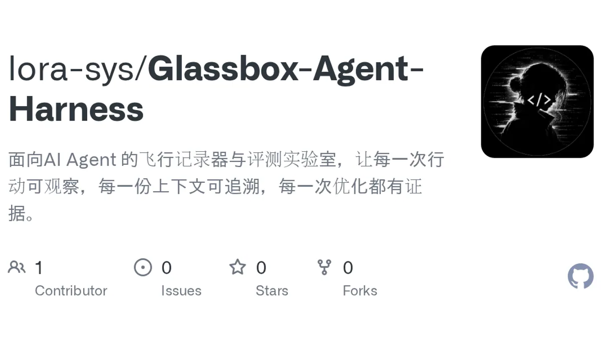
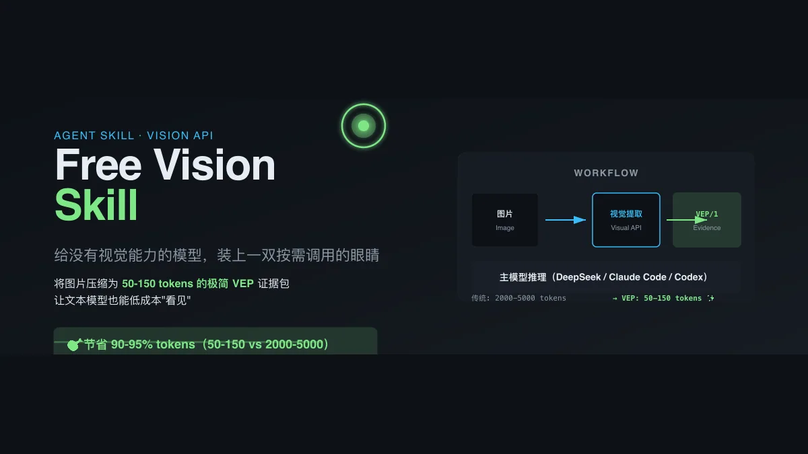
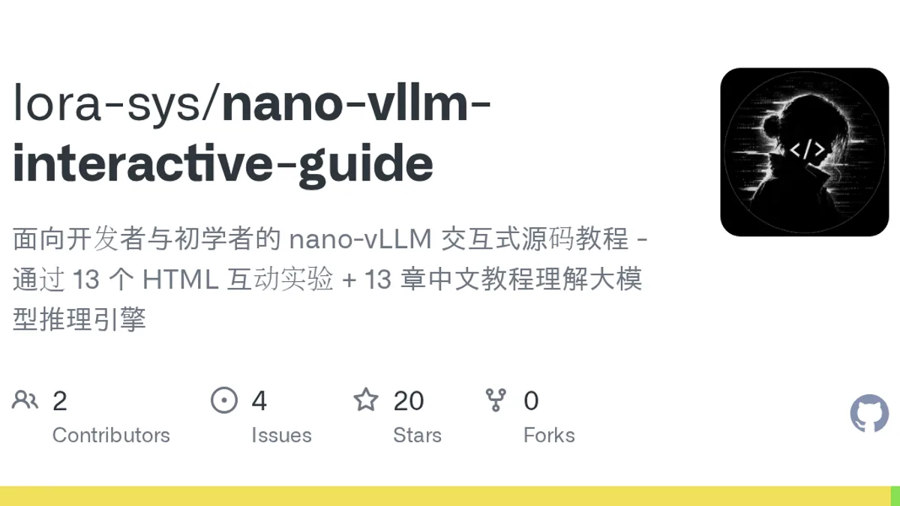
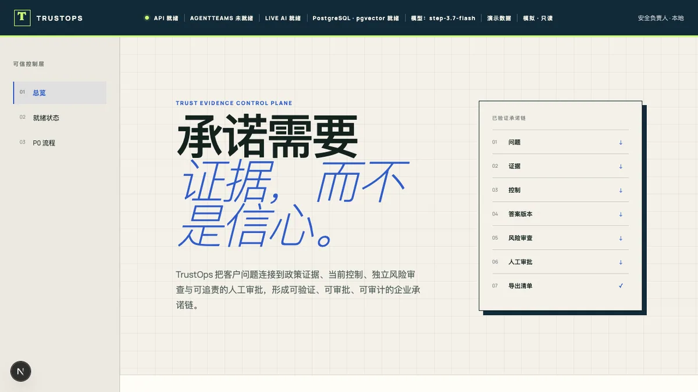
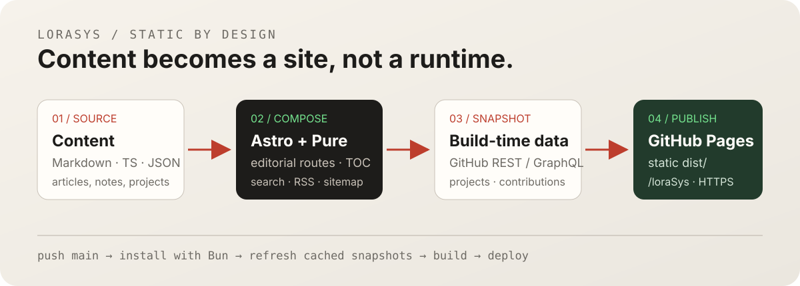

<p align="center">
  <a href="https://lora-sys.github.io/loraSys/"></a>
</p>

<p align="center">
  <a href="./README.md">English</a> ·
  <a href="https://lora-sys.github.io/loraSys/">在线网站</a> ·
  <a href="https://lora-sys.github.io/loraSys/projects">项目集</a> ·
  <a href="https://lora-sys.github.io/loraSys/blog">文章</a>
</p>

<p align="center">
  
  
  
  
</p>

`loraSys` 是 Lora 的个人工程笔记：以静态、编辑式的网站记录 AI Agent、全栈产品、开发者工具和 Web3 实验。

这个站点坚持 **内容优先、构建期驱动**。文章与结构化项目数据一起维护，GitHub 项目元数据和贡献活动在构建前生成快照，最后输出为 GitHub Pages 上的静态网站。

> Build systems that learn.

## 建议从这里开始

| 页面 | 内容 |
| --- | --- |
| [Projects](https://lora-sys.github.io/loraSys/projects) | 52 个自有公开仓库，包含海报、状态、技术栈、Stars、源码和线上链接。 |
| [Blog](https://lora-sys.github.io/loraSys/blog) | 关于 Agent 基础设施、视觉证据、模型 API 和工程实验的文章。 |
| [Lab](https://lora-sys.github.io/loraSys/lab) | 五篇项目导览，解释实际系统是怎么工作的。 |
| [Notes](https://lora-sys.github.io/loraSys/notes) | 关于 Agent、前端系统、Web3 和研究的短笔记。 |

## 精选项目

<table>
  <tr>
    <td width="50%" valign="top">
      <a href="https://github.com/lora-sys/Glassbox-Agent-Harness"></a>
      <h3><a href="https://github.com/lora-sys/Glassbox-Agent-Harness">Glassbox Agent Harness</a></h3>
      <p>面向 AI Agent 的可观测与评测实验室：把行动变成可检查的轨迹，让上下文可复现，让迭代拥有证据。</p>
    </td>
    <td width="50%" valign="top">
      <a href="https://github.com/lora-sys/free-vision-skill"></a>
      <h3><a href="https://github.com/lora-sys/free-vision-skill">Free Vision Skill</a></h3>
      <p>低 token 的视觉证据编译器，把图片转换为文本模型和 Coding Agent 可以使用的紧凑证据包。</p>
    </td>
  </tr>
  <tr>
    <td width="50%" valign="top">
      <a href="https://github.com/lora-sys/nano-vllm-interactive-guide"></a>
      <h3><a href="https://github.com/lora-sys/nano-vllm-interactive-guide">nano-vLLM Interactive Guide</a></h3>
      <p>通过 13 个交互实验和中文教程理解 LLM 推理引擎的关键组成。</p>
    </td>
    <td width="50%" valign="top">
      <a href="https://github.com/lora-sys/trustops"></a>
      <h3><a href="https://github.com/lora-sys/trustops">TrustOps</a></h3>
      <p>面向成长型 B2B SaaS 的可审计承诺层，连接政策、控制、审查与责任决策。</p>
    </td>
  </tr>
</table>

## 网站是怎样构建的

<p align="center"></p>

- **内容：** Markdown 文章、短笔记、个人资料、项目记录和本地媒体。
- **组合：** Astro + [Pure 主题](https://github.com/cworld1/astro-theme-pure)。
- **构建期快照：** 在发布前刷新 GitHub 项目、海报和贡献数据。
- **交付：** 静态 `dist/`、Pagefind 搜索、RSS、sitemap，以及 `/loraSys` GitHub Pages 项目站。

浏览器不依赖作品集 API 或数据库。GitHub 数据刷新失败时会继续使用上一次本地快照，保证网站仍然可以构建和发布。

## 本地运行

环境要求：[Bun 1.3.5](https://bun.sh/) 和 Git。

```bash
git clone https://github.com/lora-sys/loraSys.git
cd loraSys
bun install --frozen-lockfile
bun dev
```

常用检查：

```bash
bun run check       # Astro 类型和内容诊断
bun run build       # 静态构建、base 路径和发布审计
bun preview         # 预览生产构建
```

## 仓库结构

```text
src/content/              已发布文章
src/data/                 个人资料、笔记、项目和快照
src/pages/                blog、projects、lab、notes、now、talks、links
src/components/           建立在 Pure 之上的个人组件
packages/pure/             锁定版本的 Astro Theme Pure 源码
assets/readme/             README 专用视觉资产
.github/workflows/        GitHub Pages 部署和数据刷新
```

## 设计取舍

- Pure 仍然是主要 UI 系统，个人内容只融入它的编辑式结构。
- Projects 按证据策展，不把所有公开仓库伪装成同等重要。
- 项目海报全部本地化为 WebP，优先使用 README 截图或 GitHub 预览图。
- 动漫、收藏、贡献图和友链都采用静态数据配合轻量可访问交互，不引入运行时数据库。
- 旧 Svelte/Wayfinder 已归档，不保留兼容层。

## 链接

- [在线网站](https://lora-sys.github.io/loraSys/)
- [联系 Lora](https://lora-sys.github.io/loraSys/contact)
- [RSS](https://lora-sys.github.io/loraSys/rss.xml)
- [GitHub](https://github.com/lora-sys)

## 许可证

仓库和锁定的 Pure 主题基础采用 [Apache-2.0](./LICENSE)。文章、项目截图、Logo 和第三方媒体可能有单独的署名或许可证要求。
