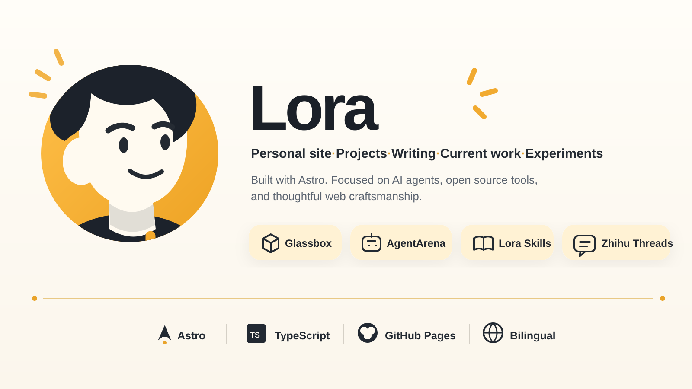

<p align="center">
  
</p>

<p align="center">
  <a href="https://lora-sys.github.io/loraSys"></a>
  <a href="https://github.com/lora-sys"></a>
  <a href="https://svelte.dev"></a>
  <a href="https://kit.svelte.dev"></a>
  <a href="https://www.typescriptlang.org"></a>
  <a href="https://pnpm.io"></a>
</p>

---

> **构建系统，让它进化。**
> AI Agent 开发者 &amp; 全栈工程师。西安 Mingde · 2022–2026
> 网站本身就是最好的证明 — [在建造中记录 →](https://lora-sys.github.io/loraSys)

---

## 这个仓库

个人数字花园 — 以建造者视角记录 AI Agent、全栈工程和 Web3 的工作。

驱动自单一数据源 [`src/lib/data/resume.ts`](src/lib/data/resume.ts)：主页、博客、闯关记录、番剧与收藏全部由此生成。

- **墨刊 (Ink Edition)** — 纸墨设计系统：`#f3efe6` 宣纸底 + `#1a1815` 墨色 + `#c6412c` 朱砂
- **暗色模式** — 运行时注入 CSS，无需 Tailwind 类
- **贡献热力图** — 自绘 SVG，不依赖 GitHub API
- **博客系统** — mdsvex + Shiki (vesper) + Giscus 评论

---

## 精选作品

| # | 项目 | 描述 |
| -: | ---- | ---- |
| 01 | **[TrandingOs](https://github.com/lora-sys/TrandingOs)** | AI 交易终端 · 40+ Agent 技能 · 记忆系统 · 玻璃拟态 UI |
| 02 | **[ai-company-os](https://github.com/lora-sys/aicompanyos)** | 8 层 AI 执行引擎 · Writer-Critic 反馈循环 · 78 E2E 测试 |
| 03 | **[Daily-Rss](https://github.com/lora-sys/Daily-Rss)** | AI 新闻简报平台 · 多 RSS 聚合 · 邮件推送 |
| 04 | **[Moss](https://github.com/lora-sys/moss)** | Monad 协议 Agent 调用层 · discover → load → action → simulate |

> [103 个公开仓库 →](https://github.com/lora-sys?tab=repositories)

---

## 闯关记录

- **ETH Beijing 2026** (2026.06 · 北京) — AI Agent × Blockchain · 5 人团队
- **Monad Hackathon** (2026.01 · 线上) — Tarot Prediction DApp · 3D 卡片 + 代币经济
- **Online AI Agent Hackathon** (2026.02 · 线上) — Emergence · 多 Agent 辩论协议
- **Monad Blitz Hackathon** (2026 · 线上) — 48 小时原型冲刺

---

## 快速开始

```bash
pnpm install       # 安装依赖
pnpm run dev       # 开发服务器
pnpm run build     # 生产构建
pnpm run check     # 类型检查
```

---

## 技术栈

**框架:** SvelteKit 2 · Svelte 5 · Next.js · React

**样式:** TailwindCSS 4 · shadcn-svelte (bits-ui)

**动画:** svelte-motion · svelte-inview · embla-carousel

**内容:** mdsvex · Shiki (vesper) · marked

**图标:** Lucide Svelte · 自定义 SVG

---

## 项目结构

```
src/
├── content/              # 博客文章 (*.md)
├── lib/
│   ├── data/resume.ts    # 单一内容源
│   ├── components/
│   │   ├── aceternity/   # Aceternity UI 效果
│   │   ├── magic/        # Magic UI 动画 (Dock, BlurFade, BentoGrid)
│   │   ├── ink/          # 墨刊组件 (ModeToggle, Navbar, Seal)
│   │   ├── portfolio/    # 页面组件 (HomePage, AnimeSection)
│   │   └── ui/           # shadcn-svelte 组件
│   └── imgs/             # SVG 图标 · Logo
└── routes/
    ├── +page.svelte      # 主页
    ├── +layout.svelte    # 布局 (Navbar · Tooltip · Lenis)
    └── blog/             # 博客列表 · 文章
```

---

## 博客

Markdown 文件置于 [`src/content/`](src/content/)，YAML frontmatter 控制元数据。添加 `published: true` 即自动上线。

- [AI Engineering Harness](src/content/ai-engineering-harness.md) — 18 类 AI Agent 工程交付
- [Free Vision Skill](src/content/free-vision-skill.md) — 视觉证据编译器，90% Token 节省
- [Building WishLive](src/content/WishLIve.md) — Multi-Agent Runtime + Solidity 合约

---

<p align="center">
  
  <br/>
  <a href="https://lora-sys.github.io/loraSys">在建造中记录</a> · <a href="https://github.com/lora-sys/loraSys">Source</a> · <a href="mailto:lorasys@outlook.com">lorasys@outlook.com</a>
</p>
