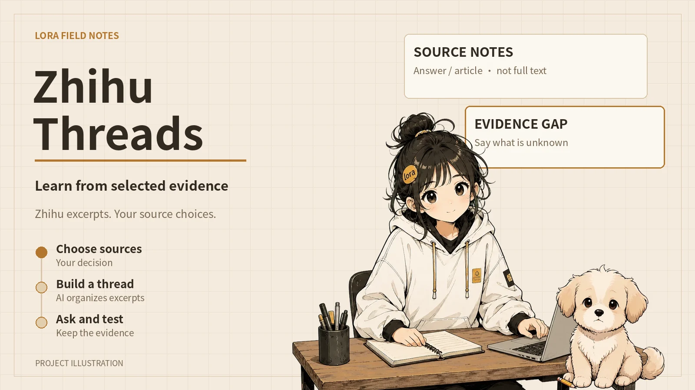
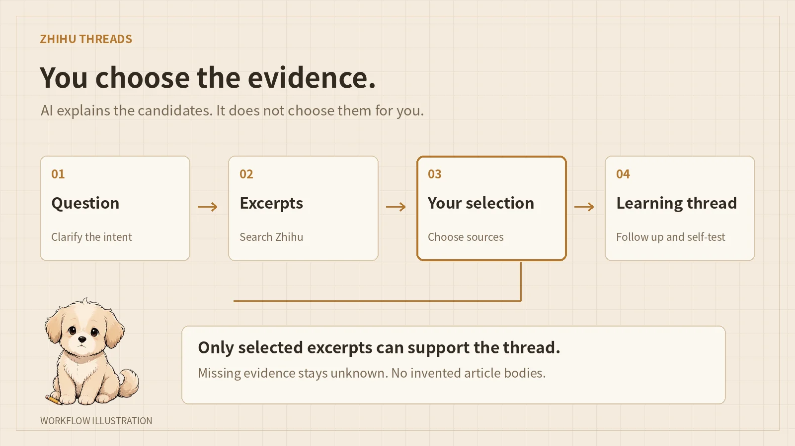

# loraSys

Lora’s bilingual portfolio and engineering notebook. Astro renders project case studies, articles, short notes and small browser experiments into a static site.

[Published site](https://lora-sys.github.io/loraSys/) · [中文说明](./README-zh-CN.md) · [Redesign implementation notes](./docs/redesign-v4.md)

<p align="center"></p>

## Pages

The main navigation is Work, Writing, Lab and About. Now, Shelf, Reading, Links, Notes, the résumé and RSS remain in secondary navigation. Contact, search, language and theme controls are always available.

| Area | What it contains |
| --- | --- |
| Home | Three entry-level case studies, original-language writing, an experiment and a compact personal shelf. |
| Work | Four editorial case studies and the complete synchronized repository archive. Search, source, status, category and deep links remain functional. |
| Cases | Glassbox, Zhihu Threads, AI Engineering Harness and AgentArena. Each separates the problem, implementation choices and limitations. |
| Writing | A directly visible article list, original-language labels, existing permanent URLs and pagination. |
| Lab | Source selection and evaluation-rule experiments, alongside the five existing repository-based notes. |
| About and Now | Existing education, credentials, activities and dated notes. Automatic repository pushes are not presented as manually verified progress. |
| Contact and résumé | Email-first contact, honest copy feedback and a readable web résumé with optional PDF access. |

New routes are bilingual. Existing article bodies and legacy redirects are preserved. A page containing a Chinese original is not advertised as an English translation.

## Project illustrations and interface studies





The project illustrations reuse the original Lora and Mochi characters. They are not product screenshots. The four case-card interface studies use localized HTML and CSS rather than text embedded in raster images. Their diagrams explain mechanisms; they do not claim to capture a real execution.

## Browser experiments

The source experiment has three authored excerpts and four dependent nodes. Every selection is recalculated locally. Removing a required excerpt marks the affected node as unsupported without hiding it.

The evaluation experiment contains four fixed teaching records. Completion-only accepts three. Requiring completion, correct tools and evidence accepts one. Changing the rule does not rerun an agent or measure a real model.

The trace viewer supports step selection, previous and next controls, keyboard input and boundary states. It is labeled as a teaching replay. None of these widgets needs a model key, account or backend service.

## Development

Use Bun 1.3.5 and the committed lockfile.

```sh
bun install --frozen-lockfile
bun run dev
```

Use the address printed by Astro rather than assuming a port.

```sh
bun run validate:sync
bun run check
NODE_OPTIONS=--max-old-space-size=3072 bun run build
bun run preview --host 0.0.0.0
```

The production build runs Astro checks, generates static HTML, prefixes deployment paths and executes the existing release audit. The deployment base is `/loraSys`.

## Content and data

Articles live in `src/content/blog`. GitHub snapshots remain in `src/data` and are generated by the existing synchronization scripts. Editorial case notes live in `src/data/studio/curation.ts`. Do not hand-edit synchronized snapshots to invent repository facts.

```sh
bun run sync:github
bun run validate:sync
```

New original art, public source screenshots and personal collection images have different attribution boundaries. Keep them separate. Raw images, audit screenshots, reports and fonts must stay outside the repository.

## Quality checks

Pull requests run the existing regression and reading-quality checks, the rendered-page and language audits, and `scripts/test-studio-v4.mjs`. The redesign test covers four widths, bilingual routes, exhaustive source combinations, rule changes, trace controls, collection filters and complete archive retention.

`PLAYWRIGHT_MODULE`, `AXE_PATH` and `SITE_TEST_OUTPUT` can point to isolated quality tools and an output directory. The new test serves only local production output and rejects non-read requests. A successful build does not prove that every external service works.

Lighthouse uses the existing simulated mobile network and CPU settings, with three samples per route. Retain every sample rather than selecting a high score. Scores and screenshots belong in the PR evidence, not in permanent marketing copy.

A PR is a review candidate. Publishing still follows the existing synchronization, quality gate, build and GitHub Pages workflow after the maintainer merges.

## License

See [LICENSE](./LICENSE) and the repository’s existing attribution notices.
