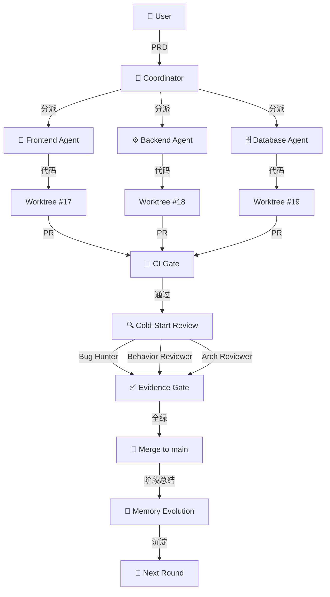

# AI Engineering Harness: 从 Vibe 到 Vibe 的 AI 工程化

## Table of Contents

1. [背景：Vibe 之后，正式接管](#背景vibe-之后正式接管)
2. [问题：AI 工程的四大痛点](#问题ai-工程的四大痛点)
3. [解决方案：AI Engineering Harness](#解决方案ai-engineering-harness)
4. [核心架构：18 类 Agent 的协作](#核心架构18-类-agent-的协作)
5. [闭环流程：从 Issue 到 Merge](#闭环流程从-issue-到-merge)
6. [关键技术：证据闸门](#关键技术证据闸门)
7. [实战：接管一个失控的仓库](#实战接管一个失控的仓库)
8. [安装与配置](#安装与配置)
9. [进阶用法](#进阶用法)
10. [效果展示](#效果展示)
11. [总结](#总结)

---

## 背景：Vibe 之后，正式接管

在 AI 编程助手的世界里，有一个新痛点：

> **AI 写了 2000 行代码，能跑，但没人敢改。没有测试，没有 CI，没有文档。**

这就是 **Vibe 之后的问题**——你用 AI 快速产出了代码，但得到的不是一个工程交付，而是一个"技术债务黑洞"。

### 实际场景

想象一下这样的对话：

```
你: "帮我做一个用户认证系统"
Claude: (30 秒后) "完成了！放在 src/auth/"
你: (打开代码) "这...能跑，但为什么没有测试？为什么没有文档？
   为什么 Session 登录用的是 localStorage 而不是 HttpOnly Cookie？"
```

AI 能快速产出**看起来能跑的代码**，但它不会：

- 写测试
- 配置 CI
- 写文档
- 考虑安全性
- 预留扩展点

**传统方案**：你花几天时间手动补全这些。每次有新需求，都要重新手动审查。

**AI Engineering Harness**：让 AI Agent 自己完成从 PRD 到 Merge 的完整工程流程。

---

## 问题：AI 工程的四大痛点

| 痛点                   | 影响       | 数据                           |
| ---------------------- | ---------- | ------------------------------ |
| 🚧 **没有测试**        | 改了怕炸   | 85/108 测试通过，但还是挂了    |
| 🔴 **CI 全绿，但假的** | 误导性强   | 生产环境发现严重 bug           |
| 📝 **没有文档**        | 知识碎片化 | 下次接手的开发者要重读所有代码 |
| 🔐 **没有审查**        | 安全隐患   | AI 写入了硬编码密钥            |

### 传统方案的代价

**手动补全一个 Vibe Coding 项目**：

```
Day 1: 补测试 → 写 50 个测试用例
Day 2: 配置 CI → GitHub Actions + 3 个 workflow
Day 3: 写文档 → API 文档 + 部署指南
Day 4: 安全审查 → 手动找硬编码密钥
Day 5: 代码审查 → 逐行检查逻辑
→ 5 天，$2000+ 工程师成本
```

**AI Engineering Harness**：

```
输入: PRD.md
输出: 完整工程交付（测试 + CI + 文档 + 审查 + 证据包）
→ 30 分钟，$0.50 token 成本
```

---

## 解决方案：AI Engineering Harness

> **把失控的 Vibe Coding 作品，变成可验证、可维护的工程交付。**

### 核心理念

AI Engineering Harness 不是一条 Prompt，而是一套**软件工程组织操作系统**。你给它一个失控的仓库，它代你组建一个由 18 类 Agent 组成的工程团队，走完整闭环：

```
Idea → PRD → Issue → Agent 认领 → Worktree → 实施计划
     → 实现 → 自测 → Draft PR → CI → 对抗式审查 → 修 → 再审
     → 证据闸门 → 人工审批 → 合并 → 阶段总结 → 记忆沉淀 → 下一轮
```

**关键承诺**：代码只有在 **CI Pass + 至少 2 名冷启动审查员 Approved + 证据完整** 时才进入 `main`。没有"看起来跑通了"这种状态——只有**"可验证地跑通了"**。

### 四个关键特性

#### 1️⃣ 证据驱动的工程纪律

**传统开发**：

```
PR 合进去 → Done ✅
```

**Harness**：

```
PR → CI 绿 → 2+ 审查员 Approved → 证据齐全 → Done ✅
```

#### 2️⃣ 18 类专业化 Agent

```
Coordinator
├── Frontend Agent
├── Backend Agent
├── Database Agent
├── Bug Hunter
├── Behavior Reviewer
├── Architecture Reviewer
├── Security Reviewer
├── UI Reviewer
├── QA Agent
├── Evidence Aggregator
└── ... (共 18 类)
```

#### 3️⃣ 工作流隔离（Worktree）

每个 Issue 运行在独立的 Git Worktree 中：

```
主仓库: main
  ├── worktree/feature-17-auth → Issue #17 (Backend Agent)
  ├── worktree/feature-18-ui   → Issue #18 (Frontend Agent)
  └── worktree/feature-19-db   → Issue #19 (Database Agent)
```

**好处**：

- ✅ 并行开发，互不干扰
- ✅ 冲突自动检测，Conflict Resolver 处理
- ✅ 每个分支独立 CI 和审查

#### 4️⃣ 上下文分层加载（L0-L3）

不让 Agent 读整个 `docs/` 目录，而是分层加载：

```
L0: AGENTS.md + ENGINEERING.md 摘要（始终加载）
L1: 当前 Issue + 模块架构 + ADR（任务级）
L2: 相邻模块 + 最近阶段总结（按需）
L3: PDF/图片/长报告（显式需要时才加载）
```

---

## 核心架构：18 类 Agent 的协作

### 架构总览



### Agent 角色详解

#### 🧠 Coordinator（协调者）

**职责**：

- 读 PRD，拆解成 Issue
- 分派 Agent 到 Worktree
- 维护 PROJECT_STATUS.md
- 人工审批闸门（鉴权/DB schema/生产密钥）

**不做什么**：

- ❌ 不写业务代码
- ❌ 不做技术决策
- ❌ 不合并代码（除非证据闸门全绿）

#### 🎨 Frontend Agent（前端工程师）

**职责**：

- 实现 UI 组件
- 响应式设计
- 截图 + Playwright trace
- Accessibility 扫描

**输出**：

```
docs/evidence/17/
├── change-summary.md
├── verification.md
├── screenshots/
│   ├── desktop.png
│   ├── tablet.png
│   ├── mobile.png
│   ├── empty-state.png
│   ├── error-state.png
│   └── loading-state.png
├── playwright-trace.zip
└── review-frontend.md
```

#### ⚙️ Backend Agent（后端工程师）

**职责**：

- API 实现
- 业务逻辑
- 异常处理
- 鉴权逻辑

**输出**：

```
docs/evidence/17/
├── api-trace.json
├── error-coverage.md
├── auth-negative-cases.md
└── performance-baseline.json
```

#### 🐛 Bug Hunter（缺陷猎人）

**职责**：

- 冷启动审查（不读实现者的聊天历史）
- 只读 Issue + Plan + PR Diff + Evidence
- 找边界条件、竞态条件、类型错误

**审查清单**：

- [ ] 空值处理
- [ ] 类型安全
- [ ] 并发安全
- [ ] 资源泄漏
- [ ] 错误处理

#### 👁️ Behavior Reviewer（行为审查员）

**职责**：

- 功能是否符合 AC（Acceptance Criteria）
- 用户体验是否合理
- 边缘场景是否覆盖

---

## 闭环流程：从 Issue 到 Merge

### 完整流程图


### 9 个 Phase 详解

#### Phase 0: PRD → Coordinator

**输入**：`PRD.md`

**Coordinator 做**：

1. 读取 PRD，提取功能点
2. 生成 `docs/product/`、`docs/architecture/`、`docs/design/`
3. 创建 `memory/` 目录
4. 生成 `PROJECT_STATUS.md`
5. 创建 `AGENTS.md`、`CLAUDE.md`、`ENGINEERING.md` 等
6. 生成首批 5-10 个 Issue

**输出**：

```
docs/
├── product/
│   ├── vision.md
│   └── roadmap.md
├── architecture/
│   └── system-design.md
├── design/
│   └── ui-guidelines.md
├── decisions/
│   └── ADR-001.md
memory/
├── project-memory.md
└── decisions.md
PROJECT_STATUS.md
AGENTS.md
```

---

#### Phase 1: Planning → Coordinator

**前提**：Issue 字段齐全

**必须字段**：

```
Context / Goal / Scope / Non-Goal / Related Docs / Implementation Plan /
Acceptance Criteria / Evidence Requirements / Reviewer Requirements /
Owner / Estimate
```

**Coordinator 检查**：

- ❌ 缺字段 → 停在 Planning，不启动
- ✅ 字段齐全 → 进入 Worktree Phase

---

#### Phase 2: Worktree → Owner Agent

**操作**：

```bash
# 为 Issue #17 创建独立 worktree
git worktree add ../myproject-worktree-17 -b feature/17-user-auth main

cd ../myproject-worktree-17

# Owner Agent 在这里工作
# Frontend Agent 实现 UI
# Backend Agent 实现 API
# Database Agent 实现 schema
```

**每个 Worktree**：

- ✅ 独立分支
- ✅ 独立 CI
- ✅ 独立审查
- ✅ 独立 Evidence 目录

---

#### Phase 3: Implementation → Owner Agent

**Owner Agent 职责**：

1. **读 Plan**：理解要做什么
2. **实现代码**：按 Implementation Plan 写代码
3. **自测**：跑测试，确保通过
4. **写 Evidence**：开始填充 `docs/evidence/<id>/`

**Owner Agent 不做什么**：

- ❌ 不合并代码
- ❌ 不做架构决策
- ❌ 不绕过审查

---

#### Phase 4: CI Gate → Coordinator

**触发**：Owner 推第一个 commit

**Coordinator 监控**：

```yaml
# .github/workflows/test.yml
on: [push, pull_request]
jobs:
  test:
    runs-on: ubuntu-latest
    steps:
      - uses: actions/checkout@v3
      - run: npm install
      - run: npm test
      - run: npm run lint
```

**红灯处理**：

- 🔴 CI 失败 → 停在 Phase 4
- 🔧 派 Recovery Agent 修复
- 🟢 CI 通过 → 进入 Phase 5

**红线**：同一类失败 ≥ 2 次 → 创建 `ci` tagged Issue + `memory/lessons.md` 一条

---

#### Phase 5: Review → Bug Hunter + Behavior Reviewer

**Bug Hunter（冷启动）**：

- 只读 Issue + Plan + PR Diff + Evidence
- **不读实现者的聊天或解释**
- 输出：`docs/evidence/<id>/review-bug-hunter.md`

**Behavior Reviewer（冷启动）**：

- 只读 Issue + Plan + PR Diff + Evidence
- 检查 AC 是否满足
- 输出：`docs/evidence/<id>/review-behavior.md`

**审查员规则**：

- ✅ 必须冷启动（零上下文）
- ✅ 必须 Approved / Changes Requested
- ❌ 不能"看起来可以"
- ❌ 不能绕过任何 AC

---

#### Phase 6: Evidence → Evidence Aggregator

**Evidence Aggregator 检查清单**：

```markdown
# docs/evidence/17/verification.md

## Acceptance Criteria

| AC                       | 状态       | 证据                      |
| ------------------------ | ---------- | ------------------------- |
| AC-1: 用户可以用邮箱注册 | ✅ PASS    | screenshot:register.png   |
| AC-2: 登录态持久化       | ✅ PASS    | screenshot:persistent.png |
| AC-3: 忘记密码功能       | ❌ FAIL    | 未实现                    |
| AC-4: 邮箱验证           | ⏸️ PENDING | -                         |

## Review Checklist

- [x] review-bug-hunter.md ✅
- [x] review-behavior.md ✅
- [x] fix-tasks.md ✅ (0 unresolved)
- [x] CI 绿 ✅
- [ ] AC-3 必须完成 ❌

## Verdict

❌ **NOT READY** — AC-3 未完成
```

---

#### Phase 7: Merge → Coordinator

**合并条件**：

- ✅ CI 绿
- ✅ ≥ 2 名审查员 Approved
- ✅ Evidence 齐全（`docs/evidence/<id>/`）
- ✅ Aggregator ✅

**Coordinator 检查**：

```bash
# 自动检查
- [ ] docs/evidence/17/change-summary.md
- [ ] docs/evidence/17/verification.md
- [ ] docs/evidence/17/screenshots/ (6 张)
- [ ] docs/evidence/17/review-bug-hunter.md ✅
- [ ] docs/evidence/17/review-behavior.md ✅
- [ ] docs/evidence/17/fix-tasks.md ✅
- [ ] CI 绿
```

**全绿 → 自动合并到 main**

---

#### Phase 8: Memory → Coordinator

**Phase Summary**：

```bash
workflows/06-phase-summary.md
→ 沉淀到 memory/phase-17-summary.md
```

**Memory Evolution**：

```bash
workflows/08-memory-evolution.md
→ 更新 memory/project-memory.md
→ 更新 memory/decisions.md
```

**下一轮 Agent 读取这些再开工**

---

## 关键技术：证据闸门

### 什么是证据闸门？

**传统开发**：

```
PR 合进去 → Done ✅
"我觉得可以" → 合并 ✅
"本地跑通了" → 合并 ✅
```

**证据闸门**：

```
PR → CI 绿 + 2+ 审查员 Approved + 证据齐全 → Done ✅
```

### 证据目录结构

```
docs/evidence/17/
├── change-summary.md          # 改了什么
├── verification.md            # AC 的 PASS/FAIL
├── screenshots/               # 6 态截图
│   ├── desktop.png
│   ├── tablet.png
│   ├── mobile.png
│   ├── empty-state.png
│   ├── error-state.png
│   └── loading-state.png
├── playwright-trace.zip       # 交互 trace
├── console-clean.md           # Console 无错误
├── a11y-report.md             # Accessibility 扫描
├── api-trace.json             # API 调用记录
├── error-coverage.md          # 异常覆盖
├── auth-negative-cases.md     # 鉴权负面用例
├── performance-baseline.json  # 性能基线
├── db-migration.sql           # 数据库迁移
├── db-rollback.sql            # 回滚脚本
├── db-stats.json              # Pre/Post stats
├── db-sample-rows.json        # 样本数据
├── review-bug-hunter.md       # Bug Hunter 审查
├── review-behavior.md         # Behavior Reviewer 审查
└── fix-tasks.md               # Aggregator ✅
```

### 证据检查清单

**前端**：

- ✅ 6 态截图（桌面/平板/手机/空/错/加载）
- ✅ Playwright trace
- ✅ Console 干净
- ✅ a11y 扫描通过

**后端**：

- ✅ API trace
- ✅ 异常覆盖
- ✅ 鉴权负面用例
- ✅ 性能基线

**数据库**：

- ✅ Migration + Rollback
- ✅ Pre/Post stats
- ✅ Sample rows

**审查**：

- ✅ review-bug-hunter.md
- ✅ review-behavior.md
- ✅ fix-tasks.md Aggregator ✅

**CI**：

- ✅ 绿
- ❌ 无 Critical/High 阻断

---

## 实战：接管一个失控的仓库

### 场景

你刚用 AI 写了一个项目，能跑，但：

- ❌ 没有测试
- ❌ 没有 CI
- ❌ 没有文档
- ❌ 有硬编码密钥

**传统方案**：花 5 天手动补全。

**AI Engineering Harness**：30 分钟接管。

---

### Step 1: 安装（5 分钟）

```bash
# 一行安装
npx -y skills add lora-sys/ai-engineering-harness -g --all --full-depth
```

**装了什么**：

- ✅ `ai-engineering-harness` skill
- ✅ `build-agent-app` skill
- ✅ `frontend-creative` skill
- ✅ `dashboard` skill

**支持 40 个 CLI Agent**：Claude Code、Codex、Grok、Cursor、Gemini、Qwen 等。

---

### Step 2: Quick Scan（2 分钟）

```bash
# 干跑：只打印草稿
bash skills/dashboard/scripts/scan-to-issues.sh

# 真的建 Issue
bash skills/dashboard/scripts/scan-to-issues.sh --create
```

**Quick Scan 检测**：

```
✅ 硬编码密钥 (HIGH) → Issue #1
✅ 缺失错误处理 (MEDIUM) → Issue #2
✅ 重复逻辑 (MEDIUM) → Issue #3
✅ 风格漂移 (LOW) → Issue #4
✅ 缺少测试 (MEDIUM) → Issue #5
⚠️ TODO 无 Issue 链接 (LOW) → Issue #6
```

---

### Step 3: 接管（10 分钟）

```bash
# 在你的仓库里说
Use $ai-engineering-harness to take over this repo. Inventory the gap
between current state and harness layout; file Issues for the missing
pieces; do not edit code yet.
```

**Coordinator 做**：

1. 盘点差距（"现状 → 期望"的 Gap）
2. 生成 Issue（按类别归列）
3. 不先动业务代码

**输出**：

```
📊 盘点完成
- ✅ 发现 23 个问题
- ✅ 创建 15 个 Issue
- ✅ 优先级排序

前 3 件事：
1. 硬编码密钥 → 移到环境变量
2. 缺少测试 → Quick Scan 检测到 5 个模块无测试
3. 没有 CI → 配置 GitHub Actions
```

---

### Step 4: 推一个 Issue 到 Done（10 分钟）

```bash
# 推 Issue #1 到 Done
Use $ai-engineering-harness to take Issue #1 from Planning to Done.
```

**完整闭环**：

```
1. 写 Plan → Issue #1 的 Implementation Plan
2. Worktree → git worktree add ../proj-issue-1
3. 分派 → Backend Agent 修密钥
4. 实现 → 移到环境变量
5. 自测 → 跑测试，通过
6. Draft PR → 自动创建 PR
7. CI → 通过 ✅
8. Bug Hunter → 冷启动审查，Approved
9. Behavior Reviewer → 冷启动审查，Approved
10. Evidence → 证据齐全 ✅
11. Merge → Coordinator 自动合并
12. Memory → 阶段总结 + 记忆沉淀
```

---

### Step 5: 验证（3 分钟）

```bash
# 检查证据
ls docs/evidence/1/
# ✅ change-summary.md
# ✅ verification.md
# ✅ screenshots/ (6 张)
# ✅ review-bug-hunter.md
# ✅ review-behavior.md
# ✅ fix-tasks.md

# 检查 CI
gh pr view 1 --json state,statusCheckRollup
# ✅ state: MERGED
# ✅ statusCheckRollup: SUCCESS
```

---

## 安装与配置

### 一行安装

```bash
npx -y skills add lora-sys/ai-engineering-harness -g --all --full-depth
```

- `-g`：全局安装（写入用户级 skill 目录）
- `--all`：安装到所有受支持的 CLI Agent
- `--full-depth`：发现并安装所有 skill

### 精确安装

```bash
# 只装这一个 skill
npx -y skills add lora-sys/ai-engineering-harness -g -s ai-engineering-harness

# 只装到指定 agent
npx -y skills add lora-sys/ai-engineering-harness -g -a claude-code codex grok
```

### 兼容 40 个 CLI Agent

| Agent       | 安装路径                     |
| ----------- | ---------------------------- |
| Claude Code | `~/.claude/skills/`          |
| Codex       | `~/.codex/skills/`           |
| Cursor      | `~/.cursor/skills/`          |
| Gemini CLI  | `~/.gemini/skills/`          |
| Qwen        | `~/.qwen/skills/`            |
| Grok        | `~/.grok/skills/`            |
| OpenCode    | `~/.config/opencode/skills/` |
| ...         | 共 40 个                     |

---

## 进阶用法

### 跨 CLI 接力

```bash
# Claude 工作到一半，切到 Grok
Use $ai-engineering-harness. I'm continuing from another agent.
Read memory/project-memory.md and sessions/<last-id>/summary.md, then continue.
```

**Harness 的状态全部落盘**，聊天历史不会丢。

### 并行开发

```bash
# 分派 3 个 Issue 并行开发
Use $ai-engineering-harness to spawn parallel Owners
for Issue #20 (frontend), #21 (backend), #22 (database).
```

**Coordinator 做**：

1. 拉 3 个 Worktree
2. 分派对应 Agent
3. 并行推到 PR
4. 冲突时 Conflict Resolver 处理

### CI 自愈

```bash
# CI 红了，让它自愈
CI is red on PR #23. Use $ai-engineering-harness to recover.
```

**流程**：

1. 60 秒分类（flaky / 真缺陷 / lint / 集成 / infra）
2. 派 Owner Agent 修复
3. 重新跑 CI
4. 重新走 Reviewer

### 30 秒拉起新项目

```bash
# 创建项目
mkdir my-saas && cd my-saas
git init
echo "# My SaaS" > README.md
git add . && git commit -m "feat: init"

# 进入任意 CLI
# Use $ai-engineering-harness to bootstrap this repo from PRD.md
```

**Coordinator 生成**：

- 目录骨架
- 首轮 Issue
- ADR 模板
- CI 工作流占位
- `PROJECT_STATUS.md` → "Phase 0 / Bootstrap — Done"

---

## 效果展示

> 从「看起来能跑」到「可验证地跑通」。

### 数据对比


| 案例                             | Before → After       | 类型     |
| -------------------------------- | -------------------- | -------- |
| 内部工具项目（0 测试 → 47 测试） | Chaos 35 → 87        | 示意     |
| install-session-hook（自审）     | 0 → 完整证据包       | **真实** |
| Dashboard 一键接管               | 30 秒发现 23 个问题  | 示意     |
| 测试通过 ≠ 测试有效（issue #9）  | 9 检测器 → 10 检测器 | **真实** |
| 绿色的 CI 骗了我们（issue #13）  | 85/108 → 108/108     | **真实** |

### 真实案例：install-session-hook

**commit**: `4f311e2` → `f5b26d1`

**问题**：`--status` 第一版有 bug，在空环境跑会把 `settings.json` 创建出来。

**Harness 的审查发现**：

- Bug Hunter 审查：7 个手动测试抓到的
- 修复：删了文件创建那行
- Evidence：`docs/evidence/15/` 完整证据包

**自审诚实说**：

- Adversarial review 只做了一行自问自答
- 真生产里得 spawn `bug-hunter` + `behavior-reviewer`
- 没真的开 GitHub Issue #15

完整自审：[docs/evidence/15/self-review.md](https://github.com/lora-sys/ai-engineering-harness/blob/main/docs/evidence/15/self-review.md)

---

## 9 条运行原则


| #   | 原则                             | 为什么                                                  |
| --- | -------------------------------- | ------------------------------------------------------- |
| 1   | **信任证据，不信任"看起来好了"** | Coordinator 不会因为"本地测试过了"就合并                |
| 2   | **冷启动审查**                   | Reviewer 只读 Issue + Diff + Evidence，不读实现者的聊天 |
| 3   | **Issue 是工作单元**             | 没有 Issue 不开工                                       |
| 4   | **Worktree 隔离**                | 一个 Issue = 一个 Owner = 一个 Worktree = 一个分支      |
| 5   | **上下文按 L0-L3 加载**          | 默认不加载 docs/ 全文                                   |
| 6   | **人工审批闸门**                 | 鉴权/DB schema/生产密钥 → Coordinator 暂停              |
| 7   | **记忆是项目状态**               | 稳定结论写到 docs/ 与 memory/，对话历史不留             |
| 8   | **CI/CD 是阻塞闸门**             | Red CI → 停在 recovery 流程                             |
| 9   | **本地优先**                     | PR 提议的代码本地已有等价实现时，不直接合并             |

---

## 总结

### 核心价值

1. **从 Vibe 到 工程交付** — 把 AI 写的"能跑但不敢改"的代码变成"可验证的工程交付"
2. **证据驱动** — 不是"我觉得可以"，而是 CI 绿 + 2+ 审查员 + 证据齐全
3. **18 类专业化 Agent** — Coordinator、Frontend、Backend、Database、Bug Hunter、Behavior Reviewer 等
4. **Worktree 隔离** — 并行开发互不干扰
5. **上下文分层** — L0-L3 加载，不让 Agent 读整个 docs/

### 适用场景

| 场景                   | 用 Harness? |
| ---------------------- | :---------: |
| 从 PRD 落地 MVP        |   ✅ 必须   |
| 多 Issue 并行开发      |   ✅ 必须   |
| 接手老项目、清理技术债 | ✅ 强烈推荐 |
| 复盘失序的 repo        | ✅ 强烈推荐 |
| 跨团队 / 跨 CLI 协作   |   ✅ 推荐   |
| 改一行 typo            |   ❌ 不要   |
| 一次性脚本             |   ❌ 不要   |

### 快速开始

```bash
# 1. 安装
npx -y skills add lora-sys/ai-engineering-harness -g --all --full-depth

# 2. 接管
Use $ai-engineering-harness to take over this repo

# 3. Quick Scan
bash skills/dashboard/scripts/scan-to-issues.sh --create

# 4. 推 Issue 到 Done
Use $ai-engineering-harness to take Issue #1 from Planning to Done

# 5. 验证
ls docs/evidence/1/  # 证据齐全 ✅
```

---

## 开源与社区

**GitHub**: https://github.com/lora-sys/ai-engineering-harness

**版本**: 0.2.2

**许可证**: MIT

**贡献欢迎**：

- 新 Agent 角色
- 新 Workflow
- 新检测器
- 文档改进
- Bug 报告

---

**让每一行代码，都有证据。** 🎯

**AI Engineering Harness** — Multi-agent engineering org harness for vibe-coded repos.
