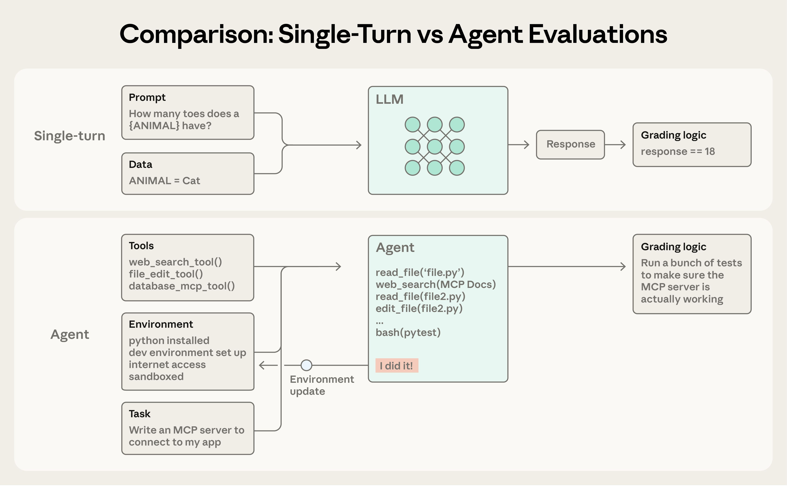
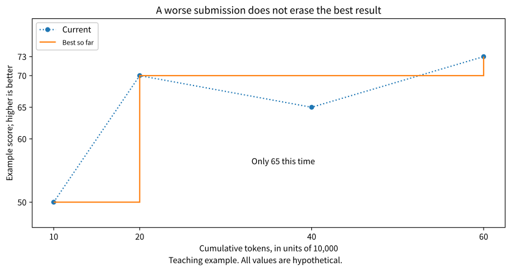
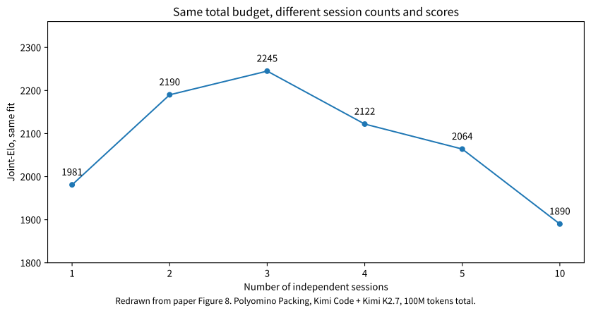
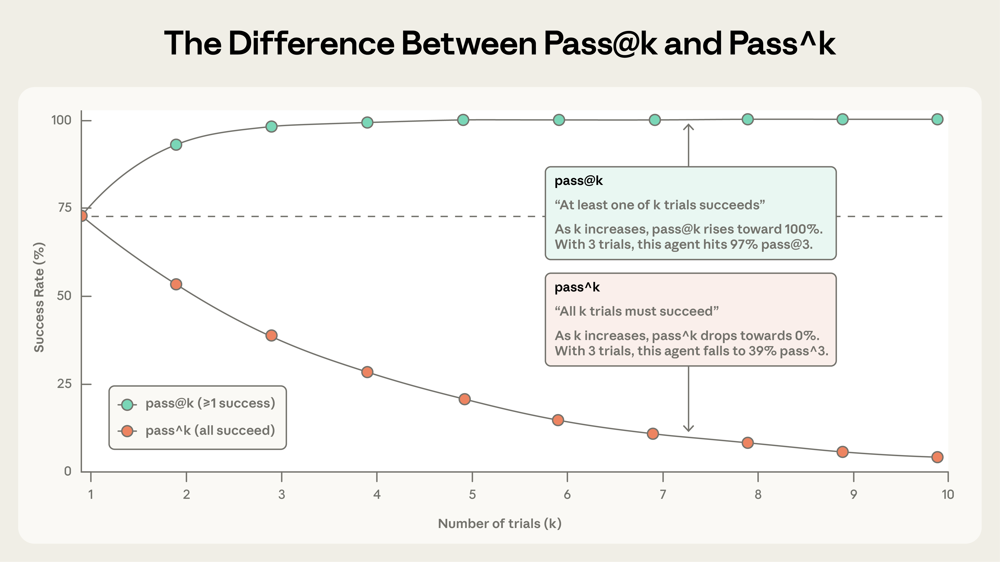

Suppose you ask an agent to optimize a search endpoint. It must not omit results or skip permission checks. Within those constraints, faster responses are better.

You give it 600,000 tokens. Should one session keep revising, or should three sessions each try with 200,000 tokens before you choose a result?

<Callout tone="note" title="Experimental scope">
600,000 tokens is a teaching example, not a budget recommended by the paper. This article distinguishes paper results, teaching assumptions, and engineering advice. It does not rerun the paper's experiments.
</Callout>

This article is based on the initial version of When Agents Slow Down, submitted September 14, 2026, together with research on inference-budget allocation, Reflexion, Hyperband, and agent evaluation. [Original paper](https://arxiv.org/abs/2609.15309)

<KeyPoints
  title="Three judgments to keep in mind"
  items="Budget allocation changes the question::Continuing one session and starting independent attempts measure different capabilities|Memory needs causal evidence::Memory is useful only if past experience actually improves later actions|The selector is part of the system::Finding a good candidate does not guarantee that the system can select and deliver it"
/>

## 1. First, distinguish what you are increasing

Here, an agent is a program that repeatedly calls a model and tools to complete a task. It reads files, edits code, runs tests, and acts on the results. Evaluation must inspect the actual code and environment, not merely the final response. [Anthropic's explanation of agent evaluation](https://www.anthropic.com/engineering/demystifying-evals-for-ai-agents)

Figure 1. Ordinary question-answer evaluation versus agent evaluation. Image from Anthropic.

Ordinary question-answer evaluation checks whether an answer is correct. Agent evaluation must also check whether the program left behind after tool use passes its tests. A model saying "I did it!" is a claim, not an acceptance result.

The paper studies test-time compute, meaning computation used while performing a task. It can go into continued revision, new attempts, checking answers, or calling other models. It does not mean retraining the model. [Inference-budget research](https://arxiv.org/abs/2408.03314)

Distinguish two quantities as well. Context length is how much information one model call can receive. Cumulative tokens are the total used across many calls during a task. A session can repeatedly compact its history and continue, so high cumulative token use does not mean a single input is equally long. [The paper's budget definition](https://arxiv.org/pdf/2609.15309#page=7)

The following allocations all address the same task.

| Allocation | Method | What to observe |
| --- | --- | --- |
| One long session. | One session uses 600,000 tokens for continued revision. | Whether later changes still produce useful improvements. |
| Three independent sessions. | Each uses 200,000 tokens to complete the task, then a result is selected. | Whether different attempts find a better implementation. |
| Ten independent sessions. | Each uses 60,000 tokens to complete the task, then a result is selected. | Whether the budget is split too finely to finish a valid attempt. |

Independent sessions here do not mean frontend and backend agents dividing up the work. Every session completes the entire task from the same starting point and cannot read code just changed by another session. Otherwise, you are measuring a collaborative system rather than this independent-attempt baseline.

## 2. Why better results do not yet prove experience is useful

Start with a thought experiment.

A independently generates ten implementations and submits the best. B generates only one and submits it directly. Every implementation comes from the same generation process, without influencing the others, at the same generation cost, and there are no tied scores.

Now put all eleven implementations together. Each has the same chance of scoring highest. A owns ten of them, so A wins with probability 10 divided by 11, or about 90.9%.

A has gained a large advantage without accumulating experience between attempts. The advantage comes from more attempts and the ability to select the best result afterward.

So if an agent improves after another hour of running, you cannot immediately conclude that it used historical experience effectively. It may simply have generated more candidates.

The paper uses independent attempts as a reference. Under the conditions above, a tenfold increase in their budget yields a theoretical Elo increase of 400. That 400 comes from Elo's scoring scale. It is not a 400% improvement in quality, nor a universal fixed rate of "intelligence growth." [Paper section 3.3](https://arxiv.org/pdf/2609.15309#page=6)

Rephrase the question in a form that is easier to test.

For the same additional budget, does continuing the current session improve the result more than a fresh attempt?

One caveat matters. Real candidates may be highly similar, scores may tie, and attempt costs may differ. In those cases, measure your own independent-attempt baseline rather than treating the theoretical reference as guaranteed returns.

## 3. How the paper measures continued progress

### First, retain the best result so far

Suppose a task produces the following four submissions. All numbers are teaching examples.

Figure 2. Best-so-far score versus current submission score. Hypothetical teaching data, not paper results.

Here are two submissions from the figure.

| Cumulative tokens | Current submission score | Best-so-far score |
| --- | --- | --- |
| 200,000. | 70 points. | 70 points. |
| 400,000. | 65 points. | 70 points. |

A version scoring 70 appears at 200,000 tokens. At 400,000, the current submission scores only 65. But the earlier 70-point version still exists, so the best deliverable score remains 70.

A best-so-far score that never declines does not mean no changes made things worse. It records the historical maximum, which cannot decrease by definition.

To use this approach in your own program, save the code version, test inputs, and score record together. Saving only the highest score without its implementation leaves you unable to deliver that result.

### Then compare results across budgets

A search endpoint may be scored in milliseconds, while a packing problem uses space utilization. Those values cannot be added directly.

The paper first compares results within the same task, then aggregates wins and losses with a Bradley-Terry model to produce Elo. You do not need to learn its derivation first. Think of it as compressing many pairwise comparisons into relative scores.

The authors then observe how Elo changes with budget. The horizontal axis is logarithmic, so 10,000 to 100,000 and 100,000 to 1,000,000 represent the same budget multiplier. They do not simply divide Elo by tokens. [Paper section 3](https://arxiv.org/pdf/2609.15309#page=4)

### Keep Self-Elo and Joint-Elo separate

Self-Elo measures how the same system progresses with additional budget. Systems are fitted separately, so their absolute scores cannot directly rank them against one another.

Joint-Elo fits multiple systems and budgets together, allowing direct comparisons within that fit.

There is another detail. When calculating Self-Elo, the authors do not compare a session's later checkpoints directly against its own earlier checkpoints. The reason is the best-so-far scoring above. A later historical maximum must be at least as high as an earlier one. Such matches would count a mathematical inevitability as evidence of progress. The authors instead compare different independent sessions. [Paper section 3.2](https://arxiv.org/pdf/2609.15309#page=6)

Elo has trade-offs too. It tells you which result is more likely to win, but not how many milliseconds faster it is or whether the added cost is worthwhile. Business acceptance still needs the original metrics.

## 4. What the experiments actually show

The authors tested four agent systems on 14 tasks drawn from four benchmark categories. Each system-task combination ran five independent sessions, with a target budget of up to 100 million tokens per session. The count includes cumulative input, output, and cached-input tokens. Automated evaluators scored the tasks. [Paper section 4.1](https://arxiv.org/pdf/2609.15309#page=7)

The main observation is that more compute can still improve results, but later budget increments yield smaller gains. "Slow Down" refers to changing returns, not slower text generation or a claim that every long session gets worse with each edit.

One budget-allocation experiment is especially easy to read. It uses Polyomino Packing, Kimi Code, and Kimi K2.7 with a fixed total budget of 100 million tokens.

Figure 3. Redrawn from the bottom-right panel of the paper's Figure 8. The horizontal axis contains six discrete configurations. Connecting lines aid reading and do not imply that intermediate configurations were tested.

<DataChart
  title="Three configurations with a fixed 100-million-token budget"
  description="Polyomino Packing, Kimi Code + Kimi K2.7. Values come from the same Joint-Elo fit in Figure 8. Higher values mean stronger relative performance within that fit, not a quality percentage."
  labels="1 session|3 sessions|10 sessions"
  values="1981|2245|1890"
  source="Source: When Agents Slow Down, Figure 8. Only the three discrete configurations discussed here are extracted."
/>

The displayed values cover the three configurations discussed here. Three sessions have a Joint-Elo of 2245, which is 264 above one session and 355 above ten sessions. This is a comparison within one fit, not a quality percentage. See [Figure 8 of the paper](https://arxiv.org/pdf/2609.15309#page=14) for all configurations.

The choice of three sessions was not arbitrary. The authors first measured the single-session returns curve and estimated a crossover near 38 million tokens. They then divided the total budget by that quantity and rounded to get three sessions. In the actual allocation, the 100-million-token budget was divided equally, about 33.33 million each, rather than 38 million each.

This crossover is where marginal returns intersect the independent-attempt reference. It is not a rule that automatically stops after three unimproved attempts. It is estimated from a collection of runs and varies by task and system. [Paper section 6](https://arxiv.org/pdf/2609.15309#page=12)

My engineering judgment is to use this result as a reason to design a controlled comparison, not to change your default concurrency to three. Test whether your task benefits more from further revision or fresh attempts.

## 5. Choosing the right result may be the hardest part

A correct answer appearing among multiple attempts and a system ultimately delivering that answer are different questions.

Return to the search endpoint. Three candidates respond in 40, 70, and 90 milliseconds. But the 40-millisecond version omits permission filtering. Selecting by speed alone picks a version that cannot ship.

I recommend first running non-negotiable checks, such as permissions, result completeness, error handling, and resource limits. Compare speed only among candidates that pass them. This is engineering advice, not a solution the paper has already validated for your endpoint.

Anthropic's evaluation article distinguishes two metrics. `pass@k` asks whether at least one of k attempts succeeds. `pass^k` asks whether all k succeed. They answer different questions. [Metric definitions](https://www.anthropic.com/engineering/demystifying-evals-for-ai-agents)

Figure 4. Succeeding at least once and succeeding every time are different requirements. Image from Anthropic, using the original article's example parameters.

More attempts make at least one success more likely. Requiring every attempt to succeed becomes harder as the number increases.

Now calculate a separate hypothetical example without mixing in the image's parameters. Suppose every independent run succeeds with probability 80%. Across five runs, the probability of at least one success is 99.968%, while the probability that all five succeed is only 32.768%.

| Requirement | Assumption | Probability across five runs |
| --- | --- | --- |
| At least one success. | Independent runs, each with an 80% success rate. | 99.968%. |
| All five succeed. | Independent runs, each with an 80% success rate. | 32.768%. |

Both numbers are correct. The first helps analyze whether a usable answer can be found. The second warns that reliability may still be insufficient for repeated user-facing execution.

And 99.968% still does not answer whether the successful attempt will be selected. Delivery requires an evaluator or review process that can recognize success.

I therefore recommend recording separately the share of candidate sets containing an acceptable result and the share of final selected results that pass acceptance. If the former is high and the latter low, inspect the selector before immediately switching to a larger model.

## 6. Related ideas you can apply

### Best-of-N and self-consistency differ in how they select

Best-of-N generates N candidates and uses a scorer to select one. Self-consistency generates different reasoning paths and aggregates consensus among their final answers. Wang and colleagues' Self-Consistency research uses the latter approach. [Self-consistency paper](https://arxiv.org/abs/2203.11171)

For a hypothetical example, five calculations return 42, 42, 42, 41, and 57. Self-consistency favors 42. But three answers can repeat the same error, so majority voting is not fact-checking.

Code optimization usually cannot select implementations by majority vote. Three different programs may all be correct but differ in speed and memory use. Running tests and comparing qualifying candidates is more suitable.

Before applying the idea, ask whether the task has final answers that can be aggregated and whether a trustworthy scorer exists. Do not ask only how many agents to launch.

### Reflexion and context management depend on whether experience changes later actions

Reflexion uses task feedback to form textual memory for later attempts, without requiring model-weight changes. Anthropic's context-engineering article discusses history compaction, external notes, and on-demand information retrieval. [Reflexion paper](https://arxiv.org/abs/2303.11366) [Context engineering](https://www.anthropic.com/engineering/effective-context-engineering-for-ai-agents)

These methods can apply to our search endpoint, but the memory must contain information that can be checked.

Here is an example handoff record.

> The current goal is to reduce latency without changing search semantics or permission rules. The best reproducible version is saved in the designated code commit. The last caching approach failed cross-user tests; reproduction inputs and failing assertions are saved. Next, check whether the cache key includes permission-related conditions before deciding whether to continue performance tests.

This record tells the next run what to preserve, where a failure occurred, and how to verify it. "Be more careful next time" provides no new basis for action.

Run a controlled comparison. Group A receives only the original task. Group B also receives the verified handoff record. Keep total budgets equal, including group B's cost of preparing and reading memory. Compare repeated errors and time to an acceptable result.

Only a comparison like this can test whether the memory helps your task. Saving a file, writing a reflection, or calling a memory tool does not prove effectiveness.

Also distinguish experience reuse within a task from parameter training. The former changes information visible to the next call; the latter changes model weights. Improvement within one task does not automatically imply a lasting gain on all new tasks.

### Hyperband suggests staged budget allocation

Hyperband studies resource allocation for hyperparameter search. It uses early stopping to reserve more resources for promising candidates while considering different initial candidate counts and investment depths. [Hyperband paper](https://arxiv.org/abs/1603.06560)

Borrowing that idea, design a small experiment with 60,000 tokens in total.

Start six candidates at 5,000 tokens each, totaling 30,000. After the same development tests, give two candidates another 10,000 each. Finally, give one candidate another 10,000. The total is exactly 60,000.

This is an example inspired by successive elimination, not full Hyperband or a scheduling policy validated by this paper.

It has an obvious risk. Some implementations need early work on data structures, score poorly on their first submissions, and may overtake others later. Eliminating them too early removes those approaches. Let candidates complete a minimally valid attempt before deciding whether to add budget.

### Budget policy must also vary by task

Snell and colleagues found that the effectiveness of inference-budget policies depends on problem difficulty. There is no fixed ratio between continued revision and broader candidate search that fits every situation. [Inference-budget allocation paper](https://arxiv.org/abs/2408.03314)

For our example, I would first distinguish two states. If an existing implementation is correct and its bottleneck is clear, targeted optimization may be worthwhile. If multiple candidates fail in the same place with no new evidence, inspect the requirements, data, or tools before merely adding tokens.

This is advice adapted to engineering tasks. Validate it against your own task records.

## 7. A small experiment in your own agent project

Do not start by reproducing the 100-million-token scale. Choose a function-level optimization task with fixed code, test inputs, and environment. First establish that the smallest budget can produce one scoreable submission.

I recommend comparing only the following three strategies in the first round. These are experimental configurations to test, not production defaults.

| Strategy | Budget per round | Execution |
| --- | --- | --- |
| Continued revision. | One session with 60,000 tokens. | Retain history and keep modifying the same implementation. |
| Moderate split. | Three sessions with 20,000 tokens each. | Run independently from the same starting point, then select a result. |
| Many short attempts. | Ten sessions with 6,000 tokens each. | Run independently and check whether short budgets suffice. |

Repeat each strategy for three rounds, for a total model-token ceiling of 540,000. This only screens for obvious differences; three rounds do not guarantee reliable statistical conclusions. If the task is too complex for a submission in 6,000 tokens, reduce the session count instead of forcing ten.

### Fix the starting point and scoring method

Use the same model version, initial prompt, tool permissions, code commit, and dependency environment across groups. Give each independent session an isolated working directory. Later sessions must not see optimizations left by earlier groups.

Development tests may be used during execution. Reserve another acceptance-test set that the agent cannot see and that is not used to select candidates. Select the final version using development tests first, then check its acceptance-test performance.

At minimum, your records should answer the following questions.

| Record | What it answers |
| --- | --- |
| Task, strategy, round, session, and model version. | Which complete experiment produced this result? |
| Code commit, test inputs, and scorer version. | Can this result be reproduced? |
| Current score, best-so-far score, and correctness checks. | Was there genuine improvement, and was the implementation ever made worse? |
| Cumulative input, output, and cached-input tokens. | Were budgets counted consistently across strategies? |
| Final selection, acceptance result, actual cost, and duration. | Is the final deliverable usable, and is its cost worthwhile? |

Before counting tokens, check the API field definitions. Establish whether cached input is already included in total input. If it is, record cache hits separately without adding them to the total again.

### Count the selector as part of the system

Prefer code tests in the first round, without an additional model judge. The model budget above then covers the agent and its subcalls, while code-test runtime and machine resources are recorded separately.

If you later add a model judge, summarizer, or scheduler, include its tokens in the total budget. Do not let the multi-session group use a strong model for free to choose results, then claim equal cost with the single-session group.

Equal token totals do not guarantee equal cost or completion time. Cache pricing, model choice, and tool execution all matter. Keep budget curves, actual costs, and duration separately; none replaces the others.

### Use the result to decide what to change next

If long sessions consistently perform better, inspect which steps use earlier results and retain continued revision for now.

If independent sessions consistently perform better, check that candidates actually use different implementations and consider allocating some budget to fresh attempts.

If correct candidates often exist but the final selection is wrong, improve the selector and acceptance criteria.

If every strategy fails, check whether the task is feasible, information is sufficient, and the environment works. Do not mistake missing prerequisites for insufficient budget.

## 8. Conclusions you cannot draw

You cannot conclude that every agent should use three sessions. That was a specific result for one task and system.

You cannot conclude that writing memory implements continual learning. You must show that it improves later actions enough to justify its cost.

You cannot conclude that declining late-stage returns prove context compaction is broken. That is one possible cause to investigate. Candidate repetition, scoring noise, tool overhead, and task difficulty need separate analysis too.

Nor can you describe the human comparisons as "ordinary people are stronger than agents." The paper compares historical strong competitors on specific contest tasks. Some figures also include extrapolated curves beyond the end of measured agent runs; those are not actual later scores. [Paper section 4.3 and Figure 1](https://arxiv.org/pdf/2609.15309#page=1)

The authors also study feedback-driven methods including program evolution, prompt optimization, and parameter updates. These results remain limited by the chosen tasks, methods, and cost accounting. They do not establish that every memory or online-learning approach is ineffective. [Paper section 5](https://arxiv.org/pdf/2609.15309#page=10)

For your own project, retain a sequence of checks. Define an acceptable result first, then save reproducible intermediate results. Compare continued revision and independent attempts under the same budget. Finally, verify that the system can select and deliver the acceptable result.

This makes it easier to determine where the next unit of budget belongs than simply increasing the maximum token count.

## References

[When Agents Slow Down](https://arxiv.org/abs/2609.15309) provides the measurement method, independent-attempt reference, and budget-allocation experiments discussed here. Section 3 covers methods; section 6 covers allocation experiments. The allocation values come from Figure 8, not experiments rerun for this article.

[Research code repository](https://github.com/agent-tts/Agent-TTS-Code) is the starting point for inspecting experimental execution and analysis. This article does not claim to have reproduced the study.

[Scaling LLM Test-Time Compute Optimally](https://arxiv.org/abs/2408.03314) explains why different tasks need different inference-budget strategies.

[Self-Consistency](https://arxiv.org/abs/2203.11171) distinguishes aggregating answer consensus from selecting candidates by score.

[Reflexion](https://arxiv.org/abs/2303.11366) explains textual feedback and experience reuse without changing model weights.

[Hyperband](https://arxiv.org/abs/1603.06560) provides related ideas for staged resource allocation and early stopping.

[Demystifying evals for AI agents](https://www.anthropic.com/engineering/demystifying-evals-for-ai-agents) provides actual-outcome acceptance and the definitions of `pass@k` and `pass^k`.

[Effective context engineering for AI agents](https://www.anthropic.com/engineering/effective-context-engineering-for-ai-agents) explains history compaction, external notes, and context management.
