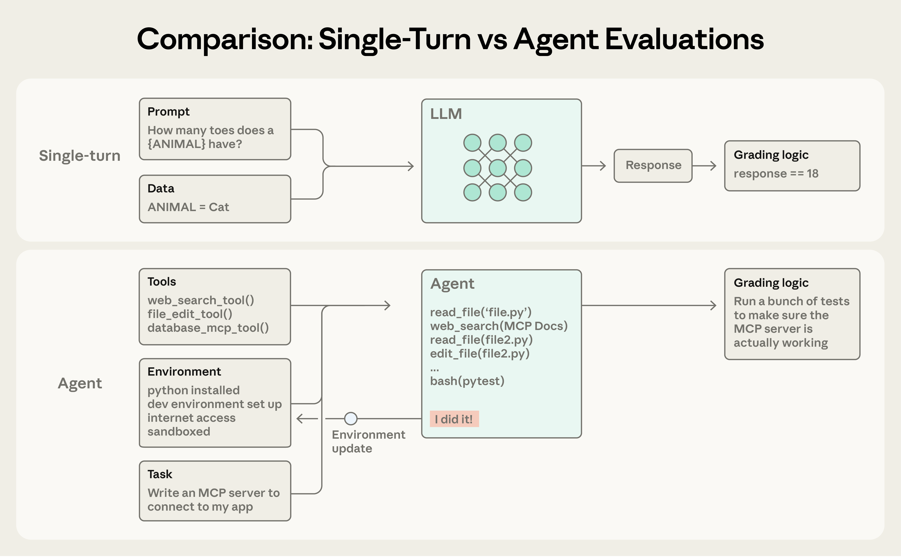
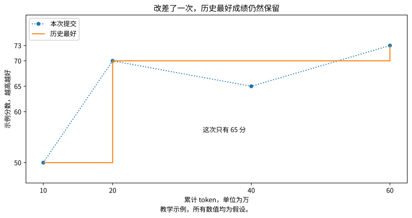
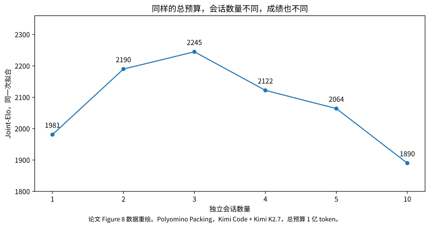
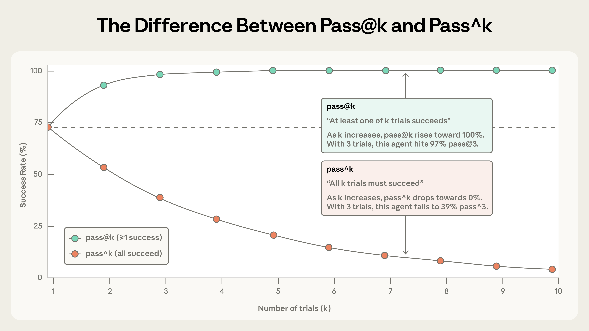

假设你让 Agent 优化一个搜索接口。搜索结果不能漏，权限检查不能少，在此前提下，响应越快越好。

你给它 60 万 token。是让一个会话一直改，还是开三个会话各试 20 万，最后挑一个？

<Callout tone="note" title="实验口径">
60 万 token 是教学示例，不是论文给出的推荐预算。本文区分论文结果、教学假设和工程建议，也没有重新运行论文实验。
</Callout>

本文依据 2026 年 9 月 14 日提交的 When Agents Slow Down 初版，并结合推理预算分配、Reflexion、Hyperband 和 Agent 评测研究。[论文原文](https://arxiv.org/abs/2609.15309)

<KeyPoints
  title="先记住这三个判断"
  items="预算分法不同::继续一个会话和重新开独立尝试测到的不是同一种能力|记忆要证明因果::后续操作真的因历史经验改善，才能说记忆有用|选择器也是系统的一部分::候选里出现好结果，不等于最终一定能把它选出来并交付"
/>

## 1. 先分清楚，你到底在增加什么

这里的 Agent，可以理解为一个反复调用模型和工具来完成任务的程序。它会读文件、改代码、运行测试，再根据结果继续操作。评测时，要检查实际代码和环境，不能只看最后那段回答。[Anthropic 的 Agent 评测说明](https://www.anthropic.com/engineering/demystifying-evals-for-ai-agents)

图 1，普通问答评测与 Agent 评测的区别。图片来源为 Anthropic。

普通问答评测检查回答是否正确。Agent 评测还要检查调用工具以后，实际留下的程序是否通过测试。模型说 "I did it!" 只是声明，不是验收结果。

论文研究的测试时计算，指执行任务期间使用的计算。它可以花在继续修改、重新尝试、检查答案或者调用其他模型上。它不等于重新训练模型。[推理预算研究](https://arxiv.org/abs/2408.03314)

还要区分两个数字。上下文长度，是一次模型调用能接收多少信息。累计 token，是整个任务里多次调用用掉的总量。一个会话可以反复压缩历史并继续执行，所以累计使用很多 token，不代表一次输入也有那么长。[论文的预算口径](https://arxiv.org/pdf/2609.15309#page=7)

下面这几种预算分法，完成的是同一个任务。

| 分法 | 具体做法 | 需要观察什么 |
| --- | --- | --- |
| 一个长会话。 | 同一个会话使用 60 万 token，连续修改。 | 后面的修改是否还带来有效改进。 |
| 三个独立会话。 | 每个使用 20 万 token，各自完成任务，再选结果。 | 不同尝试是否找到了更好的实现。 |
| 十个独立会话。 | 每个使用 6 万 token，各自完成任务，再选结果。 | 预算是否切得太碎，连完整尝试都做不完。 |

这里的独立会话，不是前端 Agent 和后端 Agent 分工合作。每个会话都从同样的起点完成整个任务，不能读取其他会话刚改出来的代码。否则你测到的是协作系统，不再是这个独立尝试基线。

## 2. 为什么结果变好，还不足以证明历史经验有用

先做一个思想实验。

甲独立生成十份实现，交出最好的一份。乙只生成一份，直接提交。每份实现来自同一种生成过程，互不影响，生成成本相同，分数没有并列。

现在把十一份实现放在一起。最高分落在每一份实现上的机会相同。甲占十份，所以甲获胜的概率是 10 除以 11，约为 90.9%。

甲没有在十次尝试之间积累经验，却已经获得很大优势。优势来自更多次尝试，以及最后能挑出最好结果。

所以，当一个 Agent 多跑了一小时以后成绩变好，你还不能直接说它有效利用了历史经验。它也可能只是多生成了几份候选。

论文把独立尝试作为参照。在上述条件成立时，独立尝试的预算增加十倍，理论上的 Elo 增加 400。这个 400 来自 Elo 的计分尺度，不是质量提高 400%，更不是自然界存在一个固定的 "智能增长速度"。[论文第 3.3 节](https://arxiv.org/pdf/2609.15309#page=6)

你可以把问题改成一句更容易检验的话。

同样再花一笔预算，继续当前会话，能不能比重新尝试得到更多改进？

这里有一个前提不能丢。现实中的候选可能高度相似，评分可能并列，每次尝试成本也可能不同。遇到这些情况，要实测自己的独立尝试基线，不能把理论参照直接当成收益保证。

## 3. 论文怎样判断 Agent 有没有继续进步

### 先保留历史最好结果

假设一次任务有下面四次提交。所有数字都是教学示例。

图 2，历史最好成绩与本次提交成绩。教学假设数据，不是论文实验结果。

下面摘出图中的两次提交。

| 累计 token | 本次提交成绩 | 历史最好成绩 |
| --- | --- | --- |
| 20 万。 | 70 分。 | 70 分。 |
| 40 万。 | 65 分。 | 70 分。 |

20 万 token 时出现了 70 分的版本。到了 40 万，本次提交反而只有 65 分。但是之前的 70 分版本还在，所以此时能够交付的最好成绩仍然是 70。

历史最好成绩没有下降，不表示中途没有改坏。它记录的是历史最高值，本来就不会下降。

你在自己的程序里应用这个方法时，需要同时保存代码版本、测试输入和评分记录。只保存一个最高分，没有保存对应实现，就不能把那个结果交付出去。

### 再把不同预算的结果放在一起比较

搜索接口可以用毫秒评分，打包问题可以用空间利用率评分。这两种数值不能直接相加。

论文先在同一道任务里比较谁的结果更好，再用 Bradley-Terry 模型汇总胜负，得到 Elo。你不必先学习这个模型的推导，可以先把它理解为把大量两两比较压成相对分数的方法。

最后，作者观察预算增加时，Elo 怎样变化。横轴使用对数刻度，所以 1 万到 10 万，与 10 万到 100 万，表示同样的预算倍数。它不是直接用 Elo 除以 token。[论文第 3 节](https://arxiv.org/pdf/2609.15309#page=4)

### Self-Elo 与 Joint-Elo，不要混着看

Self-Elo 用来看同一系统追加预算后怎样进步。不同系统分别拟合，绝对分数不能直接跨系统排名。

Joint-Elo 把多个系统和预算放进同一次拟合，才能在这次拟合内部直接比较。

还有一个细节。计算 Self-Elo 时，作者不让同一会话的后期检查点和自己的早期检查点直接比赛。原因就在上面的历史最好成绩里。后期历史最高分必然不低于早期，用这类比赛证明进步，会把一个数学上的必然关系算进结果。作者改用不同独立会话之间的比较。[论文第 3.2 节](https://arxiv.org/pdf/2609.15309#page=6)

Elo 也有取舍。它告诉你谁更容易赢，却不告诉你快了多少毫秒、是否值得增加成本。业务验收仍然需要原始指标。

## 4. 实验结果到底说明了什么

作者测试了四种 Agent 系统，在四类基准中选择了 14 个任务。每个系统和任务组合运行五个独立会话，单会话目标预算最高为 1 亿 token。这里统计输入、输出和缓存输入的累计量，任务由自动评测程序评分。[论文第 4.1 节](https://arxiv.org/pdf/2609.15309#page=7)

主要观察是，追加计算仍然可以改善结果，但后期每增加一段预算，换来的提升会减少。论文所说的 "Slow Down" 指这个收益变化，不是生成文字变慢，也不是所有长会话都会越改越差。

下面是最容易读懂的一组预算分配实验。任务是 Polyomino Packing，使用 Kimi Code 和 Kimi K2.7，总预算固定为 1 亿 token。

图 3，依据论文 Figure 8 右下图数值重绘。横轴为六种离散配置，连线只帮助阅读，不代表测过中间配置。

<DataChart
  title="固定 1 亿 token 预算下的三个配置"
  description="Polyomino Packing，Kimi Code + Kimi K2.7。数值来自论文 Figure 8 的同一次 Joint-Elo 拟合；越高只表示该拟合里的相对表现更高，不是质量百分比。"
  labels="1 个会话|3 个会话|10 个会话"
  values="1981|2245|1890"
  source="Source: When Agents Slow Down, Figure 8。本文只抽取正在讨论的三个离散配置。"
/>

表中列出本文讨论的三个配置。三个会话的 Joint-Elo 为 2245，比一个会话高 264，比十个会话高 355。这是同一次拟合中的比较，不是质量百分比。完整配置见[论文 Figure 8](https://arxiv.org/pdf/2609.15309#page=14)。

三个会话的选择不是随意猜的。作者先测单会话的收益曲线，估计约在 3800 万 token 附近出现收益拐点，再用总预算除以这个数并取整，得到三个会话。真正分配时，1 亿预算平均给三个会话，每个约 3333 万，不是每个都拿 3800 万。

这里的收益拐点，是边际收益与独立尝试参照相交的位置，不是看到三次没进步就自动停下。它来自一批运行记录的估计，也会随任务和系统变化。[论文第 6 节](https://arxiv.org/pdf/2609.15309#page=12)

我的工程判断是，把这个结果当成设计对照实验的理由，不要直接把自己的默认并发数改成三。你需要验证当前任务更适合继续修改，还是重新尝试。

## 5. 多试几次，最难的部分可能是选对结果

多次尝试里出现过正确答案，与系统最终交付正确答案，是两个问题。

仍然看搜索接口。三个候选的响应时间分别是 40、70、90 毫秒。但 40 毫秒的版本漏掉了权限过滤。只按速度选择，就会挑中不能上线的版本。

我建议先执行不能违反的检查，例如权限、结果完整性、错误处理和资源上限。只有通过这些检查的候选，才比较速度。这里是工程建议，不是论文已经替你的接口验证过的方案。

Anthropic 的评测文章区分了两个指标。`pass@k` 看 k 次尝试里是否至少成功一次。`pass^k` 看这 k 次是否全部成功。它们回答的不是同一件事。[指标定义](https://www.anthropic.com/engineering/demystifying-evals-for-ai-agents)

图 4，至少成功一次与每次都成功，是两种不同要求。图片来源为 Anthropic，图中使用原文的示例参数。

多试几次更容易至少成功一次。要求每一次都成功，会越来越难满足。

我们另外用一个假设算一遍，不与原图的参数混用。假设每次独立运行的成功率都是 80%。运行五次，至少成功一次的概率是 99.968%，五次全部成功的概率只有 32.768%。

| 要求 | 假设条件 | 五次运行的概率 |
| --- | --- | --- |
| 至少成功一次。 | 每次独立运行，单次成功率为 80%。 | 99.968%。 |
| 五次全部成功。 | 每次独立运行，单次成功率为 80%。 | 32.768%。 |

这两个数字都没错。前者适合分析能不能搜到可用答案。后者提醒你，面向用户反复执行时，可靠性可能仍然不足。

而且，99.968% 仍然没有回答最后能否挑中那次成功。真正交付时，你还需要一个能识别成功的评测程序或审核流程。

因此，我建议分别记录候选中出现合格结果的比例，以及最终选中的结果通过验收的比例。前者高、后者低，就先检查选择器，不必立刻换更大的模型。

## 6. 哪些相关知识可以迁移过来

### Best-of-N 与自一致性，区别在怎么选

Best-of-N 是生成 N 个候选，用评分器挑一个。自一致性则会生成不同的推理过程，再汇总最终答案的共识。Wang 等人的 Self-Consistency 研究采用了后一种方法。[自一致性论文](https://arxiv.org/abs/2203.11171)

举一个假设。五次计算分别得到 42、42、42、41、57，自一致性会支持 42。但是三份答案也可能重复同一种错误，所以多数票不等于事实核验。

代码优化通常不能靠多数票选实现。三份不同代码可能都正确，只是速度和内存不同。这时更适合运行测试，再比较符合要求的候选。

迁移时先问自己，任务是否有可归并的最终答案，是否有可信评分器。不要只问要开几个 Agent。

### Reflexion 与上下文管理，区别在经验是否能改变下一次操作

Reflexion 使用任务反馈形成文字记忆，并在后续尝试中使用。它不要求修改模型权重。Anthropic 的上下文工程文章则讨论了历史压缩、外部笔记和按需读取信息。[Reflexion 论文](https://arxiv.org/abs/2303.11366) [上下文工程说明](https://www.anthropic.com/engineering/effective-context-engineering-for-ai-agents)

可以把这些方法用于我们的搜索接口，但记忆要包含能复查的信息。

下面是一份交接记录的示例。

> 当前目标是在不改变搜索语义和权限规则的前提下降低耗时。可复现的最好版本保存在指定代码提交中。上一次缓存方案在跨用户测试中失败，复现输入和失败断言已保存。下一次先检查缓存键是否包含权限相关条件，再决定是否继续性能测试。

这样的记录告诉下一次执行要保留什么、哪里出过错，以及如何验证。"下次更仔细" 没有提供新的操作依据。

可以做一个对照。甲组只接收原始任务。乙组额外接收经过验证的交接记录。两组总预算相同，乙组整理和读取记忆的费用也算进去。再比较是否减少重复错误，是否更快得到合格结果。

只有这类对照，才能检验这份记忆对你的任务有没有帮助。保存了文件、写了反思、调用了记忆工具，都不是效果证明。

还要区分任务内的经验复用和参数训练。前者改变下一次调用能看到的信息，后者改变模型权重。一次任务里改进了结果，也不自动代表它在所有新任务上都有持久提升。

### Hyperband 给你的启发，是分阶段分配预算

Hyperband 研究超参数搜索中的资源分配。它利用提前停止，把更多资源留给更有希望的候选，并考虑不同的初始候选数量和投入深度。[Hyperband 论文](https://arxiv.org/abs/1603.06560)

借用这个思路，可以设计一个总共 6 万 token 的小实验。

先开六个候选，每个 5000，合计 3 万。通过同一组开发测试后，给其中两个候选各追加 1 万。最后给一个候选再追加 1 万。合计正好 6 万。

这是受逐轮筛选启发的示例，不是完整 Hyperband，也不是本论文验证过的调度方案。

它有一个明显风险。有些实现前期需要搭建数据结构，最早几次提交并不好看，却可能在后面超过别人。过早淘汰，会把这种方案删掉。所以要先允许候选完成最低限度的有效尝试，再判断是否追加预算。

### 预算策略还要随任务变化

Snell 等人的研究发现，不同推理预算策略的效果与题目难度有关。继续修改与扩大候选搜索，并没有一个在所有情况中都适合的固定比例。[推理预算分配论文](https://arxiv.org/abs/2408.03314)

对我们的例子，我会先区分两种状态。已有实现正确，性能瓶颈也明确，值得继续针对性优化。多个候选都在同一处失败，而且没有新证据，就先检查需求、数据或工具，而不是只增加 token。

这段判断是迁移到工程任务后的建议。是否成立，仍然需要用你的任务记录验证。

## 7. 在自己的 Agent 项目里，怎样做一个小实验

先别复现 1 亿 token 的规模。选一个函数级优化任务，提供固定代码、测试输入和运行环境。先确认最小预算足够产出一次可评分的提交。

我建议第一轮只比较下面三种策略。它们是待验证的实验配置，不是推荐上线参数。

| 策略 | 单轮预算 | 运行方式 |
| --- | --- | --- |
| 连续修改。 | 一个会话 6 万 token。 | 允许保留历史，持续修改同一实现。 |
| 适度拆分。 | 三个会话各 2 万 token。 | 各自从相同起点运行，最后选择结果。 |
| 多次短尝试。 | 十个会话各 6000 token。 | 同样独立运行，检查短预算是否足够。 |

每种策略先重复三轮，模型 token 的总上限就是 54 万。这里仅用于排查明显差异，三轮不能保证统计结论可靠。任务复杂到 6000 token 无法完成一次提交时，就减少会话数量，不要硬凑十个。

### 把起点和评分方式固定下来

各组使用同一模型版本、初始提示、工具权限、代码提交和依赖环境。每个独立会话使用隔离工作目录。不要让后启动的会话看到前一组留下的优化结果。

开发测试可以在执行过程中使用。另留一组验收测试，不给 Agent 查看，也不用它挑候选。先按开发测试选出最终版本，再检查它在验收测试上的表现。

记录时，至少能回答下面这些问题。

| 记录内容 | 它用来回答什么 |
| --- | --- |
| 任务、策略、轮次、会话、模型版本。 | 这次结果来自哪一个完整实验。 |
| 代码提交、测试输入、评分程序版本。 | 这个结果能不能重新运行出来。 |
| 本次评分、历史最好评分、正确性检查结果。 | 是否真的改进，是否曾把实现改坏。 |
| 累计输入、输出、缓存输入 token。 | 不同策略是否用了相同口径的预算。 |
| 最终选择、验收结果、实际费用和耗时。 | 最终交付是否可用，代价是否值得。 |

统计 token 时，先核对接口字段定义。先确认缓存输入是否已经包含在输入总量里。若已经包含，就单独记录缓存命中，不再重复加进总数。

### 把选择器也算进系统

第一轮优先使用代码测试，不使用额外模型当裁判。这样，上面的模型预算用于 Agent 及其子调用，代码测试消耗的运行时间和机器资源另外记录。

后续加入模型裁判、总结器或者调度器时，它们使用的 token 也要计入总预算。不能让多会话组额外免费使用一个强模型来挑结果，再声称它与单会话组成本相同。

同样的 token 总量，也不保证同样的费用或完成时间。缓存计费、模型种类和工具执行都有影响。因此，预算曲线、实际费用和耗时应分开保存，不能互相替代。

### 用结果决定下一次改哪里

长会话稳定更好，就检查它在哪些步骤利用了前面的结果，暂时保留连续修改。

独立会话稳定更好，就检查候选之间是否确实采用了不同实现，并考虑把一部分预算用于重新尝试。

候选里经常有正确版本，最终却选错，就改选择器和验收条件。

所有策略都失败，就先复查任务是否可完成、信息是否足够、环境是否正常。不要把基础条件缺失误判成预算不足。

## 8. 读完以后，哪些结论不能带走

不能得出 "所有 Agent 都应该开三个会话"。那是一个任务和系统上的具体实验结果。

不能得出 "写了记忆就实现了持续学习"。需要证明后续操作因此改善，而且改善值得新增成本。

不能得出 "后期收益下降，就说明上下文压缩一定有问题"。这是待检查的原因之一。候选重复、评分噪声、工具开销和任务本身的难度，都需要另做分析。

也不能把文中的人类对照写成 "普通人都比 Agent 强"。论文比较了特定竞赛任务上的历史强选手。部分图还包含 Agent 实测结束后的外推曲线，不能当成后续真实运行成绩。[论文第 4.3 节与 Figure 1](https://arxiv.org/pdf/2609.15309#page=1)

作者也研究了程序进化、提示优化和参数更新等反馈驱动方法。相关结果仍然受所选任务、方法和成本口径限制，不能据此判定所有记忆或在线学习方案都无效。[论文第 5 节](https://arxiv.org/pdf/2609.15309#page=10)

对你做项目，最值得保留的是一套检查顺序。先定义什么结果算合格，再保存能复现的中间结果。随后比较同样预算下，继续修改与独立尝试的差别。最后确认，你的系统能把那个合格结果选出来并交付。

这比只设置一个更大的最大 token 数，更容易查清下一笔预算应该花在哪里。

## 参考来源

[When Agents Slow Down](https://arxiv.org/abs/2609.15309) 提供本文讨论的测量方法、独立尝试参照和预算分配实验。第 3 节看方法，第 6 节看分配实验。预算分配表中的数值来自 Figure 8，不是本文重新运行的结果。

[研究代码仓库](https://github.com/agent-tts/Agent-TTS-Code) 是检查实验执行与分析实现的入口。本文没有声称完成复现。

[Scaling LLM Test-Time Compute Optimally](https://arxiv.org/abs/2408.03314) 用于理解为什么不同任务需要不同的推理预算策略。

[Self-Consistency](https://arxiv.org/abs/2203.11171) 用于区分汇总答案共识与按评分挑选候选。

[Reflexion](https://arxiv.org/abs/2303.11366) 用于理解不修改模型权重的文字反馈与经验复用。

[Hyperband](https://arxiv.org/abs/1603.06560) 提供分阶段投入资源和提前停止的相关思路。

[Demystifying evals for AI agents](https://www.anthropic.com/engineering/demystifying-evals-for-ai-agents) 提供实际结果验收与 `pass@k`、`pass^k` 的定义。

[Effective context engineering for AI agents](https://www.anthropic.com/engineering/effective-context-engineering-for-ai-agents) 提供历史压缩、外部笔记和上下文管理的方法说明。
