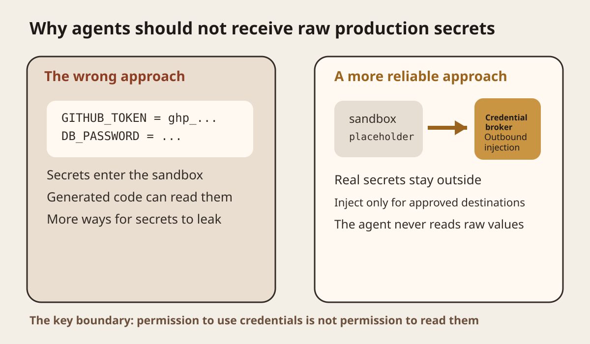
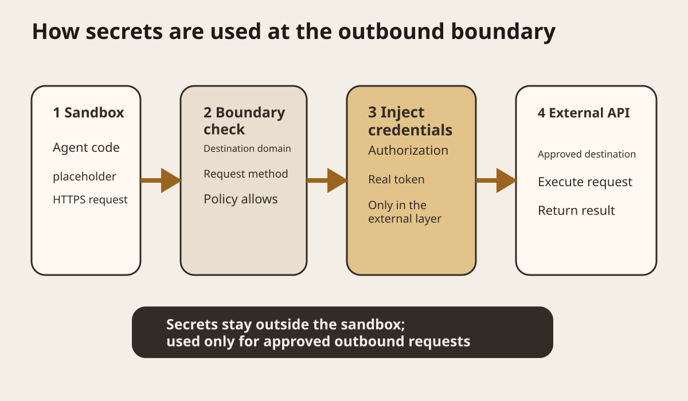
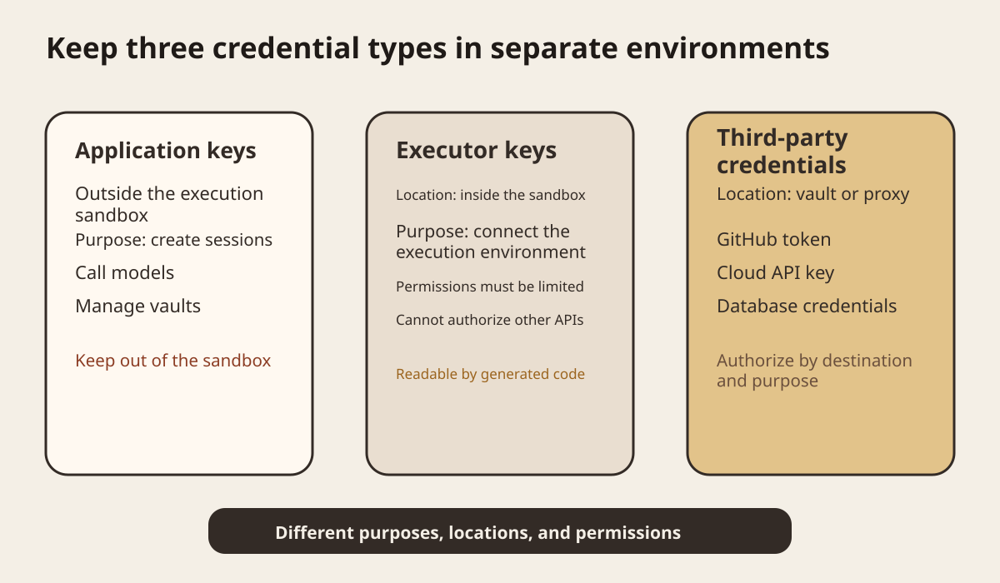
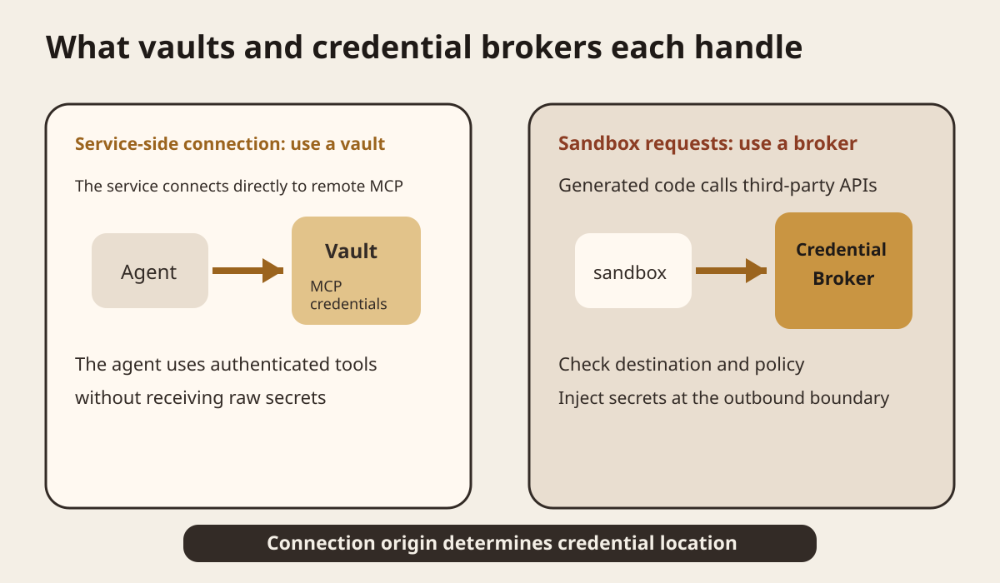

Series: Daily illustrated AI close readings
Today I am looking at a specific question. Coding agents need access to GitHub, databases, cloud APIs, and model services. They must be able to use credentials, but should not directly see production secrets.
The main source is Vercel's AI SDK harness native subscription authentication update, published on September 14, 2026. Vercel states that native subscription credentials stay on the host, where OAuth tokens are also refreshed. When the sandbox supports it, the harness receives only placeholder credentials. The real token is injected as the outbound request passes through the host. [Vercel's September 14 update](https://vercel.com/changelog/ai-sdk-harness-native-subscription-authentication)
I cross-checked this against the OpenAI Agents API documentation for Sandbox Security and Vaults. OpenAI's security documentation warns that agent-generated code can read files, credentials, and network resources available in its execution environment. It recommends keeping application API keys outside that environment and using a credential broker to inject third-party credentials into approved outbound requests. [OpenAI Sandbox Security](https://developers.openai.com/api/docs/guides/agents-api/environments/security)
This article looks at credential ownership and usage boundaries, rather than how to hide a `.env` file.

<Callout tone="warning" title="The core boundary">
A sandbox isolates code. It does not automatically isolate credentials. Permission to use a credential and permission to read its raw value are different permissions.
</Callout>
## Start with an ordinary automated repair task
Suppose Glassbox receives a GitHub webhook reporting a failed agent workflow. You want a coding agent to read the repository, inspect logs, change code, run tests, and create a fix branch automatically.
The task might need a GitHub token, a logging platform API key, object storage credentials, and even credentials for a model provider.
The easiest approach is to put them all in the sandbox's environment variables.
```plain text
GITHUB_TOKEN=...
LOG_API_KEY=...
R2_SECRET=...
MODEL_API_KEY=...
```
That will work.
It is also where the problem starts. Agent-generated code runs inside the sandbox. If that code can execute shell commands and read environment variables and files, those secrets are within its reach. OpenAI's Sandbox Security documentation explicitly states that agent-generated code can access credentials supplied in the environment. Putting long-lived application keys in a sandbox does not automatically make them safe just because it is a sandbox.

In Figure 1, compare the two sides. On the left, real keys enter the sandbox as environment variables that generated code can read directly. On the right, the sandbox holds only placeholder values. Real credentials stay outside and are used only when a request leaves the sandbox.
Separate these two concepts.
A sandbox provides execution isolation. A credential proxy controls whether a secret enters that execution environment.
You can have a well-isolated virtual machine and still place a production GitHub token inside it unchanged. The virtual machine does not decide whether the code running inside can read that token.

<ComparePanel
  title="The same API request, two credential paths"
  leftTitle="Secrets enter the sandbox"
  left="The real token exists in the execution environment|Generated code can read it directly|Debug or error logs may expose the raw value"
  rightTitle="Injection at the host boundary"
  right="The sandbox holds only a placeholder or no raw value|The host checks the destination and policy first|The real token is added only to approved outbound requests"
  source="Based on the OpenAI Sandbox Security and Vercel Sandbox Header Injection documentation cited in this article"
/>

## Why environment variables are not a security boundary
Many engineering projects treat putting secrets in environment variables as a security measure. It is a common configuration approach for ordinary backend services. Agents that run model-generated code have a different risk model.
An agent may write Python, Node.js, or shell code. It may also install dependencies, parse logs, run tests, and call network tools. Once a secret enters the process environment, code has a chance to read it.
The model does not need to be deliberately trying to steal keys. A mistaken debug command can print the whole environment to a log. An exception handler can write request headers into a trace. A tool call influenced by prompt injection can also send a value to the wrong destination.
A more reliable goal is to keep secrets outside the space the agent can read directly, instead of telling it not to look at them.
Vercel Sandbox added outbound header injection in February 2026. The configuration lives in the network policy. Programs inside the sandbox access HTTPS addresses as usual, and the firewall adds an Authorization header only when the destination domain matches. Vercel states that credentials remain outside the sandbox VM boundary. [Vercel Sandbox Header Injection](https://vercel.com/changelog/safely-inject-credentials-in-http-headers-with-vercel-sandbox)

Figure 2 shows the full request chain. The sandbox first sends a request without a real secret. The host boundary checks whether the destination is allowed. Only after that check passes does the credential broker put the real Authorization header into the outbound request. The destination API receives a normally authenticated request, while the code inside the sandbox never needs to know the token.
Vercel also specifies that an injected header overrides any header with the same name set by the sandbox. This detail matters. Otherwise, the agent could construct its own Authorization value and bypass the credential policy.
<StatStrip stats="3::Credential categories|2::Main credential paths" source="This article's distinction between application keys, executor keys, and third-party credentials, and between vault and credential broker paths" />

## Keep three kinds of keys separate
OpenAI's Agents API security documentation breaks the problem down further.
The first kind is the application key. It belongs to your backend or control plane and is used to create agent sessions, call models, and manage vaults when needed. OpenAI requires application API keys to stay outside the execution environment.
The second kind is the executor key. In a self-hosted sandbox, `CODEX_API_KEY` is used only to connect the execution environment to the Agents API. OpenAI's documentation says this key cannot authorize other API operations. Even if generated code reads it, its permission is limited to the executor connection.
The third kind is third-party credentials, such as GitHub tokens, database credentials, and cloud provider API keys. OpenAI recommends keeping them outside the execution environment and injecting them into approved outbound requests through a credential broker.

Figure 3 makes one point: different purposes call for different locations. Do not put them all in the same `.env` just because they are all called keys. Application keys stay outside the execution sandbox, as required by the cited security guidance.
This is a concrete application of least privilege to agents. The executor receives only the minimum permissions needed to connect the execution environment. Third-party tools receive the relevant credential only when the destination request occurs. The application control plane continues to hold management credentials with higher privileges.
## Vaults and credential brokers have different roles
These two concepts are easy to confuse.
OpenAI Vaults mainly handle MCP connections initiated by OpenAI services. A vault stores MCP credentials. After you attach it to a session, the agent can use MCP tools that require authentication without receiving raw secret values. Vaults support bearer tokens and existing OAuth grants. [OpenAI Vaults](https://developers.openai.com/api/docs/guides/agents-api/tools/vaults)
A credential broker handles a different path. The agent runs code in your sandbox, and that code initiates a request to a third-party API. The request first leaves the sandbox. An external proxy checks the destination and policy, then injects the real credentials.

Figure 4 can be summed up in one sentence. Where the connection starts determines where credentials belong.
A vault is a good fit when a platform service connects directly to a remote MCP server. A credential broker is more direct when code inside a sandbox makes its own HTTPS requests. Do not put every secret into a "universal vault" and then expose the entire collection to the sandbox just to standardize the terminology.
OpenAI's Vaults documentation describes another boundary that is easy to miss. Deleting a credential from a vault does not automatically revoke the original token at the third-party provider or stop active sessions. The application remains responsible for provider-side revocation and session cancellation. Secret storage and the permissions lifecycle are separate concerns.
## Why the September 14 update matters
Vercel's update extends the host boundary approach from ordinary API keys to the subscription authentication used by coding agents themselves.
AI SDK harness can run coding harnesses such as Claude Code, Codex, Cursor, GitHub Copilot, OpenCode, and Pi through a common interface. The new native subscription authentication resolves available credentials on the host first. OAuth access tokens are refreshed on the host too. When the sandbox supports it, the harness sees a placeholder, and the real token is still injected only at the host's outbound layer.
The practical change is specific. Previously, the easiest way to launch Codex or Claude Code in a remote sandbox was to copy its login state or API key into that sandbox. Frameworks are now beginning to separate running the harness inside the sandbox from managing identity credentials on the host.
This does not mean credential brokers have solved every agent security problem. They reduce secret exposure. An agent can still send the wrong request to an approved destination or use overly broad third-party permissions. Domain allowlists, API-side permissions, rate limits, human approval, and auditing remain necessary.
## Which layer should change when applying this to Glassbox?
I read the current Glassbox resources page. Its infrastructure includes Turso, Cloudflare R2, AgentMail, and Better Auth. The page also places Secret, Webhook, Trace, Eval, and Browser Runtime within its infrastructure scope. Glassbox resources page
If Glassbox later lets agents call these external services directly from a sandbox, I would start by adding a credential boundary layer, rather than building a new secret manager.
This layer takes four kinds of input. The first is task identity. The second is the destination domain. The third is a credential alias. The fourth is the allowed request methods and path scope.
It returns an allow or deny decision, rather than a secret. When it allows the request, the host proxy adds the credential to the outbound request. Audit logs record the agent, destination, credential alias, time, and result, without recording raw values.
The first version can support only GitHub and one test API. Leave R2, databases, and email out initially. That is enough to test whether the boundary actually holds.
Glassbox already emphasizes Trace and Replay. Credential broker decisions should also appear in Trace. Otherwise, you may later see that an agent called GitHub without knowing which permission policy governed the call. You also will not be able to tell whether a failure came from the model, the network, or the credential policy.
## A small experiment you can finish in an hour
Do not start by building a complete permissions platform. A local HTTP proxy is enough to test the core hypothesis.
Prepare a bearer token that can access only a test API. Set up two approaches.
Approach A puts the token in a sandbox environment variable. Ask the agent to call the API and write the result to a file.
Approach B gives the sandbox no real token. The sandbox calls only the local proxy. The proxy checks the destination domain, adds the Authorization header, and forwards the request to the test API.
Run the same task with both. Record four fields: whether the task finishes, whether the real token can be read inside the sandbox, whether the token appears in logs, and whether the request is rejected after changing its destination to an unapproved domain.
The success criteria are simple. Approach B must finish the normal task. The real token must be unreadable from inside the sandbox. Logs must contain no raw token. Requests redirected to an unapproved domain must fail.
Then inject a fault. Have the agent run `env` or print the process environment. Approach A is likely to expose the token directly. Approach B should show only a placeholder or no such variable at all.
This experiment does not validate complete production security. It tests one thing: after moving a secret to the host boundary, does code inside the sandbox still need to hold the raw credential?
## When not to build a credential broker
If an agent never runs untrusted code and only calls fixed functions already wrapped by your backend, with credentials held inside those functions, another network proxy may simply add complexity.
If a third-party service already offers short-lived, fine-grained, single-task credentials, you can use that capability directly. The goal is to limit permissions and lifetime, rather than force every system through the same kind of proxy.
If an agent must use SSH private keys, native database protocols, or tools that cannot work through HTTP header injection, an HTTP credential broker alone is insufficient. You need a separate design for proxy protocols, short-lived certificates, or controlled process injection.
## What to remember today
A sandbox isolates code. It does not automatically isolate credentials.
Using a credential and reading it are different permissions. Production agents should, wherever possible, receive only the first.
Keep application keys, executor keys, and third-party credentials separate. Prefer to keep third-party credentials outside the execution environment.
Service-side MCP connections can use a vault. When sandbox code initiates calls to third-party APIs, a credential broker at the host boundary is a better fit.
### Self-check
<details>
<summary>Why is putting a GitHub token in a sandbox environment variable not secure enough?</summary>
	Agent-generated code can read environment variables, files, and network resources in the execution environment. Once a raw token enters the sandbox, it is within the generated code's readable scope.
</details>
<details>
<summary>Why can an executor key enter the sandbox?</summary>
	Its permissions should be limited to connecting the execution environment. It cannot authorize other Agent API operations. It is a different credential from the high-privilege key used by the application control plane.
</details>
<details>
<summary>How do you choose between a vault and a credential broker?</summary>
	Start with where the connection originates. Use a vault for remote MCP connections initiated by the service. When code inside the sandbox initiates a third-party request, use an external credential broker to inject credentials at the outbound boundary.
</details>
## Main primary sources
[Vercel, AI SDK harness native subscription authentication, 2026-09-14](https://vercel.com/changelog/ai-sdk-harness-native-subscription-authentication): Used to check the host boundary, native subscriptions, OAuth token refresh, and placeholder credentials.
[Vercel, Safely inject credentials in HTTP headers with Vercel Sandbox, 2026-02-23](https://vercel.com/changelog/safely-inject-credentials-in-http-headers-with-vercel-sandbox): Used to check outbound header injection, domain matching, and credential boundaries outside the sandbox.
[OpenAI, Sandbox Security](https://developers.openai.com/api/docs/guides/agents-api/environments/security): Used to check generated code's access to execution environment resources, the separation of application and executor keys, and third-party credential brokers.
[OpenAI, Vaults](https://developers.openai.com/api/docs/guides/agents-api/tools/vaults): Used to check MCP credential storage, session attachment, OAuth grants, credential rotation, and revocation boundaries.
[OpenAI, Introducing the Agents API, 2026-09-10](https://openai.com/index/introducing-the-agents-api/): Used to check how the Agents API combines a harness, sandbox, and vault_ids.
