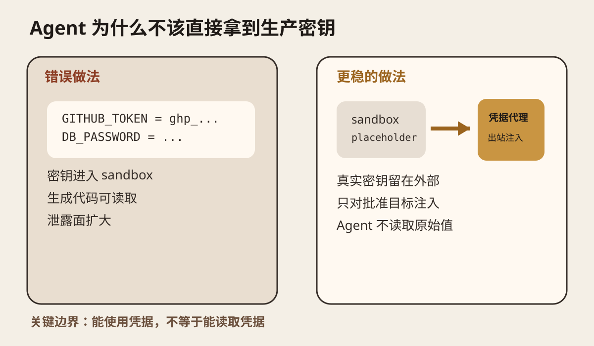
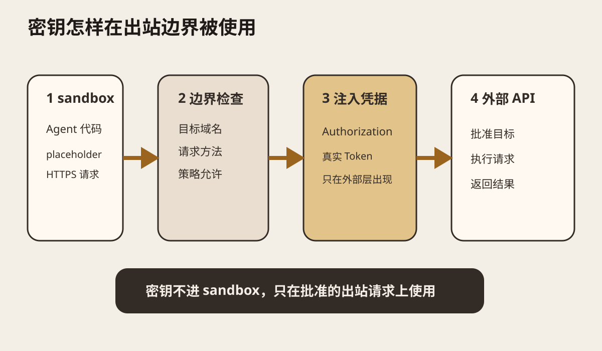
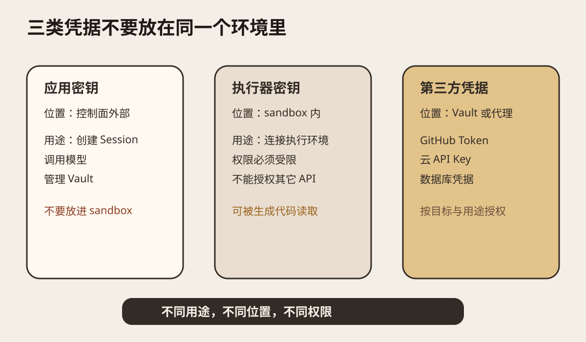
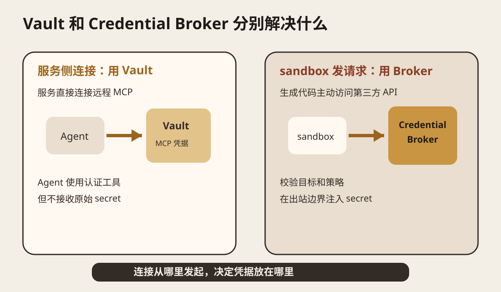

系列：每日 AI 图文精读
今天研究一个很具体的问题。Coding Agent 需要访问 GitHub、数据库、云 API 和模型服务。它必须“能用”凭据，但不应该直接“看到”生产密钥。
这次主材料是 Vercel 在 2026 年 9 月 14 日发布的 AI SDK harness 原生订阅认证更新。Vercel 明确写道，原生订阅凭据留在 host，OAuth token 也在 host 刷新。sandbox 支持时，harness 只拿到占位凭据，真实 token 在出站请求经过 host 时才注入。[Vercel 9 月 14 日更新](https://vercel.com/changelog/ai-sdk-harness-native-subscription-authentication)
我再用 OpenAI Agents API 的 Sandbox Security 和 Vault 文档交叉检查。OpenAI 的安全文档明确提醒，Agent 生成的代码可以读取执行环境里可用的文件、凭据和网络资源。它建议把应用 API key 留在环境外，并通过 credential broker 为批准的出站请求注入第三方凭据。[OpenAI Sandbox Security](https://developers.openai.com/api/docs/guides/agents-api/environments/security)
这篇不讨论“怎样藏一个 `.env` 文件”。真正的问题是凭据的所有权和使用边界。

<Callout tone="warning" title="核心边界">
Sandbox 隔离代码，不自动隔离凭据。能使用凭据和能读取原始值是两种不同权限。
</Callout>
## 先从一次很普通的自动修复任务开始
假设 Glassbox 收到 GitHub webhook，发现一个 Agent 工作流失败。你希望 Coding Agent 自动读取仓库、查看日志、改代码、运行测试，然后创建一个修复分支。
这个任务可能需要 GitHub Token、日志平台的 API Key、对象存储凭据，甚至模型提供商的访问凭据。
最省事的做法是把它们全塞进 sandbox 的环境变量。
```plain text
GITHUB_TOKEN=...
LOG_API_KEY=...
R2_SECRET=...
MODEL_API_KEY=...
```
这样当然能跑。
问题也从这里开始。Agent 生成的代码就在 sandbox 里运行。如果代码能够执行 shell、读取环境变量和文件，那么这些 secret 也在它的读取范围内。OpenAI 的 Sandbox Security 文档直接指出，Agent 生成的代码可以访问环境里提供的凭据。把长期应用密钥放进 sandbox，并不会因为“用了 sandbox”自动变安全。

图 1 只看左右两边。左边把真实密钥作为环境变量交给 sandbox，生成代码可以直接读取。右边只让 sandbox 持有占位值。真实凭据留在外部，在请求离开 sandbox 时才使用。
这里要分清两个概念。
Sandbox 解决的是执行隔离。凭据代理解决的是 secret 是否进入这个执行环境。
你可以有一个隔离很好的虚拟机，同时把生产 GitHub Token 原样放进去。虚拟机不会替你解决“里面运行的代码是否能读取 Token”这个问题。
## 为什么环境变量不是安全边界
很多工程里会把“secret 放环境变量”当作安全措施。对普通后端服务，这是一种常见配置方式。对会运行模型生成代码的 Agent，风险模型不一样。
Agent 可能自己写 Python、Node.js 或 shell。它也可能安装依赖，解析日志，运行测试，调用网络工具。只要 secret 进入进程环境，代码就有机会读取它。
这不要求模型“故意偷密钥”。一个错误的调试命令就可能把整个环境打印进日志。一个异常处理器可能把请求头写进 trace。一个被 prompt injection 影响的工具调用也可能把值发向错误的目标。
所以更稳的目标不是“告诉 Agent 不要看 secret”。目标是让 secret 根本不进入它能直接读取的空间。
Vercel Sandbox 在 2026 年 2 月加入了出站 Header 注入。配置写在 network policy 上。sandbox 内的程序正常访问 HTTPS 地址，防火墙只在匹配目标域名时加入 Authorization Header。Vercel 明确说明，凭据留在 sandbox VM 边界之外。[Vercel Sandbox Header Injection](https://vercel.com/changelog/safely-inject-credentials-in-http-headers-with-vercel-sandbox)

图 2 是完整请求链。sandbox 先发出不含真实密钥的请求。host boundary 检查目标是否在允许范围。通过以后，凭据代理才把真实 Authorization Header 写进出站请求。目标 API 收到的是正常认证请求，但 sandbox 里的代码从头到尾不需要知道 token。
Vercel 还规定，注入的 Header 会覆盖 sandbox 自己设置的同名 Header。这个细节很重要。否则 Agent 可以自己构造 Authorization 值，绕过原来的凭据策略。
<StatStrip stats="3::凭据类别|2::主要凭据路径" source="本文对应用密钥、执行器密钥、第三方凭据，以及 Vault 与 Credential Broker 的结构划分" />

## 三类 key 不应该混在一起
OpenAI Agents API 的安全文档把这个问题拆得更细。
第一类是应用密钥。它属于你的后端或控制面，用来创建 Agent Session、调用模型，以及在需要时管理 Vault。OpenAI 要求把应用 API key 留在执行环境外。
第二类是执行器密钥。Self hosted sandbox 里的 `CODEX_API_KEY` 只用于让执行环境连接 Agents API。OpenAI 文档写明，这个 key 不能授权其它 API 操作。即使生成代码读到了它，权限也被限制在执行器连接这一件事上。
第三类是第三方凭据。比如 GitHub Token、数据库访问凭据、云厂商 API Key。OpenAI 建议把它们留在执行环境外，通过 credential broker 为批准的出站请求注入。

图 3 的重点是“用途不同，位置也不同”。不要因为它们都叫 key，就统一塞进同一个 `.env`。
这其实是最小权限原则在 Agent 场景里的具体实现。执行器只拿连接执行环境所需的最小权限。第三方工具只在目标请求发生时拿到对应凭据。应用控制面继续持有更高权限的管理凭据。
## Vault 和 Credential Broker 不是同一个东西
这两个概念很容易混。
OpenAI 的 Vault 主要处理从 OpenAI 服务发起的 MCP 连接。Vault 保存 MCP 凭据。你把 Vault 挂到 Session 上以后，Agent 可以使用需要认证的 MCP 工具，但不会收到 secret 原始值。Vault 支持 bearer token 和已有 OAuth grant。[OpenAI Vaults](https://developers.openai.com/api/docs/guides/agents-api/tools/vaults)
Credential Broker 处理的是另一条路径。Agent 在你的 sandbox 里运行代码，这段代码主动访问第三方 API。请求先离开 sandbox，再由外部代理判断目标和策略，然后注入真实凭据。

图 4 可以用一句话区分。连接从哪里发起，决定凭据放在哪里。
如果是平台服务直接连接远程 MCP，Vault 很合适。如果是 sandbox 内代码自己发 HTTPS 请求，凭据代理更直接。不要为了统一名词，把所有 secret 都塞进一个“万能 Vault”以后再整体暴露给 sandbox。
OpenAI 的 Vault 文档还有一个容易忽略的边界。删除 Vault 里的 credential 不会自动撤销第三方提供商那边的原始 token，也不会自动停止正在运行的 Session。提供商侧撤销和 Session 取消仍由应用负责。这说明“秘密存储”和“权限生命周期”是两个问题。
## 9 月 14 日的新变化为什么值得看
Vercel 这次更新把“host boundary”从普通 API key 扩展到了 Coding Agent 自带的订阅认证。
AI SDK harness 可以统一运行 Claude Code、Codex、Cursor、GitHub Copilot、OpenCode、Pi 等 coding harness。新的 native subscription authentication 会优先在 host 上解析可用凭据。OAuth access token 的刷新也在 host 完成。sandbox 支持时，harness 看到的是 placeholder，真实 token 仍然只在 host 出站层注入。
这件事的意义很具体。以前你为了在远程 sandbox 里启动 Codex 或 Claude Code，最容易做的是把登录态或 API key 一起复制进去。现在框架开始把“harness 在 sandbox 里跑”和“身份凭据在 host 上管理”分开。
这里不能推出“凭据代理已经解决所有 Agent 安全问题”。它只缩小 secret 暴露面。Agent 仍然可能向已批准目标发出错误请求，也可能使用过宽的第三方权限。所以域名 allowlist、API 侧权限、速率限制、人工批准和审计仍然需要存在。
## 迁移到 Glassbox 时应该改哪一层
我读取了当前 Glassbox 资源页。现在采用的基础设施包括 Turso、Cloudflare R2、AgentMail 和 Better Auth。资源页还把 Secret、Webhook、Trace、Eval 和 Browser Runtime 都放在基础设施范围里。Glassbox 资源页
如果以后 Glassbox 让 Agent 在 sandbox 里主动调用这些外部服务，不建议先做一个新的 Secret Manager。先增加一层 credential boundary。
这一层接收四类输入。第一类是任务身份。第二类是目标域名。第三类是凭据别名。第四类是允许的请求方法和路径范围。
它输出的不是 secret，而是一条允许或拒绝结果。允许时，由 host 代理把凭据加入出站请求。审计日志记录 Agent、目标、凭据别名、时间和结果，不记录原始值。
第一版可以只支持 GitHub 和一个测试 API。R2、数据库和邮件先不接。这样能先验证边界是否真的成立。
Glassbox 当前已经重视 Trace 和 Replay。credential broker 的决策也应该进入 Trace。否则以后只能看到 Agent 调用了 GitHub，却不知道这次调用使用了哪个权限策略，也无法判断失败来自模型、网络还是凭据策略。
## 一个一小时能做完的小实验
不要先搭完整权限平台。用一个本地 HTTP 代理就能验证核心假设。
准备一个只允许访问测试 API 的 bearer token。做两个方案。
A 方案把 token 放进 sandbox 环境变量。让 Agent 完成“调用 API 并把结果写入文件”的任务。
B 方案不给 sandbox 真实 token。sandbox 只请求本地代理。代理检查目标域名后加入 Authorization Header，再转发到测试 API。
两组都执行同一任务。记录四个字段：任务是否完成、sandbox 内是否能读取真实 token、日志里是否出现 token、把目标地址改成未批准域名以后请求是否被拒绝。
成功标准很简单。B 方案必须完成正常任务。sandbox 内读取不到真实 token。日志里没有原始 token。请求改向未批准域名以后必须失败。
再做一个故障注入。让 Agent 运行 `env` 或打印进程环境。A 方案大概率直接暴露 token。B 方案应该只能看到 placeholder 或根本没有该变量。
这个实验没有验证完整生产安全性。它只验证一件事：把 secret 移到 host boundary 后，sandbox 内的代码是否还必须持有原始凭据。
## 什么时候不要做 credential broker
如果 Agent 根本不运行不可信代码，只调用后端已经封装好的固定函数，并且函数内部自行持有凭据，那么再加一层网络代理可能只是增加复杂度。
如果第三方服务已经提供短生命周期、细粒度、单任务凭据，也可以直接使用这种能力。关键仍然是限制权限和生命周期，而不是强制所有系统都经过同一种代理。
如果 Agent 必须使用 SSH 私钥、数据库原生协议或无法经过 HTTP Header 注入的工具，单纯的 HTTP credential broker 也不够。你需要单独设计代理协议、短期证书或受控进程注入。
## 今天应该记住什么
Sandbox 隔离代码，不自动隔离凭据。
能使用凭据和能读取凭据是两种权限。生产 Agent 应尽量只得到前一种。
应用密钥、执行器密钥和第三方凭据应该分开。第三方凭据优先留在执行环境外。
服务侧 MCP 连接可以用 Vault。sandbox 代码主动访问第三方 API 时，更适合在 host boundary 使用 credential broker。
### 自测
<details>
<summary>为什么把 GitHub Token 放进 sandbox 的环境变量还不够安全？</summary>
	因为 Agent 生成的代码可以读取执行环境里的环境变量、文件和网络资源。只要原始 token 进入 sandbox，它就在生成代码的可读范围内。
</details>
<details>
<summary>执行器 key 为什么可以进入 sandbox？</summary>
	因为它应该被限制为只允许连接执行环境，不能授权其它 Agent API 操作。它和应用控制面的高权限 key 不是同一种凭据。
</details>
<details>
<summary>Vault 和 Credential Broker 怎么选？</summary>
	先看连接从哪里发起。服务侧发起远程 MCP 连接时用 Vault。sandbox 内代码主动发出第三方请求时，用外部 credential broker 在出站边界注入凭据。
</details>
## 主要一手来源
[Vercel，AI SDK harness native subscription authentication，2026-09-14](https://vercel.com/changelog/ai-sdk-harness-native-subscription-authentication)：核对 host boundary、native subscription、OAuth token 刷新和 placeholder credential。
[Vercel，Safely inject credentials in HTTP headers with Vercel Sandbox，2026-02-23](https://vercel.com/changelog/safely-inject-credentials-in-http-headers-with-vercel-sandbox)：核对出站 Header 注入、域名匹配和 sandbox 外凭据边界。
[OpenAI，Sandbox Security](https://developers.openai.com/api/docs/guides/agents-api/environments/security)：核对生成代码可访问执行环境资源、应用 key 与执行器 key 的分离、第三方 credential broker。
[OpenAI，Vaults](https://developers.openai.com/api/docs/guides/agents-api/tools/vaults)：核对 MCP 凭据存储、Session 挂载、OAuth grant、凭据轮换和撤销边界。
[OpenAI，Introducing the Agents API，2026-09-10](https://openai.com/index/introducing-the-agents-api/)：核对 Agents API 的 harness、sandbox 与 vault_ids 组合方式。
