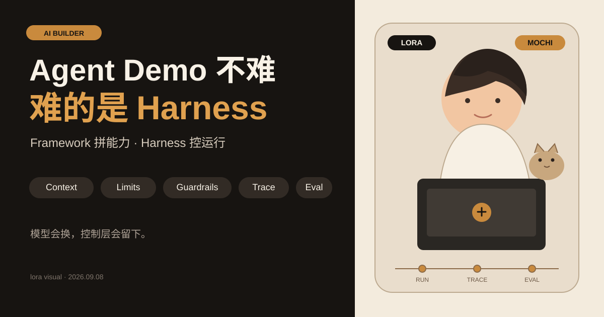

做 Agent，最容易展示的是 Demo。
选一个模型，写 Prompt，注册几个 Tool，再接一条 Workflow，很快就能跑起来。
但这不是最难的部分。
最近我看 Strands Agents 的官方仓库时，注意到一个细节：仓库直接叫 `harness-sdk`。
README 里有一句很明确的话：Build an agent harness. Control it end-to-end.
这个定位很准确。因为一个 Agent 真正进入产品后，工程问题会从“能不能调用模型”变成“能不能稳定运行”。
## Framework 负责拼，Harness 负责控
Agent Framework 通常解决这些问题：
- 模型怎么调用。
- 工具怎么注册。
- 消息怎么传。
- Workflow 怎么组合。
Agent Harness 处理的是另一层：
- 上下文什么时候压缩。
- 一次任务最多跑多久。
- Token 和成本怎么限制。
- 工具调用能不能被拦截。
- 哪些操作需要审批。
- 失败后能不能恢复状态。
- 每一步有没有 trace。
- 多 Agent 怎么隔离权限和状态。
- 输出怎么进入 Eval。
Strands 当前 README 直接列出 context management、execution limits、observability、hooks、guardrails、MCP、streaming、multi-agent 和 structured output。
这些能力的共同点不是“让 Demo 更炫”，而是让 Agent 在真实环境里可控。
## 为什么现在开始强调 Harness
模型能力一直在提高，模型供应商也越来越多。Builder 很难把产品壁垒放在“我会调用某个模型”上。
真正容易积累的，是模型之外的控制层。
比如一个代码 Agent：
它可以调用 Shell，不代表它应该拥有完整 Shell 权限。
它能连续执行 50 步，不代表每个任务都应该允许跑 50 步。
它可以读取整个代码库，不代表所有上下文都应该一直留在窗口里。
它能自动修改文件，不代表失败时不需要回滚和审计。
这些都不是 Prompt 能解决的问题。
它们需要明确的运行时机制。
## Harness MCP Server 2.0 也在说明同一个问题
另一个值得看的项目是 Harness 官方 MCP Server 2.0。
它没有继续把每个 API endpoint 都暴露成一个 Tool。
README 里给出的结构是：11 个 consolidated tools，覆盖 243 种 resource types。
背后用 registry dispatch 做路由。
这个设计解决的不是“能不能接 MCP”，而是“Tool 太多以后模型怎么选”。
Tool surface 本身开始变成架构问题。
MCP 接得越多，越不能简单地把所有工具一股脑塞进上下文。
## HydraFusion 把问题继续往运行时推进
GitHub 9 月 4 日发布的 Project HydraFusion 又把这件事往前推了一层。
它不是固定选一个模型，而是在运行时决定用 Single、Cascade 还是 Critique。
有的任务一个模型直接做。
有的任务先让便宜模型生成，再过质量门槛决定是否升级。
有的任务让一个模型写，另一个模型只读审查，再回到原模型修改。
这说明模型选择本身也开始进入 runtime orchestration。
## Builder 现在该补什么
如果你正在做 Agent 产品，我建议把下面七项单独画出来：
1. **权限**：每个 Agent 和 Tool 能做什么。
2. **状态**：任务执行到哪一步，能不能恢复。
3. **预算**：Token、时间、调用次数的上限。
4. **上下文**：什么保留，什么压缩，什么丢弃。
5. **日志**：每一步调用、结果和错误是否可追踪。
6. **评测**：结果怎么被自动验证。
7. **恢复**：失败以后重试、降级、回滚怎么做。
这七项比“用了哪个模型”更接近一个 Agent 产品的工程底盘。
Framework 仍然重要，但它更像开发入口。
Harness 决定 Agent 能不能进入长期运行。
---
