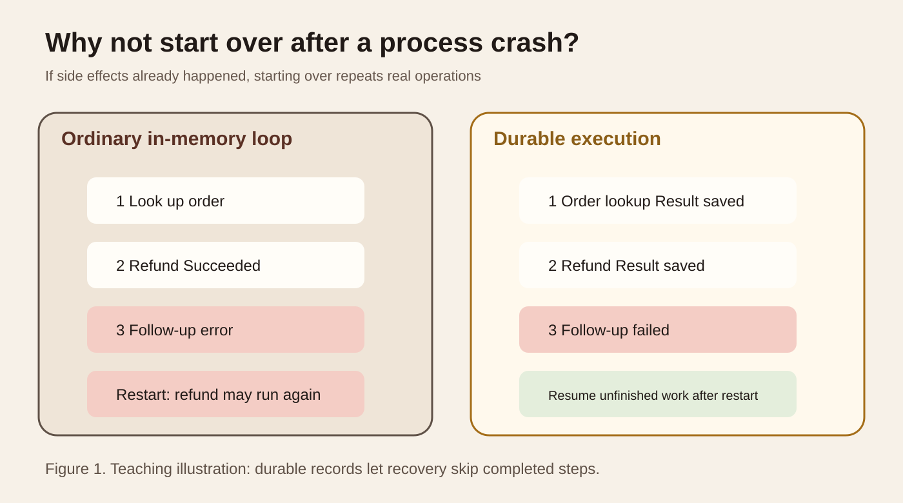
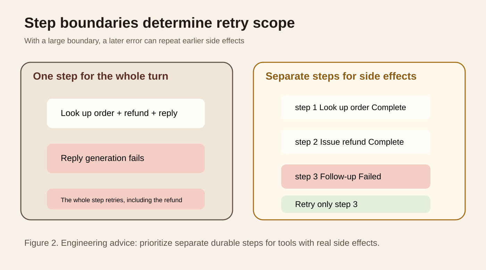
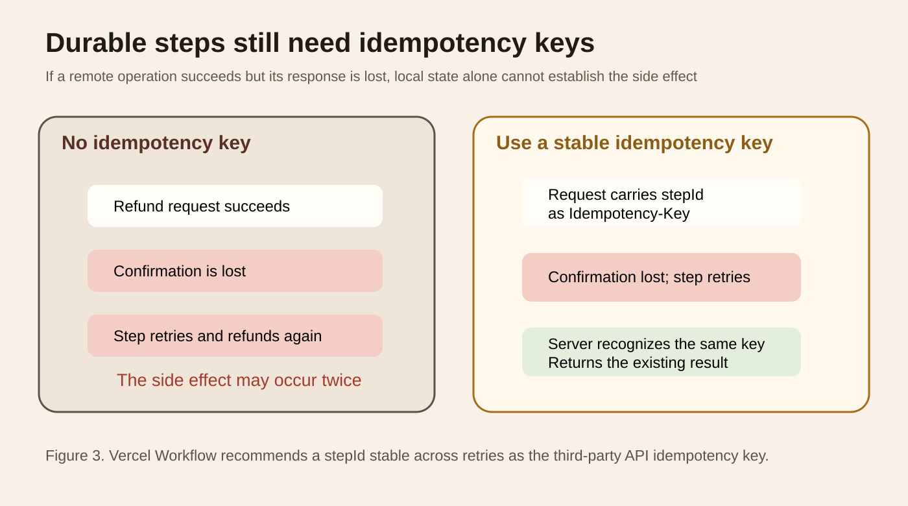
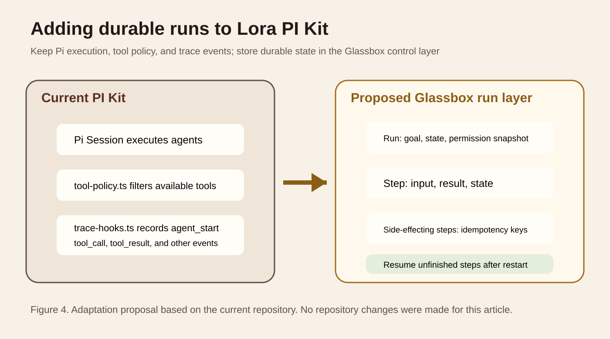

Series: Daily illustrated AI close reading

Today's question is specific. An agent has already issued a refund, sent a message, or written to a database when its process crashes. After service recovers, why not run the whole agent again from the beginning?

The main source is the Vercel AI SDK's [official WorkflowAgent documentation](https://github.com/vercel/ai/blob/main/content/docs/03-agents/07-workflow-agent.mdx). It puts model calls, tool execution, pauses, and recovery into a durable workflow. Related sources are Vercel Workflow's [Workflows and Steps](https://github.com/vercel/workflow/blob/main/docs/content/docs/v5/foundations/workflows-and-steps.mdx), [Idempotency](https://github.com/vercel/workflow/blob/main/docs/content/docs/v5/foundations/idempotency.mdx), and [AI SDK integration](https://github.com/vercel/workflow/blob/main/docs/content/docs/v5/cookbook/integrations/ai-sdk.mdx).

The AI SDK's WorkflowAgent code still had commits and package updates on September 18, 2026. This article examines problems the current implementation is addressing rather than repackaging old material as news.

## Start with a duplicate refund

Suppose a customer-service agent must process a refund. It looks up the order, calls the refund API, then generates a reply and writes a support-ticket record.

The refund API succeeds, but the next model call times out and the process exits. The client only sees a failed request and does not know whether the refund happened.

The most direct recovery is to rerun the whole agent. That is also the problem. The second run looks up the order again and may issue another refund. The first refund already happened; its success confirmation simply never reached the local process. A technical retry becomes a second business operation.

This differs from retrying ordinary chat. Generating text twice usually just wastes tokens. Payments, refunds, ticket creation, email, and database changes alter external state. If an agent has those tools, its recovery mechanism must know which steps finished and which did not.

<TraceExplorer
  title="What happened at the refund task's failure point"
  steps="Look up order::Complete::Order state has been read and this result can be reused|Issue refund::Complete::The external refund service has performed the real business action; a later failure must not create another refund|Generate reply::Failed::The model call timed out and the current process did not finish normally|Recover task::Continue::A new process reads durable step records and continues only the unfinished work"
  source="Teaching illustration of step boundaries and recovery semantics"
 />

Figure 1 is a teaching illustration drawn for this article. On the left, the process keeps state only in memory. Once it disappears, the system can only guess from the beginning. On the right, each completed step's result enters a durable record. A new process reads it before continuing from the unfinished part.

## Durable execution stores recoverable progress

The core of durable execution is making execution progress recoverable. It is not simply a longer chat history.

Vercel Workflow divides code into Workflow Functions and Step Functions. A Workflow Function organizes conditions, loops, and step order. A Step Function does the actual work. The official documentation says step results enter an event log. When a workflow recovers, orchestration code may execute again, but completed steps read their stored results rather than rerunning the step function. [Official documentation](https://github.com/vercel/workflow/blob/main/docs/content/docs/v5/foundations/workflows-and-steps.mdx)

"Replay" here does not mean repeating every business operation. It is closer to recomputing control flow while the event log answers whether a section already finished and what it returned.

This also differs from the agent regression replay examined a few days ago. Regression replay tests a new version's behavior in historical scenarios. Durable execution lets one real task continue after crashes, timeouts, and pauses. Both read history, but for different purposes.

WorkflowAgent builds on this by placing the agent loop inside a workflow. The official documentation says ordinary ToolLoopAgent primarily runs in memory. WorkflowAgent saves state and allows tools to execute as separate durable steps. Persisted progress survives a process restart. [WorkflowAgent documentation](https://github.com/vercel/ai/blob/main/content/docs/03-agents/07-workflow-agent.mdx)

## Step boundaries are what matter

Knowing that state must be saved is not enough. You also need to decide at which boundaries to save it.

Vercel's AI SDK integration documentation gives a practical counterexample. An entire user turn can go inside one `use step` function, including a model call and multiple tool calls. That is simple to implement, but makes the entire turn the smallest retry unit.

If `processRefund` succeeds and a later model call throws, the entire turn retries. The documentation explicitly says `processRefund` then runs again. It offers two solutions: make side-effecting tools idempotent themselves, or use WorkflowAgent to place tool calls in separate workflow steps. [AI SDK integration](https://github.com/vercel/workflow/blob/main/docs/content/docs/v5/cookbook/integrations/ai-sdk.mdx)

Figure 2 shows retry scope. The left groups order lookup, refund, and reply in one step. Failure at the end may rerun the whole step. The right makes the refund a separate durable step. Once it succeeds and is recorded, later failures only require recovering unfinished work.

Finer boundaries are not always better. Every persistence operation adds state, events, and scheduling costs. There is no need to separate every small function that performs pure computation, formatting, or work without external side effects. Prioritize operations that change the external world, take a long time, are expensive to fail, or require human approval.

One question helps choose a boundary: if this code succeeds and the process immediately loses power, would executing it again create a second real-world result? If so, it deserves its own step and recovery semantics.

## Why durable steps still need idempotency

At this point, it is tempting to think the problem is solved. The refund has its own step, so failure retries only that step and appears not to repeat previous work.

Distributed systems still have an unavoidable window. The external refund service may finish the operation while the local process never receives the response. The workflow only knows it did not get a successful result. It cannot prove the remote service did nothing.

Even the finest step boundaries cannot determine that remote state. You need an idempotency key.

Idempotency has a simple meaning: submitting the same business operation multiple times has the same final effect as submitting it once. Vercel Workflow's documentation recommends each step invocation's stable `stepId`, passed to a third-party API that supports idempotency keys. The `stepId` stays unchanged during retries, so the server can recognize the same operation rather than a second refund. [Idempotency documentation](https://github.com/vercel/workflow/blob/main/docs/content/docs/v5/foundations/idempotency.mdx)

Figure 3 centers on identity rather than retry count. The first call and retries must carry the same business-operation ID. Without a stable ID, the server only sees two similar-looking requests. A stable idempotency key gives it a basis for returning the first result.

If a third-party API does not support Idempotency-Key, deduplication can live in your business layer. For example, use a unique constraint on `order_id + action_type`, or write an operation record for a worker to consume. There is no universal implementation. The requirement is that duplicate requests be recognizable through the same stable business identity.

## Step idempotency and run idempotency differ

Another source of duplication is often overlooked. A user double-clicks, the frontend retries after a timeout, or a gateway resends a request. Any can start two runs for the same task.

Step idempotency handles step retries inside a run. Run idempotency determines whether two start requests represent the same task.

Vercel Workflow's current documentation uses deterministic hook tokens to coordinate duplicate runs in progress. A token can derive from an order ID, invoice ID, import-job ID, or request ID. When runs contend for the same token, the workflow decides internally which owns the task. [Run idempotency](https://github.com/vercel/workflow/blob/main/docs/content/docs/v5/foundations/idempotency.mdx)

Record the two identities separately. `run_id` identifies a workflow instance. `operation_id` or `step_id` identifies an external side effect. Do not substitute a newly generated random request ID for a business idempotency key, or every retry will become a new operation.

## Pausing and resuming belong to the same problem

Durable execution supports more than crash recovery.

WorkflowAgent supports tools that need human approval. When an approval request appears, the workflow can pause. Execution can continue even if the user approves hours later. Approval state and pending tool arguments therefore cannot live only in one Node process's memory. [WorkflowAgent documentation](https://github.com/vercel/ai/blob/main/content/docs/03-agents/07-workflow-agent.mdx)

Streaming output has another state path. WorkflowChatTransport reconnects when a stream ends abnormally. Frontend stream recovery does not inherently make backend side effects safe. UI reconnection determines whether the user can keep seeing output. Step persistence and idempotency determine whether business actions repeat. Verify them separately.

There is a cost boundary too. WorkflowAgent currently has no default step-count limit. A run can continue as long as the model keeps calling tools. The official recommendation is to configure explicit stopping conditions when execution time and cost need limits. [WorkflowAgent documentation](https://github.com/vercel/ai/blob/main/content/docs/03-agents/07-workflow-agent.mdx)

## Where this belongs in Lora PI Kit

This section is based on the current `lora-sys/lora-pi-kit` main branch I actually read, rather than an assumed structure based on the project name.

The repository README defines PI Kit as a reproducible distribution layer for Pi. `extensions/core/tool-policy.ts` filters tools by active profile on `tool_call` events. `extensions/glassbox/policy-bridge.ts` can call Glassbox's authorization checker. The README also explicitly says Glassbox can further narrow available tools before a run using a persistent per-group whitelist. [PI Kit README](https://github.com/lora-sys/lora-pi-kit/blob/main/README.md) [tool-policy.ts](https://github.com/lora-sys/lora-pi-kit/blob/main/extensions/core/tool-policy.ts)

The existing `extensions/glassbox/trace-hooks.ts` records `agent_start`, `agent_end`, `turn_start`, `turn_end`, `tool_call`, `tool_result`, and usage. These are execution signals. However, the current implementation writes events into an in-process `traceBuffer`. After the process ends, that array cannot support durable recovery. [trace-hooks.ts](https://github.com/lora-sys/lora-pi-kit/blob/main/extensions/glassbox/trace-hooks.ts)

I therefore do not recommend forcing a durable runtime into `extensions/core/runtime.ts`. That file currently only registers the `lora-status` command. PI Kit is better suited to continue handling execution environments, extensions, tool policies, and event collection. The Glassbox control plane is better suited to durable run and step state.

Figure 4 is an adaptation proposal based on the current repository structure, not a claim that the right-hand modules already exist. The proposed Glassbox run layer should save at least `run_id`, task goal, permission snapshot, current state, and a step list. Each step saves a stable `step_id`, tool name, redacted input, execution state, result reference, start and end times, and error. Steps with external side effects also bind an idempotency key.

The acceptance criteria are concrete. Existing PI Kit profile and tool-policy behavior must stay unchanged. If the process is killed after any step, restarting should load the same run. Successful side-effecting tools must not execute again. Unfinished steps may continue. Traces remain useful for observation and debugging, while durable step records become the factual basis for recovery.

There are three main failure conditions. First, `traceBuffer` remains the only state source. Second, every recovery generates new step IDs. Third, external tools have their own steps but no server-side idempotency or business deduplication. Each creates a gap between apparent recoverability and actual side-effect safety.

## An experiment you can finish in one hour

There is no need to connect PI Kit to a full workflow framework first. Validate the core assumption with a minimal Node script.

Prepare a mock refund service. The first time it sees an `operation_id`, increment `refund_count` and save the result. On subsequent requests with the same `operation_id`, return the original result. Then write a three-step agent flow: step 1 looks up the order, step 2 calls the refund service, and step 3 generates a reply.

Group A places all three actions in one retryable function. After step 2 succeeds, deliberately throw an exception in step 3 and rerun the whole function. Group B writes each step's result into a SQLite table or JSON file. Step 2 uses a stable `step_id` as the refund idempotency key. Throw at the same point, restart the program, and read the run state.

Record `run_id`, `step_id`, `attempt`, `tool_name`, `operation_id`, step state, the external service's actual execution count, and the final result each time. These numbers come from your experiment; do not write the conclusion beforehand.

Success means group B completes the task after fault injection while the mock service's real `refund_count` remains 1. Recovery logs may show several attempts, but the business side effect must happen only once. If group A refunds twice, that confirms the fault injection exercised the problem under study.

The easiest mistake is to read only the agent's logs. Printing "Refund request sent once" does not prove the server executed once. Inspect the mock service's own counter or database. Another mistake is testing only a crash before a step starts. The valuable failure point is after the external side effect succeeds but before local confirmation is reliably saved.

## When full durable execution is not worth adding

A small, read-only agent that finishes in under ten seconds and can safely restart from the beginning does not need an extra state system for durable workflows. Ordinary retries are enough.

Durable execution becomes useful when tasks run longer, wait for human input, continue across deployments, or perform real actions such as payments, database writes, deployments, and messages.

It is not a complete transaction system either. An event log tells the runtime which local steps finished, but cannot provide exactly-once guarantees for third-party APIs. Cross-system side effects still need idempotency keys, unique constraints, compensation operations, or business state machines.

## What to remember

Durable execution determines where to resume after a process disappears. It does not make chat history infinitely long.

Step boundaries determine how much work retries after a failure. Stronger side effects call for smaller retry scope.

Idempotency addresses the most dangerous unknown state. If the remote side succeeded but local confirmation is missing, a retry must not create a second business result.

### Self-check

Why can an entire agent turn in one durable step still cause duplicate refunds?

Because later code in the same turn may fail after the refund succeeds. Retrying the whole step executes the refund function again.

Why pass an idempotency key to a third-party API when an event log already exists?

The external API may succeed while its response is lost in the network. The event log then lacks a reliable result and must retry. A stable idempotency key lets the external service recognize the retry as the same business operation.

Can PI Kit's current traceBuffer act directly as recovery state?

No. The current `trace-hooks.ts` saves TraceEvents in an in-process array. It observes the current process, but is not a durable recovery source across processes.

## Main primary sources

[Vercel AI SDK WorkflowAgent](https://github.com/vercel/ai/blob/main/content/docs/03-agents/07-workflow-agent.mdx): durable agents, tool steps, automatic retries, approval pauses, and stream recovery.

[Vercel Workflow Workflows and Steps](https://github.com/vercel/workflow/blob/main/docs/content/docs/v5/foundations/workflows-and-steps.mdx): workflows, steps, event logs, recovery semantics, and default step retry counts.

[Vercel Workflow Idempotency](https://github.com/vercel/workflow/blob/main/docs/content/docs/v5/foundations/idempotency.mdx): stable stepId, step idempotency, and run idempotency.

[Vercel Workflow AI SDK integration](https://github.com/vercel/workflow/blob/main/docs/content/docs/v5/cookbook/integrations/ai-sdk.mdx): the specific failure mode in which side-effecting tools rerun when an entire turn is one step.

[Vercel, AI SDK 7, 2026-06-25](https://vercel.com/changelog/ai-sdk-7): WorkflowAgent's durable-execution role in AI SDK 7.

[Lora PI Kit README](https://github.com/lora-sys/lora-pi-kit/blob/main/README.md), [tool-policy.ts](https://github.com/lora-sys/lora-pi-kit/blob/main/extensions/core/tool-policy.ts), and [trace-hooks.ts](https://github.com/lora-sys/lora-pi-kit/blob/main/extensions/glassbox/trace-hooks.ts): current repository structure, tool policy, and trace implementation.
