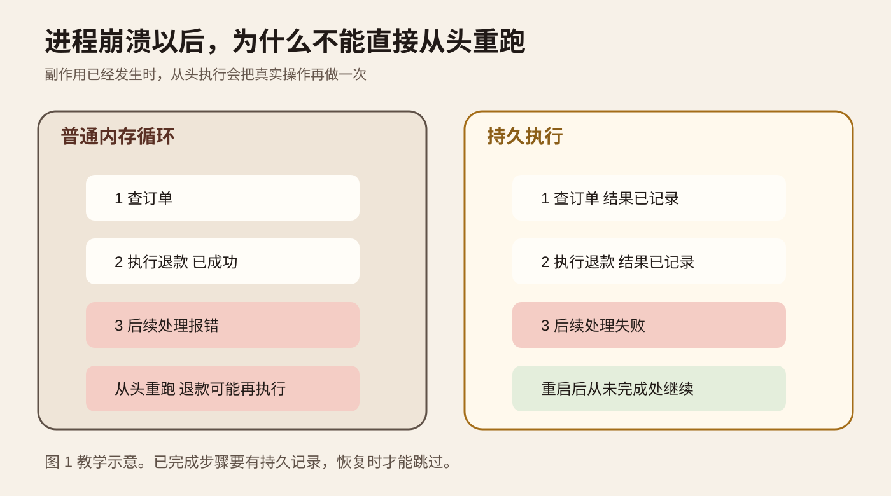
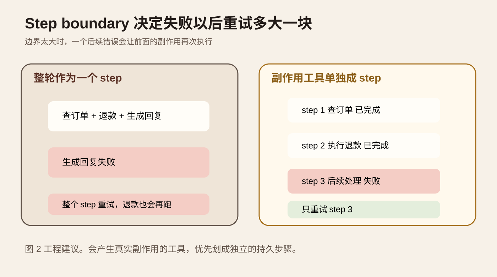
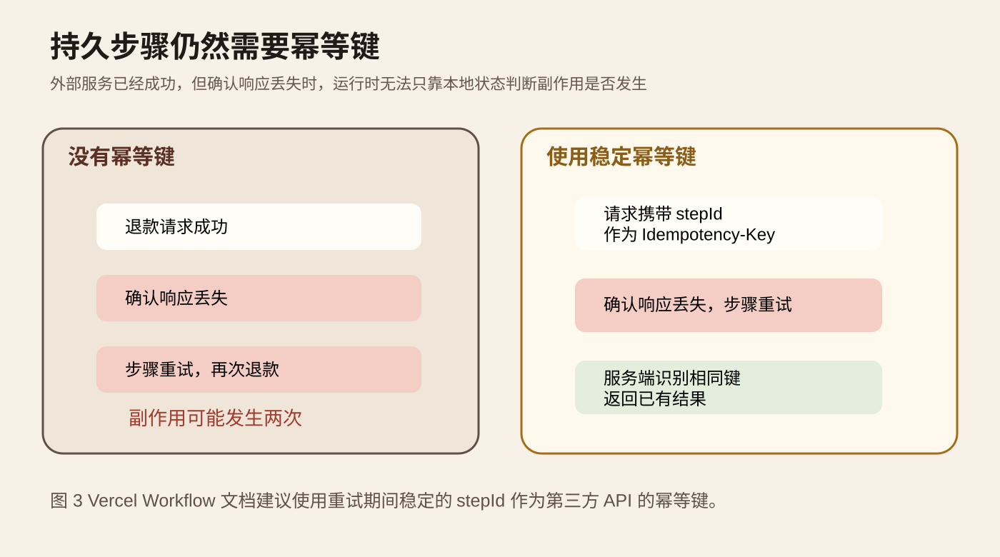
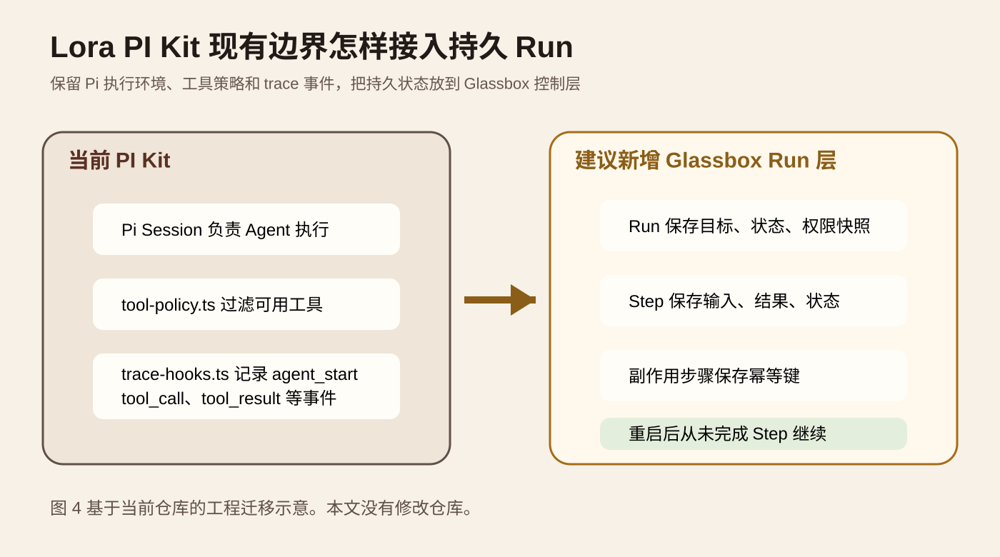

系列：每日 AI 图文精读

今天研究一个很具体的问题。Agent 已经调用过退款、发消息、写数据库，随后进程崩了。服务恢复以后，为什么不能把整段 Agent 逻辑从头再跑一遍？

主材料是 Vercel AI SDK 的 [WorkflowAgent 官方文档](https://github.com/vercel/ai/blob/main/content/docs/03-agents/07-workflow-agent.mdx)。它把 Agent 的模型调用、工具执行、暂停和恢复放进持久工作流。相关材料是 Vercel Workflow 的 [Workflows and Steps](https://github.com/vercel/workflow/blob/main/docs/content/docs/v5/foundations/workflows-and-steps.mdx)、[Idempotency](https://github.com/vercel/workflow/blob/main/docs/content/docs/v5/foundations/idempotency.mdx) 和 [AI SDK integration](https://github.com/vercel/workflow/blob/main/docs/content/docs/v5/cookbook/integrations/ai-sdk.mdx)。

AI SDK 的 WorkflowAgent 代码在 2026 年 9 月 18 日仍有提交和包更新。今天读的是当前实现正在处理的问题，不是把旧材料包装成新闻。

## 先从一次重复退款开始

假设客服 Agent 要处理一个退款任务。它先查订单，再调用退款接口，最后生成回复并写一条工单记录。

退款接口已经成功。下一次模型调用却超时，随后进程退出。客户端只看到请求失败，不知道退款到底有没有发生。

最直接的恢复方式是重新执行整个 Agent。问题也在这里。第二次运行会重新查订单，也可能再次调用退款。第一次退款已经真实发生，只是成功确认没有传回本地。于是一次技术重试变成了第二次业务操作。

这类问题和普通聊天重试不同。模型多生成一次文字，通常只是浪费 token。支付、退款、创建工单、发送邮件、修改数据库会改变外部世界。只要 Agent 有这类工具，恢复机制就必须知道哪些步骤已经完成，哪些步骤还没有完成。

<TraceExplorer
  title="退款任务在故障点发生了什么"
  steps="查订单::完成::订单状态已经读取，可以复用这一步的结果|执行退款::完成::外部退款服务已经真的完成业务动作，这一步不能因为后续失败就再次创建退款|生成回复::失败::模型调用超时，当前进程没有正常结束|恢复任务::继续::新进程读取持久步骤记录，只继续尚未完成的部分"
  source="教学示意，用于说明 Step 边界与恢复语义"
 />

图 1 是本文绘制的教学示意。左边的进程只把状态放在内存里。进程消失以后，只能从头猜。右边把每个已完成步骤的结果写入持久记录。新进程恢复时先读记录，再从未完成的位置继续。

## 持久执行保存的不是一条更长的聊天记录

持久执行的核心是把执行进度变成可恢复状态。

Vercel Workflow 把代码分成 Workflow Function 和 Step Function。Workflow Function 负责组织条件、循环和步骤顺序。Step Function 负责真实工作。官方文档说明，步骤结果会写入 event log。工作流恢复时，编排代码可以重新执行，但已完成步骤直接读取之前保存的结果，而不是再次执行步骤函数。[官方说明](https://github.com/vercel/workflow/blob/main/docs/content/docs/v5/foundations/workflows-and-steps.mdx)

所以这里的“重放”不能理解成重新做所有业务操作。更接近的理解是重新计算控制流程，同时让 event log 回答“这一段以前做完没有，结果是什么”。

这和前几天精读过的 Agent 回归 Replay 也不是一回事。回归 Replay 用于测试新版本在历史场景中的行为。今天说的 durable execution 用于一次真实任务在崩溃、超时和暂停以后继续执行。两者都会读历史记录，但目的不同。

WorkflowAgent 在这个基础上把 Agent loop 放进工作流。官方文档写明，普通 ToolLoopAgent 主要在内存中运行。WorkflowAgent 会保存状态，并允许工具执行成为独立的持久步骤。进程重启后，已经持久化的进度仍然存在。[WorkflowAgent 文档](https://github.com/vercel/ai/blob/main/content/docs/03-agents/07-workflow-agent.mdx)

## 真正关键的是 Step 边界

知道“状态要保存”还不够。你还要决定保存到哪里。

Vercel 的 AI SDK integration 文档给了一个很实用的反例。可以把整个用户回合放进一个 `use step` 函数。这个回合里面包含模型调用和多个工具调用。这样实现很简单，但整个回合才是最小重试单元。

如果 `processRefund` 已经成功，后面的模型调用又抛错，整个回合会重试。文档明确指出，此时 `processRefund` 会再次执行。官方给出的两个解决办法是让有副作用的工具本身具备幂等性，或者使用 WorkflowAgent，把工具调用放到独立的工作流 Step 中。[AI SDK integration](https://github.com/vercel/workflow/blob/main/docs/content/docs/v5/cookbook/integrations/ai-sdk.mdx)

图 2 看的是重试范围。左边把查订单、退款和后续回复包在一个 Step 里。最后一步失败，整个 Step 都可能重新执行。右边把退款单独做成持久 Step。退款成功并记录后，后续失败只需要恢复未完成部分。

这个边界不是越细越好。每一次持久化都会增加状态、事件和调度成本。纯计算、格式化、没有外部副作用的小函数没有必要全部拆开。真正应该优先独立的是会改变外部世界的操作，以及耗时长、失败成本高、需要人工审批的操作。

可以先用一个判断题来划边界。如果这段代码执行成功以后，进程突然断电，下一次重复执行会不会产生第二份真实结果？如果答案是会，它就值得单独设计 Step 和恢复语义。

## 有持久 Step 以后，为什么还需要幂等性

很多人做到这里会认为问题已经解决。退款 Step 已经独立了，失败就重试这一个 Step，看起来不会重复前面的步骤。

但分布式系统还有一个无法消除的窗口。外部退款服务已经完成操作，本地却没有收到响应。工作流只知道“这次调用没有拿到成功结果”。它无法证明远端没有执行。

这时再精细的 Step 划分也不能回答远端真实状态。你需要幂等键。

幂等的意思很简单。同一个业务操作重复提交多次，最终效果和提交一次相同。Vercel Workflow 文档给出的办法是使用每次 Step 调用稳定不变的 `stepId`，把它传给支持幂等键的第三方 API。Step 重试时 `stepId` 不变，服务端可以识别这是同一次操作，而不是第二次新的退款。[Idempotency 文档](https://github.com/vercel/workflow/blob/main/docs/content/docs/v5/foundations/idempotency.mdx)

图 3 的关键不在重试次数，而在身份。第一次调用和重试必须携带同一个业务操作 ID。没有稳定 ID，服务端只能看到两次长得相似的请求。带稳定幂等键以后，服务端才有依据返回第一次的结果。

如果第三方 API 不支持 Idempotency-Key，也可以在自己的业务层做去重。例如以 `order_id + action_type` 建唯一约束，或者先写一条 operation 记录，再由 worker 消费。这里没有统一做法。要求只有一个，重复请求必须能被同一个稳定业务身份识别。

## Step 幂等和 Run 幂等不是同一个问题

还有一层重复经常被忽略。用户连续点两次按钮，前端超时后自动重试，网关重新发送请求，都可能让同一个任务启动两个 Run。

Step 幂等解决的是一个 Run 内部的步骤重试。Run 幂等解决的是两个启动请求是不是同一个任务。

Vercel Workflow 当前文档用确定性的 Hook token 协调正在执行的重复 Run。token 可以来自订单 ID、发票 ID、导入任务 ID 或 request ID。多个 Run 争用相同 token 时，工作流在内部判断谁拥有这个任务。[Run idempotency](https://github.com/vercel/workflow/blob/main/docs/content/docs/v5/foundations/idempotency.mdx)

工程上可以把这两个 ID 分开记录。`run_id` 表示一次工作流实例。`operation_id` 或 `step_id` 表示一次外部副作用。不要拿随机生成的新请求 ID 代替业务幂等键，否则每次重试都会变成新操作。

## 暂停和恢复也属于同一个问题

持久执行不只服务于崩溃恢复。

WorkflowAgent 支持需要人工批准的工具。批准请求出现以后，工作流可以暂停。用户几个小时以后再批准，执行仍能继续。这里要求审批状态和待执行工具参数不能只存在某个 Node 进程的内存里。[WorkflowAgent 文档](https://github.com/vercel/ai/blob/main/content/docs/03-agents/07-workflow-agent.mdx)

流式输出也是另一条状态线。WorkflowChatTransport 会在流没有正常结束时重新连接。前端能恢复流，不代表后端副作用天然安全。UI 重连解决“用户还能不能继续看到输出”。Step 持久化和幂等解决“业务动作会不会重复”。这两件事要分别验证。

还要注意一个成本边界。WorkflowAgent 当前没有默认的 Step 数量上限。如果模型持续调用工具，Run 可以一直进行。官方建议需要控制执行时间和成本时配置明确的停止条件。[WorkflowAgent 文档](https://github.com/vercel/ai/blob/main/content/docs/03-agents/07-workflow-agent.mdx)

## 放到 Lora PI Kit，应该改哪一层

这部分基于我本次实际读取的 `lora-sys/lora-pi-kit` 当前主分支，不是根据项目名字猜结构。

仓库 README 把 PI Kit 定义为 Pi 的可复现发行层。`extensions/core/tool-policy.ts` 在 `tool_call` 事件上根据 active profile 过滤工具。`extensions/glassbox/policy-bridge.ts` 可以调用 Glassbox 的授权检查器。README 还明确写了 Glassbox 可以在 Run 开始前用持久的 per-group whitelist 进一步缩小工具范围。[PI Kit README](https://github.com/lora-sys/lora-pi-kit/blob/main/README.md) [tool-policy.ts](https://github.com/lora-sys/lora-pi-kit/blob/main/extensions/core/tool-policy.ts)

现有 `extensions/glassbox/trace-hooks.ts` 已经记录 `agent_start`、`agent_end`、`turn_start`、`turn_end`、`tool_call`、`tool_result` 和 usage。这些是执行信号。不过当前实现把事件写进进程内的 `traceBuffer`。进程结束以后，这个数组不会成为持久恢复依据。[trace-hooks.ts](https://github.com/lora-sys/lora-pi-kit/blob/main/extensions/glassbox/trace-hooks.ts)

所以我不建议把 durable runtime 硬塞进 `extensions/core/runtime.ts`。这个文件当前只注册 `lora-status` 命令。PI Kit 更适合继续负责执行环境、扩展、工具策略和事件采集。Glassbox 控制面更适合负责 Run 和 Step 的持久状态。

图 4 是根据当前仓库结构画的工程迁移示意，不表示仓库已经实现右侧模块。建议新增的 Glassbox Run 层至少保存 `run_id`、任务目标、权限快照、当前状态和 Step 列表。每个 Step 保存稳定 `step_id`、工具名、脱敏后的输入、执行状态、结果引用、开始时间、结束时间和错误。会产生外部副作用的 Step 再绑定幂等键。

这样改的验收标准也很具体。PI Kit 现有 profile 和 tool policy 行为不能改变。进程在任意 Step 结束后被杀掉，重新启动应该读取同一个 Run。已经成功的副作用工具不能再次执行。未完成的 Step 可以继续。trace 仍然用于观察和调试，但持久 Step 记录成为恢复事实来源。

主要失败条件有三个。第一，`traceBuffer` 仍是唯一状态源。第二，每次恢复都生成新的 Step ID。第三，外部工具虽然单独成 Step，却没有服务端幂等或业务去重。这三种情况都会让“看起来可恢复”和“真实副作用安全”出现差距。

## 一个一小时可以做完的实验

不需要先给 PI Kit 接完整工作流框架。先用一个最小 Node 脚本验证核心假设。

准备一个模拟退款服务。收到第一次 `operation_id` 时把 `refund_count` 加一并保存结果。再次收到相同 `operation_id` 时直接返回原结果。再写一个三步骤 Agent 流程。Step 1 查订单。Step 2 调退款。Step 3 生成回复。

A 组把三个动作放在一个可重试函数里。让 Step 2 成功后，在 Step 3 人工抛异常，然后重新执行整个函数。B 组把每个 Step 的结果写入一个 SQLite 表或 JSON 文件。Step 2 使用稳定 `step_id` 作为退款幂等键。相同位置抛异常以后，重新启动程序并读取 Run 状态。

每次记录 `run_id`、`step_id`、`attempt`、`tool_name`、`operation_id`、Step 状态、外部服务实际执行次数和最终结果。这里的数字都是你的实验数据，不要提前写结论。

成功标准是故障注入以后 B 组能够完成任务，而且模拟退款服务的真实 `refund_count` 仍然等于 1。恢复日志可以出现多次尝试，但业务副作用只能出现一次。A 组如果出现两次退款，就说明故障注入确实覆盖了我们要研究的问题。

最容易误判的是只看 Agent 的日志。程序打印“退款请求发送一次”不能证明服务端只执行一次。实验必须查看模拟服务自己的计数或数据库状态。另一个误区是只测试步骤开始前崩溃。真正有价值的故障点是外部副作用已经成功、本地确认还没有可靠保存的窗口。

## 什么情况下不值得引入完整持久执行

一个十秒内完成、只读数据、失败后从头跑没有副作用的小 Agent，没有必要为了 durable workflow 增加一套状态系统。普通重试已经足够。

当任务会持续较久，会等待人工输入，会跨部署继续，或者会执行支付、写库、部署、发消息这类真实动作时，持久执行的价值才明显。

它也不是完整的事务系统。event log 能告诉运行时哪些本地步骤已完成，但不能替第三方 API 提供 exactly once 保证。跨系统副作用仍然需要幂等键、唯一约束、补偿操作或业务状态机。

## 记住这几个判断

持久执行解决的是“进程消失后从哪里继续”，不是“让聊天历史无限长”。

Step boundary 决定一次失败会重试多大范围。副作用越强，越应该缩小重试范围。

幂等性解决的是最危险的未知状态。远端已经成功，本地却没收到确认时，重试不能创造第二份业务结果。

### 自测

为什么把整个 Agent 回合做成一个持久 Step 仍然可能重复退款？

因为退款成功以后，回合内后续代码仍可能失败。整个 Step 重试时，退款函数会再次执行。

已经有 event log，为什么还要给第三方 API 传幂等键？

因为外部 API 可能已经成功，但成功响应在网络中丢失。event log 此时没有可靠结果，只能重试。稳定幂等键让外部服务把重试识别成同一个业务操作。

PI Kit 当前的 traceBuffer 能直接当恢复状态吗？

不能。当前 `trace-hooks.ts` 把 TraceEvent 保存在进程内数组。它适合观察当前进程，不是跨进程持久恢复事实源。

## 主要一手来源

[Vercel AI SDK WorkflowAgent](https://github.com/vercel/ai/blob/main/content/docs/03-agents/07-workflow-agent.mdx)：核对持久 Agent、工具 Step、自动重试、审批暂停和流恢复行为。

[Vercel Workflow Workflows and Steps](https://github.com/vercel/workflow/blob/main/docs/content/docs/v5/foundations/workflows-and-steps.mdx)：核对 workflow、step、event log、恢复语义和默认 Step 重试次数。

[Vercel Workflow Idempotency](https://github.com/vercel/workflow/blob/main/docs/content/docs/v5/foundations/idempotency.mdx)：核对稳定 stepId、Step 幂等和 Run 幂等。

[Vercel Workflow AI SDK integration](https://github.com/vercel/workflow/blob/main/docs/content/docs/v5/cookbook/integrations/ai-sdk.mdx)：核对整轮作为一个 Step 时副作用工具可能在重试中再次执行的具体失败模式。

[Vercel，AI SDK 7，2026-06-25](https://vercel.com/changelog/ai-sdk-7)：核对 WorkflowAgent 在 AI SDK 7 中的 durable execution 定位。

[Lora PI Kit README](https://github.com/lora-sys/lora-pi-kit/blob/main/README.md)、[tool-policy.ts](https://github.com/lora-sys/lora-pi-kit/blob/main/extensions/core/tool-policy.ts)、[trace-hooks.ts](https://github.com/lora-sys/lora-pi-kit/blob/main/extensions/glassbox/trace-hooks.ts)：核对当前仓库结构、工具策略和 trace 实现。
