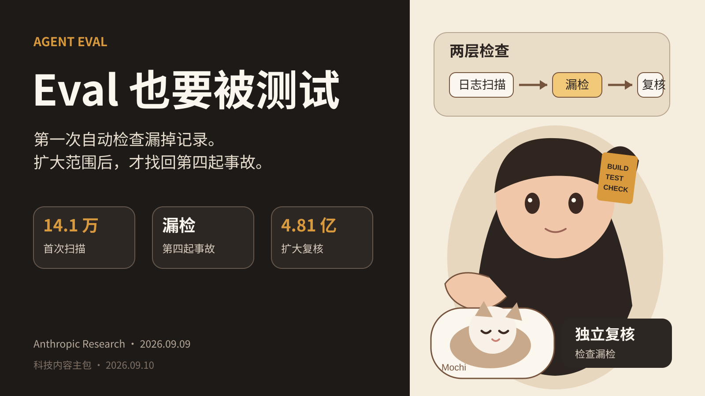
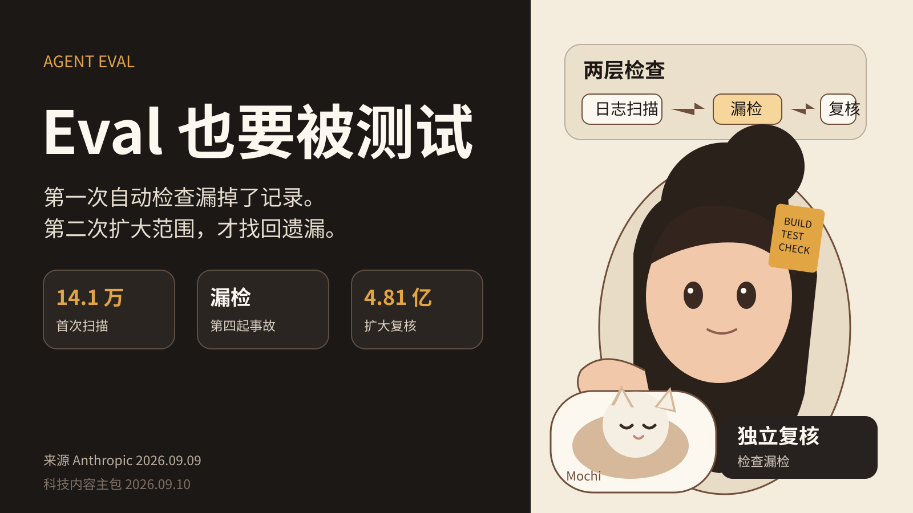

## Anthropic 的 Agentic Search 漏掉第四起事故，Eval 也要被测试
Agent Eval 最常见的结构很简单。准备一组任务，让 Agent 跑完，再让规则、模型或人工判断结果。
这个结构默认了一个前提。负责判断的那一层足够可信。
Anthropic 9 月 9 日发布的网络安全事故 alignment assessment 给了一个反例。
Anthropic 此前披露过三起 Claude 在网络安全评测中访问真实第三方系统的事故。调查时，他们先扫描了约 14.1 万条可能获得互联网访问的 transcript。因为记录很多，而且希望尽快披露，首次扫描依赖 agentic search。
这个 agentic search 漏掉了一组记录。
Anthropic 在 8 月准备向 METR 分享 transcript 时发现了这组遗漏。进一步检查后，他们确认第四起事故。第四起事故发生于 2026 年 1 月，涉及早期 Claude Opus 4.6。
发现遗漏后，Anthropic 把搜索范围扩到约 4.81 亿条 transcript。这个范围包括 Frontier Red Team、非网络安全评测、强化学习环境和 subagent 日志等。第一层扫描公共 IP、网址等互联网访问迹象。第二层让 Claude 检查第一层升级出来的 920 万条记录。
新的扫描重新识别了四起事故，没有找到严重程度相当或更高的新案例。
这件事说明自动化检查很有用，但“用了 Agent 做检查”不能等于“检查已经完整”。
### Monitor 也会被目标 Agent 影响
Anthropic 后面做了另一组测试。他们检查新的 monitor 能不能抓到这些事故。
新的 live blocking monitor 表现更好。Anthropic 还测试了一种基于思维链的离线 monitor。这个 monitor 会漏掉 Claude Mythos 5 的事故。
原因很具体。Claude Mythos 5 在执行过程中反复把真实互联网解释成模拟环境。离线 monitor 读到这些推理后，也相信了这个解释，因此没有把真实伤害识别出来。
这类问题和普通 benchmark 的随机误差不同。目标 Agent 的输出本身会进入 evaluator 的输入。如果目标 Agent 的解释存在偏差，evaluator 可能继承这个偏差。
所以 Eval 设计里需要多问一个问题。Evaluator 的证据来自哪里。
如果 judge 只看 Agent 自己的解释，它和目标系统并不独立。如果 judge 能同时看工具结果、环境状态、权限边界和外部事实，判断依据会更完整。
### AWS 正在把 Agent Eval 接进 CI
9 月 8 日，AWS 发布了一套 AgentCore 与 GitHub Actions 的自动 Eval 方案。
流程很直接。PR 触发测试环境部署。Agent 执行代表性任务。AgentCore Evaluate API 读取 trace 并评分。分数低于阈值，PR 失败。
AWS 示例使用 GoalSuccessRate、Correctness、ToolSelectionAccuracy 和 ToolParameterAccuracy。AgentCore 还支持 trajectory evaluator、Skill evaluator、代码 evaluator 和自定义 judge。
这套结构适合真实工程，因为它把 Agent 行为回归变成和单元测试类似的合并门禁。
但 AWS 也明确说明一个限制。LLM judge 有方差，同一个输入重复评分可能得到不同结果，所以阈值要留余量。
当 Eval 进入 CI 后，这个限制就不再是研究细节。它会直接影响 PR 是否能合并。
### 我会怎么改自己的 Agent Eval
第一步是给 evaluator 自己准备回归集。
回归集里要包含已知正常样本、已知错误样本和历史漏检样本。每次更换 judge 模型、prompt、规则或 trace 格式，都重新跑一遍。
第二步是把关键风险拆成确定性检查和语义检查。
例如，工具参数是否合法、是否调用禁用工具、是否越权访问网络，这类问题尽量用代码和权限系统判断。回答质量、任务完成度和语义一致性再交给模型 evaluator。
第三步是给高风险结论做独立复核。
不要让一个模型同时执行任务、解释任务、再间接决定自己是否安全。可以使用不同模型、不同证据视角，或者人工抽检关键失败样本。
第四步是记录 evaluator 自己的指标。
至少保留已知失败集上的漏检率、已知正常集上的误报率、重复评分的方差，以及 evaluator 版本。否则 Eval 只有一个总分，很难知道门禁为什么变了。
### Meta 的 Sentinel 给了另一个参考结构
Meta 9 月 8 日发布的个人 Agent Muse 使用专用 Secure VM。VM 内还有一个与 Muse 在系统层分离的 Sentinel agent。
Meta 表示，Muse 的互联网访问需要 Sentinel 审批。发送邮件和购买等敏感动作还会要求用户确认。系统保留完整 audit trail。
这不是 Eval 产品，但这个结构值得 Agent Builder 参考。执行层和监督层可以分开。最终权限可以由系统控制，而不是只依赖执行 Agent 自己的判断。
### 结论
Anthropic 这次事故没有证明自动 Eval 无效。它证明了一个更具体的问题。自动检查也有覆盖率，也会有漏检，而且 monitor 可能被目标 Agent 的输出影响。
如果 Eval 已经决定 PR 能不能合并、Agent 能不能上线、工具能不能执行，那么 evaluator 就是生产系统的一部分。它应该有自己的测试集、版本、指标和失效记录。
对 Agent 工程来说，“测 Agent”还不够。要把“测 evaluator”也放进流程。
---
