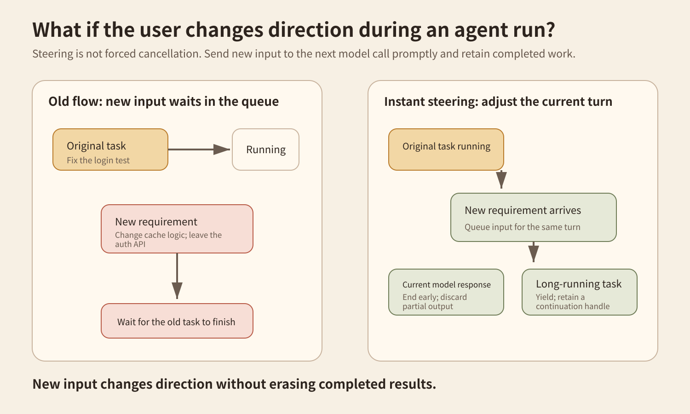
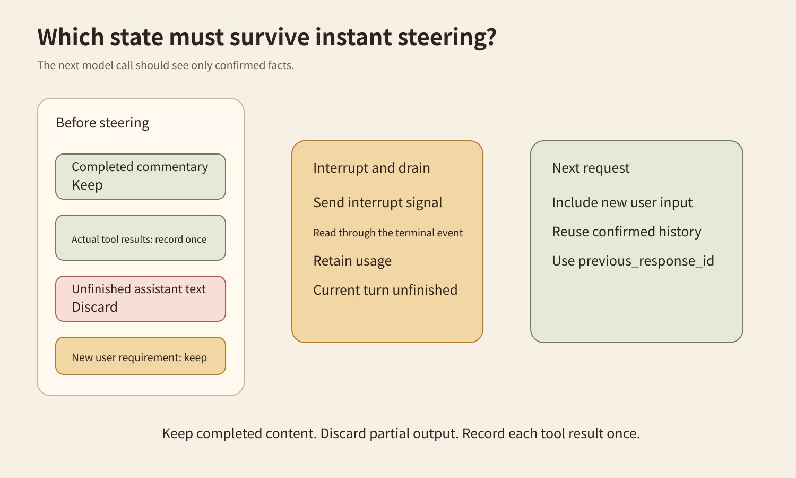
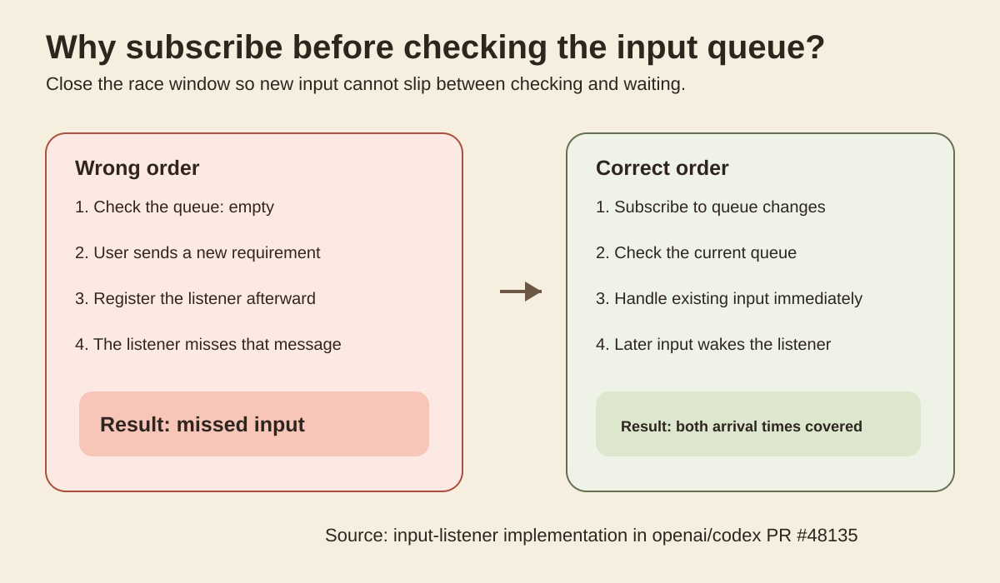
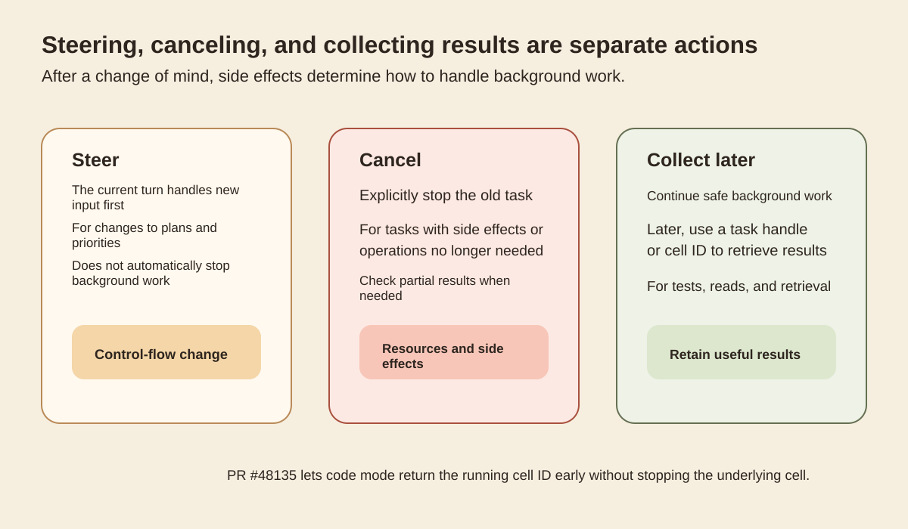
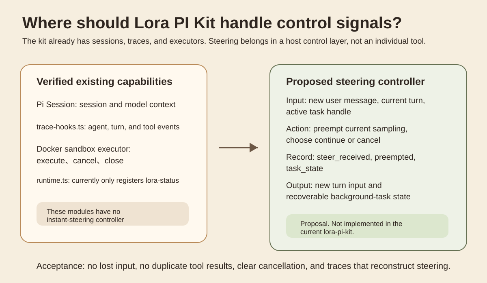

This article closely examines `instant_interrupt`, an experimental feature in Codex 0.159.0. It studies how a system adjusts the current turn when a user adds requirements during an agent run, while retaining confirmed tool results and execution state.
## Start with a change of requirements
You ask a coding agent to fix a login test. While it is running, you realize the cache logic is what needs changing, and the authentication API must stay untouched. Should the new requirement wait until the old task ends, or change the current turn's direction immediately?

## What this update actually changed
OpenAI released [Codex 0.159.0](https://github.com/openai/codex/releases/tag/rust-v0.159.0) on September 29, 2026. Its release notes list `instant_interrupt` as a new feature. The current source marks it UnderDevelopment and disables it by default. This article therefore discusses an experimental mechanism, not a stable default capability.
[PR 48135](https://github.com/openai/codex/pull/48135) handles long-running code mode calls. Previously, a new user message arriving while `exec` or `wait` ran could stay queued. The new implementation creates an input listener for the sampling request. It subscribes to queue changes first, then checks for user input already in the queue, avoiding a message arriving between the check and subscription.
When new input appears, the system triggers a preemption signal. For code mode `exec` and `wait`, this does not kill the underlying cell. The call returns early with the running cell ID. The underlying task continues. The model handles the new requirement first and can later use `wait` to collect the original task's result.
[PR 48141](https://github.com/openai/codex/pull/48141) extends the idea to model responses. When user input arrives, the current sampling step no longer has to finish naturally. The system ends that step early, then passes the new input to a subsequent request. Regression tests cover streaming responses, retry waits, and input arriving around compaction.
The WebSocket path was refined later. The final implementation does not simply disconnect and resend the full history. Once the client has a response ID, it can send an interrupt signal and keep reading events until it receives the interrupted terminal status. The next request can reuse previous_response_id, and usage for the interrupted response is retained.
This behavior comes from [PR 48508](https://github.com/openai/codex/pull/48508). It lets a request after steering reuse confirmed session state rather than sending the entire history again.
`instant_interrupt` therefore defines control semantics for an ongoing run. It is more than a faster cancel button. The system must decide how to end model output, handle background tasks, and preserve tool results at the same time.
## Keeping state consistent is the hard part
An agent runtime has a model stream, user input, tool calls, and tool results active at once. Changing only one of these during steering can leave the state inconsistent.
OpenAI's tests check several boundaries explicitly. Completed commentary can remain. Unfinished assistant text must not enter the next request. Direct tool results that already occurred must be retained exactly once. Multiple user inputs arriving in succession must not be lost either.

## Preemption and cancellation differ
A common misunderstanding is to interpret instant steering as ending the old task whenever a new message arrives.
[PR 48135](https://github.com/openai/codex/pull/48135) is more precise. A long-running code mode `exec` or `wait` can return the running cell ID to the model early when new user input arrives. The underlying cell continues. The model handles the new requirement first, then can still collect the original result with `wait`.
This preempts control flow. It changes what gets handled first without automatically terminating background work that has already started.
## Why control flow and background tasks need separate handling
When a user adds a requirement, the system must handle the current model turn separately from tools that have already started.
In the read-only testing example, letting the background task finish does not cause duplicate execution. Once the test result returns, the current turn decides whether it is relevant to the new goal.
## Model output can also be preempted
Beyond tool calls, model responses themselves can take a long time. [PR 48141](https://github.com/openai/codex/pull/48141) extends `instant_interrupt` to request setup, response streams, and retry waits. When new user input arrives, the current sampling step can finish early, leaving the next request to handle the input.

Figure 3. Subscribing to input changes before checking the current queue covers both messages already present and messages that arrive later.

Figure 4. Steering, cancellation, and continuing to collect results are different actions. Background tasks need handling according to their type.

Figure 5. A proposed adaptation for Lora PI Kit. Control signals belong in the host or Glassbox control layer. The current repository has not implemented this.
## Why subscribe before checking the queue
If the system checks the input queue before registering a listener, a user message can arrive between those steps. The message is then queued, but the listener never receives that change. A safer order is to create the listener first, then check the current queue.
This order also applies to waiting for human approval, subagent results, and background tasks. The system cannot assume events arrive only after it starts waiting.
## Steering, cancellation, and collecting results are three actions
When users change requirements mid-run, the system cannot apply one uniform action.
If a background task only reads files, runs tests, or retrieves information, continuing usually does not change external state. The system can preempt model control flow so the model handles the new requirement, then collect the background result when it finishes. Codex code mode returns the running cell ID early without stopping the underlying cell; `wait` can retrieve the result later.
If the background task modifies remote resources or makes external writes, the situation is different. Steering the model cannot undo an operation that already happened. The system must also decide whether to cancel the task and establish whether it has partially completed. A compensation flow may be necessary instead of simply discarding the tool result.
Steering handles current control flow. Cancellation handles task lifecycle. Continuing to collect results handles background work that still has value. Combining all three into one `interrupt` can produce duplicate results and unexplained external state.
## WebSocket steering changed again later
The implementation mentioned earlier initially reset the connection after preemption so the next request would resend full history. The later PR 48508 instead finishes the current response before letting subsequent requests continue with confirmed response state.
Instant steering therefore has two concerns. The first is getting new input into the current task promptly. The second is preserving usable confirmed state after steering. Related tests cover connection reuse, subsequent input, and usage records for interrupted responses.
These sources provide no general latency measurements, nor do they establish that every task should be preempted immediately. Queuing may be simpler for very short calls. External operations with strong transaction boundaries also cannot be stopped automatically merely because the model changes direction.
## Where this belongs in Lora PI Kit
This section is based on the current `lora-sys/lora-pi-kit` main branch I actually read for this article.
At present, `extensions/core/runtime.ts` only registers `lora-status`. `extensions/glassbox/trace-hooks.ts` already records agent, turn, tool-call, tool-result, and usage events. The README also documents the Docker sandbox executor's execution and cancellation capabilities.
These capabilities are currently spread across the session, tracing, and execution layers. Supporting new input during a run requires a separate coordination layer. At minimum, it needs the current turn, new input, and active task states, then must return the new requirements to the agent for a decision.
## A low-cost experiment
There is no need to connect real services. A local fake runner can validate the control semantics.
First, prepare a read-only task that takes several seconds and returns a task handle. Inject a second user message after it starts. Then prepare another set of tasks that simulate writes to temporary files to observe different handling policies.
Approach A only queues the new message and handles it after the old task ends. Approach B ends the current model step early when the new message arrives, but lets the read-only task continue. Approach C ends the current model step early and also stops the simulated write task.
Record `turn_id`, `user_input_at`, `preempt_at`, `task_state`, `tool_result_count`, `final_goal_match`, and `side_effect_count` for each run.
Success is not just response speed. Approach B should start handling the new requirement before the background task finishes and receive exactly one tool result afterward. Approach C should explicitly record that the task stopped, and the temporary file's final state must agree with that status. None of the three approaches may lose the second user message.
The easiest mistake is to inspect only the chat window. A quick acknowledgment of the new requirement does not mean the old tool has stopped. Check task state, the number of tool results, and the final side-effect state.
The proposal in Figure 5 needs four acceptance checks. New input must not be lost. Completed tool results must enter history exactly once. Safe background tasks must remain retrievable after steering. Tasks with external writes must leave clear state records.
Tracing also needs steering events. A minimal set is `steer_received`, `preempt_requested`, `preempt_completed`, `task_state`, and `replacement_turn_id`. If an agent later performs an old action after the user changed the requirement, these events let you locate the problem in order.
## When instant steering is worthwhile
Long model responses, test tasks, retrieval, and background analysis fit this mechanism well. When users add information during those phases, there is no reason to keep them waiting for an old step.
Very short tasks may not need it. Listeners, preemption, and recovery state add state-machine complexity to short calls.
Operations involving external writes also need more than instant steering. They require idempotency keys, explicit stopping semantics, transaction state, or compensation flows. The real question is which facts have already occurred after a change of direction, and which work can still continue safely.
## What to remember
First, queuing preserves order. Instant steering allows new input to change current control flow.
Second, preempting a model turn does not mean stopping a background task. Tool tasks need separate treatment by type.
Third, event listeners must account for races. Subscribing before checking current state avoids new input arriving between the check and the wait.
Fourth, state must remain usable after steering. Retain confirmed tool results and completed fragments. Do not treat unfinished assistant text as a completed result.
## Self-check

Why does a long-running read-only task not necessarily need to stop immediately?

Because instant steering first addresses control flow. The model can handle new requirements while safe background work continues, then collect the result through its task handle.

Why subscribe to input changes before checking the queue?

This covers both messages already present and messages arriving later, preventing a message from falling between the check and listener registration.

Why should a WebSocket interrupted status not always count as failure?

In this implementation it can represent intentional steering. The system preserves confirmed state and lets the next request continue the session.

## Main sources
[Codex 0.159.0 Release Notes](https://github.com/openai/codex/releases/tag/rust-v0.159.0) supports the release date and opt-in status of this feature.
[PR 48135](https://github.com/openai/codex/pull/48135) supports code mode preemption, continued cell execution, input-listening order, and related regression tests.
[PR 48141](https://github.com/openai/codex/pull/48141) supports preemption semantics for model responses, stream retries, and input around compaction.
[PR 48508](https://github.com/openai/codex/pull/48508) supports WebSocket continuation, response interruption, and reuse of existing state in subsequent requests.
[lora-sys/lora-pi-kit](https://github.com/lora-sys/lora-pi-kit) supports the adaptation section's description of current Session, Trace, runtime, and sandbox execution capabilities.
