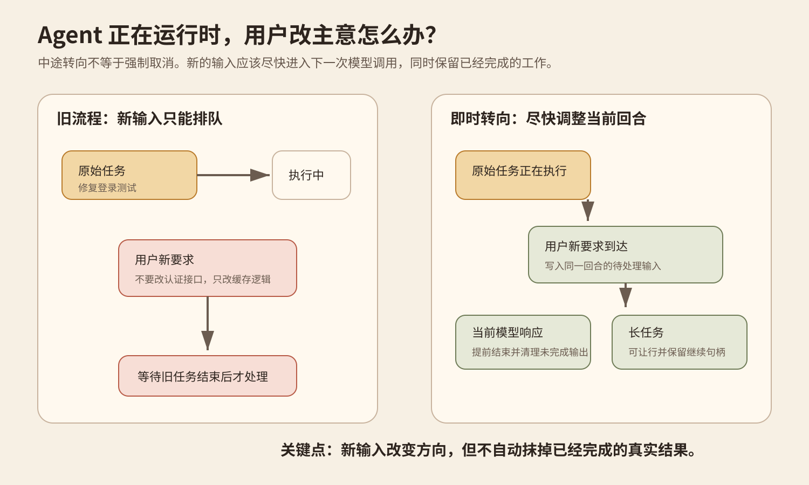
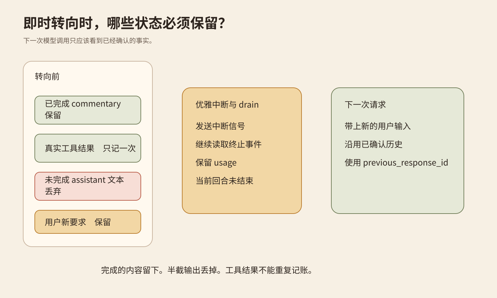
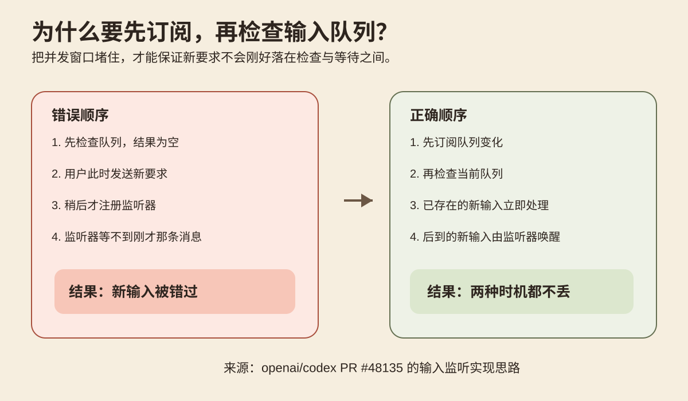
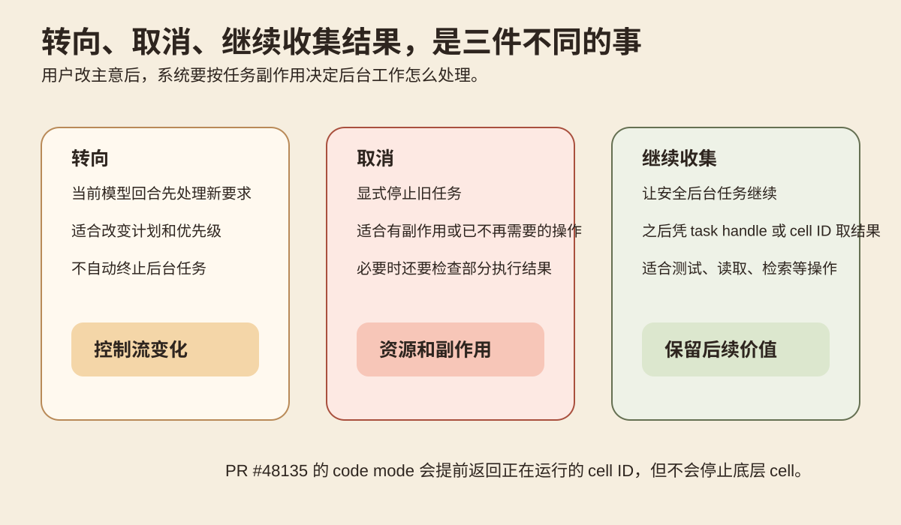
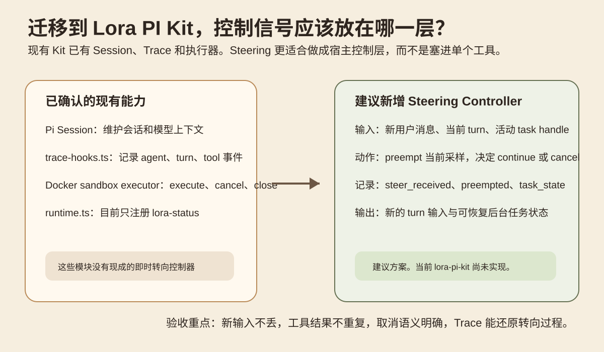

本文精读 Codex 0.159.0 的实验功能 `instant_interrupt`，研究用户在 Agent 运行途中补充新要求时，系统怎样调整当前回合，同时保留已经确认的工具结果和执行状态。
## 先从一个改需求的瞬间开始
你让 Coding Agent 修复登录测试。任务运行途中，你发现真正要改的是缓存逻辑，认证接口不能动。问题是，新要求应该等旧任务结束，还是立即改变当前回合的方向？

## 这次更新真正改了什么
OpenAI 在 2026 年 9 月 29 日发布 [Codex 0.159.0](https://github.com/openai/codex/releases/tag/rust-v0.159.0)。Release Notes 把 `instant_interrupt` 列为新功能。当前源码把它标成 UnderDevelopment，默认关闭，所以这里讨论的是实验机制，不把它写成稳定默认能力。
[PR 48135](https://github.com/openai/codex/pull/48135) 处理长时间 code mode 调用。旧行为里，用户在 `exec` 或 `wait` 运行期间发来新消息，这条消息可能一直待在队列里。新实现给 sampling request 建立输入监听器。它先订阅队列变化，再检查队列中是否已经存在用户输入，避免消息刚好落在检查与订阅之间。
新输入出现后，系统触发 preemption signal。对于 code mode 的 `exec` 和 `wait`，这不是杀掉底层 cell，而是让调用提前返回正在运行的 cell ID。底层任务继续。模型先处理新要求，之后仍可通过 `wait` 收集原任务结果。
[PR 48141](https://github.com/openai/codex/pull/48141) 把这个思路扩展到模型响应。用户输入到达时，当前采样不再必须自然结束。系统提前结束这一采样步骤，再把新输入交给后续请求。回归测试覆盖了流式响应、重试等待和 compaction 附近的新输入。
WebSocket 路径后来又做了一次收紧。最终实现不会简单断开连接并重发完整历史。客户端在拿到 response ID 后可以发送中断信号，并继续读取事件直到收到 interrupted 终止状态。下一次请求可以沿用 previous_response_id，中断响应的 token 使用也会保留。
这个行为来自 [PR 48508](https://github.com/openai/codex/pull/48508)。它让转向后的请求继续复用已经确认的会话状态，而不是把整个历史重新发送一遍。
因此，`instant_interrupt` 不是一个更快的 cancel 按钮。它建立的是运行中的控制语义。系统必须同时决定模型输出怎样收口、后台任务怎样处理、工具结果怎样保存。
## 最难的是保持状态一致
Agent 运行时同时存在模型流、用户输入、工具调用和工具结果。中途转向只改其中一条，状态就可能乱。
OpenAI 的测试专门检查了几个边界。已经完成的 commentary 可以保留。尚未完成的 assistant 文本不能进入下一次请求。已经发生的直接工具结果必须保留，而且只能记录一次。连续到达的多条用户输入也不能丢。

## 抢占和取消不是一回事
这里最容易误解的一点，是把即时转向理解成收到新消息就终止旧任务。
[PR 48135](https://github.com/openai/codex/pull/48135) 的做法更细。长时间运行的 code mode `exec` 或 `wait` 收到新用户输入后，可以提前把正在运行的 cell ID 返回给模型。底层 cell 继续执行。模型先处理新要求，之后仍能用 `wait` 收集原来的结果。
这叫抢占控制流。它改变的是现在先处理哪件事，不是自动终止已经开始的后台工作。
## 为什么还要区分控制流和后台任务
用户补充新要求时，系统要分别处理当前模型回合和已经开始的工具任务。
在只读测试的例子里，后台任务继续到结束并不会造成重复执行。测试结果返回后，再由当前回合判断这份结果是否与新的任务目标相关。
## 模型输出也会被抢占
工具调用之外，模型响应本身也可能持续较长时间。[PR 48141](https://github.com/openai/codex/pull/48141) 把 `instant_interrupt` 扩展到了请求建立、响应流和重试等待。新用户输入到达后，当前采样可以提前收口，下一次请求再处理新输入。

图 3。先订阅输入变化，再检查当前队列，可以覆盖消息已经存在和消息稍后到达两种情况。

图 4。转向、取消和继续收集结果是三种不同动作，后台任务需要按类型分别处理。

图 5。Lora PI Kit 的建议迁移方案。控制信号放在宿主或 Glassbox 控制层，当前仓库尚未实现。
## 为什么要先订阅，再检查队列
如果系统先检查输入队列，再注册监听器，用户消息可能刚好落在两步之间。这样会出现消息已经入队，但监听器没有收到新变化的情况。更稳妥的顺序是先建立监听，再检查当前队列。
这个顺序还能迁移到等待人工审批、子 Agent 结果和后台任务。系统不能假设事件只会在自己开始等待以后到达。
## 转向、取消、继续收集结果是三种动作
用户中途改要求时，系统不能只做一个统一动作。
如果后台任务只是读取文件、运行测试或检索资料，任务继续执行通常不会改变外部状态。此时可以先抢占模型控制流，让模型处理新要求，后台任务完成后再收集结果。Codex 的 code mode 会提前返回正在运行的 cell ID，但不会停止底层 cell，之后仍可以用 `wait` 取得结果。
如果后台任务会修改远端资源或产生外部写入，情况不同。模型转向并不能撤销已经发生的操作。系统还要判断任务是否应该取消，并确认操作是否已经部分完成。必要时需要补偿流程，而不是直接丢掉工具结果。
因此，转向处理当前控制流。取消处理任务生命周期。继续收集结果处理仍有价值的后台工作。把三者混成一个 `interrupt`，容易产生重复结果和不可解释的外部状态。
## WebSocket 转向后来又改了一次
前文提到的实现最初会在抢占后重置连接，让下一次请求重新发送完整历史。随后合并的 PR 48508 改成先把当前响应收口，再让后续请求继续沿用已经确认的响应状态。
这说明即时转向需要处理两个层面。第一层是让新输入及时进入当前任务。第二层是保证转向以后，已确认状态还能继续使用。相关实现测试覆盖了连接复用、后续输入和被中断响应的用量记录。
这些材料没有给出通用延迟数据，也没有证明所有任务都应该立即抢占。很短的调用继续排队可能更简单。有强事务边界的外部操作，也不能因为模型转向就自动终止。
## 放到 Lora PI Kit，应该改哪一层
这部分基于本次实际读取的 `lora-sys/lora-pi-kit` 当前主分支。
当前 `extensions/core/runtime.ts` 只注册 `lora-status`。`extensions/glassbox/trace-hooks.ts` 已经记录 agent、turn、tool call、tool result 和 usage。README 还记录了 Docker sandbox executor 的执行与取消能力。
这几项能力目前分散在会话、追踪和执行层。要支持运行中的新输入，还需要一个单独的协调层。它至少需要知道当前 turn、新输入和活动任务的状态，然后把新的要求交回 Agent 决策。
## 一个低成本实验
不需要接真实服务。可以用一个本地 fake runner 验证控制语义。
先准备一个耗时几秒的只读任务，让它返回一个 task handle。任务开始以后再注入第二条用户消息。然后再做一组模拟写入临时文件的任务，用来观察不同处理策略。
方案 A 只排队新消息，等旧任务结束以后再处理。方案 B 在新消息到达时让当前模型步骤提前收口，但只读任务继续。方案 C 让当前模型步骤提前收口，同时结束模拟写任务。
每次记录 `turn_id`、`user_input_at`、`preempt_at`、`task_state`、`tool_result_count`、`final_goal_match` 和 `side_effect_count`。
成功标准不是单纯看响应速度。方案 B 应该在后台任务完成以前开始处理新要求，而且之后只能收到一次工具结果。方案 C 应该明确记录任务已经停止，临时文件的最终状态也要与这个状态一致。三种方案都不能丢第二条用户消息。
最容易误判的是只看聊天窗口。模型很快回复收到新要求，不代表旧工具已经停止。真正要检查的是任务状态、工具结果数量和最终副作用状态。
图 5 对应的建议方案需要四个验收点。新输入不能丢。已经完成的工具结果只能进入历史一次。安全后台任务在转向后仍能取回结果。涉及外部写入的任务必须留下清楚的状态记录。
Trace 也要补转向事件。最小可以记录 `steer_received`、`preempt_requested`、`preempt_completed`、`task_state` 和 `replacement_turn_id`。这样以后出现用户已经改要求但 Agent 仍执行旧动作时，可以按事件顺序定位。
## 什么时候值得做即时转向
长时间模型响应、测试任务、检索任务和后台分析很适合这套机制。用户在这些阶段补充信息时，没有必要为了一个旧步骤一直等待。
很短的任务不一定需要。为了短调用增加监听、抢占和恢复状态，会增加状态机复杂度。
涉及外部写入的操作也不能只靠即时转向。系统还需要幂等键、明确的停止语义、事务状态或补偿流程。真正要判断的是中途改方向以后，哪些事实已经发生，哪些工作仍然可以安全继续。
## 记住这几个结论
第一，排队保证顺序。即时转向允许新输入改变当前控制流。
第二，抢占模型回合不等于停止后台任务。工具任务需要按类型单独处理。
第三，事件监听要考虑竞态。先订阅，再检查当前状态，可以避免新输入刚好落在检查与等待之间。
第四，转向后的状态必须可继续。已经确认的工具结果和完成片段要保留，未完成的 assistant 文本不能当成完成结果。
## 自测

为什么长时间运行的只读任务不一定要被立即停止？

	因为即时转向首先解决的是控制流。模型可以先处理新要求，安全后台任务继续运行，之后再通过任务句柄收集结果。

为什么要先订阅输入变化，再检查队列？

	这样可以同时覆盖消息已经存在和消息稍后到达两种情况，避免消息落在检查与监听建立之间。

为什么 WebSocket 的 interrupted 状态不能一律当成失败？

	在这次实现里，它可以表示一次有意的转向。系统保留已经确认的状态，再让后续请求继续当前会话。

## 主要来源
[Codex 0.159.0 Release Notes](https://github.com/openai/codex/releases/tag/rust-v0.159.0) 支持本次功能的发布时间和 opt-in 状态。
[PR 48135](https://github.com/openai/codex/pull/48135) 支持 code mode 的抢占、cell 继续运行、输入监听顺序和相关回归测试。
[PR 48141](https://github.com/openai/codex/pull/48141) 支持模型响应、stream retry 和 compaction 附近输入的抢占语义。
[PR 48508](https://github.com/openai/codex/pull/48508) 支持 WebSocket continuation、响应中断和后续请求继续沿用既有状态。
[lora-sys/lora-pi-kit](https://github.com/lora-sys/lora-pi-kit) 支持本文迁移部分对当前 Session、Trace、runtime 和 sandbox 执行能力的描述。
