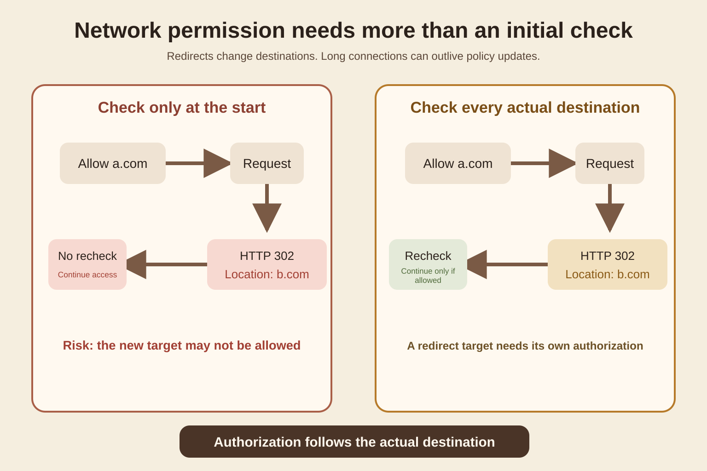
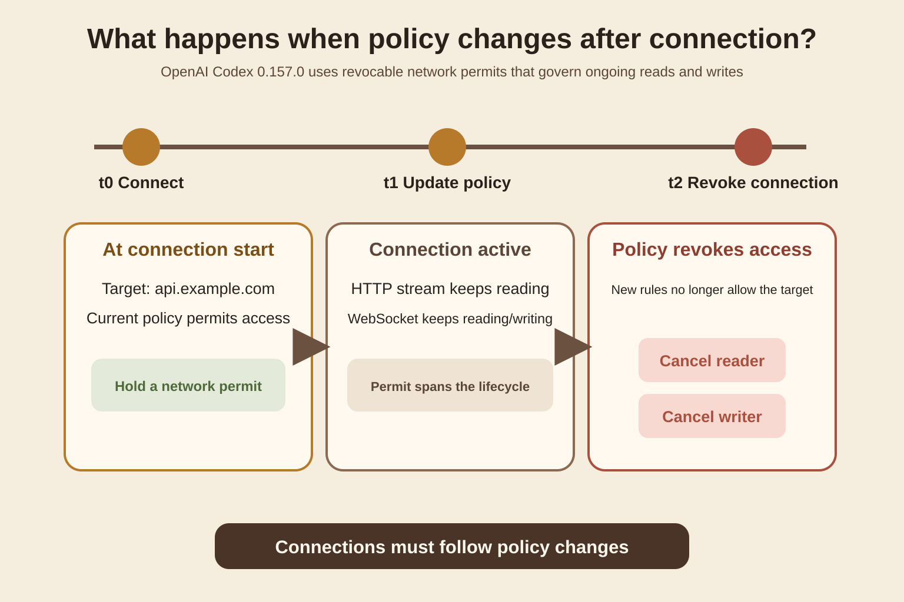
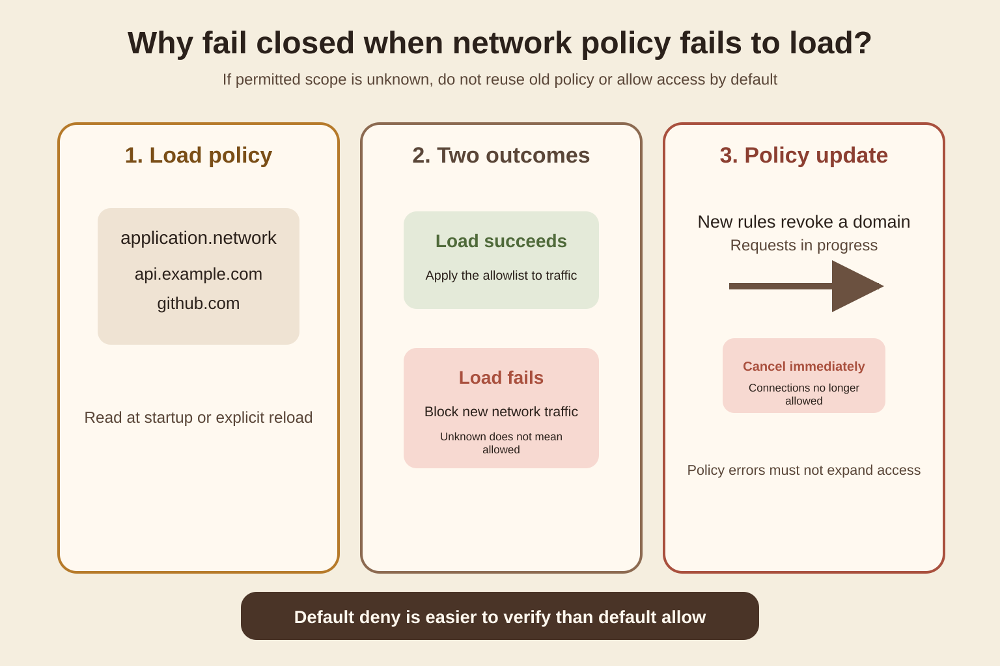
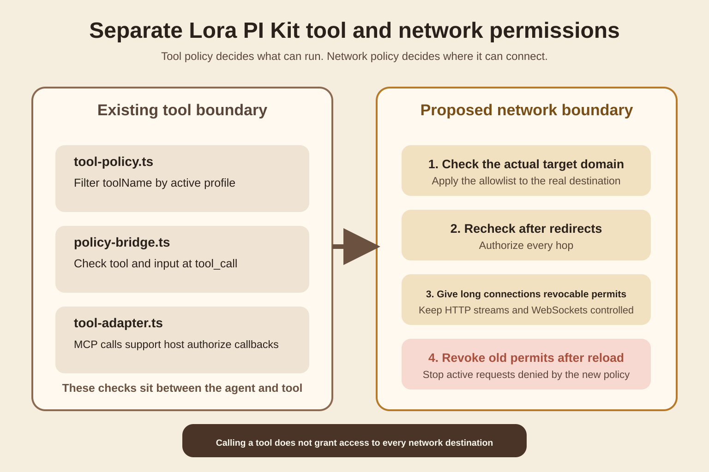

Today's question is specific. A coding agent has permission to access an API. The request has already been sent, or a WebSocket is already connected. Why must the runtime keep checking network permissions?
The main source is [Codex CLI 0.157.0](https://github.com/openai/codex/releases/tag/rust-v0.157.0), released by OpenAI on September 25, 2026. This version extends network restrictions to HTTP redirects, response bodies still being read, and established WebSockets. If a policy update revokes access, requests in progress are canceled too. The implementation mainly comes from [PR 47389](https://github.com/openai/codex/pull/47389), merged September 22, and [PR 47407](https://github.com/openai/codex/pull/47407), merged September 23.
This article does not discuss bypassing network policy. It examines a runtime design problem: authorization must follow the actual destination and connection lifecycle, rather than act as a single boolean check before a request starts.
## A development scenario that can fail
Suppose a coding agent in Lora PI Kit has a tool for reading build status from an external service. The administrator allows it to access only [api.example.com](http://api.example.com).
The first request does go to [api.example.com](http://api.example.com), so it passes the check. The service then returns HTTP 302 and asks the client to continue at [files.example.net](http://files.example.net). Many HTTP clients follow redirects automatically by default. If the authorization layer only checks the initial URL, the later actual destination never passes through the same rules.
Another case is less obvious. The agent opens a WebSocket in the morning. In the afternoon, an administrator discovers that the destination should no longer be accessible and updates the policy. If the old connection keeps sending and receiving, the configuration has changed while the actual permissions have not.
Both errors treat permission at request start as permission for the entire request lifecycle.

Figure 1 is a mechanism diagram drawn for this article. The left side checks only the initial [a.com](http://a.com). On the right, the redirect makes [b.com](http://b.com) a new authorization target. Focus on one point: the check must apply to the destination actually being accessed, not merely the URL string initially entered by the user.
## What Codex 0.157.0 changed
The Codex 0.157.0 release notes explicitly describe a fix: network restrictions now cover redirects, ongoing HTTP traffic, and WebSocket traffic. Requests in progress are canceled when policy changes revoke access. [Release notes](https://github.com/openai/codex/releases/tag/rust-v0.157.0)
PR 47389 breaks down the behavior. At every HTTP redirect, the client checks the new destination before resolving the route. During response-body reads, the runtime retains a revocable network permit. WebSocket connection setup, reads, and writes are also controlled by revocable permits. For split readers and writers, policy revocation must wake and stop each separately. [PR 47389](https://github.com/openai/codex/pull/47389)
A permit is a currently valid runtime authorization, not a permanent pass. Once a policy update invalidates it, subsequent reads and writes should stop.
The PR also handles error semantics explicitly. Network-policy denials remain Policy Errors and are treated as non-retryable. A permission denial is not a temporary network glitch. Automatic retries would only repeat an explicitly prohibited action.

Figure 2 focuses on time. At t0, the destination is allowed when the connection opens. At t1, the administrator tightens the policy. At t2, both the reader and writer must stop. This matters for long-running agents because a task can span multiple configuration updates.
## Why redirects need new authorization
A redirect changes the actual resource being accessed. It is more than a minor networking detail.
Suppose the initial policy allows [docs.example.com](http://docs.example.com). The request returns a Location. The new address may be a static-content domain owned by the same company, or something entirely different. A runtime that checks only the original domain turns the server's redirect decision into a new source of authorization.
The current Codex app-server documentation states strict rules. Domain keys in [application.network](http://application.network) are exact hostnames. Rules apply before HTTP and WebSocket routing or connection work, including redirects and reused clients. Allow entries permit only HTTPS or WSS on that exact host. [app-server README](https://github.com/openai/codex/blob/main/codex-rs/app-server/README.md)
These are Codex's current implementation choices, not universal internet standards. Other systems may use domain groups, service identities, or proxy-layer rules. The requirement remains: every change in the actual destination must pass through authorization.
## Why policy-loading failures must not default to allow
PR 47407 addresses another problem. The app-server loads [application.network](http://application.network) at startup and on explicit configuration or account reload. If loading fails, new network traffic is blocked. Active requests no longer allowed by the new policy are canceled. [PR 47407](https://github.com/openai/codex/pull/47407)
This is called fail closed. Without trustworthy rules, the system denies access by default instead of assuming the old rules remain usable.
It handles configuration uncertainty. If a damaged policy file, read failure, or account change causes the system to fall back to unrestricted networking, a configuration error expands permissions. Codex's current documentation also says account changes revoke requests and clients still holding the old account's authorization. [app-server README](https://github.com/openai/codex/blob/main/codex-rs/app-server/README.md)

Figure 3 shows two states. Apply trustworthy rules when available. Block new traffic when the rules cannot be confirmed. After a policy update, old connections cannot keep running on previously acquired permits.
## Tool permissions and network permissions differ
It is easy to confuse this with tool authorization.
Tool permissions decide whether an agent may call read_file, bash, or a particular MCP tool. Network permissions decide which external destinations that tool may access and whether access remains valid throughout the connection.
OpenAI's Sandbox Security documentation also separates these layers. Agent-generated code can use the network supplied by its execution environment, so that environment should allow only approved outbound destinations. Third-party credentials should remain outside the execution environment, with a trusted proxy injecting them only into approved outbound requests. [Sandbox Security](https://developers.openai.com/api/docs/guides/agents-api/environments/security)
Permission to call a tool therefore does not imply permission for that tool to access any network address.
## Where to add this in Lora PI Kit
This section is based on the current lora-sys/lora-pi-kit main branch I actually read for this article.
[tool-policy.ts](https://github.com/lora-sys/lora-pi-kit/blob/main/extensions/core/tool-policy.ts) filters toolName according to the active profile on tool_call events. [policy-bridge.ts](https://github.com/lora-sys/lora-pi-kit/blob/main/extensions/glassbox/policy-bridge.ts) checks dangerous bash commands and can pass toolName, input, and context to Glassbox's PolicyChecker. [tool-adapter.ts](https://github.com/lora-sys/lora-pi-kit/blob/main/extensions/mcp/tool-adapter.ts) also supports a host authorize callback before every MCP tool invocation.
All three answer whether a tool may be called. In those three authorization files, I did not find a unified network-permit layer covering HTTP redirects, response-body reads, and the WebSocket lifecycle. The existing Tool Policy should therefore not be treated as complete network isolation.
My engineering recommendation is to retain those tool boundaries and add a separate Network Guard at the host's or runtime's outbound network layer.
Its inputs include the destination host, current Run or principal, policy version, and connection type. Its output is a revocable permit rather than a simple true or false. Every HTTP redirect rechecks the destination. Long responses and WebSockets retain a permit during reads and writes. After policy reload, the system revokes permits that no longer meet the rules.

Figure 4 proposes a design based on PI Kit's current file structure; it does not represent implemented functionality. The left retains the existing Tool Policy, Glassbox Policy, and MCP authorize callback. The right adds a network layer that constrains actual outbound destinations.
## A low-cost experiment to verify it yourself
You do not need a complete agent. Two local test servers are enough.
Start with Server A and Server B. One endpoint on A returns 302 with a Location pointing to B. Prepare a simple policy allowing only A.
Compare two approaches. The baseline client checks A before the first request, then lets the HTTP library follow redirects automatically. The candidate disables automatic redirects, reads Location, checks B, and then decides whether to continue.
Record requested_host, redirect_host, policy_version, decision, connection_state, and cancel_reason. First, verify whether B is actually blocked. Then switch to a long-running response or WebSocket. After the connection opens, change the policy for the current destination from allow to deny and observe whether the active connection stops.
The success criteria are simple. An unauthorized redirect destination must not receive a connection. Active connections must stop reading and writing after revocation. A policy-loading failure must not silently fall back to unrestricted networking.
The easiest mistake is checking only a function's return value. Observe whether Server B received a connection and whether the socket still carries traffic after the update. Another mistake is conflating DNS resolution with domain authorization. This article concerns the authorization lifecycle, not the design of a complete SSRF protection system.
## Where this is useful, and where not to overbuild
This mechanism is worth implementing if an agent can access the internet, connect to MCP HTTP services, use remote model providers, keep WebSockets open, read streamed responses, or experience policy changes during a run.
For an offline agent with no network capability that only operates on local files and controlled processes, focus on filesystem, process, and tool permissions. There is no need to build an unused network-policy framework.
There is another boundary. Codex's [application.network](http://application.network) mainly constrains the app-server's own supported HTTP, WebSocket, and some gRPC paths. The official README explicitly says user-initiated Git, SSH, shell, and other subprocess traffic remains controlled by the respective execution and sandbox policies. [app-server README](https://github.com/openai/codex/blob/main/codex-rs/app-server/README.md) Any network policy must first specify exactly which outbound paths it covers.
## What to remember
If a request redirects, check its new actual destination.
If a connection persists, permission needs a continuing lifecycle too.
If policy can change, old permits must be revocable.
If policy cannot be loaded reliably, do not broaden access.
Verify tool authorization and network authorization separately.
## Self-check
Question 1: Why check network permissions after an agent has passed a tool-permission check?
Answer: Tool permissions only decide whether a capability may be called. The real external destinations it accesses still need independent limits.
Question 2: If the initial domain is allowed, why check again after a 302?
Answer: A redirect changes the actual destination. Permission for the original destination does not automatically authorize the new one.
Question 3: What should happen when an administrator tightens policy after a WebSocket is established?
Answer: The active connection must follow the new policy too. Readers and writers with revoked permits should stop.
Question 4: Why not allow traffic after a policy-loading failure until configuration recovers?
Answer: The system cannot confirm the permitted scope. Defaulting to allow turns a configuration failure into a permissions expansion.
## Main sources
[OpenAI Codex 0.157.0 Release](https://github.com/openai/codex/releases/tag/rust-v0.157.0) supports the version changes and release date.
[OpenAI Codex PR 47389](https://github.com/openai/codex/pull/47389) supports redirect checks, permits during response-body reads, WebSocket read/write revocation, and non-retryable policy errors.
[OpenAI Codex PR 47407](https://github.com/openai/codex/pull/47407) supports policy reload, fail closed, active-request cancellation, and authorization revocation after account changes.
[Codex app-server README](https://github.com/openai/codex/blob/main/codex-rs/app-server/README.md) supports the current exact-host rules and coverage boundaries for [application.network](http://application.network).
[OpenAI Sandbox Security](https://developers.openai.com/api/docs/guides/agents-api/environments/security) supports minimal execution-environment networking and the security boundary for credential proxies.
