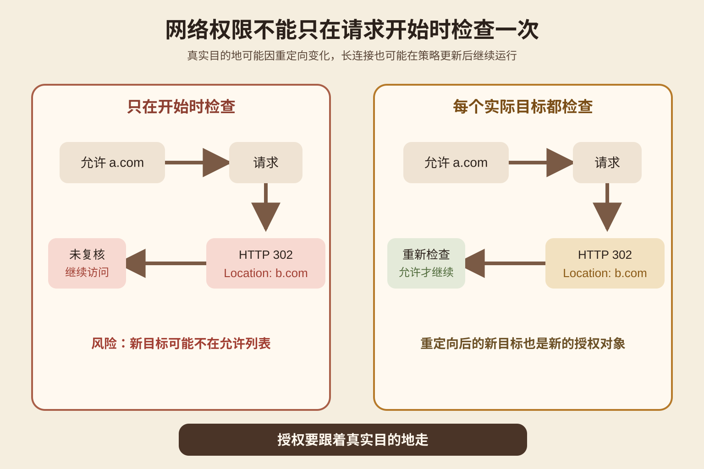
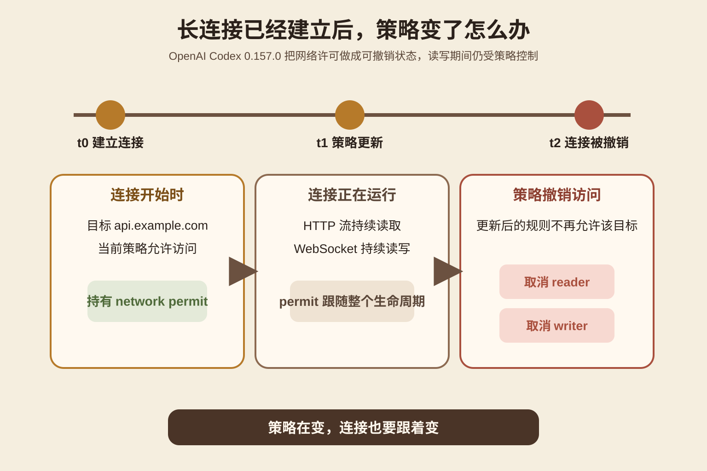
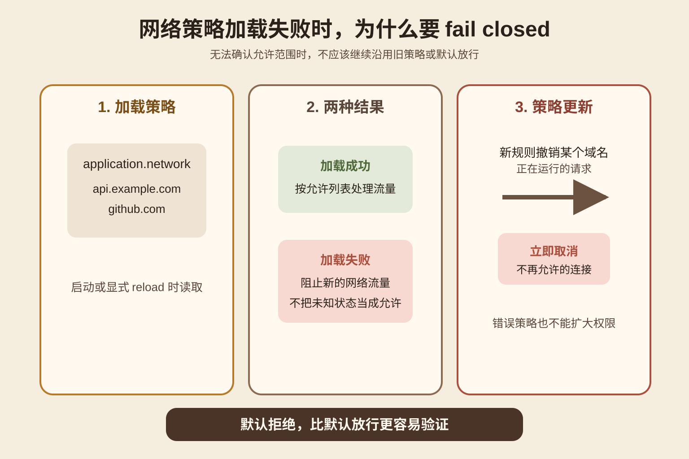
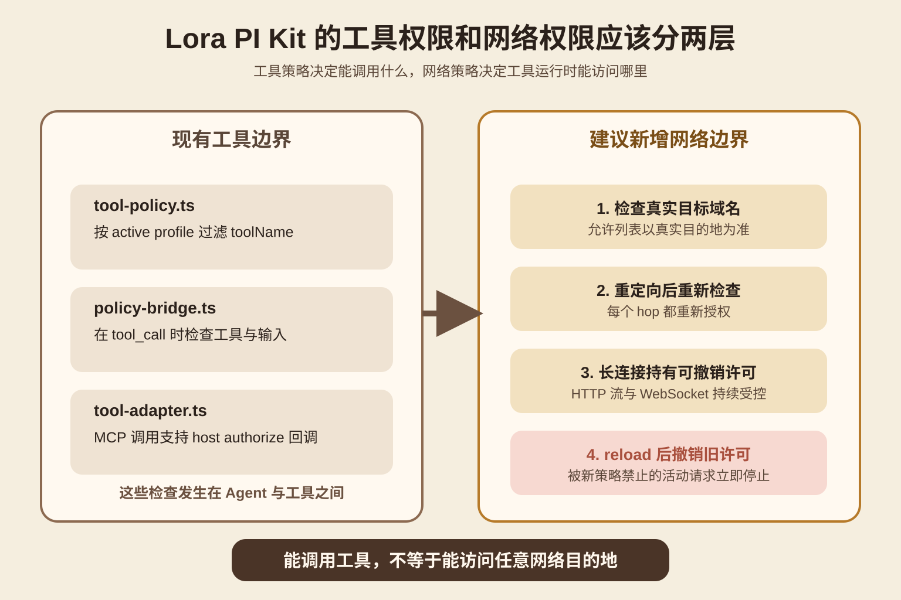

今天研究一个很具体的问题。Coding Agent 被允许访问一个 API。请求已经发出，甚至 WebSocket 已经连上。为什么运行时还要继续检查网络权限？
主材料是 OpenAI 在 2026 年 9 月 25 日发布的 [Codex CLI 0.157.0](https://github.com/openai/codex/releases/tag/rust-v0.157.0)。这个版本把网络限制覆盖到 HTTP 重定向、持续读取中的响应体和已经建立的 WebSocket。策略更新以后，如果新的规则撤销访问，正在进行的请求也会被取消。对应实现主要来自 9 月 22 日合入的 [PR 47389](https://github.com/openai/codex/pull/47389) 和 9 月 23 日合入的 [PR 47407](https://github.com/openai/codex/pull/47407)。
这篇不讨论怎样绕过网络策略。重点是理解一个运行时设计问题：授权不是请求开始前的一次布尔判断，而是要跟随真实目的地和连接生命周期。
## 先看一个会出错的开发场景
假设 Lora PI Kit 里的 Coding Agent 有一个工具，用来读取某个外部服务的构建状态。管理员只允许它访问 [api.example.com](http://api.example.com)。
第一次请求确实发往 [api.example.com](http://api.example.com)，所以检查通过。服务随后返回 HTTP 302，让客户端继续访问 [files.example.net](http://files.example.net)。很多 HTTP 客户端默认会自动跟随重定向。如果授权层只检查第一次输入的 URL，后面的实际目的地就没有再经过同一套规则。
另一种情况更隐蔽。Agent 在上午建立了一个 WebSocket。下午管理员发现这个目标不应该再访问，于是更新策略。如果旧连接仍然继续收发消息，那么配置文件虽然变了，真实权限却没有变。
这两种错误的共同点是，系统把“请求开始时允许”误当成“整个请求生命周期一直允许”。

图 1 是本文绘制的机制图。左边只检查最初的 [a.com](http://a.com)。右边在重定向以后把 [b.com](http://b.com) 当成新的授权对象。读图时只看一件事：真正需要判断的是实际要访问的目的地，不是用户最初输入的那串 URL。
## Codex 0.157.0 实际改了什么
Codex 0.157.0 的 Release Notes 明确写了一个修复：网络限制现在覆盖重定向、持续 HTTP 流量和 WebSocket 流量。当策略变化撤销访问时，正在进行的请求会被取消。[Release 说明](https://github.com/openai/codex/releases/tag/rust-v0.157.0)
PR 47389 把这个行为拆得更清楚。HTTP 客户端在每一次重定向时，都要先检查新的目的地，再做路由解析。读取响应体期间，运行时继续持有一个可撤销的 network permit。WebSocket 的连接建立、读取和写入也都受可撤销许可控制。对于已经拆开的 reader 和 writer，策略撤销时要分别唤醒并停止。[PR 47389](https://github.com/openai/codex/pull/47389)
这里的 permit 可以理解成一张仍然有效的运行许可。它不是永久通行证。只要策略更新使这张许可失效，后续读写就应该停止。
PR 还专门处理了错误语义。网络策略拒绝被保留为 Policy Error，并按不可重试处理。原因很直接。权限拒绝不是临时网络抖动。自动重试只会重复一个明确不允许的动作。

图 2 看的是时间。t0 建立连接时目标被允许。t1 管理员收紧策略。t2 连接的 reader 和 writer 都必须停止。这个机制对长时间运行的 Agent 很重要，因为一次任务可能跨越多次配置更新。
## 为什么重定向必须重新授权
重定向不是简单的网络细节。它会改变实际访问对象。
假设最初策略允许 [docs.example.com](http://docs.example.com)。请求返回一个 Location。新地址可能是同一公司的静态域名，也可能完全不同。运行时如果只检查原始域名，就把服务器的重定向决定变成了新的授权来源。
Codex 当前 app-server 文档把规则写得很严格。[application.network](http://application.network) 的域名键是精确主机名。规则会在 HTTP 和 WebSocket 路由或连接工作开始前执行，也覆盖重定向和复用的客户端。允许项只允许对应精确主机上的 HTTPS 或 WSS。[app-server README](https://github.com/openai/codex/blob/main/codex-rs/app-server/README.md)
这些是 Codex 当前实现，不是互联网通用标准。工程上可以使用别的策略语言，例如域名组、服务身份或代理层规则。关键要求不变：每一次真实目的地变化都要经过授权层。
## 为什么策略加载失败不能默认放行
PR 47407 处理的是另一类问题。app-server 会在启动和显式配置或账户 reload 时加载 [application.network](http://application.network)。加载失败时，新网络流量会被阻止。新策略不再允许的活动请求会被取消。[PR 47407](https://github.com/openai/codex/pull/47407)
这叫 fail closed。系统拿不到可信规则时，默认拒绝，而不是假设旧规则还可以继续使用。
它解决的是配置不确定性。策略文件损坏、读取失败或账户发生变化时，如果系统自动退回无限制网络，错误配置就会扩大权限。Codex 的当前文档还说明，账户变化会撤销仍持有旧账户授权的请求和客户端。[app-server README](https://github.com/openai/codex/blob/main/codex-rs/app-server/README.md)

图 3 只表达两个状态。规则可信时按规则执行。规则无法确认时阻止新的流量。策略更新以后，旧连接不能靠之前拿到的许可继续运行。
## 工具权限和网络权限不是一回事
这件事很容易和工具授权混在一起。
工具权限回答的是 Agent 能不能调用 read_file、bash、某个 MCP Tool。网络权限回答的是这个工具运行以后能访问哪些外部目的地，以及访问权限在整个连接期间是否仍然有效。
OpenAI 的 Sandbox Security 文档也把这两层分开。Agent 生成的代码可以访问执行环境提供的网络，因此运行环境应只允许批准的出站目的地。第三方凭据还应该留在执行环境外，由可信代理只在批准的出站请求上注入。[Sandbox Security](https://developers.openai.com/api/docs/guides/agents-api/environments/security)
所以“允许调用这个工具”不能推出“这个工具可以访问任何网络地址”。
## 放到 Lora PI Kit，应该加在哪一层
这部分基于我本次实际读取的 lora-sys/lora-pi-kit 当前主分支。
[tool-policy.ts](https://github.com/lora-sys/lora-pi-kit/blob/main/extensions/core/tool-policy.ts) 会在 tool_call 事件上根据 active profile 过滤 toolName。[policy-bridge.ts](https://github.com/lora-sys/lora-pi-kit/blob/main/extensions/glassbox/policy-bridge.ts) 会检查危险 bash 命令，也可以把 toolName、input 和 context 交给 Glassbox 的 PolicyChecker。[tool-adapter.ts](https://github.com/lora-sys/lora-pi-kit/blob/main/extensions/mcp/tool-adapter.ts) 还支持由宿主在每次 MCP Tool 调用前执行 authorize 回调。
这三处都在解决“能不能调用这个工具”。在本次读取的这三处授权代码里，我没有看到一个统一覆盖 HTTP 重定向、响应体读取和 WebSocket 生命周期的 network permit 层。因此不要把现有 Tool Policy 当成完整的网络隔离。
我的工程建议是保留现有工具边界，在宿主或 runtime 的出站网络层增加独立 Network Guard。
它需要的输入包括目标主机、当前 Run 或 principal、策略版本和连接类型。它的输出不是简单的 true 或 false，而是一份可撤销 permit。HTTP 每次跳转时重新检查目标。长响应和 WebSocket 在读写期间保留 permit。策略 reload 后，系统撤销不再符合规则的 permit。

图 4 是基于当前 PI Kit 文件结构给出的建议方案，不代表仓库已经实现。左边保留现有 Tool Policy、Glassbox Policy 和 MCP authorize。右边新增真正约束出站目的地的网络层。
## 一个低成本实验，自己验证这件事
不用先搭完整 Agent。两个本地测试服务器就够了。
起始条件是准备 Server A 和 Server B。A 的一个接口返回 302，并把 Location 指向 B。再准备一个简单策略，只允许 A。
对照方案有两组。基线客户端只在第一次请求前检查 A，然后让 HTTP 库自动跟随重定向。候选客户端关闭自动重定向，读取 Location 后先检查 B，再决定是否继续。
操作时记录 requested_host、redirect_host、policy_version、decision、connection_state 和 cancel_reason。第一轮验证 B 是否真的被阻止。第二轮改成长时间响应或 WebSocket。连接建立后更新策略，把当前目标从 allow 改为 deny，再观察活动连接是否停止。
成功标准很简单。未授权的重定向目标不能被连接。策略撤销以后，活动连接不能继续读写。策略加载失败时也不能自动退回无限制网络。
最容易误判的是只检查函数返回值。真正要观察的是 Server B 有没有收到连接，以及策略更新以后 socket 是否仍有流量。另一个误判是把 DNS 解析和域名授权混在一起。今天讨论的是授权生命周期，不是在设计一套完整的 SSRF 防护系统。
## 哪些场景值得做，哪些不用过度设计
只要 Agent 能访问外网、连接 MCP HTTP 服务、使用远程模型提供商、保持 WebSocket、读取流式响应，或者策略可能在运行中变化，这套机制就值得做。
如果一个离线 Agent 完全没有网络能力，只操作本地文件和受控进程，那么重点应该放在文件系统、进程和工具权限，没必要为了网络策略造一套空框架。
还有一个边界。Codex 的 [application.network](http://application.network) 主要约束 app-server 自己支持的 HTTP、WebSocket 和部分 gRPC 路径。官方 README 明确指出，用户直接发起的 Git、SSH、Shell 和其他 subprocess 流量仍由各自的执行与 sandbox 策略控制。[app-server README](https://github.com/openai/codex/blob/main/codex-rs/app-server/README.md) 所以任何网络策略都要先写清楚“它实际覆盖哪些出口”。
## 记住这几个判断
如果请求会重定向，就检查新的真实目的地。
如果连接会持续存在，就让权限也有持续生命周期。
如果策略会更新，就让旧许可可以被撤销。
如果策略无法可信加载，就不要扩大访问范围。
工具授权和网络授权要分开验证。
## 自测
问题一：Agent 已经通过一次工具权限检查，为什么还需要网络权限检查？
答案：工具权限只决定能不能调用某个能力。工具运行以后访问的真实外部目的地仍需要独立约束。
问题二：HTTP 请求最开始访问的域名在允许列表里，为什么 302 以后还要再检查？
答案：重定向改变了真实访问对象。原始目标的许可不能自动授权新的目标。
问题三：WebSocket 已经建立以后，管理员收紧策略，正确行为是什么？
答案：正在运行的连接也要受到新策略约束。被撤销许可的 reader 和 writer 应该停止。
问题四：策略加载失败为什么不能先放行，等配置恢复再说？
答案：系统无法确认允许范围。默认放行会把配置故障变成权限扩大。
## 主要来源
[OpenAI Codex 0.157.0 Release](https://github.com/openai/codex/releases/tag/rust-v0.157.0) 支持本次版本变化与发布日期。
[OpenAI Codex PR 47389](https://github.com/openai/codex/pull/47389) 支持重定向检查、响应体期间 permit、WebSocket 读写撤销和策略错误不可重试。
[OpenAI Codex PR 47407](https://github.com/openai/codex/pull/47407) 支持策略 reload、fail closed、活动请求取消和账户变化后的授权撤销。
[Codex app-server README](https://github.com/openai/codex/blob/main/codex-rs/app-server/README.md) 支持 [application.network](http://application.network) 当前的精确主机规则与覆盖边界。
[OpenAI Sandbox Security](https://developers.openai.com/api/docs/guides/agents-api/environments/security) 支持执行环境网络最小化与凭据代理的安全边界。
