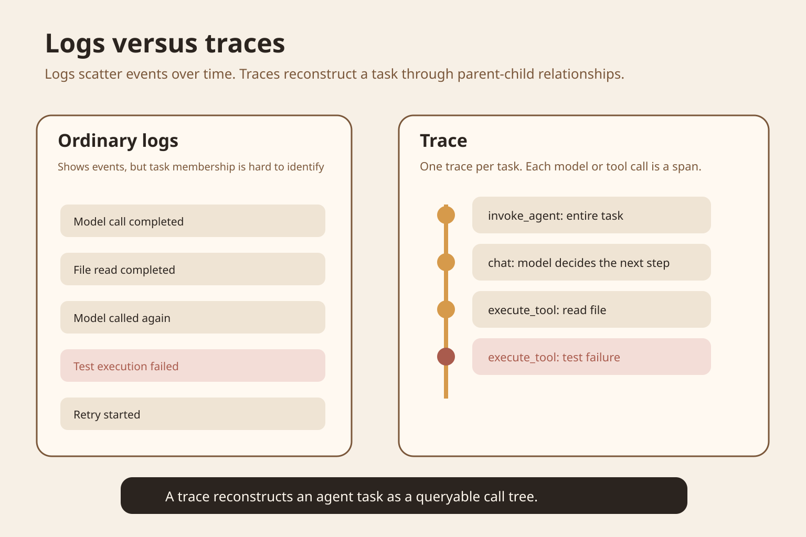
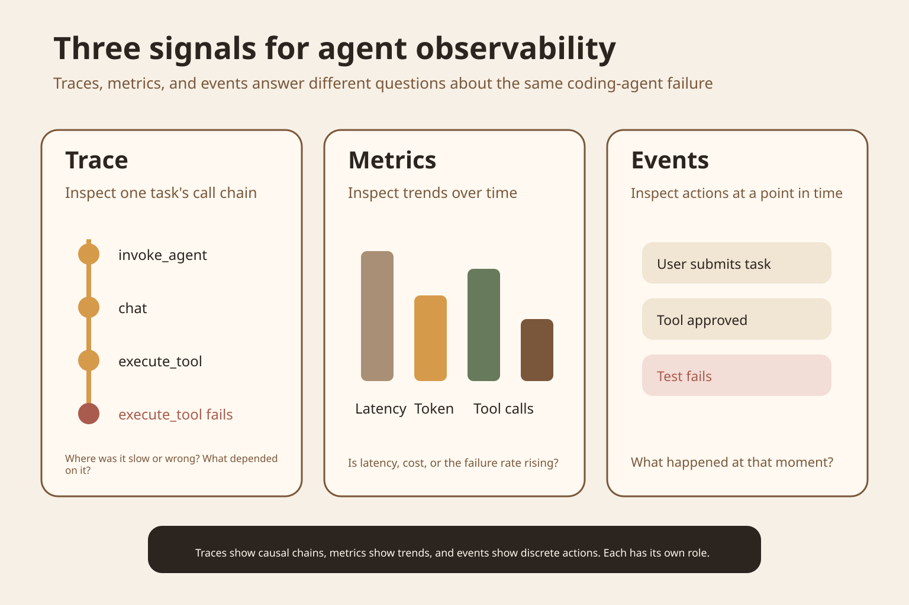
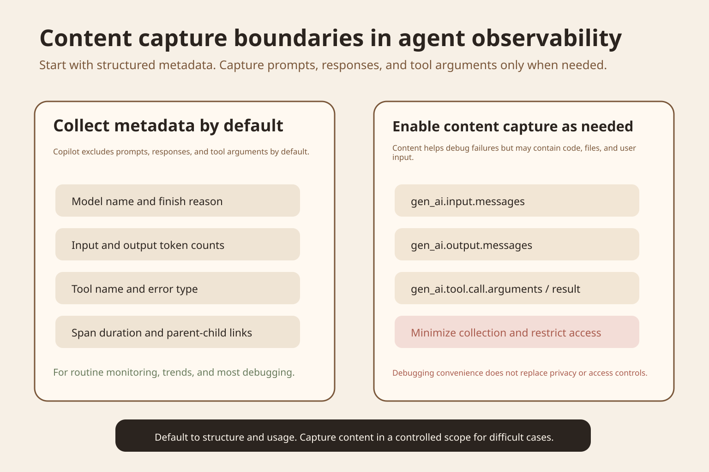
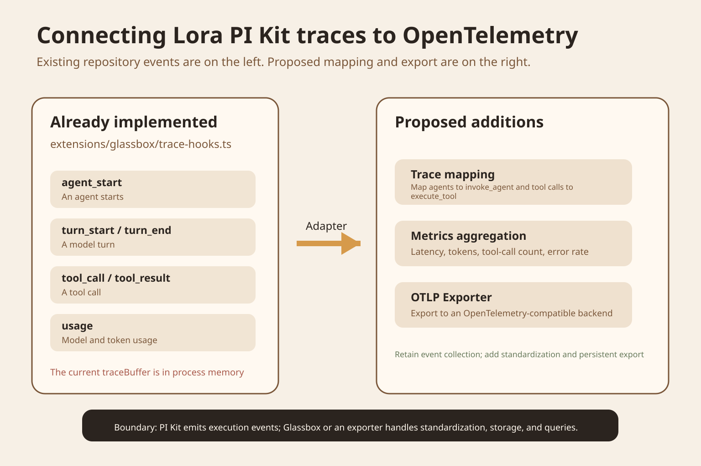

A coding agent tries to fix a failing test. It reads files, asks the model, edits code, and runs tests. The task ultimately fails. You can see dozens of log entries, yet three questions remain hard to answer. Which entries belong to the same task? Which tool call caused the later failure? Why was this task slower than usual?

The main source is [OpenTelemetry in the GitHub Copilot app](https://github.blog/changelog/2026-09-22-opentelemetry-in-the-github-copilot-app/), published by GitHub on September 22, 2026. GitHub exports agent sessions, model calls, and tool calls as OpenTelemetry data so enterprises can analyze agents using their existing monitoring backends. Its Copilot CLI documentation also specifies span and metrics fields, allowing us to discuss the mechanism at the implementation level.

## Start with a failed task

Suppose the agent receives a task to fix a failing `login` test. It reads the error log and implementation file, requests model inference, edits the code, and reruns the test. The test still fails.

With ordinary logs, you will see records of model calls, file reads, file writes, and test failure. Logs can tell you something happened at a particular time, but they do not usually identify parent-child relationships automatically. Nor do they inherently tell you whether a model call and a subsequent tool call belong to the same agent turn.

The problem grows with concurrency. Two agents running together produce interleaved logs. One may also create subagents. Sorting by time alone can easily combine events from different tasks.

OpenTelemetry traces address this. A trace represents one end-to-end operation and contains multiple spans. A span is an operation with a start and end; trace IDs and parent IDs organize spans into a call tree. GitHub's current Copilot documentation names an agent invocation `invoke_agent`, a model request `chat`, and a tool execution `execute_tool`. These names follow the OpenTelemetry GenAI Semantic Conventions.



Figure 1 is a mechanism diagram drawn for the original article. Logs on the left tell you what happened. The trace on the right also retains task boundaries and parent-child relationships, so you can follow the call tree to the model call and context preceding the failed tool.

## What traces and spans are

Think of a trace as the record of one task, identified by a unique trace ID. Model calls, tool calls, approvals, and subagent calls each become spans, with their own start time, end time, status, and parent.

For example, a repair task can have an `invoke_agent` root span. Beneath it, a `chat` span represents the model deciding what to do next. When the model chooses to read a file, an `execute_tool` span follows. After the tool returns, there is another `chat`. When the model chooses to run tests, another `execute_tool` follows. If the tests fail, the error belongs to that span.

This differs substantially from putting everything in a log string. A trace lets you calculate each step's duration and locate the model turns before and after a tool call. When different languages and services follow the same semantic fields, the monitoring backend can query them consistently. OpenTelemetry calls this shared naming Semantic Conventions. Its purpose is to correlate data from different codebases and platforms.

The OpenAI Agents SDK uses the same trace-and-span approach. By default it records spans for agents, model generation, function tools, guardrails, and handoffs, and allows traces to be sent to other processors. SDK fields vary, but traces and spans are now common units of observation in agent runtimes.

## What traces, metrics, and events each answer

GitHub's agent monitoring documentation divides exported telemetry into traces, metrics, and events. The three signals cannot replace one another.

A trace explains what happened within a task. Which model call came first? Which tool did it invoke? Which step failed? How are parent and child agents connected?

Metrics describe trends over time. GitHub's current documentation lists model-call duration, input and output tokens, model requests per agent invocation, and tool calls per invocation. These work well for percentiles, trends, and alerts, rather than reconstructing one failed task.

Events record discrete actions at a moment in time, such as a user accepting an edit or a system state change. They can tell you whether a specific action happened, but lack a trace's complete call tree.



Figure 2 shows the roles of the three signals. Bar heights are teaching illustrations, not experimental data. Real metrics should come from actual runs.

Many teams collect only metrics. They can see a sudden rise in tool failures but cannot identify the affected call chain. Others collect only traces. They can reconstruct one failure but cannot tell whether that class of failure has been increasing all week. Define the engineering question before choosing a signal.

## What GitHub's update provides

In its September 22 update, GitHub announced OpenTelemetry export from the Copilot app through enterprise-managed settings. Administrators can configure telemetry in `managed-settings.json` to send Copilot agent activity to an OTLP-compatible backend. GitHub explicitly lists three uses: analyzing agent sessions, investigating unexpected behavior, and managing monitoring configuration centrally.

The Copilot CLI documentation is more specific. An `invoke_agent` span can include total input tokens, total output tokens, model, session ID, and error type. Each `chat` has its own input and output tokens, model, and finish reason. Each `execute_tool` can include tool name, tool-call ID, and error type.

GitHub also warns that some usage fields appear on both root and child spans. Adding values from every span directly would double-count them.

## Observability does not require saving all content

The sensitive part of a trace is the content, rather than duration or tokens. Prompts may contain source code. Tool arguments may include file paths, query conditions, and account information. Tool results may contain business data directly.

GitHub's Copilot monitoring documentation explicitly says default telemetry excludes prompts, responses, and tool arguments. Administrators can opt into content capture, but GitHub warns that this content may include code, file contents, and user input. Copilot CLI currently uses `OTEL_INSTRUMENTATION_GENAI_CAPTURE_MESSAGE_CONTENT` to control full message-content capture, with a default of false.

OpenTelemetry's GenAI attribute documentation also flags sensitive-information risks for `gen_ai.input.messages`, `gen_ai.output.messages`, `gen_ai.tool.call.arguments`, and `gen_ai.tool.call.result`. It recommends allowing implementations to filter or truncate content.

The first version of monitoring therefore need not save full conversations. Start with structure, timing, model, tokens, tool names, error types, and state. If a particular failure remains untraceable, enable content capture for a small number of runs in a controlled environment.



Figure 3 shows the content-capture boundary. The left contains structure and usage suitable for default collection. The right contains message content and tool inputs and outputs that require stricter access control.

## Where this belongs in Lora PI Kit

This section is based on the `lora-sys/lora-pi-kit` main branch actually read when the original article was written.

The existing `extensions/glassbox/trace-hooks.ts` listens for `agent_start`, `agent_end`, `turn_start`, `turn_end`, `tool_execution_start`, and `tool_execution_end`. It also records a usage event when an assistant message includes usage. Events ultimately enter `traceBuffer` and are broadcast to registered listeners.

`src/types.ts` already defines `TraceEvent`. Current event types include `agent_start`, `agent_end`, `turn_start`, `turn_end`, `tool_call`, `tool_result`, and `usage`. PI Kit thus has an event-collection layer, but lacks an OpenTelemetry trace-and-span data model and a persistent exporter.

A smaller change is to add an adapter after the listener. `agent_start` creates the root span; `agent_end` ends it. Turn events map to model-turn spans. `tool_call` and `tool_result` share one toolCallId to form an `execute_tool` span. `usage` goes into the corresponding model span or aggregate root-span attributes. An OTLP exporter then sends completed spans to Glassbox or another compatible backend.

Stable trace IDs and parent IDs are still missing. The current TraceEvent ID combines the current time with a random string. That works as an individual event ID but cannot directly express full parent-child relationships. Create a trace ID when an agent session starts and explicitly pass parent-span context into turns, tools, and subagents.



Figure 4 separates current code from proposed additions. The left shows existing PI Kit events. The right shows the proposed OpenTelemetry mapping, metrics aggregation, and OTLP export. This is an engineering recommendation, not a claim that the repository has implemented those modules.

## A low-cost experiment

You do not need to deploy Grafana or change your agent framework first. GitHub Copilot CLI currently provides a file exporter that writes telemetry as JSON Lines. This experiment only checks your understanding of trace trees, not a production monitoring system.

Start with a working Copilot CLI installation and a small repository containing one failing test and its implementation. Do not use production code or real credentials.

Compare two groups. Group A sees only ordinary terminal logs. Group B enables OpenTelemetry file export while leaving message-content capture off.

For group B, set:

```bash
COPILOT_OTEL_FILE_EXPORTER_PATH=./copilot-otel.jsonl copilot
```

Give the agent a fixed task, such as reading the failing test, editing the implementation, and running the test once. After the run, open `copilot-otel.jsonl`. Focus on finding an `invoke_agent` call tree with `chat` and `execute_tool` spans beneath it, rather than on message text. GitHub's documentation says the file exporter writes JSON Lines and that setting `COPILOT_OTEL_FILE_EXPORTER_PATH` automatically enables OTel.

Record only six fields: task success, root-span count, model-span count, tool-span count, failed-span name, and whether the trace alone identifies the model call immediately before the failed tool.

Success means group B can state call order, failure location, and parent-child relationships explicitly, while group A must infer them manually from timing. Do not treat duration differences from one experiment as a performance conclusion. This experiment measures neither exporter performance nor the relative quality of models.

There are two common misinterpretations. First, a complete trace does not establish business correctness. The agent can still make bad decisions. Second, content capture making debugging easier does not justify permanently storing full prompts and source code in production.

## When this much machinery is unnecessary

For a single-process script with one model call, no tools, and no concurrent tasks, ordinary structured logs are usually enough. Traces become more valuable as call chains, tool counts, subagents, and external services grow.

If you only need daily token consumption, metrics suffice. If you need to know why a particular task called the wrong tool, use a trace. If you need to know whether a user accepted an edit, use an event. Establish the question before deciding what to collect.

## What to remember

A trace describes causal relationships within an agent task. A span is one operation within it. Metrics describe trends. Events record discrete actions.

OpenTelemetry provides shared fields and export protocols. It does not automatically define the right business metrics or solve privacy problems.

Lora PI Kit can keep its existing trace hooks. The next additions should be trace IDs, parent spans, standard field mappings, and a persistent exporter, rather than a rewritten event system.

### Self-check

Question: Why are timestamps and log levels alone insufficient?

Answer: Concurrent tasks interleave, and the logs lack stable task boundaries and parent-child call relationships.

Question: What should you check first to see model calls per agent invocation over the past week?

Answer: Metrics. An individual trace reconstructs one run; it does not directly represent a long-term trend.

Question: Why avoid recording full prompts and tool results by default?

Answer: These fields may contain code, file contents, and user input. Both GitHub and OpenTelemetry documentation explicitly warn of sensitive-information risks in content capture.

## Main sources

- [GitHub Changelog: OpenTelemetry in the GitHub Copilot app](https://github.blog/changelog/2026-09-22-opentelemetry-in-the-github-copilot-app/)
- [GitHub Docs: OpenTelemetry for agent monitoring](https://docs.github.com/en/copilot/concepts/enterprise/opentelemetry)
- [GitHub Copilot CLI reference: OpenTelemetry monitoring](https://docs.github.com/en/copilot/reference/copilot-cli-reference/cli-command-reference#opentelemetry-monitoring)
- [OpenTelemetry Semantic Conventions](https://opentelemetry.io/docs/specs/semconv/)
- [OpenTelemetry GenAI attributes](https://opentelemetry.io/docs/specs/semconv/registry/attributes/gen-ai/)
- [OpenAI Agents SDK tracing](https://openai.github.io/openai-agents-python/tracing/)
