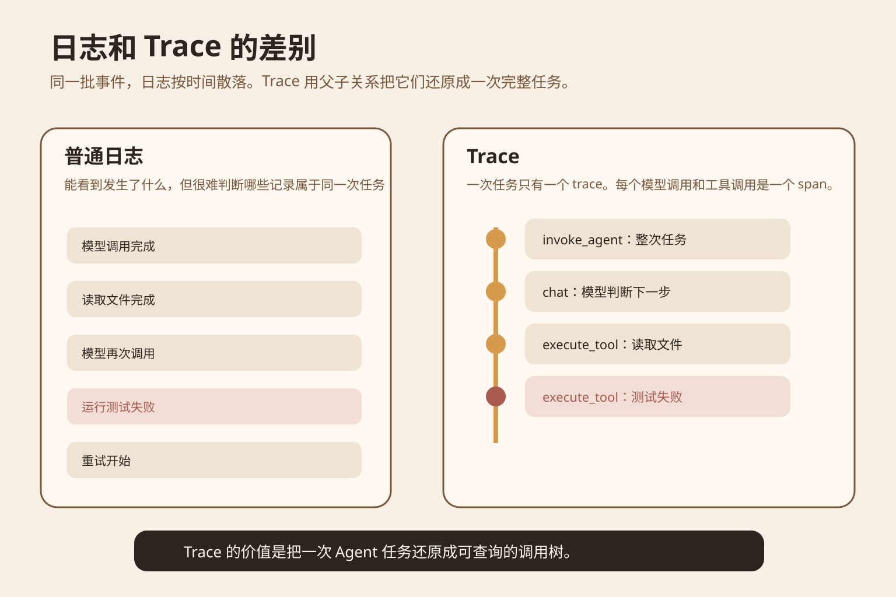
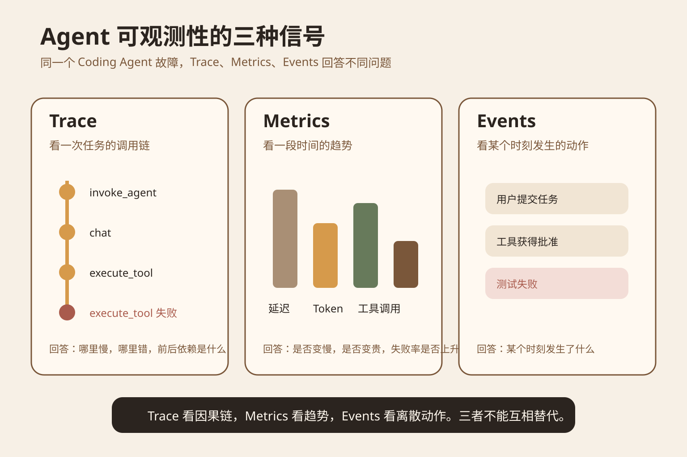
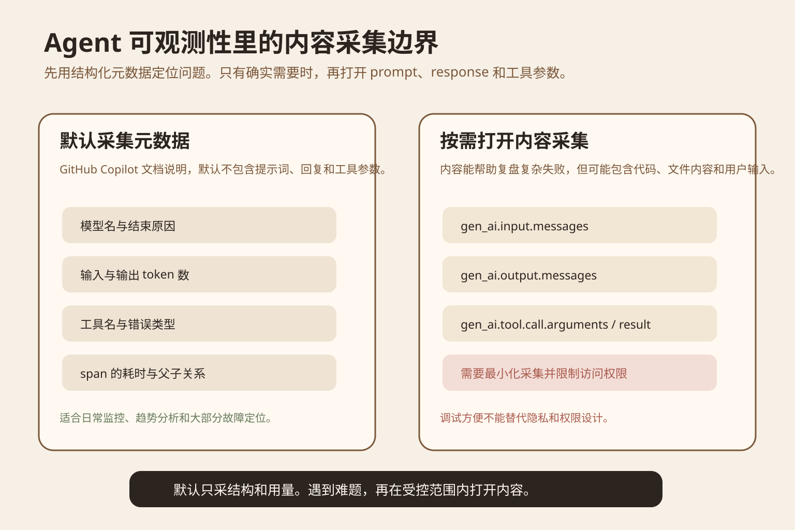
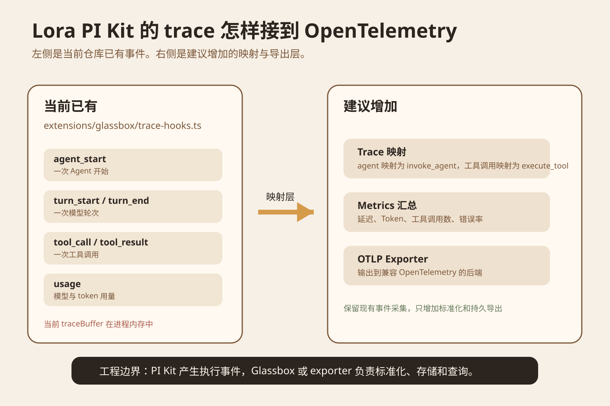

Coding Agent 修一个测试失败。它先读文件，再问模型，再改代码，再跑测试。最后任务失败了。日志里能看到几十条记录，但你很难回答三个问题。哪几条记录属于同一次任务。哪个工具调用导致后续失败。为什么这次任务比平时更慢。

主材料是 GitHub 在 2026 年 9 月 22 日发布的 [OpenTelemetry in the GitHub Copilot app](https://github.blog/changelog/2026-09-22-opentelemetry-in-the-github-copilot-app/)。GitHub 把 Agent 会话、模型调用和工具调用导出成 OpenTelemetry 数据，让企业继续使用现有监控后端分析 Agent。GitHub 的 Copilot CLI 文档同时给出了具体的 Span 和 Metrics 字段，所以可以把机制讲到工程实现层。

## 先看一个失败任务

假设 Agent 收到任务，修复 `login` 测试失败。它读取错误日志，读取实现文件，请求一次模型推理，修改代码，再运行测试。测试仍然失败。

如果程序只打印普通日志，你会看到模型调用、读文件、写文件、测试失败这些记录。日志可以说明某件事在某个时间发生了，但它通常没有自动告诉你这些记录之间的父子关系，也不会天然说明一次模型调用和后面的工具调用是不是同一个 Agent turn。

当并发任务增加以后，问题更明显。两个 Agent 同时运行，日志会交错。一个 Agent 还可能创建子 Agent。只按时间排序，很容易把不同任务的事件拼在一起。

OpenTelemetry 的 Trace 解决的是这件事。一个 Trace 表示一次端到端操作。Trace 里面包含多个 Span。Span 表示一个有开始和结束的操作，并通过 trace id 和 parent id 形成一棵调用树。GitHub 当前 Copilot 文档把一次 Agent 调用记为 `invoke_agent`，把一次模型请求记为 `chat`，把一次工具执行记为 `execute_tool`。这些命名遵循 OpenTelemetry GenAI Semantic Conventions。



图 1 是原文绘制的机制图。左边的日志告诉你发生了什么。右边的 Trace 还保存任务边界和父子关系，所以你可以沿着调用树找到失败工具前面的模型调用和上下文。

## Trace 和 Span 到底是什么

可以把 Trace 理解成一次任务的档案袋。这个档案袋有唯一的 trace id。任务里的模型调用、工具调用、审批、子 Agent 调用，各自成为 Span，并保存自己的开始时间、结束时间、状态和父节点。

例如一次修复任务可以有一个根 Span `invoke_agent`。根 Span 下面有一个 `chat`，表示模型判断下一步。模型决定读文件后，会产生一个 `execute_tool`。工具返回以后又有新的 `chat`。模型决定跑测试后，再产生一个 `execute_tool`。如果测试失败，错误就挂在这个 Span 上。

这和把所有东西塞进一条日志字符串的区别很大。Trace 可以直接计算每个步骤用了多久，也能找到某个工具调用前后的模型轮次。不同语言和不同服务只要遵循同一套语义字段，监控后端就能用相同方式查询。OpenTelemetry 官方把这类统一命名叫 Semantic Conventions，目的就是让不同代码库和平台产生的数据可以关联分析。

OpenAI Agents SDK 也使用相同的 Trace 和 Span 思路。它默认记录 Agent、模型生成、函数工具、Guardrail 和 Handoff 等 Span，并允许把 Trace 发送到其他处理器。不同 SDK 的字段不完全相同，但 Trace 和 Span 已经是 Agent 运行时常用的观察单位。

## Trace、Metrics 和 Events 分别回答什么

GitHub 的 Agent 监控文档把导出的遥测分成 Trace、Metrics 和 Events。三种信号不能互相替代。

Trace 适合回答一次任务内部发生了什么。哪个模型调用先发生，调用了哪个工具，失败在哪一步，父子 Agent 怎样连接。

Metrics 适合回答一段时间的趋势。GitHub 当前文档列出了模型调用持续时间、输入输出 token、一次 Agent 调用包含多少模型请求、包含多少工具调用等指标。它们适合做分位数、趋势和告警，而不是复盘单个失败任务。

Events 记录某个时刻发生的离散动作。例如用户是否接受一次编辑，或者系统发生某个状态变化。它适合回答某个具体动作是否发生，但没有 Trace 那样的完整调用树。



图 2 是三种信号的职责图。柱形高度只是教学示意，没有使用实验数据。真正的 Metrics 应来自实际运行记录。

很多团队只收 Metrics。你能看到工具失败率突然升高，却不知道是哪条调用链出了问题。另一种情况是只收 Trace。你可以复盘一次失败，却不知道这类失败是不是最近一周都在增加。工程上应该先明确问题，再选信号。

## GitHub 这次更新具体带来了什么

GitHub 在 9 月 22 日的更新里宣布，Copilot app 可以通过企业管理设置导出 OpenTelemetry。管理员可以在 `managed-settings.json` 里配置 telemetry，让 Copilot Agent 的活动进入兼容 OTLP 的后端。GitHub 明确列出三个用途。分析 Agent 会话，调查异常行为，统一管理监控配置。

Copilot CLI 的文档更具体。`invoke_agent` Span 可以带总输入 token、总输出 token、模型、会话 id 和错误类型。每次 `chat` 有自己的输入输出 token、模型和完成原因。每个 `execute_tool` 可以带工具名、工具调用 id 和错误类型。

GitHub 还特别提醒，某些消耗字段会同时出现在根 Span 和子 Span，不能把所有 Span 的值直接相加，否则会重复计算。

## 可观测性不是把所有内容都存下来

Trace 里最敏感的部分不是耗时和 token，而是内容。Prompt 可能包含源码。工具参数可能包含文件路径、查询条件和账号信息。工具返回结果可能直接包含业务数据。

GitHub 的 Copilot 监控文档明确写着，默认遥测不包含 prompt、response 和工具参数。管理员可以主动开启内容采集，但 GitHub 同时提醒这些内容可能包含代码、文件内容和用户输入。Copilot CLI 当前使用 `OTEL_INSTRUMENTATION_GENAI_CAPTURE_MESSAGE_CONTENT` 控制完整消息内容采集，默认值是 false。

OpenTelemetry 的 GenAI 属性文档也对 `gen_ai.input.messages`、`gen_ai.output.messages`、`gen_ai.tool.call.arguments` 和 `gen_ai.tool.call.result` 标出了敏感信息风险。它建议实现允许过滤或截断内容。

所以第一版监控没有必要把完整对话全存。先记录结构、时间、模型、token、工具名、错误类型和状态。只有某类失败无法定位时，再在受控环境里对少量运行打开内容采集。



图 3 是内容采集边界。左边是适合默认开启的结构和用量。右边是需要更严格权限控制的消息内容和工具输入输出。

## 放到 Lora PI Kit，应该改哪一层

这一部分基于原文当次实际读取的 `lora-sys/lora-pi-kit` 主分支。

现有 `extensions/glassbox/trace-hooks.ts` 已经监听 `agent_start`、`agent_end`、`turn_start`、`turn_end`、`tool_execution_start` 和 `tool_execution_end`。它还会在 assistant message 有 usage 时记录 usage 事件。事件最终写进 `traceBuffer`，并广播给注册的 listener。

`src/types.ts` 里已经定义了 `TraceEvent`。当前事件类型包括 `agent_start`、`agent_end`、`turn_start`、`turn_end`、`tool_call`、`tool_result` 和 `usage`。这说明 PI Kit 已经有事件采集层，但还没有 OpenTelemetry 的 Trace 和 Span 数据模型，也没有持久 exporter。

更小的改法是在 listener 后面增加 adapter。`agent_start` 创建根 Span。`agent_end` 结束根 Span。turn 事件映射成模型轮次 Span。`tool_call` 和 `tool_result` 共用同一个 toolCallId，形成一个 `execute_tool` Span。`usage` 写入对应模型 Span 或根 Span 的聚合属性。最后由 OTLP exporter 把完成的 Span 发送到 Glassbox 或其他兼容后端。

这里还缺少稳定的 trace id 和 parent id。当前 TraceEvent id 使用当前时间和随机字符串，适合作为单个事件 id，但不能直接表达完整父子关系。工程上应该在 Agent Session 开始时创建 trace id，并在进入 turn、tool 和子 Agent 时显式传递父 Span 上下文。



图 4 把当前代码和建议增加的层分开。左边是已经存在的 PI Kit 事件。右边是建议实现的 OpenTelemetry 映射、Metrics 汇总和 OTLP 导出。这是工程建议，不代表仓库已经实现这些模块。

## 一个低成本实验

不需要先部署 Grafana，也不需要改自己的 Agent 框架。GitHub Copilot CLI 当前提供文件 exporter，可以把遥测写成 JSON Lines。这个实验只验证你是否真正理解 Trace 树，不验证生产监控系统。

起始条件是安装可用的 Copilot CLI，并准备一个小仓库。仓库里放一个失败测试和对应实现。不要使用生产代码和真实凭据。

对照方案有两组。A 组只看终端普通日志。B 组启用 OpenTelemetry 文件导出，但保持消息内容采集关闭。

B 组可以设置：

```bash
COPILOT_OTEL_FILE_EXPORTER_PATH=./copilot-otel.jsonl copilot
```

然后给 Agent 一个固定任务，例如读取失败测试，修改实现，再运行一次测试。运行结束后打开 `copilot-otel.jsonl`。重点不是看文本内容，而是找一棵 `invoke_agent` 调用树，并确认下面能看到 `chat` 和 `execute_tool` Span。GitHub 文档说明文件 exporter 会写 JSON Lines，设置 `COPILOT_OTEL_FILE_EXPORTER_PATH` 会自动启用 OTel。

记录字段只需要六个。任务是否成功。根 Span 数量。模型 Span 数量。工具 Span 数量。失败 Span 名称。是否可以只凭 Trace 找到失败工具前一个模型调用。

成功标准是 B 组可以明确回答调用顺序、失败位置和父子关系，而 A 组需要人工根据时间猜测。不要把一次实验的耗时差异当成性能结论。这里没有测 exporter 的性能，也没有测不同模型的优劣。

容易误判的地方有两个。第一，Trace 完整不等于业务正确。Agent 仍然可能做出错误决策。第二，打开内容采集以后更容易调试，不代表生产环境应该长期保存完整 prompt 和源码。

## 什么时候不用做这么重

一个单进程脚本只有一次模型调用，没有工具，也没有并发任务，普通结构化日志通常够用。Trace 的价值会随着调用链、工具数量、子 Agent 和外部服务增加而上升。

如果你的问题只是每天消耗多少 token，Metrics 就够。如果你的问题是为什么某次任务调用了错误工具，需要 Trace。如果你要知道用户是否接受某次编辑，需要 Event。先确定问题，再决定采什么数据。

## 记住这几件事

Trace 解决的是一次 Agent 任务内部的因果关系。Span 是 Trace 里的单个操作。Metrics 用于看趋势。Events 用于记录离散动作。

OpenTelemetry 的价值在统一字段和导出协议。它不会自动替你定义正确的业务指标，也不会自动解决隐私问题。

对 Lora PI Kit 来说，现有 trace hook 可以继续保留。下一步应该补 trace id、parent span、标准字段映射和持久 exporter，而不是重新写一套事件系统。

### 自测

问：只有时间戳和日志级别，为什么还不够？

答：因为并发任务会交错，日志缺少稳定的任务边界和父子调用关系。

问：想看最近一周每次 Agent 调用了多少次模型，应该先看什么？

答：Metrics。单条 Trace 适合复盘一次运行，不适合直接代表长期趋势。

问：为什么不建议默认记录完整 prompt 和工具结果？

答：这些字段可能包含代码、文件内容和用户输入。GitHub 和 OpenTelemetry 文档都明确提醒内容采集存在敏感信息风险。

## 主要来源

- [GitHub Changelog：OpenTelemetry in the GitHub Copilot app](https://github.blog/changelog/2026-09-22-opentelemetry-in-the-github-copilot-app/)
- [GitHub Docs：OpenTelemetry for agent monitoring](https://docs.github.com/en/copilot/concepts/enterprise/opentelemetry)
- [GitHub Copilot CLI reference：OpenTelemetry monitoring](https://docs.github.com/en/copilot/reference/copilot-cli-reference/cli-command-reference#opentelemetry-monitoring)
- [OpenTelemetry Semantic Conventions](https://opentelemetry.io/docs/specs/semconv/)
- [OpenTelemetry GenAI attributes](https://opentelemetry.io/docs/specs/semconv/registry/attributes/gen-ai/)
- [OpenAI Agents SDK tracing](https://openai.github.io/openai-agents-python/tracing/)
