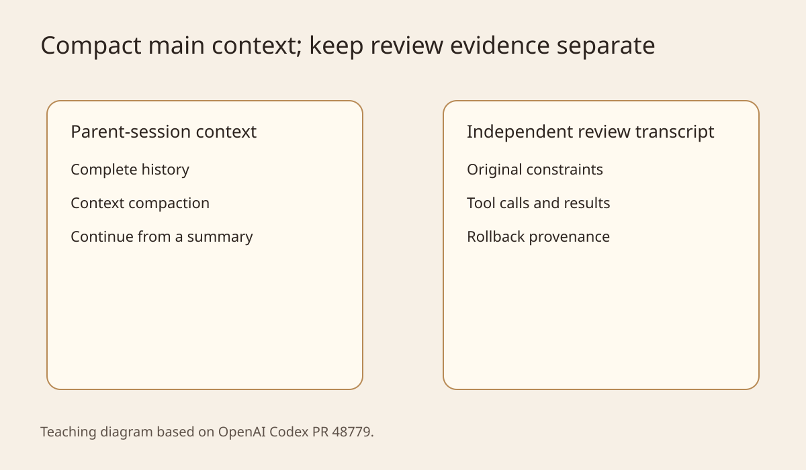
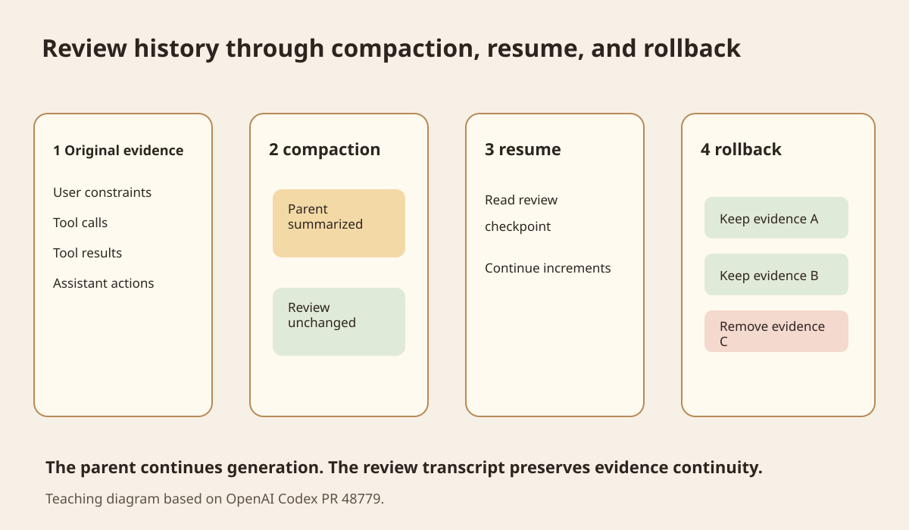
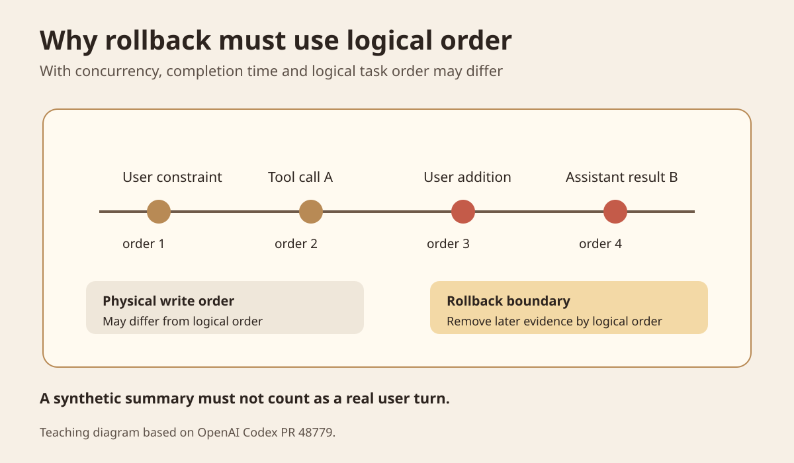

Today's question is specific. A coding agent has run for many turns, and its main session is approaching the context limit, so the system compacts the history into a summary. Later, an independent reviewer needs to decide whether an operation meets the user's constraints. Should it treat that compacted parent-session history as a complete basis for its decision?
The answer is that it should not assume it can. Context for continued generation and evidence for review have different purposes. The main agent needs a short, useful working state. The reviewer needs original evidence and provenance that explain its decision. If both share only one compacted history, the main agent may be able to continue while the reviewer has already lost what it needs to judge the action.
The main source for this article is OpenAI Codex [PR 48779](https://github.com/openai/codex/pull/48779), merged on September 27, 2026. Its title is "Preserve independent Guardian history across parent compaction." It has merged into the openai/codex main branch, but is not in the 0.158.0 release changelog published earlier that day. I therefore treat it as a main-branch engineering change, not a feature already shipped in 0.158.0. [Codex 0.158.0](https://github.com/openai/codex/releases/tag/rust-v0.158.0)
## A development scenario that can fail
Suppose an agent receives a restriction on what it may publish. It first calls a tool to inspect the repository and receives an explicit original result. It then reads files, edits configuration, and runs tests. Dozens of turns later, the main session compacts its context. The new context retains only a summary such as "Repository configuration has been checked."
That summary may be enough to keep writing code. The problem appears during review. The reviewer needs to know what the earlier check actually found. If the summary omits the original tool output, the reviewer has only an incomplete description.
OpenAI's Compaction documentation explains that compaction reduces context size while preserving the state needed for later turns, balancing quality, cost, and latency. The returned compacted state supports the next stretch of model work. It is not an audit log. [OpenAI Compaction](https://developers.openai.com/api/docs/guides/compaction)
Anthropic's discussion of long-task context also notes that aggressive compaction can discard information that seems minor at the time but later becomes important. It recommends starting with recall, then removing redundancy, and storing information that needs to survive over time in durable records outside the context. [Anthropic Context Engineering](https://www.anthropic.com/engineering/effective-context-engineering-for-ai-agents)

Figure 1 is a teaching diagram drawn for this article. The left side has only the parent-session summary. The right side lets the main context continue compacting while keeping an independent review record. The two data paths serve different purposes.
## What Codex changed
The central change in PR 48779 is to select a bounded, independent review transcript for Guardian when reuse of parent-session compaction is disabled. Here, a transcript means the reviewer's own event record. It is not another unlimited copy of the entire chat. It retains the evidence needed for review and has its own checkpoint. [PR 48779](https://github.com/openai/codex/pull/48779)
The code adds an independent Guardian context mode. ContextManager creates a TranscriptHistory for that mode. Subsequent Guardian checkpoints come directly from this review history instead of reconstructing a history from the parent session's current window.
Compaction changes the window visible to the parent model. The reviewer's evidence history should not be replaced by the same summary. The PR's tests specifically check original tool evidence. In independent mode, that evidence remains in the review transcript.
Synchronous review and asynchronous grading also stop depending on the parent-session checkpoint. When a session resumes, a new reviewer can continue from its own checkpoint and subsequent increments without requiring the main agent to retain the original window.

Figure 2 shows four stages. The main agent may compact history into a short context. The review transcript retains original evidence. Resume reads its own checkpoint. Rollback removes the revoked portion from that record.
## Why a compacted summary is not sufficient review evidence
A summary selects information. For generation tasks, this is usually necessary. Repeated tool outputs, long logs, and completed processes consume context. The compaction system tries to retain only the state needed for the next work.
Review has different requirements. A reviewer needs the conclusion and the basis for it. "The check is complete" and the concrete facts returned by a tool do not carry the same evidentiary weight. The former describes a process. The latter is an input that can be checked.
We can divide system information into two categories. The first is active context. It serves the next model call and may be compacted, trimmed, or reorganized. The second is the evidence record. It serves review, rollback, reproduction, and later explanation. It can have bounded retention and indexes, but a new summary in the main session should not directly overwrite its original sources.
This does not mean every subagent should keep a complete, permanent history. The PR itself uses a bounded transcript. In practice, it is better to create independent records only for reviewers that need evidence to survive context changes.
## Why rollback is harder than ordinary deletion
Long tasks may contain concurrent actions. An assistant result can finish and reach storage first even though a supplemental user instruction was logically accepted earlier. Database write time therefore does not necessarily reflect the actual order within the task.
PR 48779 retains rollback provenance and uses acceptance ordering to remove rolled-back evidence. A code comment specifically explains that a later assistant action may reach disk first. Restoring by persistence order alone could bring back content that was already revoked.
There is another easy-to-miss detail. Codex's local compaction stores a synthetic summary as a user-role message. The system generated that summary; the user did not actually speak again. The new implementation explicitly excludes these summaries so they cannot consume user-turn boundaries for rollback. [PR 48779 files changed](https://github.com/openai/codex/pull/48779/files)

Figure 3 focuses on ordering. Logical order within the task determines the rollback boundary. Physical persistence time only tells us when data was written. It cannot, by itself, define which part of the interaction the user revoked.
## What the evidence does and does not support
The source here is an engineering PR already merged into Codex's main branch. The openai/codex README describes the project as a locally running coding agent, and the repository uses the Apache 2.0 License. [Codex README](https://github.com/openai/codex) [License](https://github.com/openai/codex/blob/main/LICENSE)
The PR provides an implementation diff and regression tests. They cover reviewer continuity, evidence retention after parent-session compaction, resume, rollback after local and remote compaction, and compatibility with old checkpoints.
It does not provide a public benchmark measuring how much an independent transcript improves review accuracy. I also did not run Codex's own Guardian test suite for this article. This change cannot establish that independent transcripts necessarily make every agent more reliable.
The engineering conclusion is narrower. If a reviewer's decisions require original evidence to survive compaction, resume, or rollback, the parent agent's current compacted window should not be its only evidence source.
## Where this belongs in Lora PI Kit and Glassbox
This section is based on the current repositories I actually read for this article.
In `lora-sys/lora-pi-kit`, `extensions/glassbox/trace-hooks.ts` already collects events such as `agent_start`, turns, tool calls, tool results, and usage, but first writes them to an in-process `traceBuffer`. The current `tool-policy.ts` and `policy-bridge.ts` remain responsible for the profile's available tools and Glassbox policy checks. [Lora PI Kit](https://github.com/lora-sys/lora-pi-kit)
Glassbox's existing resources page states that Turso stores structured data, Trace and Eval indexes, and statistics, while Cloudflare R2 stores Raw Trace, Artifact, Replay, and Backup data.
Given that setup, I suggest splitting the data into three layers. This is an engineering proposal; the current repository has not implemented it.
The main agent's active context stays under Pi Session's control, with compaction allowed.
The system can persist original TraceEvents and tool evidence that may need review. R2 is suitable for Raw Trace data. Turso is suitable for event indexes, review checkpoints, and logical order.
Each reviewer loads only a bounded transcript. It contains evidence references and the current review state, without putting every Raw Trace back into the model context.
The existing Tool Policy and Glassbox Policy do not need to disappear because of this change. Tool policy continues to control execution boundaries. The new review record only preserves the basis for later checks. Do not compress those two kinds of state into the same model summary.
## A twenty-minute experiment
This experiment needs neither a model nor a complete agent.
Start with events numbered in logical order. Include at least one user constraint, one critical tool result, two ordinary execution records, and a later revocation instruction.
The control gives the reviewer only a parent-session summary. The experimental version retains an independent evidence list. Clearly label the summary as a teaching assumption and deliberately omit one critical tool result to simulate compaction discarding a detail that matters later.
Record these fields: `event_id`, `logical_order`, `parent_turn_id`, `kind`, `raw_evidence_ref`, `rolled_back`, and `review_decision`.
First, have both versions determine whether the same constraint has supporting evidence. Then perform rollback at logical order 4, removing review evidence at and after that boundary, and repeat the decision.
I ran this teaching simulation for the article. The parent summary deliberately omitted the critical tool result. The summary-only version could not produce that original basis. The independent evidence list could find it before and after compaction. After rollback by logical order, evidence before the boundary remained. This validates data structures and recovery semantics, not Codex Guardian's actual review effectiveness.
The success criterion is that the experimental version reaches the same explainable conclusion before and after compaction, and revoked evidence does not reappear after rollback.
There are two common misinterpretations. If the teaching summary happens to preserve all important facts, the two versions will not differ. And an independent transcript does not mean keeping everything forever. Production systems still need retention policies, redaction, access control, and size limits.
## When it is worth using
Consider this pattern if an agent has tool actions requiring review, human confirmations, long-session compaction, checkpoint recovery, or rollback. These cases all need to answer the same question: which original evidence supports the current decision?
For a short task where all inputs and tool results remain in one context and the result needs no audit or recovery, a separate reviewer transcript may only add state complexity.
The criterion is whether review decisions must keep citing original evidence across context changes, rather than whether the system has multiple agents.
## What to remember
The main agent's context is a working set. It can be compacted to continue generation.
The review record is an evidence set. It needs its own provenance, checkpoints, and rollback semantics.
Resume requires recovering the reviewer's own evidence state, rather than rereading the parent agent's summary.
Rollback must follow logical task order. Physical write time does not necessarily reflect the actual interaction order.
### Self-check
**Question 1: Why can't "Repository configuration has been checked" replace the original tool result?**
It only says that a check happened, without preserving its result. The reviewer cannot use it to prove that a specific constraint was satisfied.
**Question 2: Why shouldn't a compaction summary automatically count as a rollback turn?**
It is a synthetic message generated to shorten context, not new user intent. Treating it as a real turn changes the rollback boundary.
**Question 3: Can Lora PI Kit's current traceBuffer act as a long-term review evidence store?**
No. The current implementation is an in-process array. It can collect events, but cannot independently provide durable recovery or long-term evidence retention after the process exits.
## Main sources
[OpenAI Codex PR 48779](https://github.com/openai/codex/pull/48779) is the main source. It supports the discussion of independent review transcripts, checkpoints, rollback provenance, and related regression tests.
[OpenAI Compaction](https://developers.openai.com/api/docs/guides/compaction) supports the purpose of compaction, its returned state, and its use in long sessions.
[Anthropic Effective context engineering for AI agents](https://www.anthropic.com/engineering/effective-context-engineering-for-ai-agents) supports the trade-offs of compaction, the risk of losing important context through excessive compression, and durable records outside the context.
[openai/codex](https://github.com/openai/codex) supports project ownership, the README, Apache 2.0 License, and the current implementation location.
