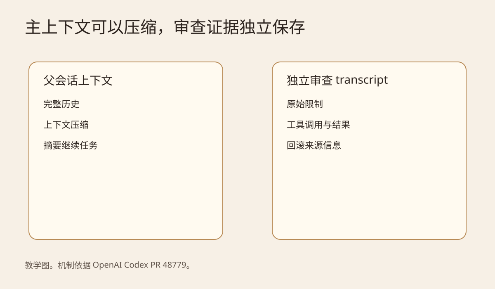
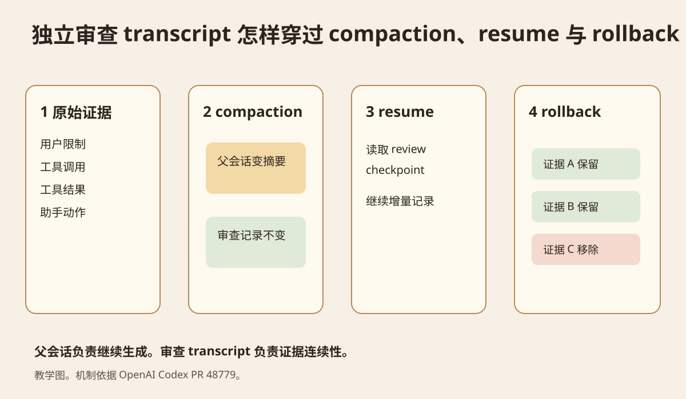
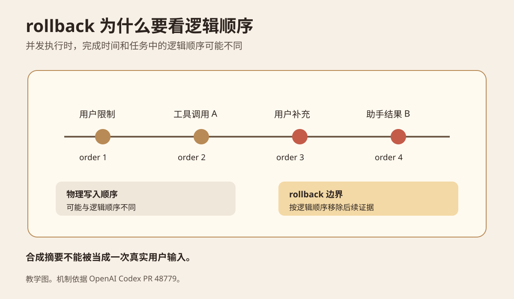

今天研究一个具体问题。Coding Agent 已经运行很多轮，主会话接近上下文上限，于是系统把历史压缩成摘要。后面独立审查器还要判断一次操作是否满足用户约束。它应该直接把主会话的压缩结果当成完整依据吗？
结论是不能默认这样做。用于继续生成的上下文和用于审查的证据，目标不同。主 Agent 需要一份短而有用的工作状态。审查器需要能够解释决定的原始证据和来源。如果两者只共用一份压缩后的历史，主 Agent 可能还能继续工作，但审查器已经缺少判断依据。
本次主要材料是 OpenAI Codex 在 2026 年 9 月 27 日合并的 [PR 48779](https://github.com/openai/codex/pull/48779)。PR 标题是 "Preserve independent Guardian history across parent compaction"。它已经合入 openai/codex 主分支，但不在当天更早发布的 0.158.0 Release Changelog 中，所以本文把它当作主分支工程改动，不写成已经随 0.158.0 发布的功能。[Codex 0.158.0](https://github.com/openai/codex/releases/tag/rust-v0.158.0)
## 先看一个会出问题的开发场景
假设 Agent 接到一个发布范围限制。它先调用工具检查仓库状态，得到一条明确的原始结果。随后继续读文件、修改配置、跑测试。几十轮后，主会话触发上下文压缩。新的上下文只留下 "已经检查仓库配置" 这样的摘要。
这份摘要对继续写代码可能够用。问题出现在审查阶段。审查器需要知道先前检查究竟得到什么结果。摘要如果省掉原始工具输出，审查器就只能依赖不完整的描述。
OpenAI 的 Compaction 文档说明，压缩用于减少上下文大小，同时保留后续轮次需要的状态，以平衡质量、成本和延迟。返回的压缩状态服务于下一段模型工作，不等同于审计日志。[OpenAI Compaction](https://developers.openai.com/api/docs/guides/compaction)
Anthropic 对长任务上下文的说明也指出，过度压缩可能丢掉当时看起来次要、后来才发现重要的信息。它建议先保证召回，再逐步去掉冗余，并把需要长期保留的信息放到上下文之外的持久记录里。[Anthropic Context Engineering](https://www.anthropic.com/engineering/effective-context-engineering-for-ai-agents)

图 1 是本文绘制的教学图。左边只有父会话摘要。右边让主上下文继续压缩，同时让审查记录独立保存。要看的是两条数据线服务的目标不同。
## Codex 这次具体改了什么
PR 48779 做的核心改动，是在关闭父会话 compaction 复用时，为 Guardian 选择一份有界的独立 review transcript。这里的 transcript 可以理解为审查器自己的事件记录。它不是再复制一份无限增长的完整聊天，而是保存审查需要的证据，并且有自己的 checkpoint。[PR 48779](https://github.com/openai/codex/pull/48779)
代码里新增了独立的 Guardian context mode。ContextManager 会为这个模式建立 TranscriptHistory。后续的 Guardian checkpoint 直接从这份 review history 生成，而不是重新从父会话的当前窗口拼一份历史。
父会话发生 compaction 后，模型可见窗口会变。审查器的证据历史不应该跟着被同一份摘要替换。PR 的测试专门检查了原始工具证据。独立模式下，这些证据会继续出现在审查 transcript 中。
同步审查和异步评分也被改成不依赖父会话 checkpoint。恢复会话时，新的 reviewer 可以从自己的 checkpoint 和后续增量继续，而不是要求主 Agent 还保留原始窗口。

图 2 看四个阶段。主 Agent 可以把历史压缩成短上下文。审查 transcript 仍保留原始证据。resume 读取自己的 checkpoint。rollback 再从这份记录里删掉已经撤销的部分。
## 为什么压缩摘要不能直接当审查证据
摘要会选择信息。对于生成任务，这通常是必要的。重复的工具输出、长日志和已经结束的过程会占上下文。压缩系统会尝试只留下接下来工作需要的状态。
审查要求不同。审查器不仅要知道结论，还要知道结论依据什么。"检查已完成" 和具体工具返回的事实不是同一个证据强度。前者只是过程描述。后者才是可复核输入。
可以把系统里的信息分成两类。第一类是 active context。它服务下一次模型调用，可以压缩、裁剪和重新组织。第二类是 evidence record。它服务审查、回滚、复现和事后解释。它可以做有界保留和索引，但不能因为主会话生成了新摘要，就把原始来源直接覆盖掉。
这不意味着每个子 Agent 都应该保存完整永久历史。PR 本身采用 bounded transcript。工程上更适合只给需要跨上下文变化保留证据的 reviewer 建独立记录。
## rollback 为什么比普通删除更麻烦
长任务里可能有并发动作。某个助手结果先完成并写入存储，但用户的一条补充指令在逻辑上更早被接受。这样一来，数据库写入时间不一定等于任务里的真实顺序。
PR 48779 因此保存 rollback provenance，并使用 acceptance ordering 删除已经回滚的证据。代码注释专门说明，较晚的助手动作可能先落盘。如果只按持久化顺序恢复，就可能把本来已经撤销的内容重新带回来。
还有一个容易忽略的细节。Codex 的本地 compaction 会把合成摘要保存成 user role message。这个消息是系统生成的摘要，不是用户真的又说了一轮。因此新实现明确排除这种 summary，让它不能占用 rollback 的用户 turn 边界。[PR 48779 Files changed](https://github.com/openai/codex/pull/48779/files)

图 3 只看顺序问题。真正决定 rollback 边界的是任务中的逻辑顺序。物理落盘时间只能说明数据什么时候写入，不能单独定义用户到底撤销了哪一段。
## 这些证据支持什么，不支持什么
这次材料是一个已经合并到 Codex 主分支的工程 PR。openai/codex README 把项目定义为本地运行的 Coding Agent，仓库采用 Apache 2.0 License。[Codex README](https://github.com/openai/codex) [License](https://github.com/openai/codex/blob/main/LICENSE)
PR 给出了实现 diff 和回归测试。测试覆盖 reviewer continuity、父会话压缩后的 evidence retention、resume、local 和 remote compaction 后的 rollback，以及旧 checkpoint 兼容性。
它没有提供公开 benchmark 来证明独立 transcript 能把审查准确率提高多少。本文也没有运行 Codex 自己的 Guardian 测试套件。因此不能把这次改动推广成 "独立 transcript 一定让所有 Agent 更可靠"。
能得到的工程结论更窄。只要某个 reviewer 的决定需要跨 compaction、resume 或 rollback 保留原始证据，它就不应该把父 Agent 当前的压缩窗口当作唯一证据源。
## 放到 Lora PI Kit 和 Glassbox，应该改哪一层
这部分基于本次实际读取的当前仓库。
当前 `lora-sys/lora-pi-kit` 的 `extensions/glassbox/trace-hooks.ts` 已经采集 `agent_start`、turn、tool call、tool result 和 usage 等事件，但这些事件先写进进程内的 `traceBuffer`。当前 `tool-policy.ts` 与 `policy-bridge.ts` 继续负责 Profile 工具面和 Glassbox 的策略检查。[Lora PI Kit](https://github.com/lora-sys/lora-pi-kit)
Glassbox 的现有资源页写明，Turso 用于结构化数据、Trace 和 Eval 索引及统计，Cloudflare R2 用于 Raw Trace、Artifact、Replay 和 Backup。
基于这个现状，我建议把数据拆成三层。这是工程建议，当前仓库尚未实现。
主 Agent 的 active context 继续由 Pi Session 管理，并允许 compaction。
工程上可以把原始 TraceEvent 和需要复核的工具证据持久保存。R2 适合放 Raw Trace。Turso 适合保存事件索引、review checkpoint 和逻辑顺序。
Reviewer 每次只加载一份有界 transcript。这份 transcript 保存证据引用和当前审查状态，不需要把所有 Raw Trace 再放进模型上下文。
现有 Tool Policy 和 Glassbox Policy 不需要因为这次改造而消失。当前工具策略继续负责执行边界。新增的审查记录只负责保存以后要复核的依据。这两类状态不要压成同一份模型摘要。
## 一个二十分钟能做完的实验
这个实验不用接模型，也不用搭完整 Agent。
起始条件是一组按逻辑顺序编号的事件。至少放一条用户限制、一条关键工具结果、两条普通执行记录和一条后续撤销指令。
对照方案只给 reviewer 一份父会话摘要。实验方案保留独立 evidence list。摘要要明确标为教学假设，并故意省掉一条关键工具结果，用来模拟 compaction 漏掉后来才重要的细节。
记录这些字段：`event_id`、`logical_order`、`parent_turn_id`、`kind`、`raw_evidence_ref`、`rolled_back` 和 `review_decision`。
先让两组判断同一个限制是否有证据支持。然后在逻辑顺序 4 执行 rollback，删除该边界及之后的审查证据，再重复判断。
我本次实际运行了这个教学模拟。父摘要故意没有保存关键工具结果。只读摘要的方案无法给出这条原始依据。独立 evidence list 在 compaction 前后都能找到这条证据。按逻辑顺序回滚后，早于边界的证据仍然保留。这里验证的是数据结构和恢复语义，不是 Codex Guardian 的实际审查效果。
成功标准是实验方案在 compaction 前后得到相同的可解释结论，并且 rollback 后不会重新出现被撤销的证据。
容易误判的地方有两个。如果教学摘要恰好保留了全部关键事实，两组不会表现出差异。独立 transcript 也不代表永久保存所有内容。生产系统仍然需要保留策略、脱敏、访问控制和大小上限。
## 什么时候值得用
如果 Agent 有需要复核的工具动作、人工确认、长会话 compaction、断点恢复或 rollback，这个模式值得考虑。因为这些场景都需要回答同一个问题。当前决定到底依据了哪条原始证据。
如果只是一个短任务，所有输入和工具结果都还在同一个上下文里，而且结果不需要审计或恢复，单独维护 reviewer transcript 可能只会增加状态复杂度。
判断标准不是 "是不是多 Agent"。判断标准是审查决定是否必须跨上下文变化继续引用原始证据。
## 记住这几件事
主 Agent 的上下文是工作集，可以为了继续生成而压缩。
审查记录是证据集。它需要独立的来源、checkpoint 和 rollback 语义。
resume 不是重新读取父 Agent 的摘要。可靠恢复需要恢复 reviewer 自己的证据状态。
rollback 要跟随任务中的逻辑顺序。物理写入时间不一定能表示真实交互顺序。
### 自测
**问题 1：为什么 "已经检查仓库配置" 不能替代原始工具结果？**
因为它只说明发生过检查，没有保留检查结果。审查器无法据此证明具体限制已经满足。
**问题 2：为什么 compaction summary 不应该自动成为一次 rollback turn？**
因为它是系统为缩短上下文生成的合成消息，不是新的用户意图。把它当真实 turn 会改变回滚边界。
**问题 3：Lora PI Kit 当前的 traceBuffer 能直接当长期审查证据库吗？**
不能。当前实现是进程内数组。它适合采集事件，但进程结束以后不能单独承担持久恢复和长期证据保存。
## 主要来源
[OpenAI Codex PR 48779](https://github.com/openai/codex/pull/48779) 是本文主材料，支持独立 review transcript、checkpoint、回滚来源信息和相关回归测试说明。
[OpenAI Compaction](https://developers.openai.com/api/docs/guides/compaction) 支持 compaction 的目的、返回状态和长会话使用方式。
[Anthropic Effective context engineering for AI agents](https://www.anthropic.com/engineering/effective-context-engineering-for-ai-agents) 支持 compaction 的取舍、过度压缩可能丢失关键上下文，以及上下文外持久记录的工程思路。
[openai/codex](https://github.com/openai/codex) 支持项目归属、README、Apache 2.0 License 和当前实现位置。
