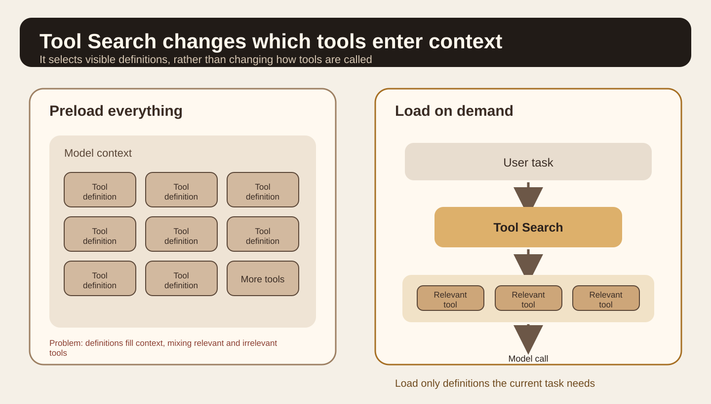
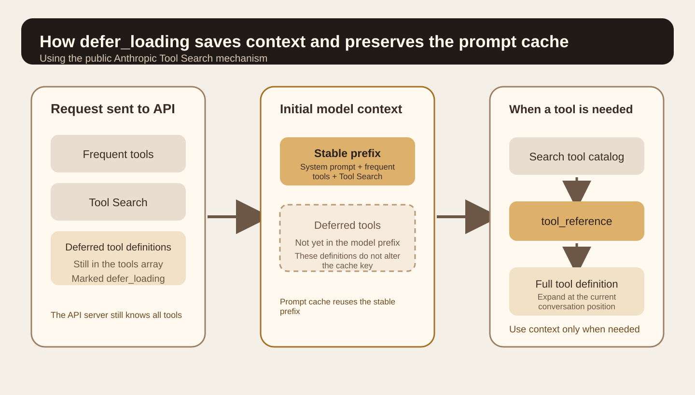
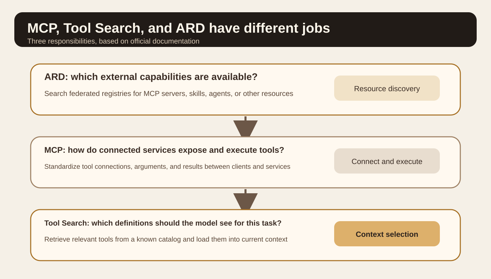
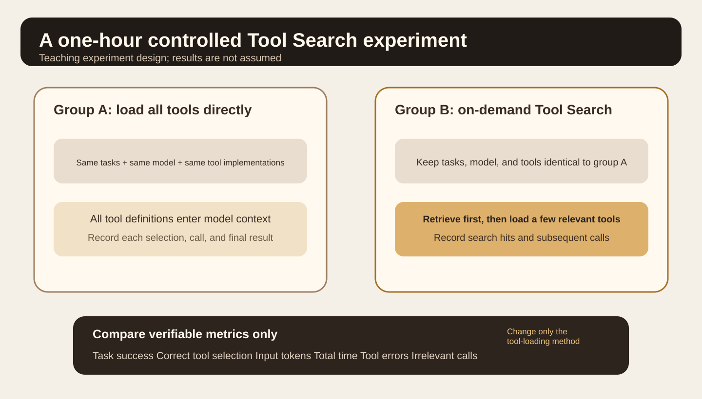

Series: Daily illustrated AI close reading

Today's question is why connecting an agent to GitHub, Slack, Sentry, databases, deployment platforms, and many MCP servers can make it more likely to choose the wrong tool for a real task.

This is worth revisiting because OpenAI included Tool Search among its formal agent harness capabilities when it released the Agents API on September 10, 2026. OpenAI's explanation is direct. An agent need not see every tool definition at the start; it can load relevant tools for the task. This reduces tokens and cost while preserving the prompt cache where possible. [OpenAI Agents API](https://openai.com/index/introducing-the-agents-api/)

This article primarily uses Anthropic's Tool Search documentation to explain the mechanism, then adds MCP and the ARD v0.91 specification released on August 26, 2026, to distinguish tools that are already connected from tools that have not yet been discovered. [Anthropic Tool Search](https://platform.claude.com/docs/en/agents-and-tools/tool-use/tool-search-tool) [ARD v0.91](https://agenticresourcediscovery.org/spec/)

I did not call OpenAI's or Anthropic's live APIs or reproduce the experiments for this article. Official numbers refer only to tests or typical configurations in the respective vendor documentation. They are not universal rules for all models and projects.

## A common kind of agent

Suppose you are building a troubleshooting agent. The user says, "API 5xx errors have increased over the last half hour. Find the cause and suggest a fix."

The agent may need Sentry errors, Grafana metrics, recent GitHub commits, deployment records, slow database queries, and team documentation. Each system may expose a dozen or more tools. The total quickly grows from a handful to dozens or even hundreds.

The simplest implementation puts every tool's name, description, and parameter schema into model context and lets the model choose.

That is where the problem starts. Tool definitions are themselves prompt content. Before the model even reads a log, it has already read a long catalog of available tools. Similar functions, names, and parameters make selection harder.

Anthropic's Tool Search documentation gives a concrete example. A multi-server configuration with GitHub, Slack, Sentry, Grafana, and Splunk can consume about 55k tokens in tool definitions before the model starts work. The documentation says on-demand search typically reduces this context by over 85%, loading only the 3 to 5 tools needed for the task. It also says Claude's tool-selection accuracy declines beyond roughly 30 to 50 available tools. These numbers come from Anthropic's public documentation and should not be treated as fixed thresholds for other models. [Anthropic Tool Search](https://platform.claude.com/docs/en/agents-and-tools/tool-use/tool-search-tool)



Compare the two sides of Figure 1. The left places every tool definition in context upfront. The right first understands the task, searches the tool catalog, and loads only relevant definitions. Tool Search decides which tools the model should see in the current reasoning step. It does not reinvent the tool-calling protocol.

<StatStrip stats="55k::Example tool-definition tokens|85%+::Documented context reduction|3–5::Tools loaded on demand each time" source="Anthropic Tool Search documentation; figures apply only to its published examples and guidance" />

<ProcessSteps
  title="The path through one Tool Search cycle"
  steps="Understand the task::Determine which capabilities the current problem needs|Search the catalog::Narrow candidates using names, descriptions, and parameters|Load full definitions::Put only the matching tool schemas into the current context|Call and verify::After execution, continue checking permissions, results, and errors"
  source="Based on Anthropic Tool Search documentation and the mechanism explained in this article"
/>

## What Tool Search actually does

In Anthropic's public implementation, tools can set `defer_loading: true`. This field is easy to misunderstand. It does not remove the tool from the API request.

You still include the full definitions in the request's `tools` array. The API server needs them to perform the search. The difference is that deferred tools do not enter the model's system-prompt prefix at the start.

When Claude needs a capability, it calls Tool Search. Anthropic currently offers Regex and BM25 server-side search. The search examines tool names, descriptions, parameter names, and parameter descriptions. The API returns `tool_reference` results. Only then does it expand the matching tools' full definitions at the current point in the conversation, allowing the model to call them.

The sequence is therefore to retrieve tools, load their definitions, then call them.

This resembles RAG, except the retrieved objects are definitions of actions the model can execute next rather than document passages.

The documentation also offers practical configuration advice. Keep 3 to 5 frequently used tools non-deferred and search for the rest on demand. Common actions such as reading files and executing commands then need no preliminary search, while occasional Jira, CRM, monitoring, and deployment tools do not permanently occupy context. [Anthropic Tool Search](https://platform.claude.com/docs/en/agents-and-tools/tool-use/tool-search-tool)

The following is a minimal illustration of the documented mechanism. No Anthropic API call was made for this task.

```json
{
  "tools": [
    {
      "type": "tool_search_tool_bm25_20251119",
      "name": "tool_search_tool_bm25"
    },
    {
      "name": "sentry_search_errors",
      "description": "Search recent application errors by service, time range and message",
      "input_schema": {"type": "object"},
      "defer_loading": true
    }
  ]
}
```

## Why this also affects the prompt cache

If every new MCP server adds dozens of tool definitions to the system-prompt prefix, that prefix keeps changing. Stable prompt-cache reuse becomes difficult.

Anthropic's implementation addresses this explicitly. Tools with `defer_loading: true` are removed from the rendered system-prompt tool section before computing the cache key. When Tool Search finds one, its full definition expands on demand within the conversation without rewriting the original prefix.

This reduces two costs. The model need not read every tool on every turn, and adding low-frequency tools makes it easier for the stable prefix to keep hitting the cache. [Anthropic Tool Reference](https://platform.claude.com/docs/en/agents-and-tools/tool-use/tool-reference)

OpenAI's Agents API announcement emphasizes the same direction. Its Tool Search loads relevant definitions as needed to reduce tokens and cost while preserving model caching. Its specific API mechanism differs from Anthropic's, but the engineering goal is the same. [OpenAI Agents API](https://openai.com/index/introducing-the-agents-api/)



The central "Stable prefix" in Figure 2 is the important part. Deferred tools remain in the server-side catalog without entering initial model context. Once a search finds them, they expand where needed.

## Tool descriptions now also act as retrieval documents

Tool Search makes tool descriptions more important.

Previously, a weak description might leave the model hesitating among a dozen tools. Now it can also keep the search stage from finding the tool at all.

Anthropic searches tool names, descriptions, parameter names, and parameter descriptions. Vague names such as `query`, `run`, and `get_data` are risky. Names such as `github_search_issues` and `sentry_search_errors` define clearer boundaries. Anthropic's 2025 tool-design article also recommends namespacing and warns against wrapping every low-level endpoint as an agent tool merely for API completeness. [Anthropic tool design](https://www.anthropic.com/engineering/writing-tools-for-agents)

For example, exposing `list_logs` may cause an agent to retrieve a large volume of raw logs and read them itself. A more suitable interface is often `search_logs`, which filters by time, service, and keywords before returning relevant excerpts to the context.

Tool Search therefore requires more than adding a search box to a disorganized tool library. Names, descriptions, parameters, and return structures need to be designed around agent tasks.

## Distinguish MCP, Tool Search, and ARD

These terms often appear together, but they operate at different stages.

MCP handles connection and execution. Once a client knows an MCP server, it can discover and call its exposed tools. The July 28, 2026 MCP specification also changed the protocol core to stateless requests and made tool lists easier to cache. MCP itself is not a search layer for finding a new service across the internet. [MCP 2026-07-28](https://blog.modelcontextprotocol.io/posts/2026-07-28/)

Tool Search selects context from a known tool catalog. Tools are already in the request or a connected server's catalog; the model simply need not see all definitions at once.

ARD comes earlier. ARD v0.91 is a proposal released on August 26, 2026. It defines resource discovery across registries. Clients can search for MCP servers, skills, A2A agents, and other callable resources. The specification explicitly excludes execution. After finding a resource, clients still call it through its own protocol. [ARD v0.91](https://agenticresourcediscovery.org/spec/)

Hugging Face's Discover Tool is a reference implementation. It searches skills, apps, and MCP servers on Hugging Face and can query other ARD registries. [Hugging Face ARD](https://huggingface.co/blog/agentic-resource-discovery-launch)



Read Figure 3 from top to bottom. ARD decides where to find capabilities. MCP handles how to connect and call them. Tool Search decides which definitions enter model context for the current turn. All three can coexist.

## How to use this in your agent harness

The following is general engineering advice. I did not read your Lora PI Kit repository for this article, so I will not invent existing directories or modules.

The first layer maintains a tool catalog. Each tool needs at least a stable name, specific description, parameter schema, owning service, and read/write classification. Use consistent prefixes such as `github_`, `sentry_`, and `notion_`. Apply permission filtering before retrieval. Semantic similarity should not cause searches to return tools the user lacks permission to use.

The second layer retrieves tools. Load a small number of frequent tools directly and retrieve occasional tools on demand. Results should provide clear definitions and parameter descriptions, not only names.

The third layer actually calls tools using MCP, ordinary function tools, or platform tools. Tool Search must not bypass existing authentication, approvals, timeouts, or audit rules.

The fourth layer evaluates. Measure whether the correct tool was found separately from whether the task finished. Looking only at the final answer cannot distinguish retrieval errors, parameter errors, tool failures, or a model misunderstanding a correct result.

## An experiment you can finish in one hour

Start with a small agent containing 15 to 20 real or simulated tools. Deliberately retain some confusable capabilities, such as `github_search_code`, `github_search_issues`, `docs_search`, `sentry_search_errors`, and `logs_search`.

Prepare 10 to 15 tasks. Do not phrase them as "Call sentry_search_errors." Describe real goals, such as "Find the most common 500 errors in the payment service over the past hour and determine whether the latest deployment is related."

Group A puts every definition directly into context. Group B retains a few frequent tools, defers the rest, and enables Tool Search. Keep the model, tasks, tool implementations, sampling parameters, and acceptance conditions identical. Run each task several times so one random result does not determine the conclusion.

Record six categories: task completion, whether the first tool was correct, all tools ultimately called, input tokens, total duration, and tool errors. Group B also records retrieved tools and whether it missed the correct one.



Do not judge only tokens. If group B's context becomes much smaller but task pass rate declines, improve the retriever or tool descriptions. If tool choice is steadier but every simple task adds a noticeable search wait, those frequent tools may belong in direct loading again.

The experiment should answer which tools should stay loaded and which should be discovered on demand, rather than try to prove Tool Search is always better.

## When not to add Tool Search

Anthropic's public advice is explicit. Ordinary tool calling is simpler with fewer than 10 tools, when almost every tool is used every time, or when all definitions together are very small. An extra search layer can add implementation and debugging costs. [Anthropic Tool Search](https://platform.claude.com/docs/en/agents-and-tools/tool-use/tool-search-tool)

Tool Search also does not fix bad tools. Two heavily overlapping tools with vague names and descriptions may still be confused. A tool returning tens of thousands of tokens can still overwhelm subsequent context whether loaded directly or discovered through search.

It is not a security boundary. A search result tells the model a tool may be relevant; it does not grant permission to call it. Authentication, write-operation approval, secret isolation, and auditing remain separate requirements.

ARD likewise does not justify automatically installing and trusting search results. It discovers resources. Client and user policies must still decide whether to connect, authorize, and execute.

## What to remember today

As a tool library grows, the scarce resource is the set of definitions that should be visible in the model's current turn, rather than the number of tools that can be connected.

Tool Search splits selection into two steps: retrieve relevant capabilities, then load a few definitions for the model. `defer_loading` keeps occasional tools out of initial context and helps stabilize the prompt cache.

MCP, Tool Search, and ARD handle connection and execution, context selection, and cross-registry discovery respectively. Separating them makes large tool systems easier to design and evaluate.

<details>
<summary>Self-check 1: Does defer_loading stop sending tool definitions to the API?</summary>

No. In Anthropic's implementation, full definitions remain in the request's tools array. They temporarily stay out of the model's initial context and expand after Tool Search finds them.

</details>

<details>
<summary>Self-check 2: Why need Tool Search when MCP already exists?</summary>

MCP handles connection and invocation. One MCP server can expose many tools. Tool Search decides which definitions the model should see for the current task.

</details>

<details>
<summary>Self-check 3: What is the main difference between ARD and Tool Search?</summary>

ARD can discover resources in external registries that have not been connected in advance. Tool Search usually selects on demand from a catalog the current system already knows.

</details>

## Main primary sources

[OpenAI, Introducing the Agents API, 2026-09-10](https://openai.com/index/introducing-the-agents-api/): Agents API Tool Search, on-demand loading, token and cache goals, and Programmatic Tool Calling.

[Anthropic, Tool Search Tool](https://platform.claude.com/docs/en/agents-and-tools/tool-use/tool-search-tool): `defer_loading`, Regex and BM25, `tool_reference`, prompt caching, applicability, and public example data.

[Anthropic, Writing effective tools for AI agents, 2025-09-11](https://www.anthropic.com/engineering/writing-tools-for-agents): tool counts, namespacing, returning relevant context, and tool-description design.

[Agentic Resource Discovery Specification v0.91, 2026-08-26](https://agenticresourcediscovery.org/spec/): Search First Discovery, registries, `POST /search`, and ARD's exclusion of execution.

[Hugging Face, Agentic Resource Discovery, 2026-06-17](https://huggingface.co/blog/agentic-resource-discovery-launch): the Hugging Face Discover reference implementation and discovery of MCP servers, skills, and other resources.
