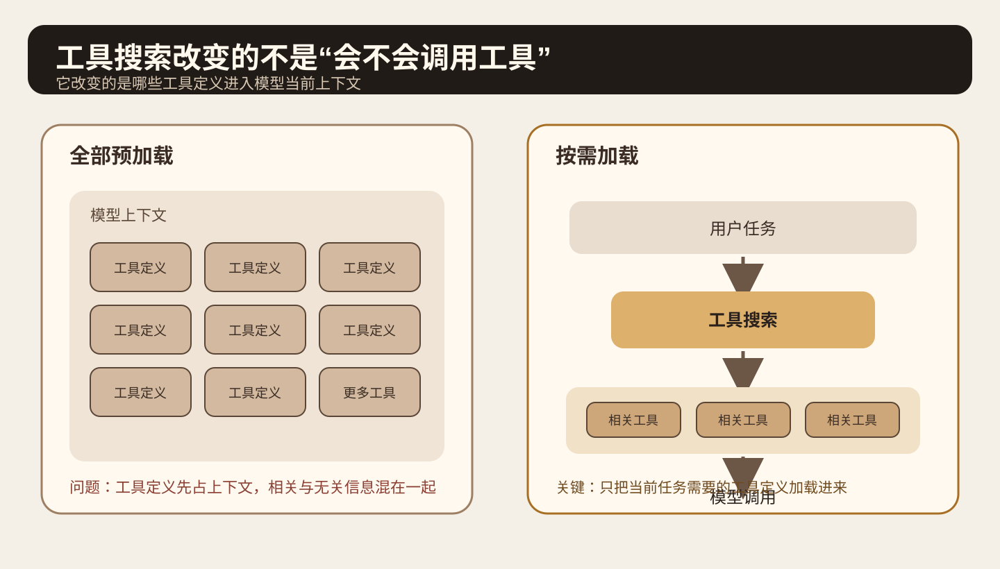
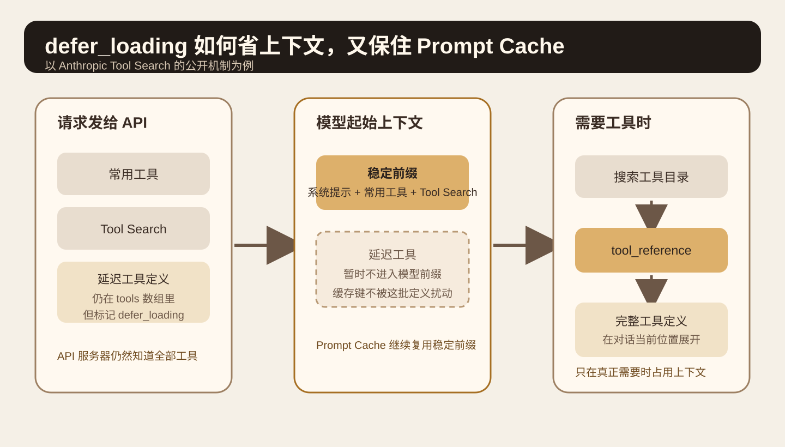
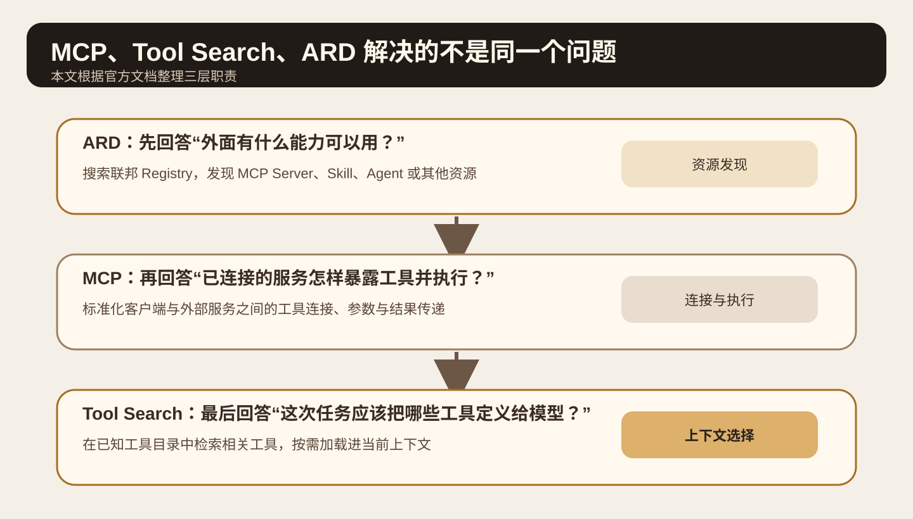
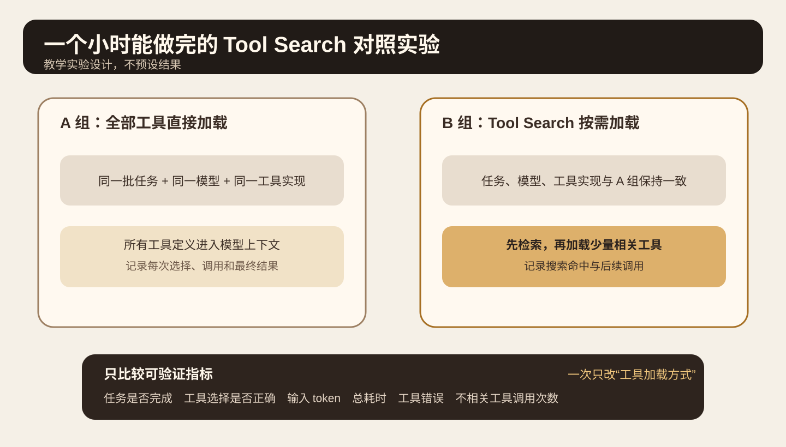

系列：每日 AI 图文精读

今天只研究一个问题：Agent 接入 GitHub、Slack、Sentry、数据库、部署平台和一堆 MCP Server 以后，为什么工具更多了，实际任务反而可能更容易选错工具。

这个问题最近又值得看，是因为 OpenAI 在 2026 年 9 月 10 日发布 Agents API 时，把 Tool Search 放进了正式的 Agent Harness 能力里。OpenAI 的说明很直接。Agent 不需要一开始就看到全部工具定义，可以按任务加载相关工具。这样可以减少 token 和成本，并尽量保住 Prompt Cache。[OpenAI Agents API](https://openai.com/index/introducing-the-agents-api/)

本文主要用 Anthropic 的 Tool Search 文档拆开机制，再用 MCP 和 2026 年 8 月 26 日发布的 ARD v0.91 规范补齐“工具已经接入”和“工具还没有被发现”这两个不同阶段。[Anthropic Tool Search](https://platform.claude.com/docs/en/agents-and-tools/tool-use/tool-search-tool) [ARD v0.91](https://agenticresourcediscovery.org/spec/)

本文没有运行 OpenAI 或 Anthropic 的线上 API，也没有复现实验数据。文中的官方数字只表示对应厂商文档中的测试或典型配置，不当作所有模型和项目都成立的规律。

## 先看一个很常见的 Agent

假设你在做一个排障 Agent。用户说：“最近半小时接口 5xx 变多了，找原因并给出修复建议。”

这个 Agent 可能需要查 Sentry 错误、Grafana 指标、GitHub 最近提交、部署记录、数据库慢查询和团队文档。每个系统又可能暴露十几个工具。工具数量很快就会从十几个变成几十个，甚至几百个。

最直接的实现，是把每个工具的名字、描述、参数 Schema 全部放进模型上下文，然后让模型自己选。

问题出在这里。工具定义本身就是 Prompt。模型还没有开始读日志，已经先读了一大段“我有哪些工具”。工具之间越相似，名字和参数越接近，选择也越难。

Anthropic 的 Tool Search 文档给了一个具体例子。GitHub、Slack、Sentry、Grafana 和 Splunk 这类多服务器配置，工具定义可能在模型开始工作前占掉约 55k token。Anthropic 文档称，按需搜索通常可以把这部分上下文减少超过 85%，因为每次只加载当前任务需要的 3 到 5 个工具。文档还指出，当可用工具超过约 30 到 50 个后，Claude 的工具选择准确率会下降。这里的数字来自 Anthropic 的公开文档，不应推广成其他模型的固定阈值。[Anthropic Tool Search](https://platform.claude.com/docs/en/agents-and-tools/tool-use/tool-search-tool)



图 1 只看左右两边。左边把全部工具定义先塞进模型上下文。右边先理解任务，再搜索工具目录，只把相关工具定义加载进来。Tool Search 解决的是“这轮推理应该让模型看到哪些工具”，不是重新发明工具调用协议。

<StatStrip stats="55k::示例工具定义 token|85%+::文档报告的上下文缩减|3–5::每次按需加载工具数" source="Anthropic Tool Search 文档，数字只适用于其公开示例与说明" />

## Tool Search 到底做了什么

以 Anthropic 的公开实现为例，工具可以设置 `defer_loading: true`。这个字段很容易被误解。它不是说这个工具从 API 请求里消失了。

你仍然把完整工具定义放在请求的 `tools` 数组里。API 服务器需要知道它们，才能执行搜索。区别是延迟工具不会一开始就进入模型的系统提示前缀。

Claude 当前需要某个能力时，会调用 Tool Search。Anthropic 目前提供 Regex 和 BM25 两种服务器端搜索方式。搜索会看工具名、工具描述、参数名和参数描述。找到结果以后，API 返回 `tool_reference`。随后才把对应工具的完整定义展开到对话当前位置，让模型真正调用它。

所以它的工作顺序是：先检索工具，再加载定义，再调用工具。

这和 RAG 很像，但检索对象不是文档段落，而是“模型接下来可以执行的动作定义”。

官方文档还给了一个很实用的配置建议。常用的 3 到 5 个工具可以保持非延迟加载，其余工具再按需搜索。这样“读文件”“执行命令”这类高频动作不用每次先搜索，而低频的 Jira、CRM、监控和部署工具不会长期占着上下文。[Anthropic Tool Search](https://platform.claude.com/docs/en/agents-and-tools/tool-use/tool-search-tool)

下面是文档机制的最小示意，没有在本次任务里实际调用 Anthropic API。

```json
{
  "tools": [
    {
      "type": "tool_search_tool_bm25_20251119",
      "name": "tool_search_tool_bm25"
    },
    {
      "name": "sentry_search_errors",
      "description": "Search recent application errors by service, time range and message",
      "input_schema": {"type": "object"},
      "defer_loading": true
    }
  ]
}
```

## 为什么这还会影响 Prompt Cache

如果你每接一个新 MCP Server，就把几十个工具定义加到系统提示前缀，前缀会不停变化。Prompt Cache 很难稳定复用。

Anthropic 的实现专门处理了这个问题。`defer_loading: true` 的工具会在计算缓存键之前从渲染后的系统提示工具段中移出。Tool Search 找到它以后，完整定义在对话中间按需展开，不去重写原来的前缀。

所以这里同时解决了两个成本。第一个是模型不用每轮先读所有工具。第二个是新增低频工具时，稳定前缀更容易继续命中缓存。[Anthropic Tool Reference](https://platform.claude.com/docs/en/agents-and-tools/tool-use/tool-reference)

OpenAI 在 Agents API 的发布说明中也强调了同一个方向。它的 Tool Search 会按需要加载相关工具定义，目标包括减少 token 使用和成本，并保持模型缓存。具体 API 机制和 Anthropic 不同，但工程目标相同。[OpenAI Agents API](https://openai.com/index/introducing-the-agents-api/)



图 2 的重点是中间那块“稳定前缀”。延迟工具仍然存在于服务器侧目录，但不需要一开始就进入模型上下文。真正命中搜索以后，再在需要的位置展开。

## 工具描述现在同时承担“检索文档”的职责

Tool Search 引入以后，工具描述的重要性反而更高。

以前，一个差一点的描述可能导致模型在十几个工具里犹豫。现在，一个差描述还会让搜索阶段直接找不到它。

Anthropic 的搜索会使用工具名、描述、参数名和参数描述。所以 `query`、`run`、`get_data` 这种模糊名字很危险。`github_search_issues`、`sentry_search_errors` 这种名字更容易形成边界。Anthropic 在 2025 年的工具设计文章里也建议做 namespacing，并强调不要为了“API 完整”把每个底层接口都包成 Agent 工具。[Anthropic 工具设计](https://www.anthropic.com/engineering/writing-tools-for-agents)

例如日志系统如果暴露 `list_logs`，Agent 可能先拿回大量原始日志，再自己读。更适合 Agent 的接口通常是 `search_logs`，让工具先根据时间、服务和关键词过滤，只把高信号片段带回上下文。

所以，Tool Search 不是给混乱的工具库加一个搜索框就结束。工具名称、描述、参数和返回结构都需要围绕 Agent 的任务重新设计。

## MCP、Tool Search 和 ARD 不要混成一个概念

这三个词经常一起出现，但它们处在不同阶段。

MCP 解决连接和执行。一个 MCP Server 已经被客户端认识以后，客户端可以发现它暴露的工具并调用。2026 年 7 月 28 日的 MCP 规范还把协议核心改成了无状态请求，并让工具列表更适合缓存，但 MCP 本身不是“从整个互联网替你找一个新服务”的搜索层。[MCP 2026-07-28](https://blog.modelcontextprotocol.io/posts/2026-07-28/)

Tool Search 解决当前已知工具目录中的上下文选择。工具已经在请求或已连接服务器的目录里，只是模型不需要一次看到全部定义。

ARD 更靠前。ARD v0.91 是 2026 年 8 月 26 日发布的 Proposal。它定义的是跨 Registry 的资源发现。客户端可以搜索 MCP Server、Skill、A2A Agent 和其他可调用资源。规范明确说 ARD 不负责执行，找到资源以后，仍然通过资源自己的协议调用。[ARD v0.91](https://agenticresourcediscovery.org/spec/)

Hugging Face 的 Discover Tool 是一个参考实现。它可以搜索 Hugging Face 上的 Skills、应用和 MCP Server，也可以查询其他 ARD Registry。[Hugging Face ARD](https://huggingface.co/blog/agentic-resource-discovery-launch)



图 3 可以按从上到下理解。ARD 决定“去哪里找能力”。MCP 负责“怎样连接并调用”。Tool Search 决定“当前这轮把哪些工具定义放进模型上下文”。它们可以同时存在。

## 放进自己的 Agent Harness 时怎么做

下面是通用工程建议。这次没有读取你的 Lora PI Kit 仓库，所以不虚构现有目录和模块。

第一层维护工具目录。每个工具至少有稳定名称、具体描述、参数 Schema、所属服务和读写性质。名字尽量形成统一前缀，例如 `github_`、`sentry_`、`notion_`。权限过滤应该发生在检索前。用户没有权限的工具，不应该因为语义相似就被搜索出来。

第二层做工具检索。少量高频工具直接加载。低频工具按需检索。检索结果不要只返回工具名，还要让模型拿到足够明确的定义和参数说明。

第三层才是真正调用。这里继续使用 MCP、普通函数工具或者平台内置工具。Tool Search 不应该绕过原来的鉴权、审批、超时和审计规则。

第四层做 Eval。要单独统计“是否找到正确工具”和“最终任务是否完成”。如果只看最终答案，你无法区分检索错了、参数错了、工具失败了，还是模型拿到正确结果以后理解错了。

## 一个小时可以做完的实验

先找一个有 15 到 20 个真实或仿真工具的小 Agent。工具里故意保留几个容易混淆的能力，例如 `github_search_code`、`github_search_issues`、`docs_search`、`sentry_search_errors` 和 `logs_search`。

准备 10 到 15 个任务。不要写成“调用 sentry_search_errors”。任务应该描述真实目标，例如“找出支付服务过去一小时最常见的 500 错误，并确认最近部署是否相关”。

A 组把全部工具定义直接放进上下文。B 组保留少量高频工具，其余工具延迟加载，并启用 Tool Search。模型、任务、工具实现、采样参数和验收条件都保持一致。每个任务重复运行几次，避免一次随机结果决定结论。

记录六类数据：任务是否完成、首个工具是否选对、最终调用过哪些工具、输入 token、总耗时、工具错误。B 组还要记录检索到了哪些工具，以及有没有漏掉正确工具。



判断标准也不要只看 token。如果 B 组上下文明显变小，但任务通过率下降，说明检索器或工具描述需要改。如果工具选择更稳定，但每个简单任务都多出一次明显的搜索等待，可能应该把这些高频工具改回直接加载。

这个实验真正要回答的是“哪些工具应该常驻，哪些工具应该按需发现”，而不是证明 Tool Search 永远更好。

## 什么情况下不要上 Tool Search

Anthropic 的公开建议很明确。工具少于 10 个、所有工具几乎每次都会用、或者全部工具定义加起来非常小时，普通 Tool Calling 更简单。多一层搜索反而会增加实现和调试成本。[Anthropic Tool Search](https://platform.claude.com/docs/en/agents-and-tools/tool-use/tool-search-tool)

Tool Search 也不会解决坏工具。两个工具功能高度重叠，名字和描述都含糊，搜索仍可能选错。一个工具一次返回几万 token，无论它是直接加载还是搜索出来，后面的上下文仍会被淹没。

它也不是安全边界。搜索结果告诉模型“这个工具可能相关”，不等于模型获得了调用权限。鉴权、写操作审批、密钥隔离和审计仍然要单独实现。

ARD 同样不是“自动安装并信任搜索结果”的理由。它负责发现资源。是否连接、授权和执行，仍然应该由客户端和用户策略决定。

## 今天记住什么

当工具库变大以后，真正稀缺的不是“能接多少工具”，而是模型当前这一轮应该看到哪些工具定义。

Tool Search 把工具选择拆成两步。先检索相关能力，再把少量定义加载给模型。`defer_loading` 让低频工具不占初始上下文，也更有利于稳定 Prompt Cache。

MCP、Tool Search 和 ARD 分别处理连接执行、上下文选择和跨目录发现。把这三层分开以后，大规模工具系统会更容易设计和评测。

<details>
<summary>自测 1：defer_loading 是不是不再把工具定义发给 API？</summary>

不是。以 Anthropic 的实现为例，完整定义仍在请求的 tools 数组里。它只是暂时不进入模型起始上下文，命中 Tool Search 后再展开。

</details>

<details>
<summary>自测 2：已经有 MCP 了，为什么还需要 Tool Search？</summary>

MCP 解决连接和调用。一个 MCP Server 可以暴露很多工具。Tool Search 解决的是当前任务应该让模型看到其中哪些工具定义。

</details>

<details>
<summary>自测 3：ARD 和 Tool Search 最大的区别是什么？</summary>

ARD 可以在外部 Registry 中发现尚未预先接入的资源。Tool Search 通常在当前系统已经知道的工具目录中做按需选择。

</details>

## 主要一手来源

[OpenAI，Introducing the Agents API，2026-09-10](https://openai.com/index/introducing-the-agents-api/)：核对 Agents API 的 Tool Search、按需加载、token 与缓存目标，以及 Programmatic Tool Calling。

[Anthropic，Tool Search Tool](https://platform.claude.com/docs/en/agents-and-tools/tool-use/tool-search-tool)：核对 `defer_loading`、Regex 与 BM25、`tool_reference`、Prompt Cache、适用条件与公开示例数据。

[Anthropic，Writing effective tools for AI agents，2025-09-11](https://www.anthropic.com/engineering/writing-tools-for-agents)：核对工具数量、namespacing、返回高信号上下文和工具描述设计。

[Agentic Resource Discovery Specification v0.91，2026-08-26](https://agenticresourcediscovery.org/spec/)：核对 Search First Discovery、Registry、`POST /search` 和 ARD 不负责执行的边界。

[Hugging Face，Agentic Resource Discovery，2026-06-17](https://huggingface.co/blog/agentic-resource-discovery-launch)：核对 Hugging Face Discover 的参考实现和对 MCP Server、Skill 等资源的发现方式。
