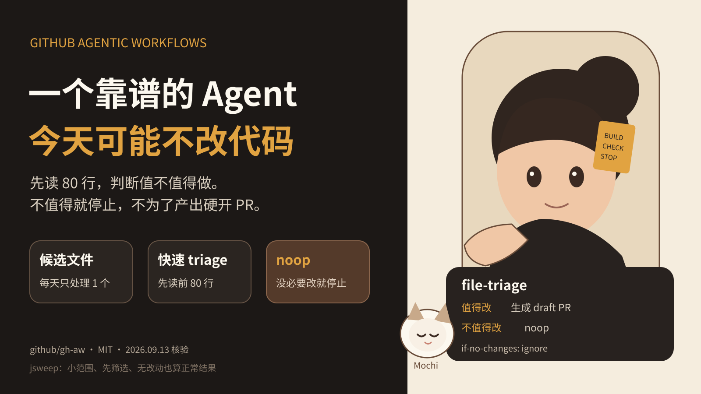

## 一个靠谱的 Agent，今天可能不改代码
GitHub Agentic Workflows 9 月 11 日公开了一个很小的自动化 Agent，名字叫 jsweep。
它的任务很窄。每天从 `actions/setup/js/` 里选一个 `.cjs` 文件，优先找还带着 `@ts-nocheck` 的文件，做一次小范围清理。
真正值得看的地方不是它怎么把 `var` 改成 `const`，而是它允许自己判断“今天没必要改”。
#### 修改之前，先判断值不值得做
jsweep 不会直接把整个候选文件读完。
它先启动一个 `file-triage` 子 Agent，只读取前 80 行。这个子 Agent 负责回答几个很具体的问题：当前文件运行在什么上下文，是否有 `@ts-nocheck`，有没有对应测试文件，这次清理是否值得继续。
如果结果是 `noop`，主 Agent 就停止。
这个步骤解决的是动作之前的判断问题。Agent 不需要先拿满上下文，再想办法证明自己应该做点什么。
#### 9 月 11 日那次运行，没有 PR
GitHub 公布的当天运行在 8 分钟内结束，使用了 336K tokens，只走了 2 个 turn。
最终结果是零错误、零警告、零 PR。
这不是异常。官方页面明确解释，没有 PR 是设计内结果，因为 triage 判断候选文件不值得产生 diff。
它的 `safe-outputs` 配置也配合这个判断。`create-pull-request` 使用 `if-no-changes: ignore`，PR 设置 2 天过期时间，并且强制为 draft。
换句话说，系统没有把“必须创建 PR”写成成功条件。
#### 为什么很多 Agent 会制造无意义动作
如果任务只有一个目标，例如“每天优化代码”，模型很容易把“产生修改”当成完成任务的证据。
这在 Demo 里看起来很积极。放进长期自动化后，会带来两个问题。
第一，代码审查队列里会出现价值很低的 diff。人需要花时间确认这些修改其实没必要。
第二，Agent 会把更多上下文、工具调用和模型轮次花在一个本来应该提前结束的任务上。
jsweep 没有解决所有成本问题。它当天仍然使用了 336K tokens，所以不能把这个案例写成“低成本 Agent”。但它把“是否值得继续”单独做成一步，这个结构是清楚的。
#### noop 应该进入任务协议
我会把 `noop` 当成 Agent 输出协议的一部分，而不是一个异常分支。
例如代码维护 Agent 可以有三种结果。
第一种是发现明确问题，生成 draft PR。
第二种是发现问题，但缺少测试或风险太高，生成报告并等待人工处理。
第三种是没有值得修改的内容，返回 noop。
三种结果都完成了任务。区别是它们采取的动作不同。
这样设计以后，Eval 也更容易做。你可以评估 Agent 是否在应该停止的时候停止，而不是只统计它成功提交了多少次修改。
#### 给 Builder 的实现方式
如果你正在做长期运行的 Coding Agent，可以先做四个改动。
先缩小单次任务。不要让“整理整个仓库”成为一个运行目标。把范围限制到一个文件、一个 issue 或一个明确模块。
再加预检。预检只读取完成判断所需的最少信息。它的目标不是解决问题，而是决定是否值得进入主任务。
然后定义 noop。给它明确的返回条件和日志格式。不要把“没有修改”当成运行失败。
最后限制输出。自动代码变更默认进入 draft。高风险操作需要人工批准。没有变化时不要制造空 PR 或形式化报告。
#### 这比“更聪明的 Prompt”更接近生产问题
生产 Agent 的难点之一，是系统会重复运行。
一次多余修改看起来不严重。每天一次、几十个仓库、几百个任务后，低价值动作会直接转成人工审查成本。
所以我更关心 Agent 有没有停止条件，有没有作用范围，有没有安全输出，而不是它每次能不能生成一个看起来完整的结果。
jsweep 这个案例很小，但它把这几个控制点写得很清楚。对长期自动化来说，知道什么时候不改代码，是任务设计的一部分。
---
