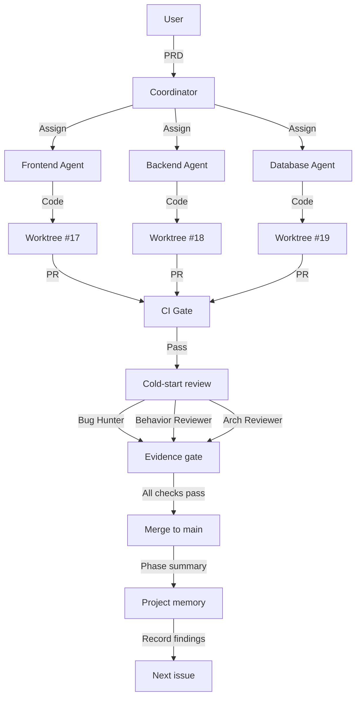

## What is still missing after vibe coding

AI can quickly generate code that runs, but engineering delivery also requires tests, CI, review, documentation, and traceable verification results. The problem is how generated code enters a maintainable process, rather than how fast it is generated.

For example, a user authentication feature still needs checks for cookie policy, permission boundaries, test coverage, and regression paths even if it starts successfully. Leaving these checks for a human to add at the end makes every change repeat the same work.

AI Engineering Harness aims to make these checks a fixed process. Agents can implement features, but tests, reviews, and evidence determine whether they can merge.

## What AI code encounters in an engineering workflow

| Pain point | Impact | Data |
| --- | --- | --- |
| **No tests** | Every change feels risky | 85/108 tests passed, but it still failed |
| **Green CI that gives false confidence** | Misleading results | A serious bug was found in production |
| **No documentation** | Fragmented knowledge | The next developer has to reread all the code |
| **No review** | Security risks | AI wrote hardcoded secrets into the code |

### Why adding everything manually can slow work down

Tests, CI, documentation, security review, and code review are often scattered across separate steps. The time and cost depend on repository size, testing conditions, and model pricing. This article does not treat the original example day counts and token costs as measured results.

## How the harness organizes the engineering loop

<Callout tone="note" title="Goal">
CI, reviews, and evidence determine whether code enters main. An agent's declaration of completion does not.
</Callout>

### How it works

AI Engineering Harness organizes repository takeover, issue assignment, worktrees, CI, review, and evidence directories into a fixed workflow. The current repository defines 18 kinds of agent roles. Those roles are implementation details, not an industry standard that must be copied.

```
Idea → PRD → Issue → Agent claims issue → Worktree → Implementation plan
     → Implementation → Self-test → Draft PR → CI → Adversarial review → Fix → Re-review
     → Evidence gate → Human approval → Merge → Phase summary → Record memory → Next round
```

The current workflow requires `CI Pass`, approval from at least 2 cold-start reviewers, and complete evidence before entering `main`.

<StatStrip stats="18::Agent roles|2+::Cold-start reviewers|4::Context levels" source="Architecture defined in this article" />

### Four key mechanisms

**1. Evidence-driven engineering discipline**

**Traditional development**:

```
PR merged → Done ✅
```

**Harness**:

```
PR → Green CI → 2+ reviewers approve → Complete evidence → Done ✅
```

**2. 18 specialized agent roles**

```
Coordinator
├── Frontend Agent
├── Backend Agent
├── Database Agent
├── Bug Hunter
├── Behavior Reviewer
├── Architecture Reviewer
├── Security Reviewer
├── UI Reviewer
├── QA Agent
├── Evidence Aggregator
└── ... (18 roles in total)
```

**3. Workflow isolation with worktrees**

Each issue runs in its own Git worktree:

```
Main repository: main
  ├── worktree/feature-17-auth → Issue #17 (Backend Agent)
  ├── worktree/feature-18-ui   → Issue #18 (Frontend Agent)
  └── worktree/feature-19-db   → Issue #19 (Database Agent)
```

**Benefits**:

- Parallel development without interference
- Automatic conflict detection, with a Conflict Resolver handling conflicts
- Independent CI and review for each branch

**4. Layered context loading, L0–L3**

Instead of making the agent read the entire `docs/` directory, load context in layers:

```
L0: AGENTS.md + ENGINEERING.md summary (always loaded)
L1: Current issue + module architecture + ADRs (task-level)
L2: Adjacent modules + recent phase summaries (on demand)
L3: PDFs/images/long reports (only when explicitly needed)
```

---

## Core architecture: collaboration among 18 agent roles

### Architecture overview



### Agent roles in detail

**Coordinator**

**Responsibilities**:

- Read the PRD and break it into issues
- Assign agents to worktrees
- Maintain PROJECT_STATUS.md
- Enforce human approval gates for authentication, DB schemas, and production secrets

**What it does not do**:

- Does not write business code
- Does not make technical decisions
- Does not merge code unless all evidence-gate checks pass

**Frontend Agent**

**Responsibilities**:

- Implement UI components
- Create responsive designs
- Capture screenshots and Playwright traces
- Run accessibility scans

**Output**:

```
docs/evidence/17/
├── change-summary.md
├── verification.md
├── screenshots/
│   ├── desktop.png
│   ├── tablet.png
│   ├── mobile.png
│   ├── empty-state.png
│   ├── error-state.png
│   └── loading-state.png
├── playwright-trace.zip
└── review-frontend.md
```

**Backend Agent**

**Responsibilities**:

- Implement APIs
- Implement business logic
- Handle exceptions
- Implement authentication logic

**Output**:

```
docs/evidence/17/
├── api-trace.json
├── error-coverage.md
├── auth-negative-cases.md
└── performance-baseline.json
```

**Bug Hunter**

**Responsibilities**:

- Perform a cold-start review without reading the implementer's chat history
- Read only the issue, plan, PR diff, and evidence
- Find edge cases, race conditions, and type errors

**Review checklist**:

- [ ] Null handling
- [ ] Type safety
- [ ] Concurrency safety
- [ ] Resource leaks
- [ ] Error handling

**Behavior Reviewer**

**Responsibilities**:

- Check whether the feature meets the AC, or acceptance criteria
- Check whether the user experience makes sense
- Check coverage of edge cases

---

## The complete workflow from issue to merge

### Full workflow diagram


### The 9 phases in detail

**Phase 0: PRD → Coordinator**

**Input**: `PRD.md`

**The Coordinator**:

1. Reads the PRD and extracts features
2. Generates `docs/product/`, `docs/architecture/`, and `docs/design/`
3. Creates the `memory/` directory
4. Generates `PROJECT_STATUS.md`
5. Creates `AGENTS.md`, `CLAUDE.md`, `ENGINEERING.md`, and related files
6. Generates the first 5–10 issues

**Output**:

```
docs/
├── product/
│   ├── vision.md
│   └── roadmap.md
├── architecture/
│   └── system-design.md
├── design/
│   └── ui-guidelines.md
├── decisions/
│   └── ADR-001.md
memory/
├── project-memory.md
└── decisions.md
PROJECT_STATUS.md
AGENTS.md
```

---

**Phase 1: Planning → Coordinator**

**Prerequisite**: All issue fields are complete

**Required fields**:

```
Context / Goal / Scope / Non-Goal / Related Docs / Implementation Plan /
Acceptance Criteria / Evidence Requirements / Reviewer Requirements /
Owner / Estimate
```

**The Coordinator checks**:

- Missing fields mean staying in Planning without starting
- Complete fields allow entry into the Worktree phase

---

**Phase 2: Worktree → Owner Agent**

**Operations**:

```bash
# Create an isolated worktree for Issue #17
git worktree add ../myproject-worktree-17 -b feature/17-user-auth main

cd ../myproject-worktree-17

# The Owner Agent works here
# The Frontend Agent implements the UI
# The Backend Agent implements the API
# The Database Agent implements the schema
```

**Each worktree has**:

- Its own branch
- Its own CI
- Its own review
- Its own evidence directory

---

**Phase 3: Implementation → Owner Agent**

**Owner Agent responsibilities**:

1. **Read the plan**: Understand what to do
2. **Implement the code**: Follow the implementation plan
3. **Self-test**: Run the tests and confirm they pass
4. **Write evidence**: Start populating `docs/evidence/<id>/`

**What the Owner Agent does not do**:

- Does not merge code
- Does not make architectural decisions
- Does not bypass review

---

**Phase 4: CI Gate → Coordinator**

**Trigger**: The owner pushes the first commit

**The Coordinator monitors**:

```yaml
# .github/workflows/test.yml
on: [push, pull_request]
jobs:
  test:
    runs-on: ubuntu-latest
    steps:
      - uses: actions/checkout@v3
      - run: npm install
      - run: npm test
      - run: npm run lint
```

**Handling failures**:

- CI failure means staying in Phase 4
- Assign a Recovery Agent to repair it
- Passing CI allows entry into Phase 5

**Hard rule**: The same kind of failure occurring ≥ 2 times creates an issue tagged `ci` and an entry in `memory/lessons.md`

---

**Phase 5: Review → Bug Hunter + Behavior Reviewer**

**Bug Hunter, cold start**:

- Reads only the issue, plan, PR diff, and evidence
- **Does not read the implementer's chat or explanations**
- Output: `docs/evidence/<id>/review-bug-hunter.md`

**Behavior Reviewer, cold start**:

- Reads only the issue, plan, PR diff, and evidence
- Checks whether the acceptance criteria are met
- Output: `docs/evidence/<id>/review-behavior.md`

**Reviewer rules**:

- Must start cold, with zero context
- Must return Approved or Changes Requested
- Cannot settle for "looks fine"
- Cannot bypass any acceptance criterion

---

**Phase 6: Evidence → Evidence Aggregator**

**Evidence Aggregator checklist**:

```markdown
# docs/evidence/17/verification.md

## Acceptance Criteria

| AC | Status | Evidence |
| --- | --- | --- |
| AC-1: Users can register with email | ✅ PASS | screenshot:register.png |
| AC-2: Login state persists | ✅ PASS | screenshot:persistent.png |
| AC-3: Forgot password feature | ❌ FAIL | Not implemented |
| AC-4: Email verification | ⏸️ PENDING | - |

## Review Checklist

- [x] review-bug-hunter.md ✅
- [x] review-behavior.md ✅
- [x] fix-tasks.md ✅ (0 unresolved)
- [x] Green CI ✅
- [ ] AC-3 must be completed ❌

## Verdict

❌ **NOT READY**. AC-3 is incomplete
```

---

**Phase 7: Merge → Coordinator**

**Merge conditions**:

- Green CI
- Approval from ≥ 2 reviewers
- Complete evidence in `docs/evidence/<id>/`
- Aggregator

**The Coordinator checks**:

```bash
# Automated checks
- [ ] docs/evidence/17/change-summary.md
- [ ] docs/evidence/17/verification.md
- [ ] docs/evidence/17/screenshots/ (6 images)
- [ ] docs/evidence/17/review-bug-hunter.md ✅
- [ ] docs/evidence/17/review-behavior.md ✅
- [ ] docs/evidence/17/fix-tasks.md ✅
- [ ] Green CI
```

**All checks pass → Automatically merge into main**

---

**Phase 8: Memory → Coordinator**

**Phase summary**:

```bash
workflows/06-phase-summary.md
→ Record in memory/phase-17-summary.md
```

**Memory evolution**:

```bash
workflows/08-memory-evolution.md
→ Update memory/project-memory.md
→ Update memory/decisions.md
```

**The next round's agents read these before starting work**

---

## Key technique: the evidence gate

### What is an evidence gate?

**Traditional development**:

```
PR merged → Done ✅
"I think it's fine" → Merge ✅
"It ran locally" → Merge ✅
```

**Evidence gate**:

```
PR → Green CI + 2+ reviewers approve + Complete evidence → Done ✅
```

### Evidence directory structure

```
docs/evidence/17/
├── change-summary.md          # What changed
├── verification.md            # PASS/FAIL for each acceptance criterion
├── screenshots/               # Screenshots of 6 states
│   ├── desktop.png
│   ├── tablet.png
│   ├── mobile.png
│   ├── empty-state.png
│   ├── error-state.png
│   └── loading-state.png
├── playwright-trace.zip       # Interaction trace
├── console-clean.md           # No console errors
├── a11y-report.md             # Accessibility scan
├── api-trace.json             # API call records
├── error-coverage.md          # Exception coverage
├── auth-negative-cases.md     # Negative authentication cases
├── performance-baseline.json  # Performance baseline
├── db-migration.sql           # Database migration
├── db-rollback.sql            # Rollback script
├── db-stats.json              # Pre/Post stats
├── db-sample-rows.json         # Sample data
├── review-bug-hunter.md        # Bug Hunter review
├── review-behavior.md          # Behavior Reviewer review
└── fix-tasks.md                # Aggregator ✅
```

### Evidence checklist

**Frontend**:

- Screenshots of 6 states: desktop, tablet, mobile, empty, error, and loading
- Playwright trace
- Clean console
- Passing accessibility scan

**Backend**:

- API trace
- Exception coverage
- Negative authentication cases
- Performance baseline

**Database**:

- Migration and rollback
- Pre/Post stats
- Sample rows

**Review**:

- review-bug-hunter.md
- review-behavior.md
- fix-tasks.md Aggregator

**CI**:

- Green
- No Critical/High blockers

---

## In practice: taking over an uncontrolled repository

### Scenario

You have just built a project with AI. It runs, but:

- It has no tests
- It has no CI
- It has no documentation
- It contains hardcoded secrets

**Traditional approach**: Spend 5 days filling the gaps manually.

**AI Engineering Harness**: Take over in 30 minutes.

---

### Step 1: Install

```bash
# One-line installation
npx -y skills add lora-sys/ai-engineering-harness -g --all --full-depth
```

**What gets installed**:

- The `ai-engineering-harness` skill
- The `build-agent-app` skill
- The `frontend-creative` skill
- The `dashboard` skill

**Supports 40 CLI agents**: Claude Code, Codex, Grok, Cursor, Gemini, Qwen, and others.

---

### Step 2: Quick Scan

```bash
# Dry run: print drafts only
bash skills/dashboard/scripts/scan-to-issues.sh

# Actually create issues
bash skills/dashboard/scripts/scan-to-issues.sh --create
```

**Quick Scan detects**:

```
✅ Hardcoded secrets (HIGH) → Issue #1
✅ Missing error handling (MEDIUM) → Issue #2
✅ Duplicate logic (MEDIUM) → Issue #3
✅ Style drift (LOW) → Issue #4
✅ Missing tests (MEDIUM) → Issue #5
⚠️ TODO without an issue link (LOW) → Issue #6
```

---

### Step 3: Take over

```bash
# Say this in your repository
Use $ai-engineering-harness to take over this repo. Inventory the gap
between current state and harness layout; file Issues for the missing
pieces; do not edit code yet.
```

**The Coordinator**:

1. Inventories the gap between the current and desired states
2. Generates issues, grouped by category
3. Leaves business code untouched at first

**Output**:

```
📊 Inventory complete
- ✅ Found 23 problems
- ✅ Created 15 issues
- ✅ Prioritized them

Top 3 tasks:
1. Hardcoded secrets → Move to environment variables
2. Missing tests → Quick Scan found 5 modules without tests
3. No CI → Configure GitHub Actions
```

---

### Step 4: Take one issue to Done

```bash
# Take Issue #1 to Done
Use $ai-engineering-harness to take Issue #1 from Planning to Done.
```

**The complete loop**:

```markdown
1. Write the plan → Issue #1's Implementation Plan
2. Worktree → git worktree add ../proj-issue-1
3. Assign → Backend Agent fixes the secrets
4. Implement → Move them to environment variables
5. Self-test → Run tests and pass
6. Draft PR → Create a PR automatically
7. CI → Pass ✅
8. Bug Hunter → Cold-start review, Approved
9. Behavior Reviewer → Cold-start review, Approved
10. Evidence → Complete evidence ✅
11. Merge → Coordinator merges automatically
12. Memory → Phase summary and recorded findings
```

---

### Step 5: Verify

```bash
# Check the evidence
ls docs/evidence/1/
# ✅ change-summary.md
# ✅ verification.md
# ✅ screenshots/ (6 images)
# ✅ review-bug-hunter.md
# ✅ review-behavior.md
# ✅ fix-tasks.md

# Check CI
gh pr view 1 --json state,statusCheckRollup
# ✅ state: MERGED
# ✅ statusCheckRollup: SUCCESS
```

---

## Installation and configuration

### One-line installation

```bash
npx -y skills add lora-sys/ai-engineering-harness -g --all --full-depth
```

- `-g`: Install globally into the user-level skill directory
- `--all`: Install for every supported CLI agent
- `--full-depth`: Discover and install every skill

### Targeted installation

```bash
# Install only this skill
npx -y skills add lora-sys/ai-engineering-harness -g -s ai-engineering-harness

# Install only for specified agents
npx -y skills add lora-sys/ai-engineering-harness -g -a claude-code codex grok
```

### CLI agent compatibility layer

| Agent | Installation path |
| --- | --- |
| Claude Code | `~/.claude/skills/` |
| Codex | `~/.codex/skills/` |
| Cursor | `~/.cursor/skills/` |
| Gemini CLI | `~/.gemini/skills/` |
| Qwen | `~/.qwen/skills/` |
| Grok | `~/.grok/skills/` |
| OpenCode | `~/.config/opencode/skills/` |
| ... | 40 in total |

---

## Advanced use

### Handoff between CLIs

```bash
# Switch from Claude to Grok halfway through the work
Use $ai-engineering-harness. I'm continuing from another agent.
Read memory/project-memory.md and sessions/<last-id>/summary.md, then continue.
```

**All harness state is written to disk**, so chat history is not lost.

### Parallel development

```bash
# Assign 3 issues for parallel development
Use $ai-engineering-harness to spawn parallel Owners
for Issue #20 (frontend), #21 (backend), #22 (database).
```

**The Coordinator**:

1. Creates 3 worktrees
2. Assigns the corresponding agents
3. Advances them to PRs in parallel
4. Uses the Conflict Resolver when conflicts arise

### CI self-repair

```bash
# Ask the harness to repair failing CI
CI is red on PR #23. Use $ai-engineering-harness to recover.
```

**Process**:

1. Classify within 60 seconds: flaky, real defect, lint, integration, or infrastructure
2. Assign an Owner Agent to fix it
3. Rerun CI
4. Go through reviewers again

### Initialize a new project

```bash
# Create the project
mkdir my-saas && cd my-saas
git init
echo "# My SaaS" > README.md
git add . && git commit -m "feat: init"

# Open any CLI
# Use $ai-engineering-harness to bootstrap this repo from PRD.md
```

**The Coordinator generates**:

- The directory structure
- The first round of issues
- ADR templates
- CI workflow placeholders
- `PROJECT_STATUS.md` → "Phase 0 / Bootstrap: Done"

---

## Verification records

<Callout tone="data" title="How to read these records">
The table includes repository records and cases explicitly marked as illustrative. Illustrative figures are not measured project results.
</Callout>

### Data comparison


| Case | Before → After | Type |
| --- | --- | --- |
| Internal tool project, 0 tests → 47 tests | Chaos 35 → 87 | Illustrative |
| install-session-hook, self-review | 0 → Complete evidence package | **Real** |
| Dashboard one-click takeover | 23 problems found in 30 seconds | Illustrative |
| Passing tests ≠ effective tests, issue #9 | 9 detectors → 10 detectors | **Real** |
| Green CI misled us, issue #13 | 85/108 → 108/108 | **Real** |

### Real case: install-session-hook

**commit**: `4f311e2` → `f5b26d1`

**Problem**: The first version of `--status` had a bug. Running it in an empty environment created `settings.json`.

**What harness review found**:

- Bug Hunter review: caught through 7 manual tests
- Fix: removed the line that created the file
- Evidence: a complete package in `docs/evidence/15/`

**An honest account of the self-review**:

- The adversarial review was only one line of self-questioning and answering
- Real production work needs spawned `bug-hunter` and `behavior-reviewer` agents
- GitHub Issue #15 was not actually opened

Full self-review: [docs/evidence/15/self-review.md](https://github.com/lora-sys/ai-engineering-harness/blob/main/docs/evidence/15/self-review.md)

---

## 9 operating principles


| # | Principle | Why |
| --- | --- | --- |
| 1 | **Trust evidence, not "looks fixed"** | The Coordinator does not merge merely because local tests passed |
| 2 | **Cold-start review** | Reviewers read only the issue, diff, and evidence, not the implementer's chat |
| 3 | **The issue is the unit of work** | No issue, no work starts |
| 4 | **Worktree isolation** | One issue = one owner = one worktree = one branch |
| 5 | **Load context in L0–L3 layers** | Do not load the full contents of docs/ by default |
| 6 | **Human approval gates** | Authentication, DB schema, or production secrets make the Coordinator pause |
| 7 | **Memory is project state** | Stable conclusions go into docs/ and memory/; conversation history is not retained |
| 8 | **CI/CD is a blocking gate** | Red CI keeps work in the recovery process |
| 9 | **Local first** | Do not directly merge a PR if an equivalent implementation already exists locally |

---

## When it is worth using

This harness suits repositories with multiple issues, multiple review roles, evidence-retention requirements, or frequent handoffs between agents. It is not suited to wrapping a one-off small change in a complex process. Adjust the number of roles, reviewers, and context levels to the repository's risk rather than copying the default configuration.

When taking over a repository, start with Quick Scan, then choose one real issue and run it through the full loop. During acceptance, check that CI, review records, and `docs/evidence/<issue>/` all correspond to the same change. Add parallel agents or more automation only once that chain can be repeated reliably.

### Minimal usage path

```bash
npx -y skills add lora-sys/ai-engineering-harness -g --all --full-depth
bash skills/dashboard/scripts/scan-to-issues.sh --create
# Choose a real issue and complete implementation, CI, review, and evidence checks
```

## Project information

- GitHub: https://github.com/lora-sys/ai-engineering-harness
- Version recorded in this article: 0.2.2
- License: MIT
