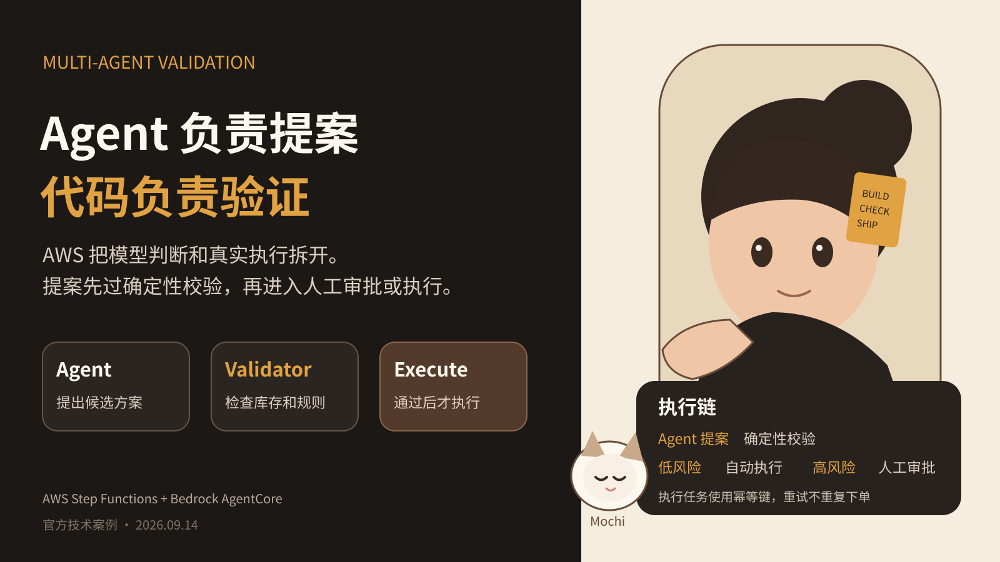

## AWS 把 Agent 决策拆开了，模型负责提案，代码负责验证
很多多 Agent 架构图有一个共同问题。图里有很多 Agent，但每个 Agent 都在做判断。
一个 Agent 生成方案，另一个 Agent 评价方案，然后第三个 Agent 决定是否执行。只要最后一步会改生产数据、付款、部署或删除资源，这种设计就有一个直接风险。所有关键判断仍然来自概率模型。
AWS 9 月 14 日发布的航班改签参考架构给了另一种写法。
它让 Agent 负责提案，把验证、路由和真实执行交给 Step Functions 和普通代码。
### Agent 只负责产生候选方案
航班取消事件触发 Step Functions 后，系统先用确定性任务读取乘客信息、订单、会员等级和偏好。
随后 Distributed Map 并行处理受影响乘客。AWS 文档写明，这种模式默认最多可以运行 10000 个并行子执行。
第一个 AgentCore Agent 的任务很窄。它根据乘客偏好和约束提出前三个改签选项。
到这里，Agent 没有任何订票权限。
### 候选方案必须通过代码验证
Agent 给出的航班不会直接进入执行。
下一步是 Lambda。它会重新读取航班信息，然后逐项检查座位库存、票价规则和路线是否合法。
如果 Agent 生成了一个不存在的航班，这里会被拦掉。航班存在但没有座位，也会被拦掉。票价等级或路线不符合规则，同样不会进入后续步骤。
这个验证器没有使用自然语言判断。它是普通 Python 代码，所以可以写单元测试，可以复现，也可以明确知道哪条规则拒绝了方案。
### 文案可以交给模型，赔偿资格不要
AWS 的第二个 Agent 负责生成面向乘客的通知文本。
它不会计算赔偿资格，也不会移动资金。
赔偿是否成立，由另一个 Lambda 根据规则表计算。AWS 在示例里引用了 EU261 和美国交通部退款规则来解释为什么这一步应该可审计，但具体规则仍由业务方配置和验证。
这就是一个很实用的边界。需要语言表达和个性化时，让模型处理。需要严格计算和合规判断时，用代码处理。
### 高风险情况进入人工审批
确定性验证之后，Step Functions 的 Choice 状态决定后续路径。
满足自动确认条件的乘客可以进入执行。不满足条件的情况进入人工审核。示例使用 task token 等待审核结果，并设置 4 小时超时。
人工等待发生在单独的回调任务里，不会让 Agent 本身一直挂着。
这对长任务很重要。审批是工作流状态，不应该依赖某个模型会话一直存活。
### 真正执行还要解决重试问题
最后的订票、赔偿和通知继续由确定性 Task 执行。
AWS 特别加了幂等设计。每个执行任务会根据乘客 ID 和决策 ID 生成幂等键。如果工作流重试或 redrive，同一请求不会再次订票，也不会再次付款。
这是很多 Agent Demo 没有处理的部分。模型能正确调用一次工具，不等于生产系统可以安全地重复执行。
### 这和 Eval 有什么关系
如果 Agent 只能聊天，Eval 常常集中在回答质量。
当 Agent 可以修改真实系统以后，Eval 需要多一层。
第一层继续评模型。它是否找到了合理候选方案，通知文本是否符合要求。
第二层评执行链。候选方案有没有通过确定性规则，错误方案有没有被拦截，高风险情况有没有进入人工，重试有没有产生重复副作用。
这两类指标不能混在一起。
模型质量下降，可能让候选方案变差。验证层失效，则可能让错误方案直接进入真实系统。后者的风险更高，也更适合用硬规则和自动测试持续检查。
### Builder 可以直接抄的结构
我会把生产 Agent 的动作分成四类。
第一类是生成。模型可以总结、规划、提出候选方案和生成文本。
第二类是验证。库存、权限、金额、状态机条件、合规规则交给确定性代码。
第三类是路由。低风险情况自动继续，高风险情况进入人工或更严格的审批链。
第四类是执行。所有有副作用的操作需要幂等、权限限制和审计记录。
这种拆分不要求使用 AWS。Temporal、队列系统、自己的状态机都能实现相同原则。
关键是别让一个模型同时负责提出方案、证明自己是对的，再亲手执行。
