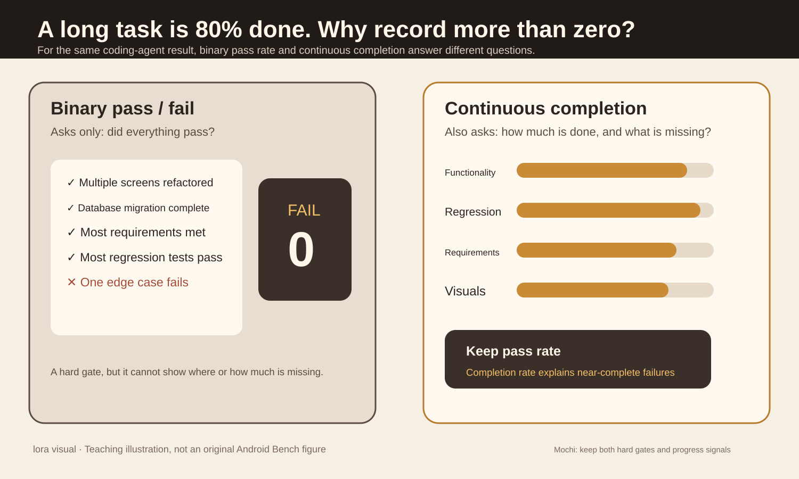
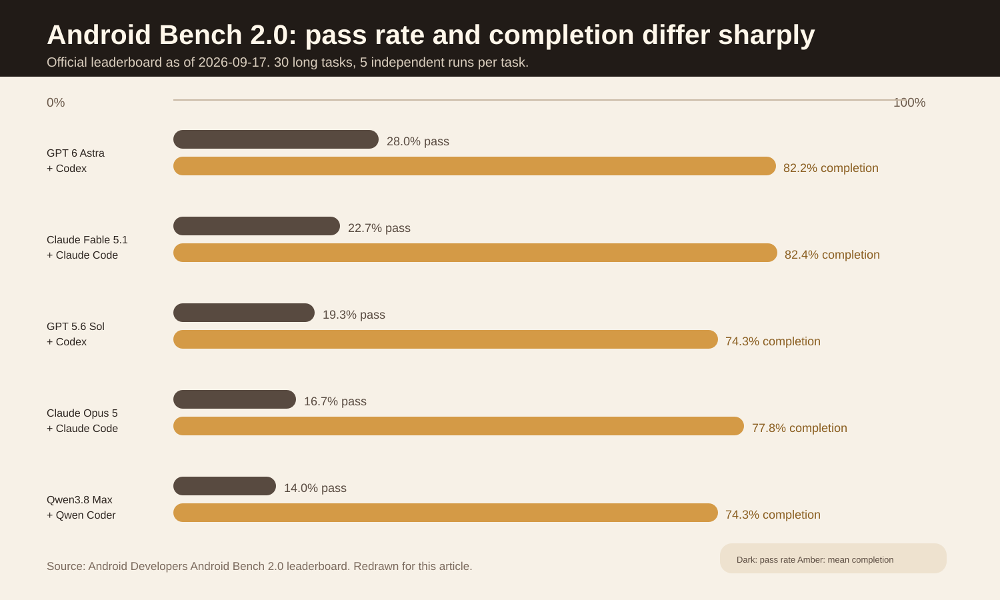
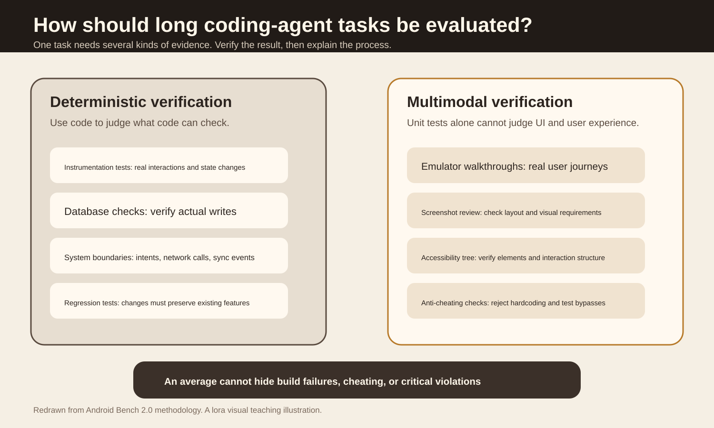

A coding agent has changed dozens of files and the main functionality works, but one edge case still fails. Should the evaluation score it as zero, or also record how much it completed?

Android Bench 2.0 keeps both. Pass rate continues to answer "Can this be delivered?" Completion rate answers "How much is finished?"

The main sources are Google Android Developers' [Android Bench 2.0](https://developer.android.com/blog/posts/android-bench-2-0-pushing-the-frontier-with-challenging-long-horizon-tasks) and [Methodology 2.0](https://developer.android.com/bench/methodology/2), updated on September 17, 2026. Leaderboard data come from the [current Android Bench leaderboard](https://developer.android.com/bench), whose results page states they are current as of September 17, 2026.

## Start with a refactor that almost finishes

Suppose you ask a coding agent to migrate 40 screens in an Android app to Jetpack Compose. It updates the main screens, the database works, navigation mostly works, and most tests pass. One final edge-case test fails.

If scoring only allows pass or fail, this run and a project that does not compile both get zero.

That is fine for a release gate. When acceptance requires every condition to pass, a failure remains a failure. The problem appears during analysis and improvement. The gap between those two zeroes can be large. One agent has completed the main architectural work; another may not even have built the project. A zero alone cannot tell you whether to change the model, change the harness, add tools, or fix a single edge case.

Figure 1 is a teaching illustration drawn by the original article's author, not an original Android Bench figure. The left side asks whether the result can be delivered; the right asks how much is complete. Android Bench 2.0 retains pass rate and adds completion rate beside it.

## Why older coding-agent benchmarks are becoming insufficient

Android Bench 1.0 mainly used localized issues and pull requests from real open-source repositories. Google's updated methodology describes their scale. The median task changed only 32 lines, usually across 1 to 2 files. The documentation says frontier models were approaching a 90% pass rate on this class of task.

Android Bench 2.0 expands the benchmark to 30 long-horizon tasks, each with 5 independent attempts.

| Task type | Count | Typical scope |
| --- | ---: | --- |
| Build an app from scratch | 9 | About 1,200 to 5,500 lines across 20 to 70 files |
| Migration | 13 | About 200 to 8,200 lines across 5 to 294 files |
| Add a feature | 6 | About 400 to 2,200 lines across 4 to 60 files |
| Cross-platform to native Android | 2 | Complete UI, navigation, and persistence |

The tasks include dependency upgrades, architecture migrations, building apps from designs, adding features to existing apps, and converting Flutter or React Native apps to native Android. Google also uses private apps, migration tasks that have not appeared upstream, and trajectory audits to reduce training-contamination risk.

Small-patch evaluations mainly ask whether an agent can fix a particular issue. Long tasks also ask whether it can handle architecture, runtime state, visuals, existing functionality, and task constraints throughout the work.

## Why pass rate and completion rate differ so much

On the current Android Bench 2.0 long-task leaderboard, GPT 6 Astra with Codex has a 28.0% pass rate and 82.2% average completion rate. Claude Fable 5.1 with Claude Code scores 22.7% and 82.4%, respectively. GPT 5.6 Sol with Codex scores 19.3% and 74.3%.

These figures come from the September 17, 2026 leaderboard. They describe results for this set of tasks, harnesses, and evaluation environment, and cannot be generalized directly to other tasks.

Figure 2 redraws official leaderboard data. The notable point is the large gap between the two bars for the same system. On long tasks, agents often finish most of the work but struggle to resolve every detail.

Google's methodology gives a more specific trajectory. On a Flutter-to-Android task, GPT 5.6 Sol reached 84% completion after 94 steps. It then took another 121 steps and finished at only 86%. The statistics page and dark theme were still incomplete.

This example describes only that task's trajectory, but it reveals a problem binary scoring misses. An agent may start correctly and then plateau after completing most of the work.

## Completion rate does not relax acceptance

Android Bench 2.0 does not measure completion directly by how many lines of code changed. It divides completion into several kinds of outcome evidence, including whether functionality really works, whether existing behavior regressed, whether task requirements were met, and whether visuals and accessibility match the target.

Hard failures remain. Build failures, critical constraint violations, and other hard gates do not become passes because a continuous score is high.

Continuous completion adds diagnostic information to runs that did not fully pass. It does not turn failure into success.

## Unit tests alone are insufficient for long tasks

Android Bench 2.0 runs tasks in containerized Android virtual devices and uses [Harbor](https://github.com/harbor-framework/harbor) to standardize environment configuration, isolation, and metric collection. Each task runs independently 5 times to reduce chance effects from model nondeterminism.

Deterministic checks include Android instrumentation tests, SQLite and Room data checks, external intents and network events, and regression tests for existing features. The multimodal part drives real UI flows in the emulator, saves screenshots and the accessibility hierarchy, and then performs visual judgment and UI-structure checks.

Figure 3 focuses on evidence types. An agent's claim that it has finished has no acceptance value on its own. Records actually existing in the database, old tests still passing, and a UI that can actually be operated are outcome evidence.

Google also explains why it did not use direct pixel differences. Changes in the status-bar time, font antialiasing, and battery icons can produce pixel differences as high as 47.5% even when a UI is semantically correct. The new version instead combines emulator walkthroughs, visual judges, and accessibility-tree verification.

The methodology reports that Gemini 3.5 Flash gave consistent judgments across repeated runs in 360 calibration runs. This result comes from Google's current test environment and cannot be generalized directly to other visual judges.

## What these data support and what they do not

Android Bench 2.0 supports a clear conclusion. On long tasks, "mostly complete" and "fully passed" are different outcomes. Several systems on the current leaderboard have average completion above 70%, while their pass rates are much lower.

The methodology also shows that repetitive multi-file transformations with clear rules are easier to execute consistently. Migrations such as Java to Kotlin and Retrofit to Ktor can follow a pattern across many files. Breaking framework upgrades and runtime dependency graphs are harder.

For example, the documentation describes a Bitwarden migration from Navigation 2 to Navigation 3 across 233 files, with completion of 0.409 and a pass rate of 0. Hilt-to-Koin migrations often compile but lack dependency bindings at runtime.

These results do not prove that one model is "generally stronger." Android Bench evaluates Android engineering tasks using specified harnesses, containers, and validators. The leaderboard also warns that cost and latency are affected by early-failure bias, network routing, and dynamic pricing. A model that fails early can appear cheaper. Before comparing costs, check that completion and pass rates are similar.

## Applying this approach to your own evals

Keep hard gates in the first layer. Compilation failures, deterministic-rule failures, critical constraint violations, and abnormal real-world side effects still directly determine whether a result can be delivered.

Save continuous completion signals in the second layer. Do not rush to compress them into one overall score. Depending on the task, record functional completion, source binding, semantic support, regression safety, and visual acceptance separately.

Record "not evaluated" separately in the third layer. If a semantic judge did not run, mark it `not_evaluated`, rather than zero, and exclude it from the average. Record infrastructure errors separately too, or environment failures will be misrepresented as poor model quality.

Continuous scores are useful only when they help locate failures or compare two nearly complete versions. If the result is merely an extra decimal that looks precise but does not change debugging, there is no reason to build a complicated aggregate score.

## Sources

- [Android Developers: Android Bench 2.0, 2026-09-17](https://developer.android.com/blog/posts/android-bench-2-0-pushing-the-frontier-with-challenging-long-horizon-tasks)
- [Android Bench 2.0 methodology](https://developer.android.com/bench/methodology/2)
- [Android Bench leaderboard](https://developer.android.com/bench)
- [Official Harbor repository](https://github.com/harbor-framework/harbor)
