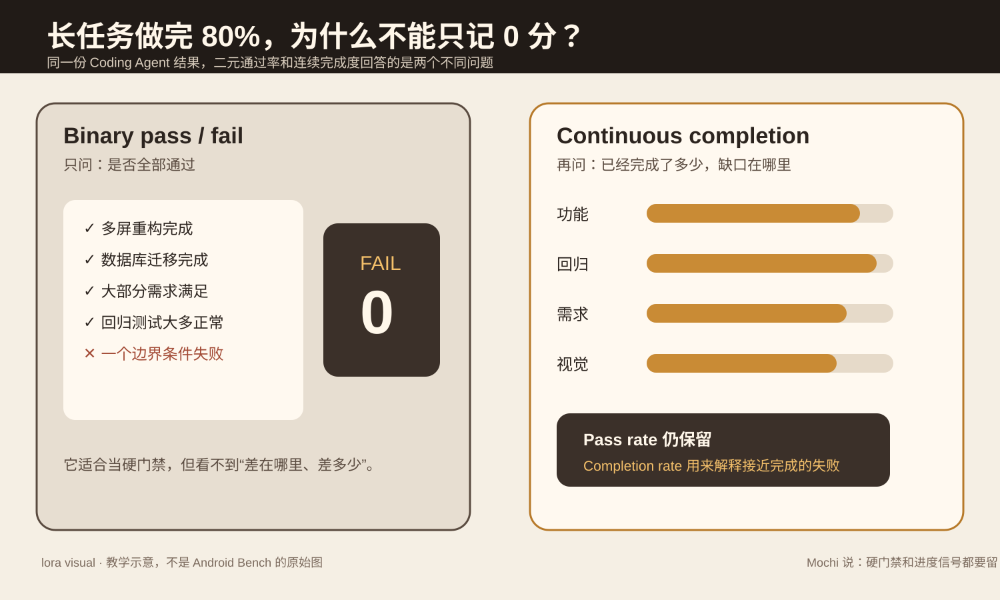
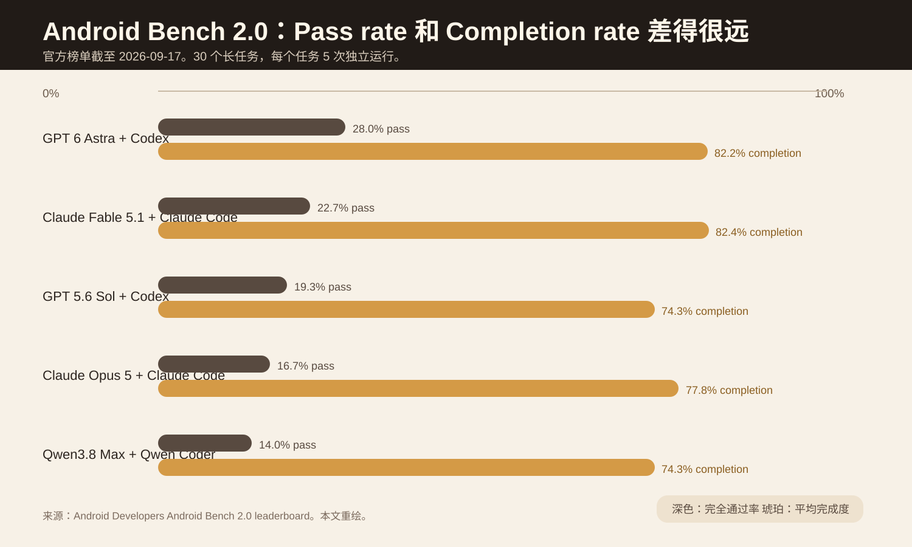
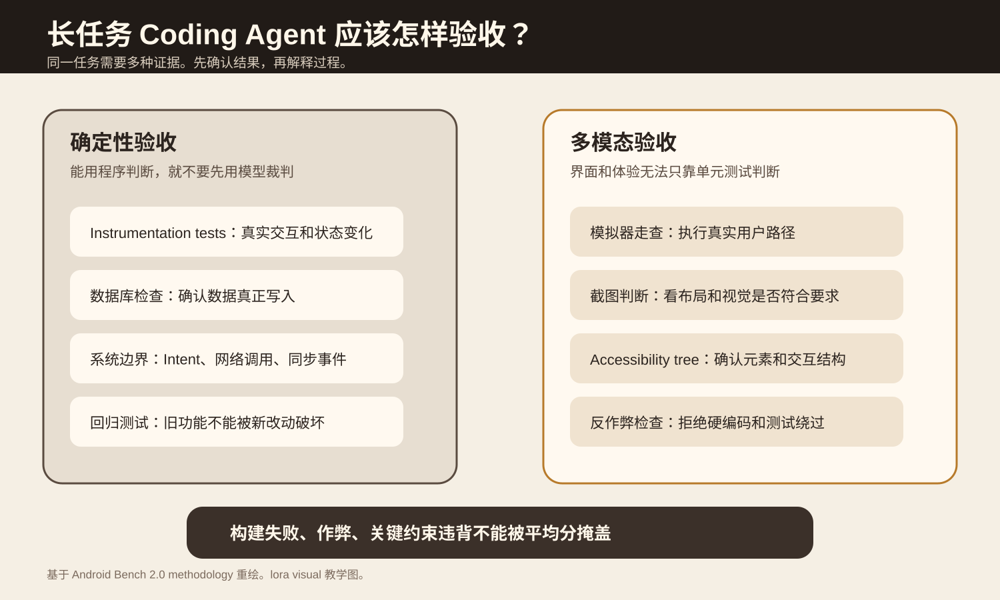

Coding Agent 改了几十个文件，主要功能已经能跑，但还剩一个边界条件失败。评测应该把它记成 0 分，还是应该同时记录它已经完成了多少？

Android Bench 2.0 给出的做法是两者都留。Pass rate 继续回答“能不能交付”，Completion rate 负责回答“已经完成到哪里”。

主材料是 Google Android Developers 在 2026 年 9 月 17 日更新的 [Android Bench 2.0](https://developer.android.com/blog/posts/android-bench-2-0-pushing-the-frontier-with-challenging-long-horizon-tasks) 和 [Methodology 2.0](https://developer.android.com/bench/methodology/2)。排行榜数据来自 [Android Bench 当前榜单](https://developer.android.com/bench)，结果页面注明截至 2026 年 9 月 17 日。

## 先从一个“差一点完成”的重构说起

假设你让 Coding Agent 把一个 Android 应用的 40 个页面迁移到 Jetpack Compose。它改完主要页面，数据库正常，导航基本能用，大部分测试也通过，最后一个边界测试失败。

如果评分只有通过和失败两个值，这次运行和“项目根本编译不过”都会得到 0。

这对发布门禁没有问题。验收条件要求全部通过时，失败就是失败。问题出在分析和改进阶段。两个 0 分背后的差距可能很大。一个 Agent 已经完成主要架构工作，另一个 Agent 可能连项目都没有构建成功。只看 0，无法判断下一步应该改模型、改 Harness、补工具，还是只修一个边界条件。

图 1 是原文作者绘制的教学图，不是 Android Bench 的原始图。左边回答“能不能交付”，右边回答“已经完成到哪里”。Android Bench 2.0 没有删除 Pass rate，而是在旁边增加 Completion rate。

## 为什么旧的 Coding Agent 基准开始不够用

Android Bench 1.0 主要来自真实开源仓库的局部问题和 Pull Request。Google 在新版方法页里给出旧任务尺度。任务的中位改动只有 32 行，通常涉及 1 到 2 个文件。文档称前沿模型在这类任务上的通过率已经接近 90%。

Android Bench 2.0 把任务扩展到 30 个长任务，每个任务运行 5 次独立尝试。

| 任务类型 | 数量 | 典型范围 |
| --- | ---: | --- |
| 从零创建应用 | 9 | 约 1200 到 5500 行，20 到 70 个文件 |
| 迁移 | 13 | 约 200 到 8200 行，5 到 294 个文件 |
| 新增功能 | 6 | 约 400 到 2200 行，4 到 60 个文件 |
| 跨平台转原生 Android | 2 | 完整界面、导航和持久化 |

这些任务包括依赖升级、架构迁移、从设计稿创建应用、给现有应用增加新功能，以及把 Flutter 或 React Native 应用改成原生 Android。Google 还使用私有应用、上游没有出现过的迁移任务和轨迹审计降低训练污染风险。

小补丁评测主要问“能不能修这个点”。长任务还要问 Agent 能不能连续处理架构、运行时状态、视觉、旧功能和任务约束。

## Pass rate 和 Completion rate 为什么差这么远

Android Bench 2.0 当前长任务榜单中，GPT 6 Astra 配 Codex 的 Pass rate 是 28.0%，平均 Completion rate 是 82.2%。Claude Fable 5.1 配 Claude Code 的两个数字分别是 22.7% 和 82.4%。GPT 5.6 Sol 配 Codex 分别是 19.3% 和 74.3%。

这些数据来自 2026 年 9 月 17 日榜单，只能说明这一套任务、Harness 和评测环境下的结果，不能直接推广到其他任务。

图 2 使用官方榜单数据重绘。值得看的是同一系统的两根条之间相差很大。长任务里，Agent 经常能完成大部分工作，但很难把所有细节都收干净。

Google 在方法页里给了一个更具体的轨迹。GPT 5.6 Sol 在一个 Flutter 转 Android 的任务上，94 步时已经达到 84% 完成度。它又执行了 121 步，最后只到 86%。统计页面和暗色主题仍然没有完成。

这个例子只代表这次任务轨迹，但它说明二元评分看不到一个重要问题。Agent 可能不是一开始就走错，而是在完成大部分工作以后进入平台期。

## Completion rate 不是放松验收

Android Bench 2.0 不直接用“改了多少行代码”判断完成度。它把完成情况拆到多类结果证据里，包括功能是否真的工作、旧功能有没有回归、是否满足任务要求，以及视觉和可访问性是否符合目标。

硬失败仍然存在。构建失败、关键约束违背或其它硬门禁不会因为连续分数较高就变成通过。

所以连续完成度的用途不是“把失败算成成功”，而是给没有完全通过的运行增加诊断信号。

## 长任务不能只跑单元测试

Android Bench 2.0 在容器化 Android 虚拟设备里运行任务，并基于 [Harbor](https://github.com/harbor-framework/harbor) 统一环境配置、隔离和指标采集。每个任务做 5 次独立运行，用来减轻模型非确定性带来的偶然结果。

确定性检查包括 Android instrumentation test、SQLite 和 Room 数据检查、外部 Intent 和网络事件，以及旧功能回归测试。多模态部分会驱动模拟器实际走界面，保存截图和 accessibility hierarchy，再做视觉判断和界面结构检查。

图 3 的重点是证据类型。一个 Agent 自己说“已经完成”没有验收价值。数据库里真的有记录、旧测试真的没有坏、界面真的能操作，这些才是结果证据。

Google 还解释了为什么没有直接使用像素差。系统状态栏时间、字体抗锯齿和电池图标等差异，可能让语义正确的界面出现最高 47.5% 的像素差。新版改用模拟器走查、视觉裁判和 accessibility tree 结合验证。

方法文档报告，在 360 次校准运行里，Gemini 3.5 Flash 对重复运行的判断保持一致。这个结果来自 Google 当前测试环境，不能直接推广到其它视觉裁判器。

## 这些数据支持什么，也不支持什么

Android Bench 2.0 支持一个明确判断。长任务里的“基本完成”和“完整通过”不是一回事。当前榜单上多个系统的平均完成度超过 70%，Pass rate 却明显低得多。

方法页还显示，重复且规则明确的多文件转换更容易稳定执行。例如 Java 转 Kotlin、Retrofit 转 Ktor 这类迁移可以跨很多文件保持模式。破坏性框架升级和运行时依赖图更难。

文档举例，Bitwarden 从 Navigation 2 升级到 Navigation 3 的任务跨 233 个文件，完成度为 0.409，Pass rate 为 0。Hilt 转 Koin 的迁移则经常出现能编译但运行时缺少依赖绑定的问题。

这些结果不能证明某个模型“普遍更强”。Android Bench 是 Android 工程任务，使用指定 Harness、容器环境和验证器。榜单也提醒，成本和延迟会受到早失败偏差、网络路由和动态价格影响。一个模型早早失败，反而可能显得更便宜。比较成本时应该先确认完成度和通过率接近。

## 怎么把这个思路用到自己的 Eval

第一层保留硬门禁。编译失败、确定性规则失败、关键约束违背和真实副作用异常，仍然直接决定能不能交付。

第二层保存连续完成信号。不要急着压成一个总分。可以按任务类型分别记录功能完成、来源绑定、语义支持、回归安全、视觉验收等维度。

第三层单独记录“没有评测”。某个语义裁判没有运行时，应该记为 `not_evaluated`，不能记成 0，也不能参加平均。基础设施错误也应该单独记录，否则环境故障会被误写成模型质量差。

连续分数只有在它能帮助定位失败、比较两个接近完成的版本时才有价值。如果最后只是多出一个看起来精确的小数，却不能改变调试方式，就没有必要做复杂总分。

## 来源

- [Android Developers：Android Bench 2.0，2026-09-17](https://developer.android.com/blog/posts/android-bench-2-0-pushing-the-frontier-with-challenging-long-horizon-tasks)
- [Android Bench 2.0 methodology](https://developer.android.com/bench/methodology/2)
- [Android Bench leaderboard](https://developer.android.com/bench)
- [Harbor 官方仓库](https://github.com/harbor-framework/harbor)
