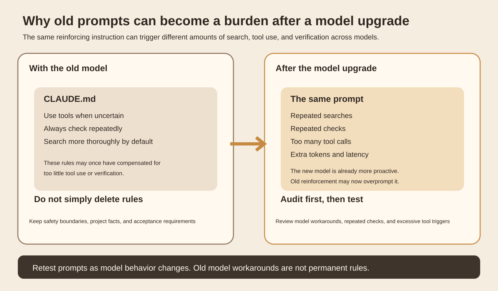
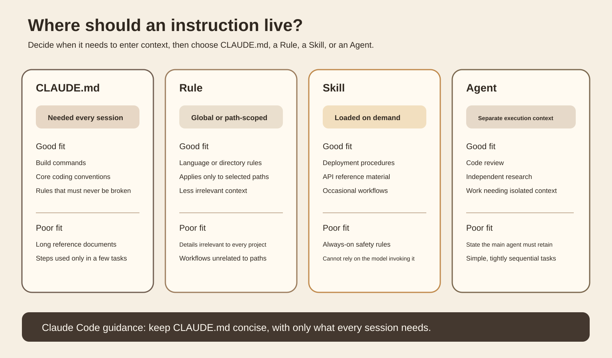
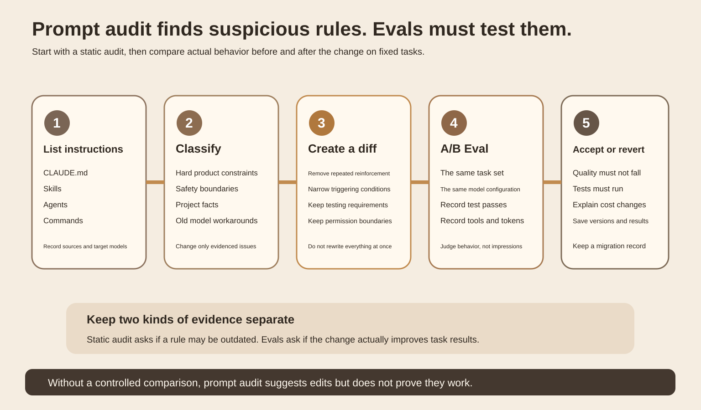
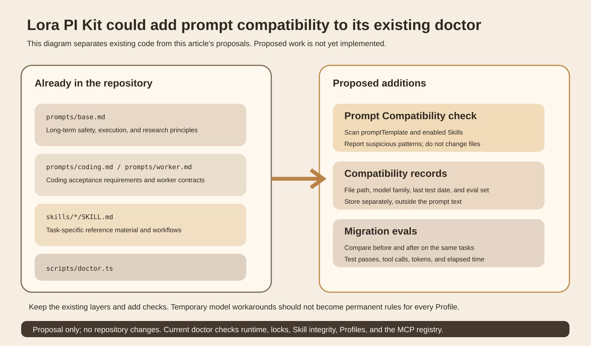

Today I am looking at a specific development problem.
You upgrade a coding agent from an old model to a new one. The code, tools, and repository stay the same, and the original [CLAUDE.md](http://CLAUDE.md) is untouched. Yet the agent starts searching more, repeating checks, and making extra tool calls. It still completes the task, but tokens, elapsed time, and wasted actions all increase.
This does not necessarily mean the new model is worse. Another possibility is that the old prompt contains reinforcing rules added to compensate for the model's capabilities at the time. The model's behavior has changed, but those rules remain.
On September 25, 2026, Anthropic added `/doctor prompt-audit` in Claude Code v2.1.283. The release notes are specific. It checks [CLAUDE.md](http://CLAUDE.md), Skills, Agents, and Commands for prompting patterns written for older models. [Claude Code v2.1.283](https://github.com/anthropics/claude-code/releases/tag/v2.1.283)
The update is not itself an effectiveness evaluation. It is a signal that prompt files have compatibility issues in long-lived agents too. Upgrading the model string is not enough.
## Start with the easiest mistakes to make
Anthropic's current Prompting best practices calls out two kinds of migration issue.
The first is tool triggering. Claude Opus 4.6 is more proactive than earlier models. If an old prompt says "use tools when uncertain" or makes a particular tool the default, the new model may trigger it too often. The official advice is to replace broad reinforcement with more specific triggering conditions. [Prompting best practices](https://docs.anthropic.com/en/docs/build-with-claude/prompt-engineering/prompt-templates-and-variables)
The second is verification. Claude Opus 5 already checks its work proactively. Anthropic explicitly says self-verification instructions written for earlier models can cause excessive verification after moving to Opus 5, increasing tokens and latency. Here the advice goes as far as deleting verification prompts that are no longer needed, rather than merely rewording them.
These examples show that a prompt's effect depends on model behavior. It is not a fixed configuration that exists independently of the model.

Figure 1 is a mechanism diagram drawn for this article. The left side shows an older model needing a prompt to compensate for a behavior. The right shows a model that is already more proactive while the old reinforcement remains. That calls for renewed acceptance testing rather than automatic reuse.
Two types of rules need to be separated here.
"Run real tests after changing code" is an acceptance requirement. It remains valid after a model upgrade.
"Always search several more times when uncertain" is more like a model workaround. It aims to change how strongly the model behaves. Rules like this most need review when the model changes.
Do not casually delete safety boundaries, business constraints, coding standards, or real acceptance requirements during a prompt audit.
## Why [CLAUDE.md](http://CLAUDE.md) needs the most restraint
Claude Code's official extension documentation clearly distinguishes how different instruction formats load. [Extend Claude Code](https://code.claude.com/docs/en/features-overview)
The full contents of [CLAUDE.md](http://CLAUDE.md) enter every session and remain in the context of every request. The official rule of thumb is to keep it under 200 lines where possible. Reference material needed only for specific tasks belongs in a Skill. Rules for particular file paths can go into a path-scoped Rule. Tasks that need isolated execution can go to a Subagent.
This is directly relevant to prompt audits. A ten-step process needed only during deployment takes up context and competes with instructions in every task if it permanently lives in [CLAUDE.md](http://CLAUDE.md). After a model upgrade, it may also create new behavioral biases.

Figure 2 follows the current Claude Code extension documentation. Loading scope is the important point. Only rules needed in every session should remain permanently loaded. Occasional workflows should enter context on demand.
The official documentation gives another boundary worth remembering. Restrictions that must execute reliably should not exist only as natural-language reminders. Claude Code recommends putting mandatory checks in Hooks. For example, a deterministic block on a dangerous class of edit is more reliable than saying "never do this."
A prompt migration can therefore check two questions at once. Is the content still appropriate for the current model, and was the rule in the wrong layer to begin with?
## What prompt audit can and cannot do
Static auditing can identify obvious old patterns: excessive emphasis on tool calls, repeated self-checking, wording specific to an old model, or large blocks of reference material that could load on demand.
It cannot prove the modified agent is better.
If a prompt audit recommends deleting a rule to "check test results every time," accepting it directly might make tasks faster, or it might make the agent skip necessary tests. Looking only at tokens or elapsed time can mistake missing acceptance steps for optimization.
The right approach is to produce a small diff from the audit and compare it on fixed tasks.

Figure 3 separates two kinds of evidence. Prompt audit finds suspicious rules. Evals check whether tasks actually improve after the change. Without the second layer, audit results are only suggested edits.
This is also why model migration should not rewrite all prompts at once. If you change more than a dozen rules and results improve, you will not know which change helped. If results get worse, the cause will be hard to locate.
A safer approach is to order changes by risk. Start with obvious model workarounds, then address loading scope, and finally shorten wording. Save each diff and its corresponding eval results.
## Which layer should change in Lora PI Kit?
This section is based on the `lora-sys/lora-pi-kit` main branch I actually read for this article, rather than an inferred structure based on the project name.
The repository already separates prompts from Skills.
`prompts/base.md` contains only four long-term principles covering authorization boundaries, run identity, evidence retention, and output requirements. [base.md](https://github.com/lora-sys/lora-pi-kit/blob/main/prompts/base.md)
`prompts/coding.md` requires real tests and a typecheck before a task may end. [coding.md](https://github.com/lora-sys/lora-pi-kit/blob/main/prompts/coding.md)
`prompts/worker.md` confines workers to their assigned workspace and requires verifiable test evidence and structured status. [worker.md](https://github.com/lora-sys/lora-pi-kit/blob/main/prompts/worker.md)
Most of these are product contracts and acceptance requirements. I would not delete them because a model changed. In particular, "finish only after real tests" verifies the program; it does not ask the model to doubt itself repeatedly.
The repository's `skills/lora-tooling/SKILL.md` holds task-specific knowledge such as installation locations, synchronization methods, and validation steps. This already follows the approach of keeping permanent principles short and loading specific procedures on demand.
The missing layer is in `scripts/doctor.ts`. The current doctor checks the Node version, Pi compatibility lock, Skill hashes, Profiles, whether Prompt files exist, and the MCP registry. It does not check whether prompt content matches model behavior. [doctor.ts](https://github.com/lora-sys/lora-pi-kit/blob/main/scripts/doctor.ts)
I suggest adding a read-only Prompt Compatibility check to doctor. It would report issues without changing files automatically.
The check could take a Profile's `promptTemplate` and `enabledSkills` as input. Its output would record file paths, suspicious patterns, the current model family, the last test date, and associated evals. Compatibility records could live separately in a file such as `locks/prompt-compatibility.json`. That filename is a proposal in this article; the current repository does not implement it.

Figure 4 shows the repository's existing layers on the left and proposed compatibility checks and migration evals on the right. The goal is to retain the existing separation and add an auditable model-migration process.
## Validate with a small experiment instead of changing prompts by feel
There is no need to start with a large benchmark.
Choose 8 fixed small coding tasks. Cover code reading, code changes, running tests, and a case that requires search or documentation lookup. Start every task from the same Git commit, with the same model, tool permissions, and tests.
Group A uses the current prompt. Group B changes only the model workarounds identified by the prompt audit. Safety boundaries, project conventions, and testing requirements stay the same.
For each task, record at least whether final tests passed, whether tests actually ran, model-call count, tool-call count, search count, input tokens, output tokens, total elapsed time, and whether checks were repeated.
If the budget allows, run each task twice for each group. This is only a low-cost teaching setup and is not enough to establish statistical significance. Its purpose is to catch obvious regressions first.
Success cannot mean only "faster." Group B must first preserve task pass results and must not skip necessary tests. If repeated searches, wasted tool calls, tokens, or elapsed time then decrease consistently, there is a reason to accept the prompt change.
Caching and task difficulty are easy sources of mistaken conclusions. Both groups must run the same tasks. Do not change the model and the prompt together, then attribute every difference to prompt audit.
## When a prompt audit is worthwhile
The best times are a major model upgrade, a clear change in default tool behavior, frequent excessive search or verification, or a long accumulation of permanently loaded instructions.
If a system has only one short prompt, without Skills, Agents, or long-term rules, a dedicated auditing system may cost more than it is worth. A direct before-and-after comparison on fixed tasks is faster.
Another case should not be solved with prompt audit. If a rule must hold 100% of the time, such as blocking production-secret access, dangerous commands, or actions without approval, prioritize enforcement through permissions, Hooks, or a policy layer. Prompts can explain rules, but cannot replace execution boundaries.
## Points to remember
Upgrading a model means more than changing a model ID. Long-lived prompts need renewed acceptance testing too.
Permanently loaded prompts should contain only facts and constraints needed for every task. Load task-specific knowledge on demand.
Prompt audit identifies suspicious patterns. Evals establish whether an edit works.
### Self-check
If a new model is already more proactive, but [CLAUDE.md](http://CLAUDE.md) still says "always call a tool when uncertain," what should you do first?
Treat it as a candidate model workaround. On fixed tasks, compare tool calls and results with the rule retained and adjusted. Do not directly delete safety or acceptance rules.
Should "run real tests after changing code" be removed because the model can verify itself?
No. Real tests are external acceptance requirements, different from repeated model self-checking.
A deployment procedure is needed only at release time but permanently lives in [CLAUDE.md](http://CLAUDE.md). Where would it fit better?
Usually in a Skill, so the full procedure enters context only when needed.
## Main sources
[Anthropic, Claude Code v2.1.283, 2026-09-25](https://github.com/anthropics/claude-code/releases/tag/v2.1.283). Supports the prompt-audit release date, inspected instruction types, and feature limits.
[Anthropic, Prompting best practices](https://docs.anthropic.com/en/docs/build-with-claude/prompt-engineering/prompt-templates-and-variables). Supports the guidance on excessive tool triggering, over-verification, and prompt changes during model migration.
[Anthropic, Extend Claude Code](https://code.claude.com/docs/en/features-overview). Supports the loading scopes and responsibilities of [CLAUDE.md](http://CLAUDE.md), Rules, Skills, Subagents, and Hooks.
[Lora PI Kit main repository](https://github.com/lora-sys/lora-pi-kit). Supports the migration section's description of the current prompts, skills, profiles, and doctor structure.
