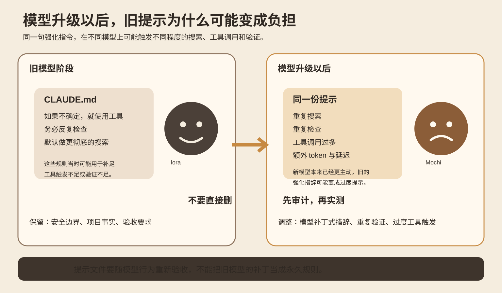
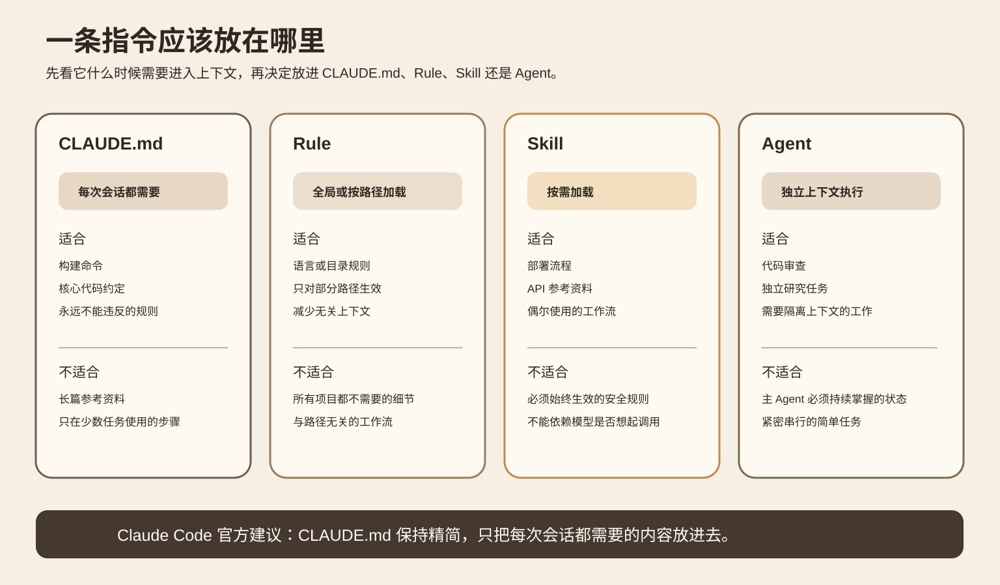
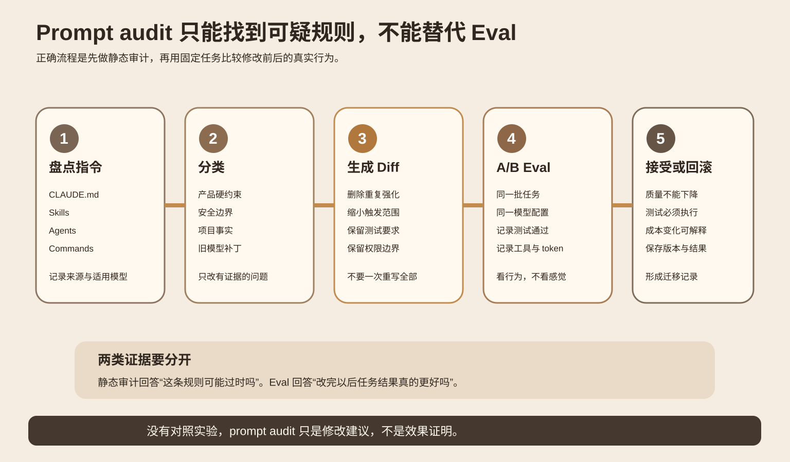
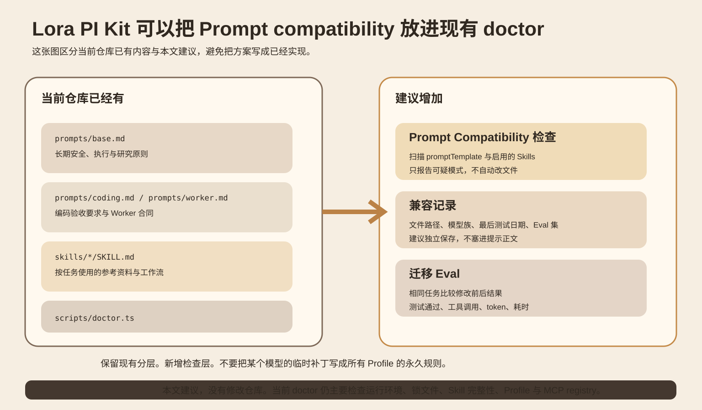

今天研究一个很具体的开发问题。
你把 Coding Agent 从旧模型升级到新模型。代码、工具和仓库都没变，原来的 [CLAUDE.md](http://CLAUDE.md) 也原封不动。结果 Agent 变得更爱搜索，更爱重复检查，还会多调用几次工具。任务最后仍能完成，但 token、耗时和无效动作一起增加。
这不一定说明新模型变差了。另一种可能是，旧提示里有一些当年为了补足模型能力而加的强化规则。模型行为已经变化，这些规则却一直保留。
2026 年 9 月 25 日，Anthropic 在 Claude Code v2.1.283 中加入了 `/doctor prompt-audit`。官方发布说明写得很具体。它会检查 [CLAUDE.md](http://CLAUDE.md)、Skills、Agents 和 Commands，寻找为旧模型写下的提示模式。[Claude Code v2.1.283](https://github.com/anthropics/claude-code/releases/tag/v2.1.283)
这个更新本身不是效果评测。它更像一个信号。长期维护 Agent 时，提示文件也有兼容性问题，不能只升级模型字符串。
## 先看最容易踩中的情况
Anthropic 当前的 Prompting best practices 专门提醒了两类迁移问题。
第一类是工具触发。Claude Opus 4.6 比更早的模型更主动。如果旧提示写着“如果不确定就使用工具”或者把某个工具写成默认选择，新模型可能过度触发。官方建议把这种笼统强化改成更具体的触发条件。[Prompting best practices](https://docs.anthropic.com/en/docs/build-with-claude/prompt-engineering/prompt-templates-and-variables)
第二类是验证。Claude Opus 5 本身会较主动地检查工作。官方明确说，为早期模型写的显式自我验证要求，迁移到 Opus 5 后可能造成过度验证，增加 token 和延迟。这里的建议甚至不是换一种说法，而是把不再需要的验证提示删掉。
这两个例子说明，提示的效果取决于模型行为。它不是独立于模型存在的固定配置。

图 1 是本文绘制的机制图。左边表示旧模型需要提示补足某种行为。右边表示模型本身已经更主动，但旧强化仍然存在。此时应该重新验收，而不是默认继续沿用。
这里要把两类规则分开。
“修改代码后必须跑真实测试”是验收条件。模型换代以后，这个条件仍然成立。
“如果不确定就一定多搜几次”更像模型补丁。它是为了影响模型的行为强度。模型变化以后，这类规则最值得重新检查。
安全边界、业务约束、代码规范和真实验收条件，不应该因为做 prompt audit 就顺手删掉。
## [CLAUDE.md](http://CLAUDE.md) 为什么最需要克制
Claude Code 的官方扩展文档把几种指令载体的加载方式分得很清楚。[Extend Claude Code](https://code.claude.com/docs/en/features-overview)
[CLAUDE.md](http://CLAUDE.md) 的完整内容会进入每个会话，并继续存在于每次请求的上下文中。官方给出的经验线是尽量控制在 200 行以内。只在特定任务需要的参考材料，更适合放到 Skill。只对某些文件路径生效的规则，可以放进带路径范围的 Rule。需要隔离执行的任务，可以交给 Subagent。
这件事和 prompt audit 有直接关系。一个只在部署时需要的十步流程，如果长期塞在 [CLAUDE.md](http://CLAUDE.md) 里，它既占上下文，又会参加所有任务的指令竞争。模型升级后，它还可能产生新的行为偏差。

图 2 根据 Claude Code 当前扩展文档整理。要点不是文件名，而是加载范围。每次会话都必须知道的规则才适合常驻。偶尔使用的工作流应该按需进入上下文。
官方文档还有一个值得记住的边界。必须稳定执行的限制不要只写成自然语言提醒。Claude Code 建议把必须发生的检查放到 Hook。比如禁止某类危险编辑，确定性的阻断比一句“永远不要这样做”更可靠。
所以一次提示迁移可以同时检查两个问题。第一，内容是否仍适合当前模型。第二，这条规则是否本来就放错了层。
## Prompt audit 能做什么，不能做什么
静态审计可以发现明显的旧模式。比如过度强调工具调用、重复自检、旧模型专用措辞，或者大段本可按需加载的参考资料。
它不能证明修改后的 Agent 更好。
如果 prompt audit 建议删掉一条“每次都检查测试结果”的规则，直接接受可能让任务变快，也可能让 Agent 少跑了必要测试。只看 token 或耗时，会把偷掉验收步骤误认为优化。
正确做法是让审计产生一个小 Diff，然后用固定任务做对照。

图 3 把两类证据分开。Prompt audit 找可疑规则。Eval 检查改动以后任务是否真的更好。没有后一层，审计结果只是修改建议。
这也是为什么模型迁移不适合一次重写全部提示。一次改十几条规则，结果变好以后你不知道哪条有效。结果变差以后也很难定位原因。
更稳妥的方法是按风险排序。先处理明显的模型补丁，再处理加载范围，最后处理文字精简。每次保留 Diff 和对应 Eval 结果。
## 放到 Lora PI Kit，应该改哪一层
这部分基于我本次实际读取的 `lora-sys/lora-pi-kit` 主分支，不是根据项目名字推测结构。
当前仓库已经把提示和 Skill 分开了。
`prompts/base.md` 只有四条长期原则，包括授权边界、Run 身份、证据保留和输出要求。[base.md](https://github.com/lora-sys/lora-pi-kit/blob/main/prompts/base.md)
`prompts/coding.md` 要求真实测试和 typecheck，然后才可以结束任务。[coding.md](https://github.com/lora-sys/lora-pi-kit/blob/main/prompts/coding.md)
`prompts/worker.md` 规定 Worker 只能在分配的 workspace 内工作，还要提交可验证的测试证据和结构化状态。[worker.md](https://github.com/lora-sys/lora-pi-kit/blob/main/prompts/worker.md)
这些内容大多属于产品合同和验收条件。我不会因为模型升级就删除它们。尤其是“真实测试后再结束”，它验证的是程序，不是要求模型反复自我怀疑。
仓库里的 `skills/lora-tooling/SKILL.md` 则保存了安装位置、同步方式和验证步骤等任务型知识。这种分层已经符合“常驻原则精简，具体流程按需加载”的方向。
真正缺的一层在 `scripts/doctor.ts`。当前 doctor 会检查 Node 版本、Pi 兼容锁、Skill 哈希、Profile、Prompt 文件是否存在以及 MCP registry，但没有检查提示内容与模型行为是否匹配。[doctor.ts](https://github.com/lora-sys/lora-pi-kit/blob/main/scripts/doctor.ts)
我建议在 doctor 里增加一个只读的 Prompt Compatibility 检查。它只报告问题，不自动改文件。
检查输入可以来自 Profile 的 `promptTemplate` 和 `enabledSkills`。输出记录文件路径、可疑模式、当前模型族、最后一次测试日期和关联 Eval。兼容记录可以单独放进类似 `locks/prompt-compatibility.json` 的文件。这个文件名是本文建议，当前仓库没有这个实现。

图 4 左边是当前仓库已经存在的层。右边是建议补的兼容检查和迁移 Eval。目标是保留现有分层，只增加可审计的模型迁移流程。
## 用一个小实验验证，而不是凭感觉改提示
不需要先做大型 benchmark。
选 8 个固定的小型编码任务。任务要覆盖读代码、改代码、运行测试和一次需要搜索或查文档的场景。所有任务从同一个 Git commit 开始，使用同一个模型、同一组工具权限和同一套测试。
A 组使用当前提示。B 组只调整 prompt audit 标出的模型补丁。安全边界、项目规范和测试要求保持不变。
每个任务至少记录这些字段：最终测试是否通过，测试是否真的执行，模型调用次数，工具调用次数，搜索次数，输入 token，输出 token，总耗时，以及是否出现重复检查。
如果预算允许，每个任务各跑两次。这个次数只是低成本教学配置，不足以证明统计显著性。它的目的，是先发现明显回归。
成功标准也不要只看“更快”。B 组首先不能降低任务通过情况，也不能少执行必要测试。在这个前提下，如果重复搜索、无效工具调用、token 或耗时稳定下降，才有理由接受这次提示修改。
最容易误判的地方是缓存和任务难度。两组必须跑相同任务。不要一边换模型，一边改提示，再把所有差异都算到 prompt audit 上。
## 什么时候值得做 Prompt audit
最值得做的时机是模型主版本升级、默认工具行为明显改变、Agent 开始频繁过度搜索或过度验证，以及常驻提示已经积累很久的时候。
如果系统只有一个短提示，没有 Skills、Agents 或长期规则，专门做一套审计系统可能得不偿失。直接用固定任务做前后对照更快。
还有一种情况不该靠 prompt audit 解决。某条规则必须百分之百执行，比如禁止访问生产密钥、禁止危险命令、强制审批。此时应该优先把限制放到权限、Hook 或策略层。提示可以解释规则，但不能代替执行边界。
## 记住这几件事
模型升级不是只换一个 model id。长期提示也要重新验收。
常驻提示只保留每次任务都需要的事实和约束。任务型知识按需加载。
Prompt audit 负责发现可疑模式。Eval 负责证明修改是否有效。
### 自测
如果新模型本身已经更主动，但 [CLAUDE.md](http://CLAUDE.md) 仍写着“如果不确定就一定调用工具”，第一步应该怎么做？
答案是把它列为模型补丁候选，在固定任务上比较保留与调整后的工具调用和结果。不要直接删除安全与验收规则。
“修改代码后必须跑真实测试”要不要因为模型会自我验证就删掉？
不要。真实测试是外部验收条件，不等于让模型反复自我检查。
一个部署流程只有发布时才用，却长期放在 [CLAUDE.md](http://CLAUDE.md)。更合适的去处是什么？
通常是 Skill。这样完整流程只在需要时进入上下文。
## 主要来源
[Anthropic，Claude Code v2.1.283，2026-09-25](https://github.com/anthropics/claude-code/releases/tag/v2.1.283)。支持 prompt audit 的发布时间、检查对象和功能边界。
[Anthropic，Prompting best practices](https://docs.anthropic.com/en/docs/build-with-claude/prompt-engineering/prompt-templates-and-variables)。支持模型迁移时的过度工具触发、过度验证和提示调整建议。
[Anthropic，Extend Claude Code](https://code.claude.com/docs/en/features-overview)。支持 [CLAUDE.md](http://CLAUDE.md)、Rules、Skills、Subagents 和 Hooks 的加载范围与职责。
[Lora PI Kit 主仓库](https://github.com/lora-sys/lora-pi-kit)。支持本文迁移部分对 prompts、skills、profiles 和 doctor 当前结构的描述。
