> **The conclusion first.** FDE did enter a period of rapid growth in 2026, but the role is more specific than an on-site engineer who can write agents. Public data points to an engineer who writes production code, works directly inside a customer's business, turns ambiguous problems into working systems, owns adoption outcomes, and feeds field experience back into the product. At the same time, title inflation has already appeared. A dataset of 519 public job descriptions found that 28.1% of roles explicitly called FDE or FDSE failed its basic "true FDE" rules. [\[1\]](https://adam-boudjemaa.com/state-of-fde)

## What this research answers

Rather than treating "FDE is hot" as the conclusion, this study asks five questions:

1. How does FDE differ from SWE, Solutions Engineer, and implementation engineer roles?
2. Is there data supporting job growth?
3. What capabilities are companies actually hiring for?
4. Is China simply renaming existing work, or are real organizations and projects emerging?
5. Can the model scale, or will it become expensive on-site staffing?

The data was checked on September 20, 2026. Evidence is divided into hiring data, first-party company material, real projects, and critical research. Sources use different time windows and sampling methods. This article does not combine Lightcast, Indeed, LinkedIn, public ATS data, and Chinese hiring platforms into a single "global FDE market size."

## Start with the growth data

| Source | Time basis | Result | Note |
| --- | --- | ---: | --- |
| Lightcast, via Fortune | January to August 2026, year over year | **More than 1000%** | Engineering job ads containing "forward-deployed" |
| Lightcast, via Fortune | January to August 2026 versus 2023 | **More than 4600%** | Same source as the row above |
| Indeed, via public reporting | 2025-04 to 2026-04 | 643 to 5330, about **+729%** | Platform keyword-based count |
| LinkedIn, via Sino-Singapore Jingwei | 2023 to 2025 | About **42 times** | AI Engineer grew about 13 times over the same period |

These numbers cannot directly validate one another because their definitions differ. They do point in the same direction: FDE has spread from an internal title at a few companies into a distinct job family. [\[2\]](https://fortune.com/2026/09/03/forward-deployed-engineers-fast-growing-six-figure-silicon-valley-job-integrate-ai-with-customers-tech-careers-palantir/)[\[3\]](https://finance.sina.com.cn/wm/2026-05-18/doc-inhyimem8115024.shtml)[\[4\]](https://news.china.com.cn/2026-06/05/content_118533118.shtml)

## What 519 public job descriptions show

The public dataset Adam Boudjemaa released on July 21, 2026 contains **519 FDE-family job descriptions from 57 employers**, drawn exclusively from public Greenhouse, Lever, and Ashby ATS listings. [\[1\]](https://adam-boudjemaa.com/state-of-fde)[\[5\]](https://adam-boudjemaa.com/state-of-fde/methodology)

<InteractiveHtml
  src="/artifacts/blog/fde-enterprise-ai-engineering-role/fde-global-job-spectrum-en.html"
  title="FDE global public job-description spectrum"
  height="660"
  caption="Organized from the 519 public job descriptions and sources cited in the article to explore the distribution of job skills."
/>

### 98.3% is the most important number

Among roles classified as genuine FDE by the dataset's rules, **98.3% require production coding**. FDE is therefore first an engineering role, rather than a consultant with some technical knowledge.

In the same dataset:

- AI/ML: 84.4%
- Python: 70.7%
- Data, SQL, pipelines: 50.7%
- TypeScript, JavaScript: 38.7%
- Go: 27.6%
- SQL: 22.9%
- Security, regulatory: 17.7%

The work therefore touches backend and full-stack engineering, data pipelines, enterprise APIs, cloud infrastructure, agents, evaluations, permissions, and production incidents. It goes well beyond writing prompts. [\[1\]](https://adam-boudjemaa.com/state-of-fde)

### The FDE title covers only 36.2%

Of the 519 roles, 188 were directly named FDE, or 36.2%. Other common titles include Solutions Architect, Solutions Engineer, FDSE, Deployment Engineer, Deployment Strategist, Applied AI Engineer, and Field Engineer.

The reverse is also true: a role called FDE does not necessarily operate as one. Of 235 roles explicitly called FDE or FDSE, 71.9% met the basic rules of production coding, customer embedding, and no sales quota. Adding an explicit reporting line to Engineering or Product reduced the pass rate to 60.4%. [\[1\]](https://adam-boudjemaa.com/state-of-fde)

Organizational placement and actual responsibilities therefore matter more than the title.

## What FDE actually means

OpenAI's general FDE role covers discovery, technical scoping, system design, build, and production rollout. Success criteria include production adoption, measurable workflow impact, and eval-driven feedback. The San Francisco role requires up to 50% travel. [\[6\]](https://openai.com/careers/forward-deployed-engineer-%28fde%29-sf-san-francisco/)

Anthropic FDEs work directly in customer systems, build production Claude applications, deliver MCP servers, sub-agents, and agent Skills, and feed recurring deployment patterns back to Product and Engineering. Its public listing requires 25% to 50% travel to customer sites. [\[7\]](https://job-boards.greenhouse.io/anthropic/jobs/5391016008)

Palantir treats field deployment itself as a product-development feedback loop. [\[8\]](https://www.palantir.com/docs/foundry/architecture-center/platforms)

```mermaid
flowchart LR
    A["Enter the business environment"] --> B["Break down the real problem"]
    B --> C["Define business metrics"]
    C --> D["Build a quick prototype"]
    D --> E["Connect data / APIs / permissions"]
    E --> F["Evaluate and validate safety"]
    F --> G["Deploy to production"]
    G --> H["Adoption / business outcomes"]
    H --> I["Failure cases and production feedback"]
    I --> J["Build reusable Skills / harnesses / product capabilities"]
    J --> C
```

The key is that the same engineering team has authority to define the problem, execute the engineering work, and own the result. Being on site alone does not establish that.

## Why AI has expanded the role of FDE

When agents enter enterprises, they face model uncertainty, scattered organizational knowledge, permissions, security, tool calls, conflicting business rules, evaluations, production drift, and user adoption at the same time.

OpenAI Presence is one example. Before launch, the team defines what the agent may do, when approval is required, and when a human must take over. After launch, it continues reviewing production conversations, escalation records, and quality signals, then retests and rolls out changes gradually. [\[9\]](https://openai.com/index/introducing-openai-presence/)

Agent delivery therefore resembles an ongoing engineering system more than a one-time project acceptance.

## Outside China, the role has become a deployment organization

OpenAI is providing more than **$4 billion in initial investment** for the Deployment Company and plans to acquire Tomoro to bring in roughly 150 experienced FDEs and deployment specialists from day one. [\[10\]](https://openai.com/index/openai-launches-the-deployment-company/)

DXC and Anthropic plan to train **tens of thousands** of Claude-certified FDEs and builders to work in banking, aviation, insurance, manufacturing, and government systems. DXC OASIS is already in production at more than 50 joint customers. [\[11\]](https://dxc.com/newsroom/06112026-dxc-and-anthropic-announce-multi-year-global-alliance-to-bring-ai-into-mission-critical-enterprise-systems)

Reuters reports that TCS plans an AI deployment engineer workforce of up to approximately **8900 people**. AWS announced **$1 billion** for a new embedded AI engineering organization. [\[12\]](https://www.reuters.com/world/india/indias-tata-consultancy-services-plans-up-8900-ai-deployment-engineers-seeks-ai-2026-07-12/)[\[13\]](https://www.reuters.com/business/retail-consumer/amazons-aws-commits-$1-billion-toward-new-unit-embedded-ai-engineers-2026-06-30/)

This is no longer unique to Palantir's culture. It is spreading to model companies, cloud providers, consultancies, and traditional IT service firms.

## China: the work existed before the title

Chinese data is more fragmented, so official job descriptions from major firms, hiring-platform samples, listed-company actions, and talent development must be considered separately.

<InteractiveHtml
  src="/artifacts/blog/fde-enterprise-ai-engineering-role/fde-china-market-dashboard-en.html"
  title="Public samples from the Chinese FDE market"
  height="680"
  caption="Organized from the 28 major-company job descriptions, public salary samples, and 2026 organizational actions checked in the article."
/>

### 28 official job descriptions reveal the outline

On July 21, 2026, Feidi collected listings directly from the official hiring sites of Tencent, ByteDance, Alibaba Cloud, Ant Group, and Zhipu. It recorded 28 identifiable FDE roles: 12 at Tencent, 11 at ByteDance, 3 at Alibaba Cloud, 1 at Ant Group, and 1 at Zhipu. [\[14\]](https://fdesky.com/market.html)

There is an important detail in the secondary labeling of these 28 descriptions. The author did not publish precise percentages. Across two labeling passes on the same set, the top four items stayed in the same order, but their counts changed. The stable ordering was:

1. Turn ambiguous requirements into executable plans.
2. Communicate with customers and explain value.
3. Deploy to production and integrate systems.
4. Agent tool use and multistep work.
5. RAG and evaluations.

This is more reliable than forcing percentages out of the sample. It suggests that major Chinese firms first screen for the ability to deliver the work, and only then for familiarity with a particular agent framework. [\[14\]](https://fdesky.com/market.html)

### Chinese salaries cannot be summarized as "a million yuan a year"

Public reports in 2026 show a wide range:

- ByteDance Doubao AI large-model FDE: RMB 35000 to 70000 per month, 15 months of salary per year.
- Ant Digital Technologies enterprise FDE: RMB 40000 to 60000 per month, 15 months of salary per year.
- Zhipu FDE lead: RMB 60000 to 80000 per month.
- Alibaba Cloud Intelligence FDE: RMB 20000 to 50000 per month, 16 months of salary per year.
- A public Mobvoi role: RMB 15000 to 30000 per month.

These figures come from different companies, levels, regions, and role definitions. They show that jobs under the title vary widely, but cannot establish a uniform market salary. [\[4\]](https://news.china.com.cn/2026-06/05/content_118533118.shtml)[\[15\]](https://m.21jingji.com/article/20260702/herald/796436f687ece63fbf06059abe02fda0.html)[\[16\]](https://cn.linkedin.com/jobs/view/ai%E5%89%8D%E6%B2%BF%E9%83%A8%E7%BD%B2%E5%B7%A5%E7%A8%8B%E5%B8%88%EF%BC%88fde%EF%BC%89-at-mobvoi-4457718499)

### Organizational action appeared in August and September

Yonyou Network's 2026 interim report explicitly says enterprise AI deployment is moving toward an FDE model. It describes FDE as a multidisciplinary team that stays on site long term, identifies business problems early, builds custom integrations, iterates continuously, and owns business value. [\[17\]](https://static.cninfo.com.cn/finalpage/2026-08-22/1225490345.PDF)

Yusys Technologies disclosed that its FDE team had been tested in banking customer projects. It also established a training system covering prompt engineering, RAG 2.0, agents, industry field delivery, and comprehensive assessment. [\[18\]](https://static.cninfo.com.cn/finalpage/2026-08-26/1225506640.PDF)

On September 10, Moonshot AI launched the Kimi enterprise partner program with Chinasoft International, Kingsoft Cloud, Teamsun, Yacoo, AsiaInfo Technologies, and other partners to build FDE delivery teams. [\[19\]](https://m.21jingji.com/article/20260910/herald/593ef402a928c4fc4931846b719ccd67.html)

On September 16, Shanghai Xuhui District's Human Resources and Social Security Bureau explicitly classified FDE as an urgently needed multidisciplinary talent category and jointly offered advanced training with Shanghai Jiao Tong University. [\[20\]](https://rsj.sh.gov.cn/txh_17094/20260916/27117c0df6e0471fa58c97e7d6511ba4.html)

Tencent Cloud ADP also published its FDE certification and partner system in September, covering requirements analysis, solution design, application building, delivery implementation, and security compliance. [\[21\]](https://adp.tencent.com/zh/blog/adp-fde-certification-guide)

China's FDE activity has therefore moved beyond a hiring title. Roles, training, partner networks, and delivery methods are appearing together.

## Real projects: what FDE actually delivers

Job descriptions alone can make FDE look like repackaged positioning. Real projects make its boundaries clearer.

<InteractiveHtml
  src="/artifacts/blog/fde-enterprise-ai-engineering-role/fde-case-evidence-explorer-en.html"
  title="FDE real-project evidence explorer"
  height="720"
  caption="Collects the article's 6 public cases and their sources, retaining attribution to company- or project-reported results."
/>

### OpenAI Presence

OpenAI already uses Presence for its own English-language phone support. Its official disclosures state:

- **75%** of inbound issues need no human handling.
- A Codex-driven improvement cycle reduced the human transfer rate by **15 percentage points** in **10 days**.

The system first defines a specific job, then connects knowledge, account context, and actions that can be approved. After launch, production conversations and human-escalation records continue to feed the improvement loop. [\[9\]](https://openai.com/index/introducing-openai-presence/)

This shows that FDE work includes building a loop of evaluation, production, failure cases, changes, regression testing, and release, beyond simply deploying an agent.

### John Deere × OpenAI

The John Deere case published by OpenAI Deployment Company says the team reviewed hundreds of real examples with domain experts, built custom evaluations, and rapidly iterated a recommendation system. Public results include **6 times** the customer engagement and a **70%** reduction in chemical use. [\[22\]](https://deploy.co/)

These numbers are public project disclosures, not third-party audits. The important sequence is to establish domain examples and evaluations before discussing scaled deployment.

### DXC OASIS × Anthropic

DXC reports that Claude helped accelerate software delivery for its OASIS platform by approximately **10 times**. More than **95%** of its code was generated by Claude and then reviewed by humans. OASIS is already in production at **more than 50** joint customers. [\[11\]](https://dxc.com/newsroom/06112026-dxc-and-anthropic-announce-multi-year-global-alliance-to-bring-ai-into-mission-critical-enterprise-systems)

Its sequence is Customer Zero, internal production validation, 90-day certification, FDE deployment into customers, and replication across industries.

### Datawhale FDE100: cross-border e-commerce

Datawhale FDE100's cross-border clothing e-commerce case connects inventory, logistics, replenishment, and advertising data. The project reports saving roughly **4 hours** of logistics-information processing per day, with approximately **3000** new SKUs added annually. [\[23\]](https://fde100.datawhale.cn/)

The case looks like AI automation, but its main underlying problems are isolated data and cross-system workflows.

### Datawhale FDE100: physical-retail reconciliation

The store previously reconciled paper receipts, its checkout system, and the mall's settlement system manually. The project integrated OCR, visual recognition, three-source cross-checking, and discrepancy classification into the existing process.

Reported time fell from approximately **1 to 2 person-days** per cycle to **a few hours**. The project estimates an efficiency improvement of roughly **70% to 80%**. [\[24\]](https://fde100.datawhale.cn/cases/cases-015)

### AInnovation: FDE in manufacturing

AInnovation offers a workload estimate: AI coding has reduced some development work, but software development accounts for only about **30% to 40%** of the work of deploying industrial agents. The remainder includes clarifying business logic, data governance, model selection, and compute optimization. [\[25\]](https://m.21jingji.com/article/20260901/herald/b1c40fbed3c704237b5f0b6839cff2a1_zaker.html)

Its approach starts with building the first working system for a leading customer. FDEs solve problems on site, turn the results into reusable platform assets and industry packages, then replicate them for similar customers.

If each customer requires a completely new implementation, FDE remains a business whose labor needs grow linearly. If field experience repeatedly becomes product capability, FDE can create a cycle of product improvement.

## How FDE differs from adjacent roles

The table below is a model of responsibilities, not statistical data.

| Dimension | Conventional SWE | Solutions | Traditional implementation | FDE |
| --- | --- | --- | --- | --- |
| Main focus | Core product and codebase | Presales solutions and customer technical communication | Defined projects and delivery scope | Real customer business problems and production systems |
| Production coding | Common | Depends on the role | Depends on the project | **Core requirement** |
| Participation in problem definition | Depends on the team | Common | Less common | **Common** |
| Direct accountability for business outcomes | Less common | Indirect | Mainly project acceptance | **Common** |
| Field feedback enters the product | Indirect | Common | Less common | **Core feedback loop** |
| Customer-site work | Less common | Common | Common | **Common** |

A practical test is:

> **A genuine FDE has authority over both engineering execution and problem definition.**

Customer communication without production engineering is closer to Solutions. Coding without customer and business ownership is closer to a conventional SWE role.

## This model also has clear problems

An article focused only on growth would miss the most important other half.

### Title inflation has already happened

The 519-role dataset shows that 28.1% of roles explicitly called FDE or FDSE failed its basic authenticity rules. [\[1\]](https://adam-boudjemaa.com/state-of-fde)

IDC also observes a split in China. Some companies have established talent standards, delivery methods, and feedback loops between customer-facing and internal teams. Others do not differ materially from traditional on-site delivery. [\[26\]](https://www.idc.com/resource-center/blog/fde-%E5%9C%A8%E4%B8%AD%E5%9B%BD%E7%81%AB%E4%BA%86%EF%BC%8Cagent-%E5%AE%9E%E6%96%BD%E6%9C%8D%E5%8A%A1%E7%9A%84%E7%9C%9F%E6%AD%A3%E8%80%83%E9%AA%8C%E5%9C%A8%E5%93%AA%E5%84%BF%EF%BC%9F/)

### FDE is expensive and inherently limits scaling efficiency

a16z acknowledges this directly. An implementation-intensive model can mean lower gross margins and higher costs early on. But teams that turn complex integrations into reusable platform capabilities may also build strong customer retention. [\[27\]](https://a16z.com/services-led-growth/)

The question is whether services keep becoming product capabilities.

### China may not follow the US model

Gartner's China team has publicly raised concerns about high costs, uncertain returns, and the conflict between long-term co-development and project-based procurement. Some enterprises may treat FDE as high-end systems integration rather than product innovation. [\[28\]](https://m.21jingji.com/article/20260910/herald/d46137c0a3b1921157a1a2c10643e9a2_zaker.html)

Another Gartner FDE Playbook gives more specific advice: use vendor FDEs to increase the effectiveness of internal teams, rather than replace internal capability. Projects should specify knowledge transfer, ownership, and exit mechanisms to avoid long-term dependence. [\[29\]](https://www.gartner.com/en/documents/8287721)

This aligns with DXC and AInnovation: experienced FDEs build the first working system, establish methods and reusable assets, train internal or partner engineers, and then replicate at scale.

## Which FDE roles deserve a closer look

Check six things in a job description:

1. Does it explicitly require production coding, rather than only demos, slides, or training?
2. Can engineers participate in defining the problem, rather than only receive requirements?
3. Do success criteria include adoption, accuracy, processing time, cost, or business metrics?
4. Does responsibility for evaluation, stability, and failure cases continue after launch?
5. Can field experience feed back into the core product?
6. Does the company have a platform, components, or methods that turn one project's work into reusable assets for the next?

If most are missing, a role called FDE may still be repackaged implementation or presales work.

## What this means for developers

The median minimum experience requirement across the 519 job descriptions is **5 years**. OpenAI's general role asks for 5 or more years, and Anthropic's current role is also clearly senior-oriented. FDE is generally not a typical entry-level role. [\[1\]](https://adam-boudjemaa.com/state-of-fde)[\[6\]](https://openai.com/careers/forward-deployed-engineer-%28fde%29-sf-san-francisco/)

If you want to move in this direction, the most valuable project is a complete delivery loop: real users, an ambiguous problem, data and system integration, an agent or automation, evaluations, launch, metrics, failure cases, and another iteration. Another chat interface alone does not demonstrate that work.

A portfolio should answer:

- Where was the original process slow?
- Which real data and systems did you connect?
- How did you handle permissions?
- How did you design evaluations?
- How did metrics change before and after launch?
- What became reusable components?

This account is closer to how FDE hiring actually works than a list saying "used LangGraph, MCP, and RAG."

## Final judgment

FDE was not invented because of AI. Palantir has practiced it for years.

The real change in 2026 is that the enterprise AI bottleneck is moving from whether the model can perform a task to who can put it into a real business safely, reliably, and with measurable results.

Hiring growth, OpenAI's $4 billion Deployment Company, DXC's plan for tens of thousands of engineers, TCS's 8900-person deployment workforce, and the actions of Yonyou, Yusys, Kimi, and Tencent Cloud in China all show that enterprises are willing to reorganize people and budgets around deployment.

But FDE is not automatically a viable business model. If it simply renames traditional on-site staffing, costs grow linearly. If FDEs continually turn field problems into evaluations, Skills, harnesses, industry ontologies, data connectors, and product capabilities, each customer can improve the product in return.

That is the substantive difference FDE should establish from ordinary project outsourcing.

## Data definitions and limitations

- Research was checked on September 20, 2026.
- The 519 overseas FDE-family job descriptions came from public Greenhouse, Lever, and Ashby ATS listings. The sample leans toward US, AI-native, and venture-backed companies. Databricks, Palantir, OpenAI, and Snowflake account for approximately 59% of the sample. It is not a census of the global employment market.
- "True FDE" classification in the 519-role dataset uses fixed coding rules, rather than individual expert review of every listing.
- Salary disclosures cover only 17.3% of the 519-role sample, so they are directional information only.
- The 28 major-company Chinese job descriptions were collected at a point in time on July 21, 2026. Listings may be removed.
- The source page for the Chinese Liepin industry sample says n=37, but its category-table counts add up to 38. This article retains that inconsistency and does not convert it into industry percentages.
- Project metrics from Datawhale FDE100, OpenAI, DXC, and AInnovation are publicly disclosed by the project or company. They are not equivalent to third-party audits.
- The comparison of FDE with adjacent roles is an analysis of responsibilities, not a statistical result.

## Main sources

1. [State of Forward-Deployed Engineering 2026](https://adam-boudjemaa.com/state-of-fde)
2. [Dataset methodology](https://adam-boudjemaa.com/state-of-fde/methodology)
3. [OpenAI FDE Careers](https://openai.com/careers/search/?q=forward+deployed)
4. [OpenAI Deployment Company](https://openai.com/index/openai-launches-the-deployment-company/)
5. [OpenAI Presence](https://openai.com/index/introducing-openai-presence/)
6. [Anthropic FDE](https://job-boards.greenhouse.io/anthropic/jobs/5391016008)
7. [DXC × Anthropic](https://dxc.com/newsroom/06112026-dxc-and-anthropic-announce-multi-year-global-alliance-to-bring-ai-into-mission-critical-enterprise-systems)
8. [Palantir Forward Deployed Engineering](https://www.palantir.com/docs/foundry/architecture-center/platforms)
9. [a16z: Trading Margin for Moat](https://a16z.com/services-led-growth/)
10. [Chinese FDE job and salary samples](https://fdesky.com/market.html)
11. [Yonyou Network 2026 interim report](https://static.cninfo.com.cn/finalpage/2026-08-22/1225490345.PDF)
12. [Yusys Technologies 2026 interim report](https://static.cninfo.com.cn/finalpage/2026-08-26/1225506640.PDF)
13. [Shanghai Human Resources and Social Security Bureau FDE training](https://rsj.sh.gov.cn/txh_17094/20260916/27117c0df6e0471fa58c97e7d6511ba4.html)
14. [Datawhale FDE100](https://fde100.datawhale.cn/)
15. [Gartner FDE Playbook](https://www.gartner.com/en/documents/8287721)
16. [IDC: observations on FDE implementation services in China](https://www.idc.com/resource-center/blog/fde-%E5%9C%A8%E4%B8%AD%E5%9B%BD%E7%81%AB%E4%BA%86%EF%BC%8Cagent-%E5%AE%9E%E6%96%BD%E6%9C%8D%E5%8A%A1%E7%9A%84%E7%9C%9F%E6%AD%A3%E8%80%83%E9%AA%8C%E5%9C%A8%E5%93%AA%E5%84%BF%EF%BC%9F/)
