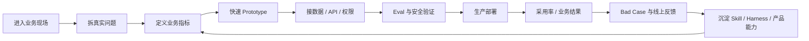

> **结论先放前面。** FDE 在 2026 年确实进入快速扩张期，但它不是“会写 Agent 的驻场工程师”。公开数据更接近这样的定义：能写生产代码，直接进入客户业务，把模糊问题做成可运行系统，并对采用效果负责，再把现场经验反馈回产品。与此同时，Title 膨胀已经出现。一份 519 条公开 JD 数据集显示，明确叫 FDE 或 FDSE 的岗位中，有 28.1% 没有通过基础“真 FDE”规则。[\[1\]](https://adam-boudjemaa.com/state-of-fde)

## 这篇调研回答什么

这次不把“FDE 很火”当结论，而是回答五个问题：

1. FDE 和 SWE、Solutions Engineer、实施工程师到底差在哪里？
2. 岗位增长有没有数据支持？
3. 企业实际在招什么能力？
4. 国内是不是只在换名字，还是已经出现真实组织和项目？
5. 这种模式能不能规模化，还是会变成高成本驻场？

数据核对日期是 2026 年 9 月 20 日。证据分成招聘数据、公司一手资料、真实项目和反方研究。不同数据源的时间窗和采样方法不同，本文不会把 Lightcast、Indeed、LinkedIn、公开 ATS 和国内招聘平台拼成一个“全球 FDE 市场规模”。

## 先看增长数据

| 数据源 | 时间口径 | 结果 | 注意 |
| --- | --- | ---: | --- |
| Lightcast，经 Fortune | 2026 年 1 至 8 月同比 | **超过 1000%** | “forward-deployed”工程招聘广告 |
| Lightcast，经 Fortune | 2026 年 1 至 8 月对比 2023 | **超过 4600%** | 与上一行同一来源 |
| Indeed，经公开报道 | 2025-04 至 2026-04 | 643 至 5330，约 **+729%** | 平台关键词口径 |
| LinkedIn，经中新经纬 | 2023 至 2025 | 约 **42 倍** | 同期 AI Engineer 约 13 倍 |

这些数字不能直接互相验证，因为统计口径不同。但方向一致：FDE 已经从少数公司的内部叫法扩散成独立岗位族。[\[2\]](https://fortune.com/2026/09/03/forward-deployed-engineers-fast-growing-six-figure-silicon-valley-job-integrate-ai-with-customers-tech-careers-palantir/)[\[3\]](https://finance.sina.com.cn/wm/2026-05-18/doc-inhyimem8115024.shtml)[\[4\]](https://news.china.com.cn/2026-06/05/content_118533118.shtml)

## 519 条公开 JD：岗位到底长什么样

Adam Boudjemaa 在 2026 年 7 月 21 日发布的公开数据集包含 **519 条 FDE-family JD、57 家雇主**，只使用 Greenhouse、Lever 和 Ashby 的公开 ATS。[\[1\]](https://adam-boudjemaa.com/state-of-fde)[\[5\]](https://adam-boudjemaa.com/state-of-fde/methodology)

<InteractiveHtml
  src="/artifacts/blog/fde-enterprise-ai-engineering-role/fde-global-job-spectrum.html"
  title="FDE 全球公开 JD 频谱"
  height="660"
  caption="按 519 条公开 JD 数据与文中引用来源整理，用于查看岗位技能分布。"
/>

### 98.3% 是最重要的数字

被该数据集规则判定为真实 FDE 的岗位中，**98.3% 要求生产编码**。所以 FDE 首先仍然是工程岗位，不是“懂点技术的咨询顾问”。

同一数据集里：

- AI/ML：84.4%
- Python：70.7%
- Data、SQL、pipelines：50.7%
- TypeScript、JavaScript：38.7%
- Go：27.6%
- SQL：22.9%
- Security、regulatory：17.7%

这说明实际工作会碰到后端、全栈、数据管道、企业 API、云基础设施、Agent、Eval、权限和线上故障，而不是只写 Prompt。[\[1\]](https://adam-boudjemaa.com/state-of-fde)

### FDE 这个名字只覆盖 36.2%

519 条岗位里，直接叫 FDE 的有 188 条，占 36.2%。其余常见名称包括 Solutions Architect、Solutions Engineer、FDSE、Deployment Engineer、Deployment Strategist、Applied AI Engineer 和 Field Engineer。

反过来也成立：岗位名叫 FDE，不代表它真的按 FDE 工作。235 个明确叫 FDE 或 FDSE 的岗位里，71.9% 满足“生产编码、客户嵌入、非销售 quota”的基础规则。加入“明确汇报给 Engineering 或 Product”以后，通过率降到 60.4%。[\[1\]](https://adam-boudjemaa.com/state-of-fde)

所以判断岗位时，组织归属和实际责任比 Title 更重要。

## FDE 到底是什么

OpenAI 的通用 FDE 负责 discovery、technical scoping、system design、build 和 production rollout。成功标准包括 production adoption、measurable workflow impact 和 eval-driven feedback。旧金山岗位要求最高 50% 出差。[\[6\]](https://openai.com/careers/forward-deployed-engineer-%28fde%29-sf-san-francisco/)

Anthropic 的 FDE 直接进入客户系统，构建 Claude 生产应用，交付 MCP Server、Sub-agent 和 Agent Skill，并把重复部署模式反馈给 Product 和 Engineering。公开岗位要求 25% 至 50% 客户现场出差。[\[7\]](https://job-boards.greenhouse.io/anthropic/jobs/5391016008)

Palantir 则把一线部署直接视为产品开发反馈回路。[\[8\]](https://www.palantir.com/docs/foundry/architecture-center/platforms)

关键不是“驻场”，而是同一个工程团队同时拿到问题定义权、工程执行权和结果责任。

## 为什么 AI 时代把 FDE 放大了

Agent 进入企业以后，会同时遇到模型不确定性、企业知识分散、权限、安全、工具调用、业务规则冲突、Eval、线上漂移和用户采用问题。

OpenAI Presence 就是一个例子。上线前要定义 Agent 能做什么、什么时候审批、什么时候交给人。上线以后继续读取生产会话、升级记录和质量信号，重新测试再灰度发布。[\[9\]](https://openai.com/index/introducing-openai-presence/)

所以 Agent 交付更像一个持续运行的工程系统，不是一次项目验收。

## 国外已经从“岗位”走到“部署组织”

OpenAI 为 Deployment Company 提供超过 **40 亿美元初始投资**，并计划通过收购 Tomoro，从第一天获得约 150 名有经验的 FDE 和部署专家。[\[10\]](https://openai.com/index/openai-launches-the-deployment-company/)

DXC 与 Anthropic 计划训练 **数万名** Claude-certified FDE 和 builders，进入银行、航空、保险、制造和政府系统。DXC OASIS 已经在 50 多个联合客户中生产运行。[\[11\]](https://dxc.com/newsroom/06112026-dxc-and-anthropic-announce-multi-year-global-alliance-to-bring-ai-into-mission-critical-enterprise-systems)

Reuters 报道，TCS 计划建立最高约 **8900 人**的 AI deployment engineer 队伍。AWS 则宣布投入 **10 亿美元**建立新的嵌入式 AI 工程组织。[\[12\]](https://www.reuters.com/world/india/indias-tata-consultancy-services-plans-up-8900-ai-deployment-engineers-seeks-ai-2026-07-12/)[\[13\]](https://www.reuters.com/business/retail-consumer/amazons-aws-commits-$1-billion-toward-new-unit-embedded-ai-engineers-2026-06-30/)

这已经不是 Palantir 的特殊文化。它正在进入模型公司、云厂商、咨询公司和传统 IT 服务商。

## 国内市场：工作早就存在，Title 正在形成

国内数据更碎，所以要把“大厂官方 JD”“招聘平台样本”“上市公司动作”“人才培养”分开看。

<InteractiveHtml
  src="/artifacts/blog/fde-enterprise-ai-engineering-role/fde-china-market-dashboard.html"
  title="FDE 中国市场公开样本"
  height="680"
  caption="按文中核对的 28 条大厂 JD、公开薪资样本和 2026 年组织动作整理。"
/>

### 28 条大厂官方 JD 已经能看出轮廓

飞地在 2026 年 7 月 21 日对腾讯、字节跳动、阿里云、蚂蚁集团和智谱官方招聘站做了一次实抓，共记录 28 条可具名 FDE 岗位：腾讯 12、字节跳动 11、阿里云 3、蚂蚁集团 1、智谱 1。[\[14\]](https://fdesky.com/market.html)

这 28 条 JD 的二次标签有一个值得保留的细节。作者没有给出精确百分比，因为同一批 JD 跑两轮标签后，前四项排序稳定，但具体数量会变化。稳定排序是：

1. 把模糊需求转成可执行方案。
2. 客户沟通和价值表达。
3. 部署上线与系统集成。
4. Agent 工具调用和多步骤工作。
5. RAG 与 Eval。

这比给样本强行换算一个百分比更可靠。它说明国内大厂首先筛的是能不能把事交付出去，然后才是某个 Agent 框架会不会用。[\[14\]](https://fdesky.com/market.html)

### 国内薪资不能用“年薪百万”概括

公开报道在 2026 年给出的样本跨度很大：

- 字节跳动豆包 AI 大模型 FDE：3.5 万至 7 万元每月，15 薪。
- 蚂蚁数科 B 端 FDE：4 万至 6 万元每月，15 薪。
- 智谱 FDE 负责人：6 万至 8 万元每月。
- 阿里云智能 FDE：2 万至 5 万元每月，16 薪。
- 出门问问公开岗位：1.5 万至 3 万元每月。

这些数字来自不同公司、级别、地区和岗位口径，只能说明 Title 下的岗位跨度很大，不能拿来推算统一市场薪资。[\[4\]](https://news.china.com.cn/2026-06/05/content_118533118.shtml)[\[15\]](https://m.21jingji.com/article/20260702/herald/796436f687ece63fbf06059abe02fda0.html)[\[16\]](https://cn.linkedin.com/jobs/view/ai%E5%89%8D%E6%B2%BF%E9%83%A8%E7%BD%B2%E5%B7%A5%E7%A8%8B%E5%B8%88%EF%BC%88fde%EF%BC%89-at-mobvoi-4457718499)

### 8 月到 9 月，国内开始出现组织级动作

用友网络在 2026 半年报里直接写“企业 AI 部署走向 FDE 范式”，并把 FDE 描述成长期驻场、前置挖掘业务痛点、定制集成、持续迭代并对业务价值负责的复合型团队。[\[17\]](https://static.cninfo.com.cn/finalpage/2026-08-22/1225490345.PDF)

宇信科技披露，FDE 团队已经在银行客户项目中验证，并建立提示工程、RAG 2.0、Agent、行业现场交付和综合考核的人才培养体系。[\[18\]](https://static.cninfo.com.cn/finalpage/2026-08-26/1225506640.PDF)

9 月 10 日，月之暗面启动 Kimi 企业合作伙伴计划，与中软国际、金山云、华胜天成、亚康股份、亚信科技等合作，共建 FDE 交付队伍。[\[19\]](https://m.21jingji.com/article/20260910/herald/593ef402a928c4fc4931846b719ccd67.html)

9 月 16 日，上海徐汇区人社局把 FDE 明确称为“急需紧缺复合型人才”，联合上海交通大学开展高级研修。[\[20\]](https://rsj.sh.gov.cn/txh_17094/20260916/27117c0df6e0471fa58c97e7d6511ba4.html)

腾讯云 ADP 也在 9 月公开了 FDE 认证与合作伙伴体系，能力覆盖需求分析、方案设计、应用搭建、交付实施和安全合规。[\[21\]](https://adp.tencent.com/zh/blog/adp-fde-certification-guide)

这说明国内 FDE 已经从“有人拿这个名字招聘”，进入岗位、培训、伙伴生态和交付方法同时出现的阶段。

## 真实项目：FDE 到底交付出了什么

只看 JD 很容易把 FDE 理解成岗位包装。真实项目更能看出边界。

<InteractiveHtml
  src="/artifacts/blog/fde-enterprise-ai-engineering-role/fde-case-evidence-explorer.html"
  title="FDE 真实项目证据浏览器"
  height="720"
  caption="汇总文中 6 个公开案例及其来源，并保留公司或项目方自报口径。"
/>

### OpenAI Presence

OpenAI 自己的英文电话支持已经使用 Presence。官方披露：

- **75%** 的入站问题无需人工处理。
- 一轮 Codex 驱动的改进在 **10 天**内把人工转接率降低 **15 个百分点**。

系统先限定具体 Job，再接知识、账户上下文和可批准动作。上线后，生产会话和人工升级记录继续进入改进循环。[\[9\]](https://openai.com/index/introducing-openai-presence/)

这说明 FDE 的工作不是“把 Agent 部署上去”，而是建立 Eval、生产、失败样本、修改、回归测试、再发布的闭环。

### John Deere × OpenAI

OpenAI Deployment Company 公布的 John Deere 案例称，团队与领域专家一起审查数百个真实样本，建立自定义 Eval，再快速迭代推荐系统。公开结果包括客户互动提升 **6 倍**，化学品使用减少 **70%**。[\[22\]](https://deploy.co/)

这些数字是项目方公开披露，不是第三方审计。这个案例的重点是先建立领域样本和评测，再谈规模化部署。

### DXC OASIS × Anthropic

DXC 披露 Claude 帮助其 OASIS 平台软件交付加速约 **10 倍**，超过 **95%** 的代码由 Claude 生成后再人工审查。OASIS 已经在 **50 多个**联合客户中生产运行。[\[11\]](https://dxc.com/newsroom/06112026-dxc-and-anthropic-announce-multi-year-global-alliance-to-bring-ai-into-mission-critical-enterprise-systems)

它采用的是 Customer Zero、内部生产验证、90 天认证、FDE 进入客户、行业复制的路径。

### Datawhale FDE100：跨境电商

Datawhale FDE100 公布的跨境服装电商案例，把库存、物流、补货和广告数据连接起来。项目方披露每天减少约 **4 小时**物流信息处理，年新增 SKU 规模约 **3000 个**。[\[23\]](https://fde100.datawhale.cn/)

这个案例表面是 AI 自动化，实际主要问题是数据孤岛和跨系统流程。

### Datawhale FDE100：线下零售对账

门店原来需要把纸质单据、收银系统和商场结算系统人工核对。项目把 OCR、视觉识别、三源交叉核对和差异分级接进原流程。

公开结果是原来每个周期约 **1 至 2 人天**，上线后压缩到 **数小时**，项目方估算效率提升约 **70% 至 80%**。[\[24\]](https://fde100.datawhale.cn/cases/cases-015)

### 创新奇智：制造业 FDE

创新奇智给出一个工作量判断：AI Coding 已经减少部分开发工作，但软件开发只占工业智能体落地工作的约 **30% 至 40%**。剩余工作包括业务逻辑梳理、数据治理、模型选择和算力优化。[\[25\]](https://m.21jingji.com/article/20260901/herald/b1c40fbed3c704237b5f0b6839cff2a1_zaker.html)

它采用的路径是头部客户 0 到 1、FDE 现场攻坚、沉淀平台资产、形成行业套件，再复制到同类客户。

如果每个客户都重新写一套，FDE 就是线性人力生意。如果现场经验不断变成产品资产，FDE 才会形成产品飞轮。

## FDE 和相邻岗位差在哪里

下面这张表是职责模型，不是统计数据。

| 维度 | 普通 SWE | Solutions | 传统实施 | FDE |
| --- | --- | --- | --- | --- |
| 主要工作对象 | 核心产品与代码库 | 售前方案与客户技术沟通 | 已定义项目与交付范围 | 客户真实业务问题与生产系统 |
| 生产编码 | 常见 | 视岗位而定 | 视项目而定 | **核心要求** |
| 参与问题定义 | 视团队而定 | 常见 | 较少 | **常见** |
| 直接对业务结果负责 | 较少 | 间接 | 项目验收为主 | **常见** |
| 一线反馈进入产品 | 间接 | 常见 | 较少 | **核心闭环** |
| 客户现场 | 较少 | 常见 | 常见 | **常见** |

一个实用判断是：

> **真 FDE 同时拥有工程执行权和问题定义权。**

只有客户沟通，没有生产工程能力，更接近 Solutions。只有写代码，没有客户和业务 ownership，更接近普通 SWE。

## 这套模式也有明显问题

如果文章只写增长，会漏掉最重要的一半。

### Title 膨胀已经发生

519 条数据已经显示，28.1% 的明确 FDE 或 FDSE 岗位没有通过基础真实性规则。[\[1\]](https://adam-boudjemaa.com/state-of-fde)

IDC 也观察到中国 FDE 正在分化。一部分公司建立了人才标准、交付方法和前后方反馈闭环，另一部分与传统驻场交付没有实质区别。[\[26\]](https://www.idc.com/resource-center/blog/fde-%E5%9C%A8%E4%B8%AD%E5%9B%BD%E7%81%AB%E4%BA%86%EF%BC%8Cagent-%E5%AE%9E%E6%96%BD%E6%9C%8D%E5%8A%A1%E7%9A%84%E7%9C%9F%E6%AD%A3%E8%80%83%E9%AA%8C%E5%9C%A8%E5%93%AA%E5%84%BF%EF%BC%9F/)

### FDE 很贵，而且天然压低规模效率

a16z 对这件事并不回避。实施密集型模式早期会带来更低毛利和更高成本，但如果团队能把复杂集成变成可复用平台能力，也可能形成很深的客户粘性。[\[27\]](https://a16z.com/services-led-growth/)

所以问题不是“要不要服务”，而是服务有没有不断变成产品。

### 中国市场不一定照搬美国

Gartner 中国团队公开提出，FDE 在中国可能面临高成本、回报不确定、长期共创与项目制采购冲突的问题。一些企业会把 FDE 当成高端系统集成，而不是产品创新。[\[28\]](https://m.21jingji.com/article/20260910/herald/d46137c0a3b1921157a1a2c10643e9a2_zaker.html)

Gartner 另一份 FDE Playbook 给出的建议更具体：把供应商 FDE 当作 force multiplier，而不是内部能力的替代品。项目应该明确知识转移、所有权和退出机制，避免长期依赖。[\[29\]](https://www.gartner.com/en/documents/8287721)

这和 DXC、创新奇智的做法能对上：强 FDE 完成 0 到 1，建立方法和资产，训练内部或伙伴工程师，再做规模复制。

## 什么样的 FDE 岗位值得继续看

看 JD 时，可以检查下面六件事：

1. 是否明确写生产代码，而不是只做 Demo、PPT、培训。
2. 是否允许工程师参与问题定义，而不是只接需求单。
3. 成功标准有没有采用率、准确率、处理时间、成本或业务指标。
4. 上线以后是否继续负责 Eval、稳定性和 Bad Case。
5. 一线经验能不能反馈到 Core Product。
6. 公司是否有平台、组件或方法把一次项目变成下一次复用资产。

如果六项里大部分都没有，这个岗位即使叫 FDE，也可能只是重新包装的实施或售前。

## 对开发者意味着什么

519 条 JD 的最低经验要求中位数是 **5 年**。OpenAI 通用岗位写 5 年以上，Anthropic 当前岗位也明显偏资深。FDE 整体不是典型初级岗位。[\[1\]](https://adam-boudjemaa.com/state-of-fde)[\[6\]](https://openai.com/careers/forward-deployed-engineer-%28fde%29-sf-san-francisco/)

如果想往这个方向走，最有价值的项目不是再做一个聊天页面，而是做出完整闭环：真实用户、模糊问题、数据和系统集成、Agent 或自动化、Eval、上线、指标、失败样本、下一轮。

作品集最好能回答：

- 原流程哪里慢？
- 接了哪些真实数据和系统？
- 权限怎么处理？
- Eval 怎么设计？
- 上线前后指标怎么变？
- 哪些东西最后沉淀成可复用组件？

这套叙事比“用了 LangGraph、MCP、RAG”更接近 FDE 的实际招聘逻辑。

## 最后的判断

FDE 不是一个因为 AI 才发明的岗位。Palantir 很早就在做。

2026 年真正发生的变化是：企业 AI 的瓶颈开始从“模型能不能做”转向“谁能把它安全、稳定、可量化地放进真实业务”。

招聘增长、OpenAI 的 40 亿美元 Deployment Company、DXC 的数万人工程师计划、TCS 的 8900 人部署队伍，以及国内用友、宇信、Kimi、腾讯云的动作，都说明企业愿意为部署层重新组织人和预算。

但 FDE 也不是天然成立的商业模式。如果它只是把传统驻场换个名字，成本会线性增长。如果 FDE 能把现场问题不断沉淀成 Eval、Skill、Harness、行业本体、数据连接器和产品能力，那么每个客户都会反过来改善产品。

这才是 FDE 和普通项目外包真正应该拉开的距离。

## 数据口径与限制

- 调研核对日期是 2026 年 9 月 20 日。
- 519 条海外 FDE-family JD 来自公开 Greenhouse、Lever、Ashby ATS。样本偏美国、AI-native 和风险投资支持公司。Databricks、Palantir、OpenAI、Snowflake 四家约贡献 59% 样本，不能当成全球就业市场普查。
- 519 条数据中的“真 FDE”由固定规则编码，不是每条人工专家复核。
- 薪资披露只覆盖 17.3% 的 519 条样本，因此只作为方向性信息。
- 国内 28 条大厂 JD 为 2026 年 7 月 21 日时点抓取，岗位会下架。
- 国内猎聘行业样本来源页写 n=37，但其分类表计数相加为 38。本文保留这一矛盾，不把它换算成行业百分比。
- Datawhale FDE100、OpenAI、DXC、创新奇智的项目指标属于项目方或公司公开披露，不等于第三方审计。
- “FDE 与相邻岗位对比表”属于职责分析，不是统计结果。

## 主要来源

1. [State of Forward-Deployed Engineering 2026](https://adam-boudjemaa.com/state-of-fde)
2. [数据集方法说明](https://adam-boudjemaa.com/state-of-fde/methodology)
3. [OpenAI FDE Careers](https://openai.com/careers/search/?q=forward+deployed)
4. [OpenAI Deployment Company](https://openai.com/index/openai-launches-the-deployment-company/)
5. [OpenAI Presence](https://openai.com/index/introducing-openai-presence/)
6. [Anthropic FDE](https://job-boards.greenhouse.io/anthropic/jobs/5391016008)
7. [DXC × Anthropic](https://dxc.com/newsroom/06112026-dxc-and-anthropic-announce-multi-year-global-alliance-to-bring-ai-into-mission-critical-enterprise-systems)
8. [Palantir Forward Deployed Engineering](https://www.palantir.com/docs/foundry/architecture-center/platforms)
9. [a16z：Trading Margin for Moat](https://a16z.com/services-led-growth/)
10. [国内 FDE 岗位与薪资样本](https://fdesky.com/market.html)
11. [用友网络 2026 半年报](https://static.cninfo.com.cn/finalpage/2026-08-22/1225490345.PDF)
12. [宇信科技 2026 半年报](https://static.cninfo.com.cn/finalpage/2026-08-26/1225506640.PDF)
13. [上海市人社局 FDE 人才培养](https://rsj.sh.gov.cn/txh_17094/20260916/27117c0df6e0471fa58c97e7d6511ba4.html)
14. [Datawhale FDE100](https://fde100.datawhale.cn/)
15. [Gartner FDE Playbook](https://www.gartner.com/en/documents/8287721)
16. [IDC：中国 FDE 实施服务观察](https://www.idc.com/resource-center/blog/fde-%E5%9C%A8%E4%B8%AD%E5%9B%BD%E7%81%AB%E4%BA%86%EF%BC%8Cagent-%E5%AE%9E%E6%96%BD%E6%9C%8D%E5%8A%A1%E7%9A%84%E7%9C%9F%E6%AD%A3%E8%80%83%E9%AA%8C%E5%9C%A8%E5%93%AA%E5%84%BF%EF%BC%9F/)
