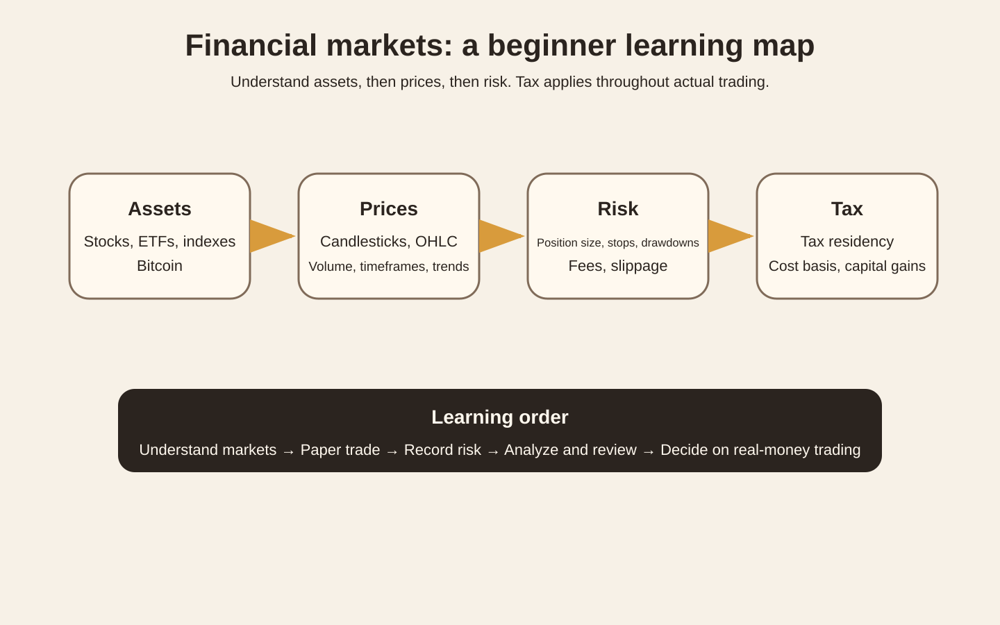
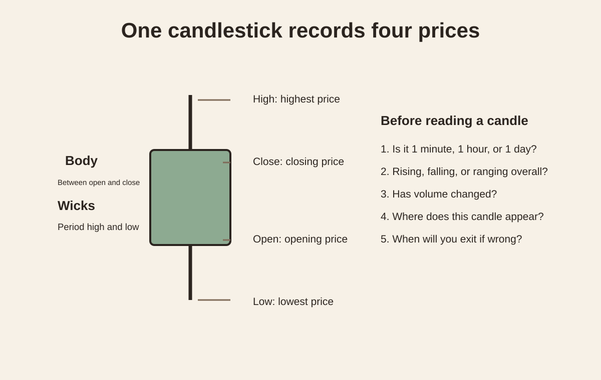
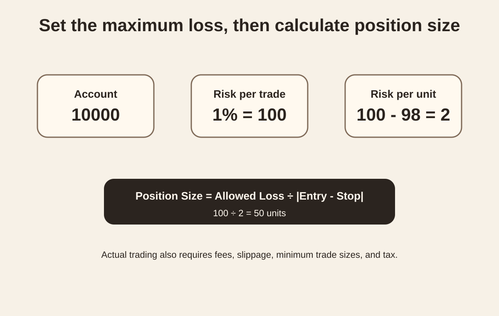

<Callout tone="note" title="Learning goal">
These notes are for beginners. The goal is to understand markets, make charts, calculate risk, and practice simulated orders before deciding whether to trade real money, rather than start by guessing price direction.
</Callout>

## Build the full map first

Figure 1 divides the material into four layers: assets, prices, risk, and tax. Start with assets, then read prices, then manage risk.

What you need to learn falls into four layers.

1. Assets. What stocks, ETFs, indexes, and Bitcoin are.
2. Prices. Candlesticks, OHLC, volume, timeframes, and trends.
3. Risk. Position size, stop-losses, drawdowns, fees, and slippage.
4. Tax. Tax residency, cost basis, capital gains, and reporting rules.

The order matters. Understand assets first, then prices, then risk. Tax runs through actual trading and should not be left until the end.

~~~mermaid
flowchart LR
  A["What is the asset?"] --> B["How does its price change?"]
  B --> C["How do you place a trade?"]
  C --> D["How much can you lose?"]
  D --> E["Paper trading"]
  E --> F["Record and review"]
  F --> G["Analyze at least 50 trades"]
  G --> H["Then decide whether to trade real money"]
~~~

## Distinguish four kinds of things

| Object | What you buy | Main subjects to study | What to learn first |
| --- | --- | --- | --- |
| Stock | A share of ownership in a company | Business, profit, cash flow, valuation, industry | Why a company has value |
| ETF | A share of a fund holding a basket of assets | What it tracks, fees, holdings, liquidity | Index investing and diversification |
| Nasdaq index | The index itself cannot be bought directly | Constituents, weights, index rules | The difference between the Nasdaq Composite and Nasdaq 100 |
| Bitcoin | A digital asset | Supply, network, custody, market structure, regulation | First understand the ledger and transaction mechanism |

The Nasdaq Composite and Nasdaq 100 are different indexes. QQQ tracks the Nasdaq 100. Start with [Nasdaq's official explanation](https://www.nasdaq.com/newsroom/nasdaq-composite-vs-nasdaq-100-what-investors-should-know).

Use [Investor.gov](https://www.investor.gov/introduction-investing) as an introductory reference for stocks, ETFs, and basic investing concepts.

## What a candlestick actually shows

Figure 2 explains only the OHLC structure of a single candlestick. Learn to read the data before studying patterns.

A candlestick has just four core data points:

- Open, the opening price.
- High, the highest price.
- Low, the lowest price.
- Close, the closing price.

The body shows the range between the opening and closing prices. The upper and lower wicks show the highest and lowest prices reached during that period.

A useful judgment requires further questions:

1. Does this candle represent 1 minute, 1 hour, or 1 day?
2. Is the overall market rising, falling, or moving sideways?
3. Has trading volume changed?
4. Where does this candle appear on the chart?
5. If the judgment is wrong, when will you exit?

<Callout tone="warning" title="Do not start by memorizing patterns">
One candlestick cannot tell you the future. Learn to read the data before studying patterns. Do not begin by memorizing dozens of candlestick names.
</Callout>

TradingView's official guide is a suitable first charting lesson: [Introduction to candlestick charts and patterns](https://www.tradingview.com/support/solutions/43000745269-introduction-to-candlestick-charts-and-patterns/).

## Learn position sizing before prediction

Figure 3 uses a simple example to explain position sizing. Decide the allowed loss first, then work backward from the entry and stop prices to the position size.

Suppose the account contains 10000. The planned maximum loss per trade is 1%, or 100.

The entry price is 100 and the stop price is 98, giving a maximum planned loss of 2 per unit.

The theoretical position size is:

$$
\text{Position Size}=\frac{\text{Allowed Loss}}{|\text{Entry}-\text{Stop}|}
$$

Substitution gives 50 units.

Actual trading also needs to account for fees, slippage, minimum trade sizes, and tax.

The purpose of this calculation is simple. You do not need to know whether the next candle will rise or fall before deciding how much you are willing to lose.

## What makes a strategy testable

A strategy should specify at least these conditions:

- Instrument. What you trade.
- Timeframe. Which period you examine.
- Entry. Which conditions must occur together before you enter.
- Invalidation. Which conditions show that the original judgment was wrong.
- Position size. The maximum share of the account you plan to lose on one trade.
- Exit. How you exit winning and losing trades.
- Records. The reasons and results for every trade.

Then calculate expected value:

$$
E=P_{win}\times AvgWin-P_{loss}\times AvgLoss-Cost
$$

Cost includes fees and slippage.

One profitable trade does not establish that a strategy works. One losing trade does not establish that it fails. Statistical meaning requires repeatedly applying the same rules.

Academic research on day trading gives beginners a clear warning. A study of the Brazilian futures market found that the vast majority of people who continued day trading for more than 300 days did not earn positive returns. Long-term research on Taiwan's market also found that only a small proportion of day traders consistently earned excess returns after costs.

Original research:

- [Day Trading for a Living?](https://papers.ssrn.com/sol3/papers.cfm?abstract_id=3423101)
- [The Cross Section of Speculator Skill](https://faculty.haas.berkeley.edu/odean/papers/Day%20Traders/The%20Cross-Section%20of%20Speculator%20Skill.pdf)

This does not mean short-term trading is impossible. It means beginners should establish that their rules work before increasing capital.

## The fastest way to get useful feedback

In the first week, do not use real-money profit as feedback.

Use these verifiable outcomes instead:

- You can explain the differences between stocks, ETFs, indexes, and Bitcoin.
- You can read a candlestick's OHLC.
- You can roughly tell whether a chart is trending or ranging.
- You can write an invalidation condition before placing an order.
- You can calculate position size from account risk.
- You can complete a paper trade and write a review.
- You can record 10 consecutive paper trades without arbitrarily changing the rules.

TradingView includes Paper Trading for practicing orders, stop-losses, take-profits, and position management without real money: [TradingView Paper Trading](https://www.tradingview.com/support/solutions/43000516466-paper-trading-main-functionality/).

## Start today

The first 60 minutes:

1. Use [Investor.gov](https://www.investor.gov/introduction-investing) to understand stocks and ETFs.
2. Read TradingView's official candlestick guide.
3. Manually find 10 candles on a chart and read their OHLC.

The next 60 minutes:

1. Open paper trading.
2. Choose a chart related to the Nasdaq 100.
3. Write an entry hypothesis and an invalidation condition.
4. Place your first paper order.
5. Take a screenshot and record the result.

By the end of today, you should be able to answer:

> What am I buying? Why am I entering here? Where will I exit if I am wrong? What is the maximum loss planned for this trade?

If you cannot answer those four questions clearly, hold off on placing the order.

## A 7-day starter plan

| Day | Topic | Required output that day |
| --- | --- | --- |
| Day 1 | Stocks, ETFs, indexes | Write a concept comparison table |
| Day 2 | Candlesticks and volume | Annotate 20 candles |
| Day 3 | Orders, stop-losses, take-profits | Complete 3 paper orders |
| Day 4 | Position sizing and risk | Complete 10 position-sizing exercises |
| Day 5 | Bitcoin | Explain blocks, ledgers, private keys, and custody |
| Day 6 | Strategies and backtesting | Write your first explicit rule set |
| Day 7 | Review | Organize the first week's trading journal |

## A 30-day path

~~~mermaid
flowchart TD
  A["Week 1 Understand markets"] --> B["Week 2 Paper trading"]
  B --> C["Week 3 Fetch data and plot candles in Python"]
  C --> D["Week 4 Write your first backtest"]
  D --> E["Include fees and slippage"]
  E --> F["Compare win rate, payoff ratio, drawdown, and expected value"]
  F --> G["Decide whether to keep simulating or trade a small amount"]
~~~

### Week 1

Focus only on basic concepts and reading charts.

### Week 2

Simulate 2 to 5 trades each day. Do not delete losses to improve the win rate.

### Week 3

Start using your programming skills.

~~~python
# Learning goals
# 1. Fetch OHLCV
# 2. Plot candlesticks
# 3. Calculate simple returns
# 4. Save a trading journal
~~~

Do not train a prediction model yet. First make sure you understand the raw data and trading costs.

### Week 4

Write your first mechanical rules, such as entering after a breakout above the previous 20-day high, then define explicit exit rules.

Record at least these items in a backtest:

- Total number of trades.
- Win rate.
- Average win.
- Average loss.
- Maximum drawdown.
- Fees.
- Slippage.
- Results after costs.

## How to learn Bitcoin

Do not begin with trade-signal content. First understand why Bitcoin can transfer value and maintain a ledger.

A recommended course is [MIT OpenCourseWare Blockchain and Money](https://ocw.mit.edu/courses/15-s12-blockchain-and-money-fall-2018/resources/lecture-videos/).

Start with:

1. Introduction.
2. Money, Ledgers, and Bitcoin.
3. Blockchain Basics and Cryptography.
4. Technical Challenges.

Afterward, you should be able to explain why Bitcoin and stocks are entirely different asset classes.

## How to start learning tax

Do not memorize a single fixed tax rate. Work through this sequence first:

~~~mermaid
flowchart LR
  A["Tax residency"] --> B["Trading jurisdiction"]
  B --> C["Asset traded"]
  C --> D["Purchase cost"]
  D --> E["Sale proceeds"]
  E --> F["Holding period"]
  F --> G["Income classification"]
  G --> H["Reporting and tax payment"]
~~~

If US tax applies, start with the IRS pages [Topic No. 409 Capital Gains and Losses](https://www.irs.gov/taxtopics/tc409) and [Digital Assets](https://www.irs.gov/businesses/small-businesses-self-employed/digital-assets).

If mainland China tax applies, start with the [State Taxation Administration's policy and regulations database](https://fgk.chinatax.gov.cn/), then confirm the specific rules based on the account, instruments traded, and tax residency.

<Callout tone="warning" title="Tax limits">
Before preparing to trade real money, separately confirm your tax residency and the location of your account. Rules for stocks, ETFs, dividends, capital gains, and digital assets differ widely by region. This article is a learning path, not personal tax advice.
</Callout>

## Read the learning materials in order

1. [Investor.gov Investing Basics](https://www.investor.gov/introduction-investing). For the basics of stocks, funds, risk, and diversification.
2. [Khan Academy Stocks and Bonds](https://www.khanacademy.org/economics-finance-domain/core-finance/stock-and-bonds). For understanding stocks and bonds from scratch.
3. [TradingView Candlestick Charts](https://www.tradingview.com/support/solutions/43000745269-introduction-to-candlestick-charts-and-patterns/). For candlesticks and charting.
4. [TradingView Paper Trading](https://www.tradingview.com/support/solutions/43000516466-paper-trading-main-functionality/). For simulated orders.
5. [MIT Blockchain and Money](https://ocw.mit.edu/courses/15-s12-blockchain-and-money-fall-2018/). For Bitcoin and blockchains.
6. [Howard Marks How to Think About Risk](https://www.oaktreecapital.com/insights/insight-video/education/how-to-think-about-risk-with-howard-marks). For understanding risk.
7. [Damodaran Valuation Online Class](https://pages.stern.nyu.edu/~adamodar/New_Home_Page/webcastvalonline.htm). Read this after reaching the company-valuation stage.

## What to leave alone for now

During the first week, avoid:

- High leverage.
- Contracts and perpetuals.
- Options.
- High-frequency intraday trading.
- Copy-trading groups and paid trade signals.
- Adding more than a dozen technical indicators at once.
- Courses that show only profitable screenshots.
- Supposedly reliable strategies without complete historical trade records.

These topics are not permanently off limits. Studying them now would make you deal with both insufficient market knowledge and complex tools at the same time.

## Your first trading-journal template

Record the following for every paper trade:

| Field | Entry |
| --- | --- |
| Date | |
| Instrument | |
| Timeframe | |
| Entry reason | |
| Invalidation condition | |
| Entry price | |
| Stop price | |
| Planned maximum loss | |
| Position size | |
| Result | |
| Whether the rules were followed | |
| Review | |

## How to judge progress after 30 days

Do not ask only how much you earned.

Check:

- Have you fully recorded at least 50 paper trades using the same rules?
- Is expected value still positive after trading costs?
- Is maximum drawdown within your tolerance?
- Do profits depend on one or two unusually large wins?
- Do the results immediately fail after changing parameters?
- Does the strategy still work on a different period of historical data?

If you cannot answer these questions, keep simulating rather than rush into real-money trading.

## Sources

- [Investor.gov](https://www.investor.gov/introduction-investing)
- [Nasdaq Index Education](https://www.nasdaq.com/newsroom/nasdaq-composite-vs-nasdaq-100-what-investors-should-know)
- [TradingView Candlestick Charts](https://www.tradingview.com/support/solutions/43000745269-introduction-to-candlestick-charts-and-patterns/)
- [TradingView Paper Trading](https://www.tradingview.com/support/solutions/43000516466-paper-trading-main-functionality/)
- [MIT OpenCourseWare Blockchain and Money](https://ocw.mit.edu/courses/15-s12-blockchain-and-money-fall-2018/)
- [Howard Marks Risk Series](https://www.oaktreecapital.com/insights/insight-video/education/how-to-think-about-risk-with-howard-marks)
- [Damodaran Online Valuation Class](https://pages.stern.nyu.edu/~adamodar/New_Home_Page/webcastvalonline.htm)
- [IRS Capital Gains](https://www.irs.gov/taxtopics/tc409)
- [IRS Digital Assets](https://www.irs.gov/businesses/small-businesses-self-employed/digital-assets)
- [State Taxation Administration policy and regulations database](https://fgk.chinatax.gov.cn/)
- [Day Trading for a Living](https://papers.ssrn.com/sol3/papers.cfm?abstract_id=3423101)
- [The Cross Section of Speculator Skill](https://faculty.haas.berkeley.edu/odean/papers/Day%20Traders/The%20Cross-Section%20of%20Speculator%20Skill.pdf)

<Callout tone="tip" title="Next step">
The most useful action is to complete Day 1 and Day 2, then build a genuine paper-trading journal. Later, add more trade records, Python candlestick code, and the results of your first backtest.
</Callout>
