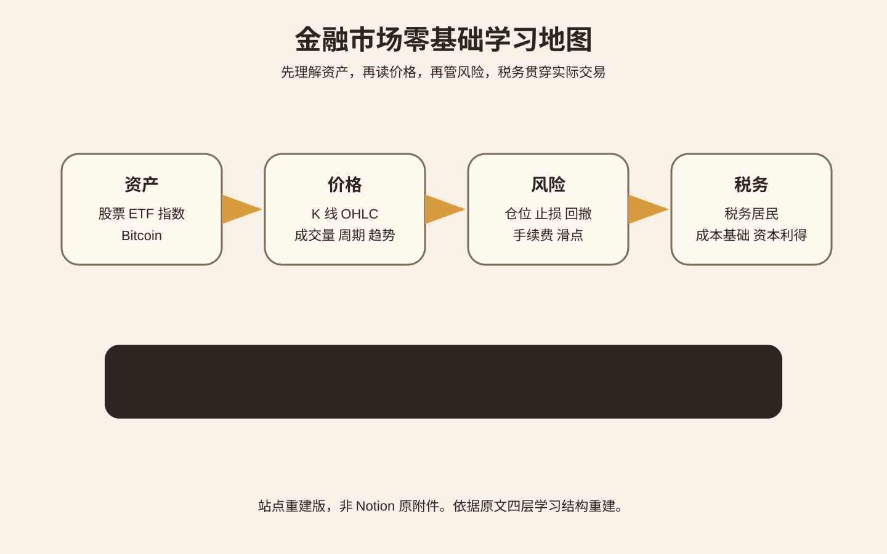
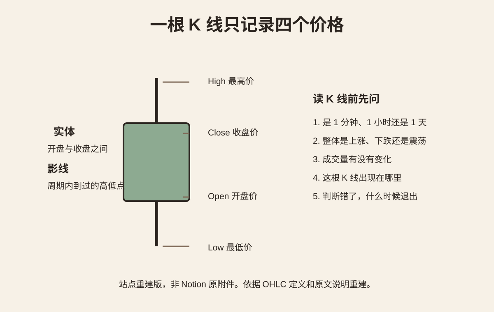
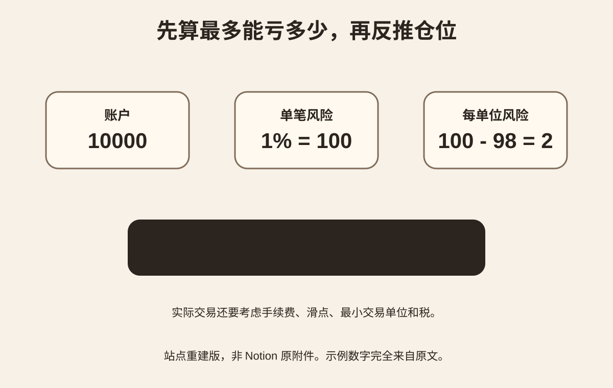

<Callout tone="note" title="学习目标">
这份笔记给零基础使用。目标不是先猜涨跌，而是先看懂市场、能画图、会计算风险、会模拟下单，再决定是否进入实盘。
</Callout>

## 先建立完整地图

图 1 把学习内容分成资产、价格、风险和税务四层，顺序是先理解资产，再读价格，再管理风险。

你现在要学的内容可以分成四层。

1. 资产。股票、ETF、指数、Bitcoin 分别是什么。
2. 价格。K 线、OHLC、成交量、时间周期、趋势。
3. 风险。仓位、止损、回撤、手续费、滑点。
4. 税务。税务居民身份、成本基础、资本利得、申报规则。

顺序很重要。先理解资产，再看价格，再学风险。税务贯穿实际交易，不应该最后才补。

~~~mermaid
flowchart LR
  A["资产是什么"] --> B["价格怎么变化"]
  B --> C["一笔交易怎么下"]
  C --> D["最多能亏多少"]
  D --> E["模拟交易"]
  E --> F["记录与复盘"]
  F --> G["统计 50 笔以上"]
  G --> H["再决定是否实盘"]
~~~

## 四类东西先分清

| 对象 | 你买到的是什么 | 主要研究什么 | 适合先学什么 |
| --- | --- | --- | --- |
| 股票 | 公司所有权的一部分 | 业务、利润、现金流、估值、行业 | 公司为什么值钱 |
| ETF | 一篮子资产组成的基金份额 | 跟踪对象、费用、持仓、流动性 | 指数投资与分散 |
| 纳斯达克指数 | 指数本身不能直接买 | 成分、权重、指数规则 | Nasdaq Composite 与 Nasdaq 100 的区别 |
| Bitcoin | 数字资产 | 供给、网络、托管、市场结构、监管 | 先理解账本和交易机制 |

Nasdaq Composite 和 Nasdaq 100 不是同一个指数。QQQ 跟踪 Nasdaq 100。可以先读 [Nasdaq 官方说明](https://www.nasdaq.com/newsroom/nasdaq-composite-vs-nasdaq-100-what-investors-should-know)。

股票、ETF 和基础投资概念可以使用 [Investor.gov](https://www.investor.gov/introduction-investing) 作为入门词典。

## K 线到底在画什么

图 2 只解释一根 K 线的 OHLC 结构，先学会读数据，再看形态。

一根 K 线只有四个核心数据：

- Open，开盘价。
- High，最高价。
- Low，最低价。
- Close，收盘价。

实体表示开盘价与收盘价之间的区间。上下影线表示这一周期内到过的最高价和最低价。

真正有用的判断必须继续问：

1. 这是 1 分钟、1 小时还是 1 天的 K 线。
2. 当前整体是在上涨、下跌还是震荡。
3. 成交量有没有变化。
4. 这根 K 线出现的位置在哪里。
5. 如果判断错了，什么时候退出。

<Callout tone="warning" title="不要先背形态">
单根 K 线不能告诉你未来。先学会读数据，再学形态。不要一开始背几十种蜡烛图名字。
</Callout>

TradingView 的官方说明适合作为第一篇图形教材：[Introduction to candlestick charts and patterns](https://www.tradingview.com/support/solutions/43000745269-introduction-to-candlestick-charts-and-patterns/)。

## 先学仓位，再学预测

图 3 用一个简单例子说明仓位计算：先确定允许亏损，再根据入场价和止损价反推仓位。

假设账户是 10000。单笔最多计划亏损 1%，也就是 100。

入场价是 100，止损价是 98，每单位最大计划亏损是 2。

理论仓位为：

$$
\text{Position Size}=\frac{\text{Allowed Loss}}{|\text{Entry}-\text{Stop}|}
$$

代入以后得到 50 个单位。

实际交易还要考虑手续费、滑点、最小交易单位和税。

这套计算的意义很简单。你不需要先知道下一根 K 线涨还是跌，才能知道自己最多愿意亏多少。

## 什么叫一套可以验证的策略

一套策略至少要写清这些条件：

- 标的。交易什么。
- 周期。看什么时间周期。
- 入场。什么条件同时出现才进入。
- 失效。什么条件出现说明原判断错了。
- 仓位。单笔最多亏账户的多少。
- 退出。盈利和亏损分别怎么退出。
- 记录。每一笔都保存原因和结果。

然后计算期望值：

$$
E=P_{win}\times AvgWin-P_{loss}\times AvgLoss-Cost
$$

Cost 包含手续费和滑点。

一次挣钱不能证明策略有效。一次亏钱也不能证明策略无效。需要相同规则重复执行，才有统计意义。

研究日内交易的学术资料给新手的提醒很明确。巴西期货市场研究发现，持续进行日内交易超过 300 天的人中，绝大多数没有获得正收益。台湾市场的长期研究也发现，能持续获得扣除费用后超额收益的日内交易者比例很低。

原始研究：

- [Day Trading for a Living?](https://papers.ssrn.com/sol3/papers.cfm?abstract_id=3423101)
- [The Cross Section of Speculator Skill](https://faculty.haas.berkeley.edu/odean/papers/Day%20Traders/The%20Cross-Section%20of%20Speculator%20Skill.pdf)

这不代表短线交易一定不能做。它说明新手应该先证明自己的规则，再扩大资金。

## 最快获得正反馈的方法

第一周先不要把真钱盈利当反馈。

把反馈改成这些可验证结果：

- 能解释股票、ETF、指数和 Bitcoin 的区别。
- 能读懂一根 K 线的 OHLC。
- 能判断图表当前大致是趋势还是震荡。
- 能在下单前写出失效条件。
- 能按账户风险反推仓位。
- 能完成一笔模拟交易并写复盘。
- 能连续记录 10 笔模拟交易而不随意改规则。

TradingView 自带 Paper Trading，可以在不使用真钱的情况下练习订单、止损、止盈和持仓管理：[TradingView Paper Trading](https://www.tradingview.com/support/solutions/43000516466-paper-trading-main-functionality/)。

## 今天就可以开始

前 60 分钟：

1. 用 [Investor.gov](https://www.investor.gov/introduction-investing) 搞清股票和 ETF。
2. 读 TradingView K 线官方说明。
3. 在图表上手工找 10 根 K 线，读出 OHLC。

后 60 分钟：

1. 打开模拟交易。
2. 选择 Nasdaq 100 相关图表。
3. 写一次入场假设和失效条件。
4. 下第一笔模拟单。
5. 截图并记录结果。

今天完成以后，你应该能回答：

> 我买的是什么。我为什么在这里进入。如果错了，我在哪里退出。这一笔最多亏多少。

如果这四句话说不清楚，就暂时不下单。

## 7 天上手计划

| 天数 | 主题 | 当天必须产出 |
| --- | --- | --- |
| Day 1 | 股票、ETF、指数 | 写一张概念对照表 |
| Day 2 | K 线和成交量 | 标注 20 根 K 线 |
| Day 3 | 订单、止损、止盈 | 完成 3 笔模拟订单 |
| Day 4 | 仓位和风险 | 完成 10 道仓位计算 |
| Day 5 | Bitcoin | 解释区块、账本、私钥、托管 |
| Day 6 | 策略和回测 | 写出第一套明确规则 |
| Day 7 | 复盘 | 整理第一周交易日志 |

## 30 天路线

~~~mermaid
flowchart TD
  A["第 1 周 读懂市场"] --> B["第 2 周 模拟交易"]
  B --> C["第 3 周 Python 拉数据和画 K 线"]
  C --> D["第 4 周 写第一套回测"]
  D --> E["加入手续费和滑点"]
  E --> F["比较胜率、盈亏比、回撤、期望值"]
  F --> G["决定继续模拟还是小额实盘"]
~~~

### 第 1 周

只建立基础概念和看盘能力。

### 第 2 周

每天模拟 2 到 5 笔。禁止为了提高胜率删掉亏损记录。

### 第 3 周

开始利用编程优势。

~~~python
# 学习目标
# 1. 获取 OHLCV
# 2. 画 K 线
# 3. 计算简单收益率
# 4. 保存交易日志
~~~

此时先不要训练预测模型。先确保你理解原始数据和交易成本。

### 第 4 周

写第一套机械规则，例如突破过去 20 日高点后进入，再定义明确退出规则。

回测时至少记录：

- 总交易次数。
- 胜率。
- 平均盈利。
- 平均亏损。
- 最大回撤。
- 手续费。
- 滑点。
- 扣除成本后的结果。

## Bitcoin 怎么学

不要先看喊单内容。先搞清楚 Bitcoin 为什么能够转账和记账。

推荐 [MIT OpenCourseWare Blockchain and Money](https://ocw.mit.edu/courses/15-s12-blockchain-and-money-fall-2018/resources/lecture-videos/)。

优先看：

1. Introduction。
2. Money, Ledgers, and Bitcoin。
3. Blockchain Basics and Cryptography。
4. Technical Challenges。

学完以后应该能解释 Bitcoin 和股票为什么是两类完全不同的资产。

## 税务怎么入门

税务不要背一个固定税率。先按下面的链路判断：

~~~mermaid
flowchart LR
  A["税务居民身份"] --> B["交易所在司法辖区"]
  B --> C["交易资产"]
  C --> D["买入成本"]
  D --> E["卖出所得"]
  E --> F["持有时间"]
  F --> G["所得分类"]
  G --> H["申报与缴税"]
~~~

如果涉及美国税务，可以从 IRS 的 [Topic No. 409 Capital Gains and Losses](https://www.irs.gov/taxtopics/tc409) 和 [Digital Assets](https://www.irs.gov/businesses/small-businesses-self-employed/digital-assets) 开始。

如果涉及中国大陆税务，可以先查 [国家税务总局政策法规库](https://fgk.chinatax.gov.cn/)，再根据账户、交易品种和税务居民身份确认具体规则。

<Callout tone="warning" title="税务边界">
真正准备实盘前，需要单独确认税务居民身份和账户所在地。不同地区对股票、ETF、股息、资本利得和数字资产的规则差异很大。本文只是学习路线，不是个人税务建议。
</Callout>

## 学习资料按顺序看

1. [Investor.gov Investing Basics](https://www.investor.gov/introduction-investing)。用途是股票、基金、风险、分散投资基础。
2. [Khan Academy Stocks and Bonds](https://www.khanacademy.org/economics-finance-domain/core-finance/stock-and-bonds)。用途是零基础理解股票和债券。
3. [TradingView Candlestick Charts](https://www.tradingview.com/support/solutions/43000745269-introduction-to-candlestick-charts-and-patterns/)。用途是 K 线和图表。
4. [TradingView Paper Trading](https://www.tradingview.com/support/solutions/43000516466-paper-trading-main-functionality/)。用途是模拟下单。
5. [MIT Blockchain and Money](https://ocw.mit.edu/courses/15-s12-blockchain-and-money-fall-2018/)。用途是 Bitcoin 和区块链。
6. [Howard Marks How to Think About Risk](https://www.oaktreecapital.com/insights/insight-video/education/how-to-think-about-risk-with-howard-marks)。用途是理解风险。
7. [Damodaran Valuation Online Class](https://pages.stern.nyu.edu/~adamodar/New_Home_Page/webcastvalonline.htm)。进入公司估值阶段以后再看。

## 暂时不要碰的东西

第一周先避开：

- 高杠杆。
- 合约和永续。
- 期权。
- 高频日内交易。
- 跟单群和收费喊单。
- 一次堆十几个技术指标。
- 只展示盈利截图的课程。
- 没有完整历史交易记录的所谓稳定策略。

这些内容不是永远不能学。现在学它们会让你同时承担市场知识不足和工具复杂度两个问题。

## 第一份交易日志模板

每一笔模拟交易都记录：

| 字段 | 填写内容 |
| --- | --- |
| 日期 | |
| 标的 | |
| 时间周期 | |
| 入场理由 | |
| 失效条件 | |
| 入场价 | |
| 止损价 | |
| 计划最大亏损 | |
| 仓位 | |
| 结果 | |
| 是否按规则执行 | |
| 复盘 | |

## 30 天以后怎么判断有没有进步

不要只问赚了多少。

检查：

- 是否完整记录至少 50 笔同规则模拟交易。
- 扣除交易成本后期望值是否仍为正。
- 最大回撤是否在自己可以承受的范围。
- 盈利是否依赖一两笔异常大赚。
- 改参数以后结果是否立刻失效。
- 换一段历史数据以后策略是否还能工作。

如果这些问题没有答案，就继续模拟，不急着实盘。

## 资料来源

- [Investor.gov](https://www.investor.gov/introduction-investing)
- [Nasdaq Index Education](https://www.nasdaq.com/newsroom/nasdaq-composite-vs-nasdaq-100-what-investors-should-know)
- [TradingView Candlestick Charts](https://www.tradingview.com/support/solutions/43000745269-introduction-to-candlestick-charts-and-patterns/)
- [TradingView Paper Trading](https://www.tradingview.com/support/solutions/43000516466-paper-trading-main-functionality/)
- [MIT OpenCourseWare Blockchain and Money](https://ocw.mit.edu/courses/15-s12-blockchain-and-money-fall-2018/)
- [Howard Marks Risk Series](https://www.oaktreecapital.com/insights/insight-video/education/how-to-think-about-risk-with-howard-marks)
- [Damodaran Online Valuation Class](https://pages.stern.nyu.edu/~adamodar/New_Home_Page/webcastvalonline.htm)
- [IRS Capital Gains](https://www.irs.gov/taxtopics/tc409)
- [IRS Digital Assets](https://www.irs.gov/businesses/small-businesses-self-employed/digital-assets)
- [国家税务总局政策法规库](https://fgk.chinatax.gov.cn/)
- [Day Trading for a Living](https://papers.ssrn.com/sol3/papers.cfm?abstract_id=3423101)
- [The Cross Section of Speculator Skill](https://faculty.haas.berkeley.edu/odean/papers/Day%20Traders/The%20Cross-Section%20of%20Speculator%20Skill.pdf)

<Callout tone="tip" title="下一步">
最有价值的动作是先完成 Day 1 和 Day 2，然后建立一份真实的模拟交易日志。后续可以继续追加交易记录、Python K 线代码和第一次回测结果。
</Callout>
