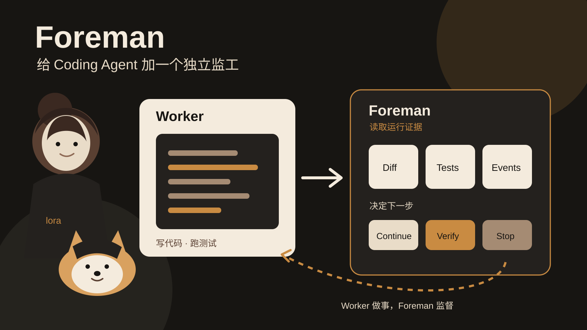

## 核心观点
Coding Agent 自己写代码，又自己判断“是不是已经做完”，会把执行和验收放进同一个决策循环。
Foreman 的做法是把监督单独拿出来。Worker 不需要停下来等待监督者思考。运行事件持续进入独立循环，监督层只看受限证据，再由确定性 policy 决定是否继续、验证、停止或请求人工。
这里最值得研究的不是再增加一个会写代码的 Agent，而是给现有 Agent 加一个独立的控制面。
## 30 秒看懂
给 Foreman 一个 ticket、规格、Bug 或自由文本任务。Codex worker 正常写代码、改文件、跑测试。
同时，Foreman 读取 diff、测试、worker 输出和事件。Jev 判断任务是否完成、测试是否充分、worker 是否卡住或跑偏。Python policy 再决定下一步。
如果需要验证，它启动一个独立 verifier。worker 卡住时可以停止或重试。需要凭证、澄清或人工判断时，它会停下来请求人处理。
## 为什么有意思
大部分 Coding Agent Harness 把“做事”和“判断何时结束”放在同一个 Agent loop 里。Agent 可能在测试没覆盖够时结束，也可能已经完成却继续消耗上下文。
Foreman 没有重写 Codex 的 reason、tool、observe 流程，也不替它选文件和工具。它从外部读取有限证据，只处理更窄的问题，例如是否卡住、是否需要独立验证、是否满足需求。
这个分工让监督策略可以单独测试和调阈值。README 也明确保留了边界：Jev 的判断准确率还没有被证明，误判可能停止正常 worker，也可能放过错误工作。
## 3 个值得借鉴的设计
### 1. Worker 和监督循环分开
Coding Agent 继续执行任务。Foreman 以独立异步循环读事件，不需要 worker 每做一步都停下来等待一个额外模型。
### 2. 模型只判断，Policy 才执行
Jev 输出的是判断结果。停止 worker、启动 verifier、重试或结束任务由 Python policy 决定。可执行动作不直接交给概率模型。
### 3. 监督上下文有明确上限
Foreman 不把整个仓库丢给监督模型。它只提供任务、近期输出、受限 diff、修改文件、测试和事件。README 给这些观察数据设置了明确大小上限。
## 与我的连接
你做 Agent Harness 或 Agent Eval 时，可以把 Foreman 的思路移到自己的 runtime。
例如多 Agent 系统中，不要让执行 Agent 同时决定自己是否完成。单独维护一个 supervisor state，只接收任务状态、工具结果、失败次数、成本、测试和关键事件。监督模型负责判断，真正的 stop、retry、verify 和 escalate 由确定性 policy 执行。
这也可以和 Kitaru 类 replay eval 配合。Foreman 管实时运行中的监督，replay eval 再检查监督策略是否经常误停、漏停或过早结束。

## 来源与事实核验
核验时间：2026-09-17 17:11 UTC-8。
- 项目名称：Foreman。
- 维护方：GitHub 组织 `thruwire`。
- 官方仓库：[thruwire/foreman](https://github.com/thruwire/foreman)。仓库公开且未归档。
- 核心能力：一个 Coding Agent worker 负责实际软件工程任务。Foreman 在独立异步循环中读取运行证据并判断当前工作状态。
- Worker：V1 使用安装在本机的 Codex CLI，通过 `codex exec` 运行任务。README 同时说明 worker 实现可以替换，运行时只依赖一个较小的 worker 协议。
- 监督输入：原始任务、worker 摘要、近期输出、退出状态、耗时、`git status`、受限 diff、修改文件、验证结果和近期事件。
- 判断维度：实现是否完成、测试是否充分、需求是否满足、是否需要验证、是否可以结束，以及当前 worker 是否有进展、是否卡住、是否跑偏、是否需要人工。
- 决策机制：Jev 负责给出判断结果。真正允许的动作由确定性的 Python policy 决定，包括继续、启动 worker、启动独立 verifier、停止、重试、结束和交给人工。
- Demo：仓库提供 `foreman demo --repo .`。README 明确写明该 demo 不需要 API key、网络、Codex 安装或外部仓库。
- 持久化：每次运行保存在 `.foreman/runs/<run-id>/state.json` 和 `events.jsonl`。
- LICENSE：MIT。
- 最近更新时间：2026-09-17 12:32:50 UTC 的提交为 `docs: clarify Foreman introduction`。同日还有 `foreman first release` 提交。
- 当前状态：项目作者明确把它定义为架构实验，不声称已经优于普通 Coding Agent Harness。V1 一次只运行一个 coding worker。本地执行不是安全沙箱。
- 独立官网：本次没有从官方仓库确认到独立官网，因此不写。
## 证据卡
1. [Foreman 官方 README](https://github.com/thruwire/foreman) 说明 worker 与 Foreman 双循环、Jev 判断、确定性 policy、真实 Codex worker、离线 demo、持久化和限制。
2. [MIT LICENSE](https://github.com/thruwire/foreman/blob/main/LICENSE) 核验许可证。
3. [首次发布提交](https://github.com/thruwire/foreman/commit/75619ce25e1634c52a2adc9dff8753823de02fdd) 发生于 2026-09-17。
4. [最新文档提交](https://github.com/thruwire/foreman/commit/2c439828b9fe45ee5d40f6f57be81f7ff1f8a140) 发生于 2026-09-17 12:32:50 UTC。
