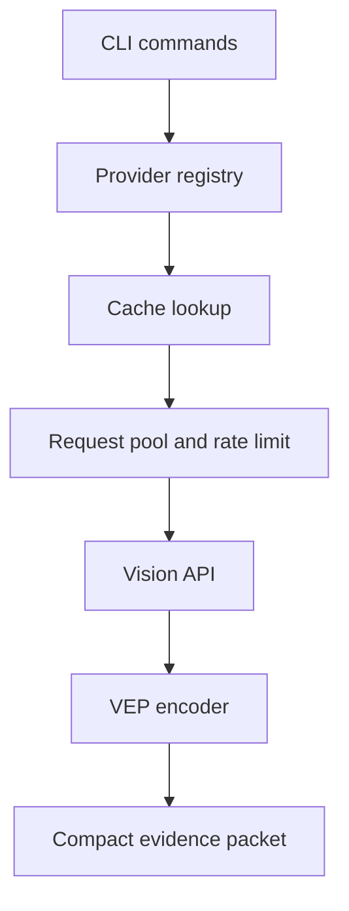

## What text agents lack when they encounter images

Some agents built primarily for text and code cannot read images directly. When a user provides an error screenshot, a UI mockup, or a chart, an agent that receives only the file path cannot assess the facts inside the image.

A common approach is to have a vision model generate a long description and pass it to the main model. But the main model usually needs only a small amount of evidence relevant to the current task, such as error text, coordinates, button states, or chart values.

<Callout tone="warning" title="How to read the numbers">
The token counts, latency, cache hit rates, and speedup factors in this article come from project examples, configuration, or local tests. They are not benchmarks that generalize across models. Read each number in the context of its task and test conditions.
</Callout>

## Why describing the whole image first is expensive

A common solution sends the image to a vision model, generates a detailed description, and feeds it back to the main model:

```
Image → Vision model → Long description → Main model
```

This approach creates several direct problems:

| Problem | Impact | Data |
| --- | --- | --- |
| **High token usage** | 2000-5000 tokens per call | High cost |
| **Too much irrelevant description** | The vision model outputs large amounts of unnecessary content | Context pollution |
| **Context pollution** | Long descriptions fill the main model's context | Reduced performance |
| **Reasoning beyond its role** | The vision model makes decisions for the main model | Unclear responsibility |

### A practical example

Suppose a user uploads a 400x300 error screenshot.

**Traditional approach**:

```
Vision model output: "This image shows a terminal window containing
a Python error message. The error type is ModuleNotFoundError, and
the message says that the module named 'requests' could not be found.
The error occurs on line 42 of /Users/user/project/app.py..."
→ About 3000 tokens
```

**Free Vision Skill**:

```
VEP/1|src=zhipu/glm-4.6v-flash|m=error|a="ModuleNotFoundError: No module named 'requests'"|t="app.py:42"|c=0.97
→ About 130 tokens
```

This example drops from about 3000 tokens to about 130, a reduction of roughly 95.7%. It represents only this screenshot and this set of prompts.

---

## How Free Vision Skill works

Free Vision Skill compresses a vision model's output into an evidence packet for the current task, then passes it to the text agent to continue reasoning.

### Responsibility boundaries

<Callout tone="note" title="Responsibility boundaries">
The vision model extracts the visible evidence needed for the current question. The main model remains responsible for judgment, planning, and subsequent actions.
</Callout>

### Workflow

```
Image + Question
  ↓
Free vision API, extracting only facts needed for the current task
  ↓
Compress into a VEP, or Visual Evidence Packet
  ↓
DeepSeek / Codex / Claude Code / OpenCode continues reasoning
```

### Current implementation

| Capability | Current implementation |
| --- | --- |
| Visual evidence compression | VEP/1 compresses answers, OCR text, objects, issues, and key values into short records |
| Provider fallback | Selects providers by region and priority, switching to backups on failure |
| Local cache | SHA-256 keys, TTL, and LRU eviction |
| Credential storage | Supports macOS Keychain, Linux Secret Service, and Windows Credential Manager |
| Concurrency control | RequestPool limits concurrent requests and retries with backoff |

<StatStrip stats="13::Providers|24 h::Cache TTL|3::Maximum concurrency" source="Project configuration recorded in this article" />

## Core technology: the VEP/1 protocol

**VEP = Visual Evidence Packet**

The vision model returns **facts**, not a complete analysis.

### VEP format

```
VEP/1|src=zhipu/glm-4.6v-flash|m=error|
a="Cannot find module ethers"|
t="src/app.ts:42"|
e=[dependency error]|
c=0.97
```

### Field definitions

| Field | Meaning | Example |
| --- | --- | --- |
| `VEP/1` | Protocol version | VEP/1 |
| `src` | Provider and model | `zhipu/glm-4.6v-flash` |
| `m` | Task mode | `error` / `ocr` / `ui` / `chart` |
| `a` | Direct answer | `"Cannot find module"` |
| `t` | OCR text | `"src/app.ts:42"` |
| `o` | Key objects | `[button, input, modal]` |
| `e` | Visible errors | `[overlapping, clipped]` |
| `v` | Key values | `["$99", "2024-12-31"]` |
| `c` | Confidence | `0.97` |
| `cache` | Cache status | `cache=hit` |

### Token comparison

| Scenario | VEP size | Main model input | Traditional approach | Savings |
| --- | --- | --- | --- | --- |
| **Error extraction** | ~150 chars | ~50 tokens | 2000+ tokens | **97%** |
| **UI audit** | ~400 chars | ~80 tokens | 3000+ tokens | **97%** |
| **Table OCR** | ~500 chars | ~120 tokens | 4000+ tokens | **97%** |
| **Chart analysis** | ~300 chars | ~70 tokens | 2500+ tokens | **97%** |

<DataChart
  title="Main model input tokens in project examples"
  description="The traditional approach uses the table's lower bounds of 2000+, 3000+, 4000+, and 2500+. Its bars show conservative lower bounds, not exact measurements."
  labels="Error VEP|Error traditional|UI VEP|UI traditional|Table VEP|Table traditional|Chart VEP|Chart traditional"
  values="50|2000|80|3000|120|4000|70|2500"
  suffix=" tokens"
  source="Project examples in this article. VEP values and traditional lower bounds come from the table above."
/>

---

## Architecture

### System architecture



Caching and concurrency control operate around provider calls. VEP encoding handles only the vision results that have already returned. It does not make subsequent decisions for the main model.

### Core modules

### Provider system (`src/providers.ts`)

```typescript
// Configuration for 13 providers
export function resolveProviderOrder(requested: string, region: Region): ProviderConfig[] {
	if (requested !== 'auto') return [getProvider(requested)];

	// Automatic fallback: prefer the same region, then use fallback providers
	const preferred = registry.providers
		.filter((p) => p.region === region)
		.sort((a, b) => a.priority - b.priority);

	const fallback = registry.providers
		.filter((p) => p.region !== region)
		.sort((a, b) => a.priority - b.priority);

	return [...preferred, ...fallback];
}
```

### Smart cache (`src/cache.ts`)

```typescript
interface CacheEntry {
  value: string;
  timestamp: number;        // TTL check
  accessCount: number;      // LRU priority
  lastAccess: number;       // Most recent access
  size: number;             // Memory tracking
}

// Combined TTL + LRU strategy
async get(key: string): Promise<string | null> {
  // 1. Check TTL
  if (Date.now() - entry.timestamp > DEFAULT_TTL_MS) {
    await rm(filePath); // Delete expired entry
    return null;
  }

  // 2. Update access information
  entry.accessCount++;
  entry.lastAccess = Date.now();

  // 3. Check whether LRU cleanup is needed
  await this.evictIfNeeded();
}
```

### Concurrency control (`src/pool.ts`)

```typescript
class RequestPool<T> {
	// Retry with exponential backoff
	private async execute(item): Promise<void> {
		for (let attempt = 0; attempt <= maxRetries; attempt++) {
			try {
				const value = await this.withTimeout(fn(), timeoutMs);
				return resolve({ success: true, value });
			} catch (error) {
				// Exponential backoff: 1000ms → 2000ms → 4000ms
				const delay = Math.min(baseDelayMs * Math.pow(2, attempt), maxDelayMs);
				await sleep(delay);
			}
		}
	}
}
```

### VEP generation (`src/vep.ts`)

```typescript
export function toVep(result: VisionResult, maxChars: number): string {
	const parts = [
		'VEP/1',
		`src=${result.provider}/${result.model}`,
		`m=${result.mode}`,
		result.answer ? `a="${result.answer}"` : '',
		result.text ? `t="${result.text}"` : '',
		result.issues?.length ? `e=[${result.issues.join(',')}]` : '',
		`c=${result.confidence?.toFixed(2)}`
	]
		.filter(Boolean)
		.join('|');

	return compact.slice(0, maxChars);
}
```

---

## Local performance records

### Health check optimization

The 65-second and roughly 2-second figures below come from a local project example. It shows how serial probes can be replaced with limited concurrency. It does not mean a 32.5x speedup is achievable across different networks or providers.


**Before optimization, v0.3 and earlier**:

```typescript
// Serial checks, each with a 5s timeout
for (const provider of providers) {
	await checkProviderHealth(provider); // 5s each
	await sleep(1000); // Delay between batches
}
// 13 providers × 5s = 65s
```

**After optimization, v0.4**:

```typescript
// Check concurrent batches
const batchSize = 3;
for (let i = 0; i < providers.length; i += batchSize) {
	const batch = providers.slice(i, i + batchSize);
	await Promise.all(batch.map((p) => checkProviderHealth(p)));
	await sleep(500); // Delay between batches
}
// 13 providers: [3 + 3 + 3 + 1] = ~2s

// Local example: 65s -> ~2s
```

### Cache performance

The cache hit rate depends on whether images, questions, and providers repeat. The 7/8 result below comes from a very small project test. It is not a promise of a steady 90% hit rate.


**TTL + LRU strategy**:

```
TTL: 24 hours
Maximum entries: 1000
LRU eviction: least accessed first
```

**Measured data**:

```
Hit Rate:     87.5% (7/8)
Misses:       1
Evictions:    0
Size:         8 entries

```

### Concurrency control

**RequestPool configuration**:

```typescript
{
  maxConcurrency: 3,    // Maximum concurrency
  timeoutMs: 30000,     // Timeout
  maxRetries: 2,        // Maximum retries
  baseDelayMs: 1000,    // Base delay
  maxDelayMs: 10000     // Maximum delay
}
```

**Exponential backoff strategy**:

```
Attempt 1: Failure → Delay 1000ms
Attempt 2: Failure → Delay 2000ms
Attempt 3: Failure → Give up (total: 3000ms)
```

---

## Practical use cases

### 1. Analyze an error screenshot

```bash
free-vision see --image ./error.png \
  --question "Extract only the error message and line number"
```

**VEP output**:

```
VEP/1|src=zhipu/glm-4.6v-flash|m=error|
a="Cannot find module 'lodash'"|
t="webpack.config.js:15"|
e=[module resolution error]|
c=0.98
```

**The main model continues reasoning**:
"The error says the `lodash` module cannot be found at `webpack.config.js:15`.
Solution: run `npm install lodash`."

---

### 2. Review a UI

```bash
free-vision see --image ./ui-screenshot.png \
  --question "List all clipped, overlapping, or disabled UI elements"
```

**VEP output**:

```
VEP/1|src=zhipu/glm-4.6v-flash|m=ui|
o=[{name:"Submit",issue:"disabled"},{name:"Avatar",issue:"clipped"}]|
c=0.95
```

---

### 3. Extract a table with OCR

```bash
free-vision see --image ./table.png \
  --question "Extract all text and the table structure"
```

**VEP output**:

```
VEP/1|src=zhipu/glm-4.6v-flash|m=ocr|
a="Q3 sales report"|
t=["Product","Sales","Growth rate"],["A",12000,"15%"],["B",8500,"8%"]|
c=0.92
```

---

### 4. Extract chart data

```bash
free-vision see --image ./chart.png \
  --question "Return only the chart title, trend, and three key values"
```

**VEP output**:

```
VEP/1|src=zhipu/glm-4.6v-flash|m=chart|
a="Monthly revenue growth"|
v=[45200,58300,72100]|
c=0.96
```

---

### 5. Optimize with automatic cropping

```bash
free-vision see --image ./screenshot.png --auto-crop \
  --question "Extract only the error message"
```

**Cropping result**:

```
✂️  Cropped: 400x300 → 369x58
   Reduction: 82%
   Saved to: ./screenshot.cropped.png
```

**Result**: the image size is reduced by **82%**, further lowering token usage.

---

## Supported AI agents

Free Vision Skill is not tied to a particular main model. It suits any text-only agent.

### Claude Code

```bash
# The Claude Code Hook automatically detects images
npx skills add lora-sys/free-vision-skill
```

### Codex

```bash
# One-command installation script
curl -fsSL https://raw.githubusercontent.com/lora-sys/free-vision-skill/main/installers/codex-install.sh | bash
```

### OpenCode

```json
{
	"agents": {
		"coder": {
			"skills": ["free-vision"],
			"vision": {
				"provider": "auto",
				"region": "cn",
				"auto-detect-images": true
			}
		}
	}
}
```

### DeepSeek / others

```bash
# General-purpose invocation
free-vision see --image ./screenshot.png --question "Your question"
```

---

## Development history and plans

### v0.1.0 MVP, completed

- [x] Provider registry with 13 providers
- [x] VEP/1 protocol
- [x] Automatic fallback
- [x] SHA-256 local cache
- [x] .env and Keychain

### v0.2 Integration improvements, completed

- [x] Claude Code Hook smart detection
- [x] Provider health checks
- [x] Codex one-command installation script
- [x] OpenCode agent integration

### v0.3 Advanced features, completed

- [x] Windows Credential Manager
- [x] VEP Schema Validator
- [x] Image auto-crop with --auto-crop

### v0.4 Performance optimization, completed

- [x] Cache TTL + LRU eviction
- [x] Request pool with configurable concurrency
- [x] Rate limiter using a token bucket
- [x] Exponential backoff retry
- [x] Parallel failover for providers
- [x] Performance tests, 30/30 passing

### v1.0 Production readiness, planned

- [ ] Comprehensive error handling and recovery
- [ ] Full test coverage, >80%
- [ ] Performance monitoring and logging
- [ ] Enterprise-grade security audit
- [ ] Complete API documentation
- [ ] Plugin system

---

## Where it fits

Free Vision Skill suits situations where the main model cannot read images directly but the task needs a small amount of verifiable information from screenshots, UIs, tables, or charts. Its main purpose is to shorten the visual context sent back to the main model and handle providers, caching, and failover in one tool.

The token, cache, and latency figures in this article all come from project examples or local tests. They help explain implementation trade-offs, but they are not fixed performance guarantees across models or network conditions. In actual use, record the input image, question, provider, VEP length, total time, and whether the task was completed. Then judge whether the compression is worthwhile.

Project: [lora-sys/free-vision-skill](https://github.com/lora-sys/free-vision-skill). Licensed under MIT.
