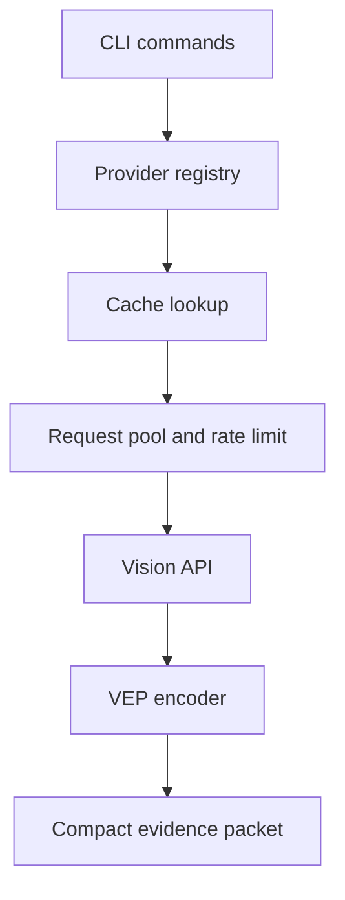

## 文本 Agent 遇到图片时缺什么

一些以文本和代码为主的 Agent 不能直接读取图片。用户给出报错截图、UI 设计稿或图表时，Agent 如果只拿到文件路径，就无法继续判断图片里的事实。

常见做法是让视觉模型先生成一段长描述，再交给主模型。但主模型通常只需要和当前任务有关的少量证据，例如错误文本、坐标、按钮状态或图表数值。

<Callout tone="warning" title="数字口径">
本文中的 token、时延、缓存命中率和加速倍数来自项目样例、配置或本地测试，不是跨模型通用基准。阅读这些数字时应同时看具体任务和测试条件。
</Callout>

## 为什么整张图先转成长描述成本高

常见的解决方案是把图片交给视觉模型，生成一段详细描述，再塞回主模型：

```
图片 → 视觉模型 → 长描述 → 主模型
```

但这种方法会带来几个直接问题：

| 问题                | 影响                         | 数据       |
| ------------------- | ---------------------------- | ---------- |
| **Token 消耗高** | 每次调用 2000-5000 tokens    | 成本高     |
| **无关描述多**   | 视觉模型输出大量不需要的内容 | 上下文污染 |
| **上下文污染**   | 主模型上下文被长描述占满     | 性能下降   |
| **越权推理**     | 视觉模型替主模型做决策       | 责任不清   |

### 举个实际例子

当用户上传一张 400x300 的错误截图时：

**传统方案**:

```
视觉模型输出: "这张图片显示了一个终端窗口，其中包含一个 Python
错误信息。错误类型是 ModuleNotFoundError，具体信息是无法找到
名为 'requests' 的模块。错误发生在文件 /Users/user/project/app.py
的第 42 行..."
→ 约 3000 tokens
```

**Free Vision Skill**:

```
VEP/1|src=zhipu/glm-4.6v-flash|m=error|a="ModuleNotFoundError: No module named 'requests'"|t="app.py:42"|c=0.97
→ 约 130 tokens
```

这个示例从约 3000 tokens 降到约 130 tokens，约减少 95.7%。它只代表这张截图和这组提示词。

---

## Free Vision Skill 的做法

Free Vision Skill 把视觉模型的输出压缩成面向当前任务的证据包，再交给文本 Agent 继续推理。

### 职责边界

<Callout tone="note" title="职责边界">
视觉模型负责提取当前问题需要的可见证据。主模型继续负责判断、规划和后续动作。
</Callout>

### 工作流程

```
图片 + 问题
  ↓
免费视觉 API（只提取当前任务需要的事实）
  ↓
压缩为 VEP（Visual Evidence Packet）
  ↓
DeepSeek / Codex / Claude Code / OpenCode 继续推理
```

### 当前实现

| 能力 | 当前实现 |
| --- | --- |
| 视觉证据压缩 | VEP/1 把回答、OCR 文本、对象、问题和关键值压成短记录 |
| Provider fallback | 按区域与优先级选择 Provider，失败时切换备用项 |
| 本地缓存 | SHA-256 key，TTL 与 LRU 淘汰 |
| 凭据存储 | 支持 macOS Keychain、Linux Secret Service 和 Windows Credential Manager |
| 并发控制 | RequestPool 限制同时请求数并做退避重试 |

<StatStrip stats="13::Provider 数量|24 h::缓存 TTL|3::最大并发" source="本文记录的项目配置" />

## 核心技术：VEP/1 协议

**VEP = Visual Evidence Packet（视觉证据包）**

视觉模型不返回完整分析，只返回**事实**：

### VEP 格式

```
VEP/1|src=zhipu/glm-4.6v-flash|m=error|
a="Cannot find module ethers"|
t="src/app.ts:42"|
e=[dependency error]|
c=0.97
```

### 字段说明

| 字段    | 含义            | 示例                             |
| ------- | --------------- | -------------------------------- |
| `VEP/1` | 协议版本        | VEP/1                            |
| `src`   | Provider 和模型 | `zhipu/glm-4.6v-flash`           |
| `m`     | 任务模式        | `error` / `ocr` / `ui` / `chart` |
| `a`     | 直接答案        | `"Cannot find module"`           |
| `t`     | OCR 文本        | `"src/app.ts:42"`                |
| `o`     | 关键对象        | `[button, input, modal]`         |
| `e`     | 可见错误        | `[overlapping, clipped]`         |
| `v`     | 关键值          | `["$99", "2024-12-31"]`          |
| `c`     | 置信度          | `0.97`                           |
| `cache` | 缓存状态        | `cache=hit`                      |

### Token 对比

| 场景         | VEP 大小   | 主模型接收  | 传统方案     | 节省       |
| ------------ | ---------- | ----------- | ------------ | ---------- |
| **错误提取** | ~150 chars | ~50 tokens  | 2000+ tokens | **97%** ⬇️ |
| **UI 审计**  | ~400 chars | ~80 tokens  | 3000+ tokens | **97%** ⬇️ |
| **OCR 表格** | ~500 chars | ~120 tokens | 4000+ tokens | **97%** ⬇️ |
| **图表分析** | ~300 chars | ~70 tokens  | 2500+ tokens | **97%** ⬇️ |

<DataChart
  title="项目样例中的主模型输入 token"
  description="传统方案使用表格中 2000+、3000+、4000+、2500+ 的下限绘制，因此柱长是保守下限，不是精确测量。"
  labels="错误 VEP|错误 传统|UI VEP|UI 传统|表格 VEP|表格 传统|图表 VEP|图表 传统"
  values="50|2000|80|3000|120|4000|70|2500"
  suffix=" tokens"
  source="本文项目样例。VEP 数值和传统方案下限来自上表。"
/>

---

## 架构设计

### 系统架构



缓存和并发控制位于 Provider 调用前后。VEP 编码只处理已经返回的视觉结果，不负责替主模型做后续决策。

### 核心模块

### Provider System (`src/providers.ts`)

```typescript
// 13 个 Provider 配置
export function resolveProviderOrder(requested: string, region: Region): ProviderConfig[] {
	if (requested !== 'auto') return [getProvider(requested)];

	// 自动降级：优先同区域，然后 fallback
	const preferred = registry.providers
		.filter((p) => p.region === region)
		.sort((a, b) => a.priority - b.priority);

	const fallback = registry.providers
		.filter((p) => p.region !== region)
		.sort((a, b) => a.priority - b.priority);

	return [...preferred, ...fallback];
}
```

### 智能缓存 (`src/cache.ts`)

```typescript
interface CacheEntry {
  value: string;
  timestamp: number;        // TTL 检查
  accessCount: number;      // LRU 优先级
  lastAccess: number;       // 最近访问
  size: number;             // 内存追踪
}

// TTL + LRU 双重策略
async get(key: string): Promise<string | null> {
  // 1. 检查 TTL
  if (Date.now() - entry.timestamp > DEFAULT_TTL_MS) {
    await rm(filePath); // 过期删除
    return null;
  }

  // 2. 更新访问信息
  entry.accessCount++;
  entry.lastAccess = Date.now();

  // 3. 检查是否需要 LRU 清理
  await this.evictIfNeeded();
}
```

### 并发控制 (`src/pool.ts`)

```typescript
class RequestPool<T> {
	// 指数退避重试
	private async execute(item): Promise<void> {
		for (let attempt = 0; attempt <= maxRetries; attempt++) {
			try {
				const value = await this.withTimeout(fn(), timeoutMs);
				return resolve({ success: true, value });
			} catch (error) {
				// 指数退避: 1000ms → 2000ms → 4000ms
				const delay = Math.min(baseDelayMs * Math.pow(2, attempt), maxDelayMs);
				await sleep(delay);
			}
		}
	}
}
```

### VEP 生成 (`src/vep.ts`)

```typescript
export function toVep(result: VisionResult, maxChars: number): string {
	const parts = [
		'VEP/1',
		`src=${result.provider}/${result.model}`,
		`m=${result.mode}`,
		result.answer ? `a="${result.answer}"` : '',
		result.text ? `t="${result.text}"` : '',
		result.issues?.length ? `e=[${result.issues.join(',')}]` : '',
		`c=${result.confidence?.toFixed(2)}`
	]
		.filter(Boolean)
		.join('|');

	return compact.slice(0, maxChars);
}
```

---

## 本地性能记录

### 健康检查优化

下面的 65 秒和约 2 秒来自项目中的本地样例。它说明串行探测可以改成有限并发，不代表不同网络或 Provider 条件下都能得到 32.5 倍提升。


**优化前**（v0.3 及以前）:

```typescript
// 串行检查，每个 5s timeout
for (const provider of providers) {
	await checkProviderHealth(provider); // 5s each
	await sleep(1000); // 批次延迟
}
// 13 个 provider × 5s = 65s
```

**优化后**（v0.4）:

```typescript
// 并发批次检查
const batchSize = 3;
for (let i = 0; i < providers.length; i += batchSize) {
	const batch = providers.slice(i, i + batchSize);
	await Promise.all(batch.map((p) => checkProviderHealth(p)));
	await sleep(500); // 批次延迟
}
// 13 个 provider: [3 + 3 + 3 + 1] = ~2s

// 本地样例: 65s -> ~2s
```

### 缓存性能

缓存命中率取决于图片、问题和 Provider 是否重复。下面的 7/8 只是一组很小的项目测试，不把它写成稳定的 90% 命中率承诺。


**TTL + LRU 策略**:

```
TTL: 24 小时
最大条目: 1000
LRU 淘汰: 最少访问优先
```

**实测数据**:

```
Hit Rate:     87.5% (7/8)
Misses:       1
Evictions:    0
Size:         8 entries

```

### 并发控制

**RequestPool 配置**:

```typescript
{
  maxConcurrency: 3,    // 最大并发
  timeoutMs: 30000,     // 超时时间
  maxRetries: 2,        // 最大重试
  baseDelayMs: 1000,    // 基础延迟
  maxDelayMs: 10000     // 最大延迟
}
```

**指数退避策略**:

```
尝试 1: 失败 → 延迟 1000ms
尝试 2: 失败 → 延迟 2000ms
尝试 3: 失败 → 放弃 (total: 3000ms)
```

---

## 实际使用场景

### 1. 错误截图分析

```bash
free-vision see --image ./error.png \
  --question "只提取错误信息和行号"
```

**VEP 输出**:

```
VEP/1|src=zhipu/glm-4.6v-flash|m=error|
a="Cannot find module 'lodash'"|
t="webpack.config.js:15"|
e=[module resolution error]|
c=0.98
```

**主模型继续推理**:
"错误是找不到 `lodash` 模块，在 `webpack.config.js:15`。
解决方案：运行 `npm install lodash`"

---

### 2. UI 审查

```bash
free-vision see --image ./ui-screenshot.png \
  --question "列出所有被裁切、重叠或禁用的 UI 元素"
```

**VEP 输出**:

```
VEP/1|src=zhipu/glm-4.6v-flash|m=ui|
o=[{name:"Submit",issue:"disabled"},{name:"Avatar",issue:"clipped"}]|
c=0.95
```

---

### 3. OCR 表格提取

```bash
free-vision see --image ./table.png \
  --question "提取所有文本和表格结构"
```

**VEP 输出**:

```
VEP/1|src=zhipu/glm-4.6v-flash|m=ocr|
a="Q3 销售报表"|
t=["产品","销售额","增长率"],["A",12000,"15%"],["B",8500,"8%"]|
c=0.92
```

---

### 4. 图表数据提取

```bash
free-vision see --image ./chart.png \
  --question "只返回图表标题、趋势和三个关键值"
```

**VEP 输出**:

```
VEP/1|src=zhipu/glm-4.6v-flash|m=chart|
a="月度营收增长"|
v=[45200,58300,72100]|
c=0.96
```

---

### 5. 自动裁剪优化

```bash
free-vision see --image ./screenshot.png --auto-crop \
  --question "只提取错误信息"
```

**裁剪结果**:

```
✂️  Cropped: 400x300 → 369x58
   Reduction: 82%
   Saved to: ./screenshot.cropped.png
```

**效果**: 图片大小减少 **82%**，进一步降低 token 消耗。

---

## 支持的 AI Agent

Free Vision Skill 不绑定某个主模型，适合所有文本-only 的 Agent：

### Claude Code

```bash
# Claude Code Hook 自动检测图片
npx skills add lora-sys/free-vision-skill
```

### Codex

```bash
# 一键安装脚本
curl -fsSL https://raw.githubusercontent.com/lora-sys/free-vision-skill/main/installers/codex-install.sh | bash
```

### OpenCode

```json
{
	"agents": {
		"coder": {
			"skills": ["free-vision"],
			"vision": {
				"provider": "auto",
				"region": "cn",
				"auto-detect-images": true
			}
		}
	}
}
```

### DeepSeek / 其他

```bash
# 通用调用
free-vision see --image ./screenshot.png --question "你的问题"
```

---

## 开发历程与未来规划

### v0.1.0 — MVP（已完成）

- [x] Provider registry（13 个 Provider）
- [x] VEP/1 协议
- [x] Auto-fallback 降级
- [x] SHA-256 本地缓存
- [x] .env 和 Keychain

### v0.2 — 集成增强版（已完成）

- [x] Claude Code Hook 智能识别
- [x] Provider 健康检查
- [x] Codex 一键安装脚本
- [x] OpenCode Agent 集成

### v0.3 — 高级功能（已完成）

- [x] Windows Credential Manager
- [x] VEP Schema Validator
- [x] Image auto-crop（--auto-crop）

### v0.4 — 性能优化（已完成）

- [x] Cache TTL + LRU eviction
- [x] Request pool with configurable concurrency
- [x] Rate limiter（token bucket）
- [x] Exponential backoff retry
- [x] Parallel failover for providers
- [x] Performance tests（30/30 passing）

### v1.0 — 生产就绪（规划中）

- [ ] 全面的错误处理和恢复
- [ ] 完整的测试覆盖（>80%）
- [ ] 性能监控和日志
- [ ] 企业级安全审计
- [ ] 完整的 API 文档
- [ ] 插件系统

---

## 适用边界

Free Vision Skill 适合主模型本身不直接读取图片，但任务又需要从截图、UI、表格或图表中取得少量可验证信息的场景。它的主要作用是缩短送回主模型的视觉上下文，并把 Provider、缓存和失败切换收在一个工具里。

文中的 token、缓存和时延数字都来自项目样例或本地测试。它们可以说明实现取舍，但不能作为跨模型、跨网络条件的固定性能承诺。真正使用时应记录输入图片、问题、Provider、VEP 长度、总耗时和任务是否完成，再判断压缩是否值得。

项目地址：[lora-sys/free-vision-skill](https://github.com/lora-sys/free-vision-skill)。许可证为 MIT。
