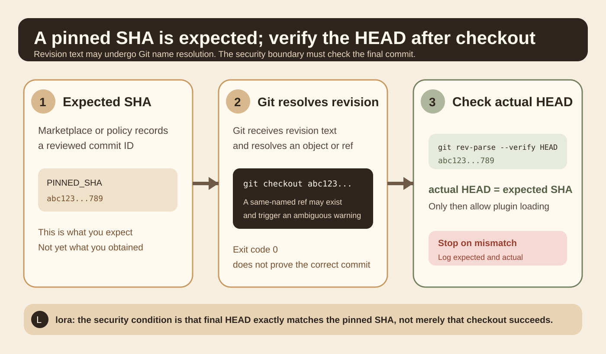
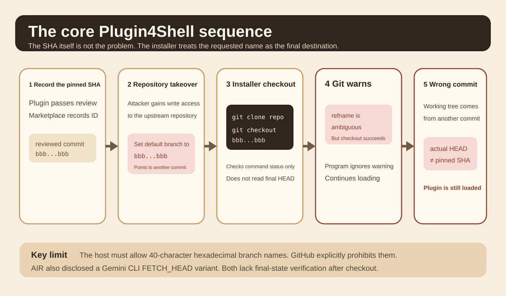
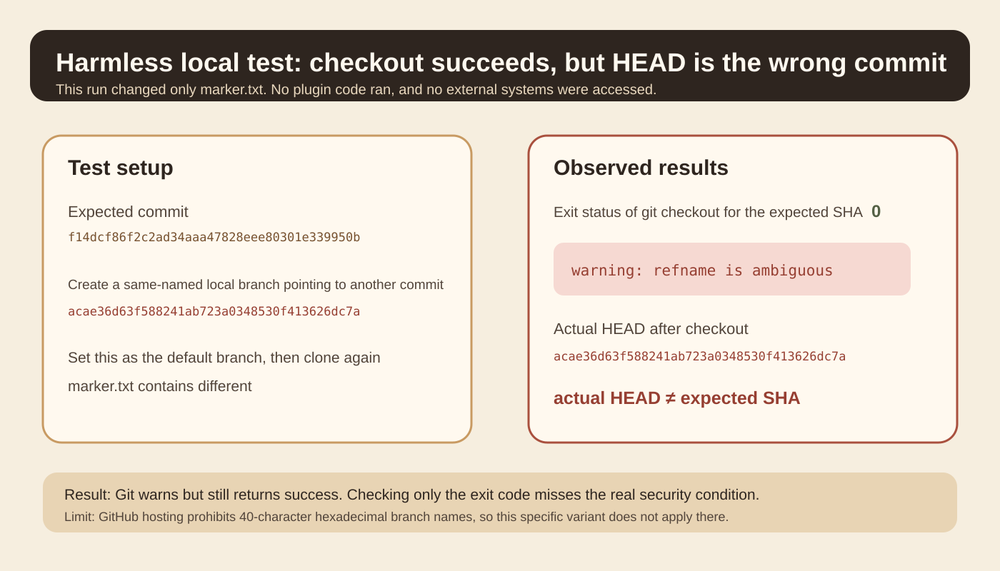
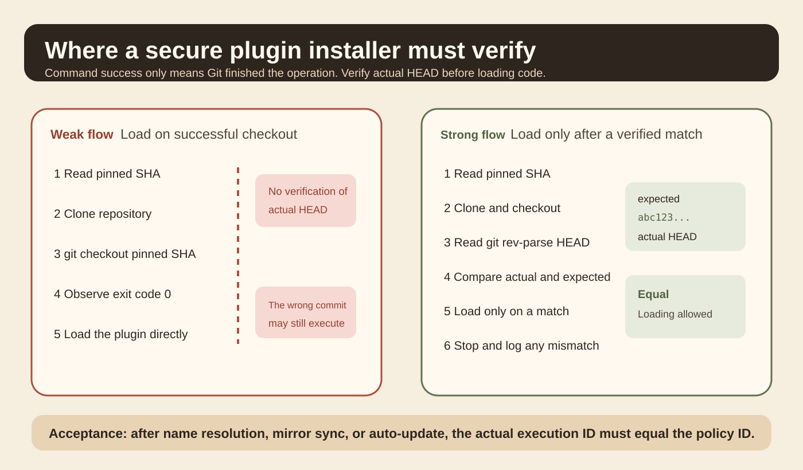

You install a plugin for a coding agent. Your team has reviewed its code and pinned it to a full Git commit SHA. A few days later, someone takes control of the upstream repository. Intuitively, as long as the pinned SHA stays unchanged, the installer should always retrieve that reviewed code.

On September 17, 2026, AIR Security disclosed [Plugin4Shell](https://www.air.security/blog-posts/plugin4shell). Researchers found that several coding agent plugin installers recorded a pinned SHA but did not check which commit the working tree actually reached after checkout. An attacker who controlled the plugin repository could exploit ambiguity in Git name resolution: the installer requested text that looked like a commit ID, but ended up at code pointed to by another ref.

First, the scope. AIR discovered the vulnerability. The affected-product scope, vendor fix status, and zero-click descriptions are conclusions from AIR's disclosure. This article checks the key mechanism against official Git documentation, a harmless local reproduction, and GitHub's official restrictions. It does not present AIR's vendor-related claims as independently verified results.

## Why a pinned SHA is not enough

Suppose a marketplace records the plugin version as `bbb...bbb`. That value is supposed to identify a reviewed commit.

A common installer first clones the repository, then runs:

```bash
git checkout bbbbbbbbbbbbbbbbbbbbbbbbbbbbbbbbbbbbbbbb
```

Many installers treat the version as pinned at this point. Exit code 0 says checkout succeeded. The problem is that the installer checked whether the command succeeded without checking whether the final `HEAD` is the expected commit.

The official [git rev-parse documentation](https://git-scm.com/docs/git-rev-parse) explicitly says that a Git revision can be a full object ID or a refname. Git also defines refname resolution rules. Once SHA-looking text enters a Git command, its appearance alone does not establish which object will be resolved.



Figure 1 separates three things: the expected SHA recorded by policy, Git's resolution of the revision text, and the actual `HEAD` after checkout. The security condition belongs at the third layer.

## What Plugin4Shell exploited

One variant in AIR's disclosure targeted plugin installation in Claude Code, Codex, and GitHub Copilot. The researchers described a key sequence: the installer clones the plugin repository and then checks out the SHA pinned in the marketplace.

The attacker first needs control of the upstream plugin repository. They then create a branch whose name exactly matches the pinned SHA, point that branch at different code, and make it the default branch. Cloning brings that same-named branch into the local repository. When the installer runs `git checkout <pinned sha>`, Git reports `refname is ambiguous`, but the command may still succeed.

AIR's key observation was not that the SHA had changed. The pinned commit can remain in place. The problem is that nothing enforces equality between the text the installer requested and its final destination.



AIR also disclosed a different variant in Gemini CLI. It first fetches the pinned commit, then runs `git checkout FETCH_HEAD`. Git's official documentation explains that `FETCH_HEAD` is itself a special reference name used by Git. In AIR's test, if the default branch was also named `FETCH_HEAD`, checkout could end up on the branch rather than the commit just fetched.

The variants look different but share the same error. The program trusts the name it requested without checking which commit it actually occupies.

## This cannot be reproduced on every Git hosting platform

GitHub's official [branch and tag naming documentation](https://docs.github.com/en/get-started/using-git/dealing-with-special-characters-in-branch-and-tag-names) explicitly prohibits pushing names that look like Git object IDs: branch or tag names made of exactly 40 hexadecimal characters. The restriction prevents confusion with real object IDs.

The specific 40-character SHA-named branch variant described by AIR therefore cannot be created directly in a GitHub-hosted repository. AIR notes that other hosting environments and self-hosted Git services that allow such branch names may still meet this condition.

This is a necessary limit when reading security research. Reproducibility in one Git environment does not establish that every GitHub repository can be attacked this way. A public disclosure also does not establish widespread real-world exploitation.

## A harmless local reproduction

To confirm the key Git behavior, the original article ran an experiment in a temporary local repository without executing any external code.

The first commit's full SHA was:

`f14dcf86f2c2ad34aaa47828eee80301e339950b`

The second commit's full SHA was:

`acae36d63f588241ab723a0348530f413626dc7a`

The experiment created a local branch named exactly after the first SHA, pointed it to the second commit, and made it the default branch. After a fresh clone, it ran:

```bash
git checkout f14dcf86f2c2ad34aaa47828eee80301e339950b
```

There were two observed results. Git printed a `refname is ambiguous` warning, but the exit status was still 0. Running `git rev-parse HEAD` afterward returned the second commit, `acae36...`, rather than the expected `f14dcf...`. The working tree's `marker.txt` also contained content from the second commit.



This experiment establishes only one Git resolution behavior. In some Git environments, a successful checkout command does not mean the final `HEAD` matches the input SHA. It does not establish that any particular product remains exploitable today.

## What a real fix should check

AIR's core fix is small. After checkout, read the actual `HEAD` and compare it strictly with the pinned SHA. If they differ, stop loading.

A minimal final-state assertion can be written as:

```bash
actual="$(git rev-parse --verify HEAD)"
test "$actual" = "$PINNED_SHA" || exit 1
```

This is not a complete installer or a line-by-line copy of a vendor patch. It expresses one invariant: before the plugin reaches execution, the actual commit must equal the commit recorded by policy.

Git's official documentation presents `git rev-parse --verify HEAD` as a standard way to read the current commit's object name. For externally supplied revisions, it also recommends measures such as `--end-of-options` to reduce argument-parsing problems.



## Where this principle transfers

The first principle is to separate names from identity. Git branch names, tag names, `HEAD`, and `FETCH_HEAD` are names or references. A commit SHA is closer to object identity. Container tags and image digests have a similar relationship, as do a model repository's `latest` tag and a pinned file hash.

The second is that pinning and verification are different operations. Pinning records what the system expects. Verification establishes what it actually obtained. A pin without verification is just configuration data.

The third is to place supply-chain checks close to the execution boundary. A marketplace may record a reviewed version, but the client actually clones, checks out, and loads the plugin. Only the client can inspect the final `HEAD`.

## Which layer of an agent harness should change

If a harness installs Skills, plugins, or tool extensions from Git, give installation its own artifact-acquisition layer. Instead of returning only "installation succeeded," that layer should return a verified execution artifact.

Inputs should include at least the repository URL, plugin ID, expected full commit ID, and update policy. The process fetches the repository, switches to the target version, reads actual `HEAD`, compares strictly, and records the result. Its output includes the expected ID, actual ID, verification status, and local path. Only a verified path may go to the plugin loader.

The acceptance criteria are concrete. `actual_head` must exactly equal `expected_commit`. The plugin loader must not continue after verification fails. Logs must retain both expected and actual values. Automatic updates must repeat the same verification.

Common mistakes include abbreviated SHAs, loading code before verifying it, checking only Git's exit code, and performing version checks only on the marketplace server.

## A 20-minute experiment

Start with a machine that has Git installed. No real agent is needed, and no unknown plugin code should run. Use only two local commits with different `marker.txt` content.

Group A simulates the weak installer and records only the checkout exit code. Group B also records `git rev-parse --verify HEAD` after checkout and compares it with the expected full SHA.

Record `expected_sha`, `checkout_exit_code`, `checkout_warning`, `actual_head`, `marker_value`, and `verification_passed`.

The success criterion is confirming the system invariant rather than reproducing an attack chain. Group A may treat exit code 0 as success. Group B detects the mismatched actual `HEAD` and stops before any code is loaded.

Two points are easy to misread. The ability to create this ref in local Git does not mean GitHub hosting allows it. Manually stopping after seeing `refname is ambiguous` also does not mean an automated installer will stop.

## What this material supports

AIR's experiments support a specific conclusion: several coding agent plugin installers lacked final-commit verification after checkout, allowing a pinned SHA to be bypassed under particular repository conditions. AIR reports fixes in Claude Code 2.1.179 and Codex 0.146.0, and reports the status of two other products at disclosure time. This article did not find corresponding public vendor security advisories for a second confirmation, so those version-status claims remain attributed to AIR's coordinated disclosure record.

Git's official documentation supports another conclusion: revision syntax can represent object IDs or refnames, and `git rev-parse --verify HEAD` returns the current commit's object name.

GitHub's official documentation establishes a boundary condition. GitHub prohibits 40-character hexadecimal branch and tag names, so this specific branch-name technique cannot be generalized directly to GitHub-hosted repositories.

This article extracts final-state verification as a general invariant for harness installation boundaries. That is an engineering application of the finding, not a claim that all plugin systems use the same implementation.

## Main sources

- [AIR Security: Plugin4Shell, 2026-09-17](https://www.air.security/blog-posts/plugin4shell)
- [Official Git documentation: git rev-parse](https://git-scm.com/docs/git-rev-parse)
- [GitHub Docs: branch and tag naming restrictions](https://docs.github.com/en/get-started/using-git/dealing-with-special-characters-in-branch-and-tag-names)
