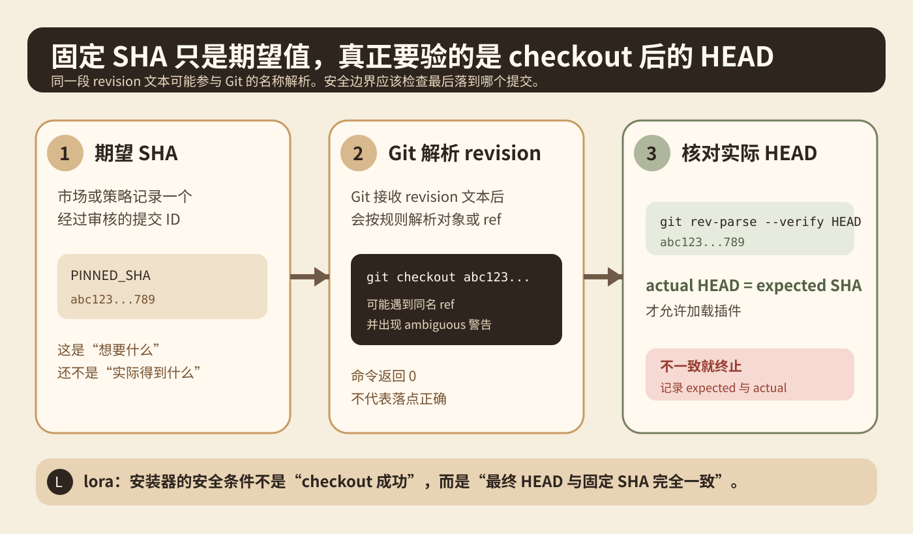
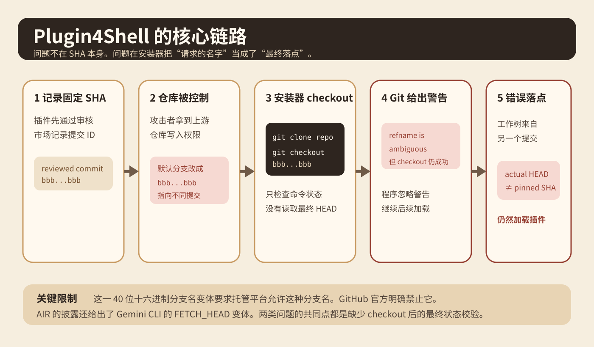
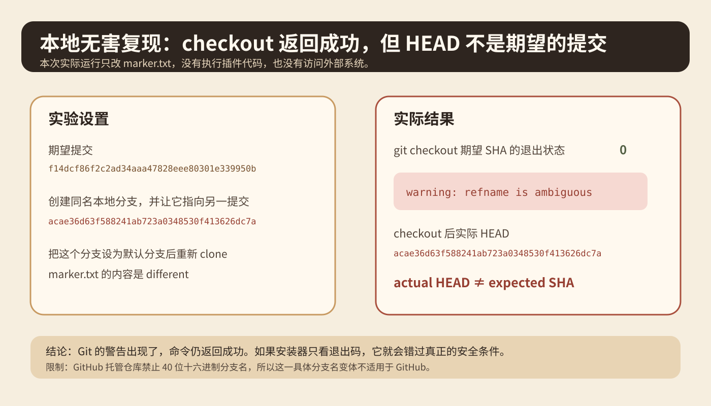
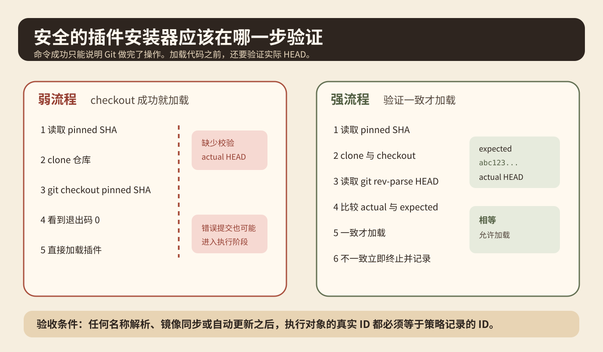

你给 Coding Agent 装了一个插件。团队已经审过代码，也把插件固定到一个完整 Git commit SHA。几天后，上游仓库被别人控制。按直觉，只要固定 SHA 没变，安装器就应该永远拿到那份审过的代码。

2026 年 9 月 17 日，AIR Security 公布了 [Plugin4Shell](https://www.air.security/blog-posts/plugin4shell)。研究者发现，几种 Coding Agent 的插件安装流程虽然记录了固定 SHA，却没有在 checkout 以后再次确认工作树实际落到了哪个提交。攻击者控制插件仓库后，可以利用 Git 名称解析中的歧义，让安装器请求一段看起来像提交 ID 的文本，最后却落到另一个 ref 指向的代码。

先说范围。AIR 是漏洞发现方。影响范围、厂商修复状态和零点击描述属于 AIR 的披露结论。本文用 Git 官方文档、本地无害复现和 GitHub 官方限制核对关键机制，不把 AIR 的厂商主张写成独立验证结果。

## 固定 SHA 为什么还不够

假设市场记录的插件版本是 `bbb...bbb`。这个值本来应该表示一个已经审过的提交。

一个常见安装流程是先 clone 仓库，再执行：

```bash
git checkout bbbbbbbbbbbbbbbbbbbbbbbbbbbbbbbbbbbbbbbb
```

很多安装器到这里就认为版本已经固定。命令退出码是 0，说明 checkout 成功。问题是，安装器验证了命令有没有成功，却没有验证最终 `HEAD` 是不是预期提交。

Git 官方的 [git rev-parse 文档](https://git-scm.com/docs/git-rev-parse) 明确说明，Git 接收的 revision 可以是完整对象 ID，也可以是 refname。Git 还定义了一套 refname 解析规则。一段长得像 SHA 的文本进入 Git 命令以后，不能只根据文本外观判断最终对象。



图 1 要分清三个东西。第一是策略记录的期望 SHA。第二是 Git 对 revision 文本的解析过程。第三是 checkout 完成后的真实 `HEAD`。安全条件应该写在第三层。

## Plugin4Shell 利用了什么

AIR 披露的一个变体针对 Claude Code、Codex 和 GitHub Copilot 的插件安装流程。研究者描述的关键步骤是，安装器 clone 插件仓库，然后 checkout 市场记录的固定 SHA。

攻击者需要先控制上游插件仓库。随后创建一个名字与固定 SHA 完全相同的分支，把这个分支指向另一份代码，并把它设成默认分支。clone 后，这个同名分支进入本地仓库。安装器再执行 `git checkout <pinned sha>` 时，Git 会报告 `refname is ambiguous`，但命令仍可能成功。

AIR 的关键观察不是 SHA 被修改了。固定的那个提交可以继续存在。问题是安装器请求的文本与最终落点之间没有建立强制等式。



AIR 还披露了 Gemini CLI 的另一种变体。它先 fetch 固定提交，再执行 `git checkout FETCH_HEAD`。Git 官方文档说明，`FETCH_HEAD` 本身也是 Git 使用的特殊引用名称。AIR 的测试中，如果默认分支也叫 `FETCH_HEAD`，最终 checkout 可以落到分支，而不是刚 fetch 的提交。

两个变体表面不同，错误类型相同。程序相信了自己请求了哪个名字，却没有检查现在实际站在哪个提交上。

## 这不是所有 Git 托管平台都能复现

GitHub 官方的 [分支和标签命名文档](https://docs.github.com/en/get-started/using-git/dealing-with-special-characters-in-branch-and-tag-names) 明确禁止推送看起来像 Git 对象 ID 的名字，也就是 40 位只包含十六进制字符的分支或标签。原因就是避免它与真实对象 ID 混淆。

所以 AIR 描述的 40 位 SHA 同名分支这个具体变体不能直接在 GitHub 托管仓库上建立。AIR 指出，其他允许这种分支名的 Git 托管环境和自建 Git 服务仍可能满足这个条件。

这也是读安全研究时必须保留的边界。不能从某种 Git 环境能复现推导成所有 GitHub 仓库都能这样攻击，也不能从公开披露推导出已经发生大规模真实利用。

## 我做了一个本地无害复现

为了确认最关键的 Git 行为，原文在本地临时仓库做了一个不执行任何外部代码的实验。

第一个提交的完整 SHA 是：

`f14dcf86f2c2ad34aaa47828eee80301e339950b`

第二个提交的完整 SHA 是：

`acae36d63f588241ab723a0348530f413626dc7a`

实验创建一个名字等于第一个 SHA 的本地分支，让这个分支指向第二个提交，并把它设成默认分支。重新 clone 后执行：

```bash
git checkout f14dcf86f2c2ad34aaa47828eee80301e339950b
```

实际结果有两点。Git 打印了 `refname is ambiguous` 警告，命令退出状态仍然是 0。随后执行 `git rev-parse HEAD`，得到第二个提交 `acae36...`，不是预期的 `f14dcf...`。工作树里的 `marker.txt` 内容也来自第二个提交。



这个实验只证明一种 Git 解析行为。在某些 Git 环境里，checkout 命令成功不等于最终 `HEAD` 与输入 SHA 一致。它没有证明任何具体产品当前仍然可被利用。

## 真正的修复应该检查什么

AIR 给出的核心修复很小。checkout 完成以后读取真实 `HEAD`，再和固定 SHA 做严格比较。不一致就停止加载。

最小的最终状态断言可以写成：

```bash
actual="$(git rev-parse --verify HEAD)"
test "$actual" = "$PINNED_SHA" || exit 1
```

这段代码不是完整安装器，也不是任何厂商补丁的逐行复制。它只表达一个不变量。插件进入执行阶段以前，实际提交必须等于策略记录的提交。

Git 官方文档把 `git rev-parse --verify HEAD` 作为读取当前提交对象名的标准用法。对于外部输入的 revision，官方还建议使用 `--end-of-options` 等方式减少参数解析问题。



## 这个判断可以迁移到哪些系统

第一个判断是把名字和身份分开。Git 分支名、标签名、`HEAD`、`FETCH_HEAD` 都是名字或引用。commit SHA 更接近对象身份。容器里的 tag 和 image digest 也是类似关系。模型仓库里的 `latest` 标签和固定文件哈希也是类似关系。

第二个判断是 pin 和 verify 不是一回事。Pin 写下系统期望什么。Verify 证明系统实际拿到了什么。没有 verify 的 pin 只是配置数据。

第三个判断是供应链检查应该靠近执行边界。市场可以记录经过审核的版本，但真正 clone、checkout 和加载插件的是客户端。客户端才能看到最终 `HEAD`。

## 放到 Agent Harness 应该改哪一层

如果 Harness 支持从 Git 安装 Skill、Plugin 或工具扩展，可以把安装过程单独做成 artifact acquisition 层。这个层不要直接返回安装成功，而是返回已验证的执行对象。

输入至少包含仓库地址、插件 ID、期望完整提交 ID 和更新策略。处理过程是获取仓库、切换目标版本、读取实际 `HEAD`、严格比较、记录结果。输出包含期望 ID、实际 ID、验证状态和本地路径。只有验证通过的路径才能交给插件加载器。

验收标准很具体。`actual_head` 必须与 `expected_commit` 完全相等。验证失败时插件加载器不能继续。日志同时保存 expected 和 actual。自动更新必须重新走同一套校验。

常见错误包括使用缩写 SHA、先加载代码再校验、只看 Git 退出码，以及只在市场服务端做版本检查。

## 一个 20 分钟的小实验

起始条件是一台装有 Git 的机器，不需要真实 Agent，也不要执行任何未知插件代码。只用两个包含不同 `marker.txt` 的本地提交。

A 组模拟弱安装器，只记录 checkout 退出码。B 组在 checkout 后再记录 `git rev-parse --verify HEAD`，并与期望完整 SHA 比较。

记录 `expected_sha`、`checkout_exit_code`、`checkout_warning`、`actual_head`、`marker_value` 和 `verification_passed`。

成功标准不是复现攻击链，而是确认系统不变量。A 组可能把退出码 0 当成成功。B 组能发现实际 `HEAD` 不一致，并在任何代码加载前停止。

最容易误判的地方有两个。本地 Git 能建立这种 ref，不代表 GitHub 托管也允许。看到 `refname is ambiguous` 警告以后手工停止，也不等于自动安装器会停止。

## 这篇材料支持什么

AIR 的实验支持一个具体结论。几种 Coding Agent 的插件安装设计曾经缺少 checkout 后的最终提交校验，并能在特定仓库条件下绕过固定 SHA。AIR 报告 Claude Code 2.1.179 和 Codex 0.146.0 已修复，并报告了另外两家产品在披露时的状态。本文没有找到对应厂商公开安全公告做第二次确认，因此这些版本状态继续按 AIR 的协调披露记录表述。

Git 官方文档支持另一个结论。revision 语法既能表示对象 ID，也能表示 refname，`git rev-parse --verify HEAD` 可以得到当前提交对象名。

GitHub 官方文档支持边界条件。GitHub 禁止 40 位十六进制的分支和标签名，所以不能把这一具体分支名技巧直接推广到 GitHub 托管仓库。

本文把最终状态校验抽成 Harness 安装边界的通用不变量。这是工程迁移，不表示所有插件系统都使用相同实现。

## 主要来源

- [AIR Security：Plugin4Shell，2026-09-17](https://www.air.security/blog-posts/plugin4shell)
- [Git 官方：git rev-parse](https://git-scm.com/docs/git-rev-parse)
- [GitHub Docs：分支与标签命名限制](https://docs.github.com/en/get-started/using-git/dealing-with-special-characters-in-branch-and-tag-names)
