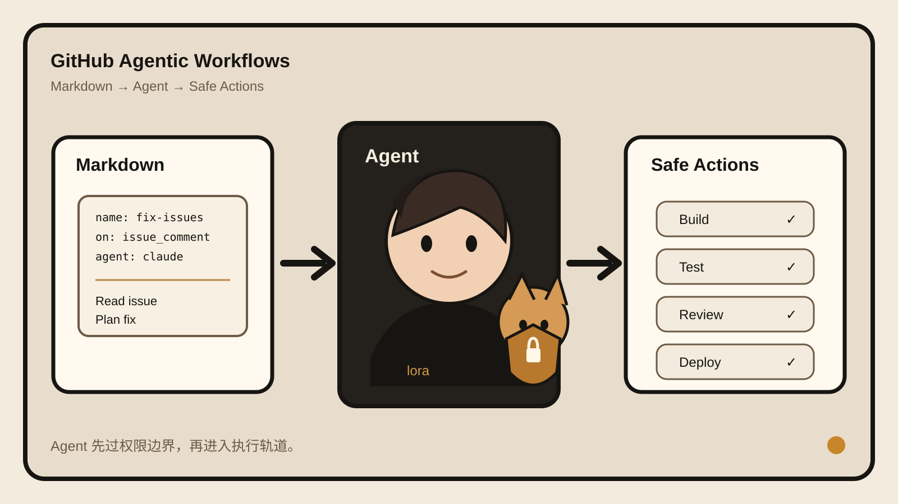

## 30 秒看懂
普通 GitHub Actions 适合确定性步骤：build、test、lint、deploy。
`gh-aw` 补的是另一类任务：需要读 issue、看代码、判断上下文、决定下一步。
你写一个 Markdown 工作流，frontmatter 定触发器、权限、工具和模型，正文写任务。`gh aw compile` 把它变成标准 Actions 工作流。Agent 默认只读、跑在沙箱里。需要写回仓库时，再走受控输出。
关键点不是“Actions 里塞了个 LLM”，而是把 Agent 的自由度包在现有 CI 权限模型里。
## 为什么有意思
大多数 Agent 自动化 demo 先展示“它会做什么”。`gh-aw` 先解决“它凭什么能做”。
这更接近生产环境。CI 本来就有触发器、权限、secret、日志、审计和失败记录。`gh-aw` 没重造一套 Agent 平台，而是把推理步骤接到这套基础设施上。
## 3 个值得借鉴的设计
### 1. 意图文件和执行文件分开
人维护 `.md`，机器执行编译后的 `.lock.yml`。自然语言方便改，执行结果仍然是可检查的 Actions 文件。
### 2. 默认不给写权限
Agent 先读、分析、生成结果。真正修改 issue、PR 或仓库内容时，走明确的 safe outputs。权限不是 prompt 里的提醒，而是执行层约束。
### 3. 不替代确定性 CI
测试、构建、部署继续用普通 Actions。只有需要判断的部分才交给 Agent。这样比“所有步骤都 Agent 化”更容易调试，也更便宜。
## 与我的连接
这个项目最值得借鉴的是 **Agent harness 和业务工作流分层**。
你在做 Agent runtime、工具调用、权限和自动化时，可以直接复用这个判断：
- 确定性任务继续写普通程序。
- 需要解释和判断时才进入 Agent loop。
- Agent 的权限放在 runtime / tool boundary，不只写进 system prompt。
- 自然语言配置最好编译成可审计的执行产物。
这套结构也适合你做多 Agent 系统：上层写目标，下层生成受约束的执行计划，再由工具层真正落地。

## 来源与事实核验
- 项目：GitHub Agentic Workflows，CLI 名 `gh-aw`。
- 维护方：GitHub Next / GitHub。
- 核心功能：用 Markdown + YAML frontmatter 定义 Agent 工作流，再通过 `gh aw compile` 生成标准 GitHub Actions `.lock.yml`。
- 适用任务：issue triage、PR review、CI failure investigation、文档维护、依赖分析、仓库报告等需要判断或解释的任务。
- AI 引擎：GitHub Copilot、Claude Code、OpenAI Codex、Google Gemini、Pi。
- 安全默认值：Agent job 默认只读并运行在沙箱中；写操作通常通过受约束的 safe outputs 处理。
- LICENSE：MIT。
- 当前状态：官方文档、安装流程、quickstart 和仓库均可访问；2026-09-07 官方周报记录 v0.88.4。
## 证据卡
1. **官方 About**：定义了 Markdown source、`gh aw compile`、sandbox、read-only 和 safe outputs。  
[https://github.github.com/gh-aw/about/](https://github.github.com/gh-aw/about/)
1. **官方仓库**：说明 `gh-aw = Actions + Agent + Safety`，列出支持的 AI engines 与 MIT License。  
[https://github.com/github/gh-aw](https://github.com/github/gh-aw)
1. **GitHub Docs Quickstart**：给出安装和运行流程。  
[https://docs.github.com/en/copilot/how-tos/github-agentic-workflows/quickstart](https://docs.github.com/en/copilot/how-tos/github-agentic-workflows/quickstart)
1. **官方 Weekly Update 2026-09-07**：v0.88.4 重点是 firewall/network hardening 与 CI reliability。  
[https://github.github.com/gh-aw/blog/2026-09-07-weekly-update/](https://github.github.com/gh-aw/blog/2026-09-07-weekly-update/)
