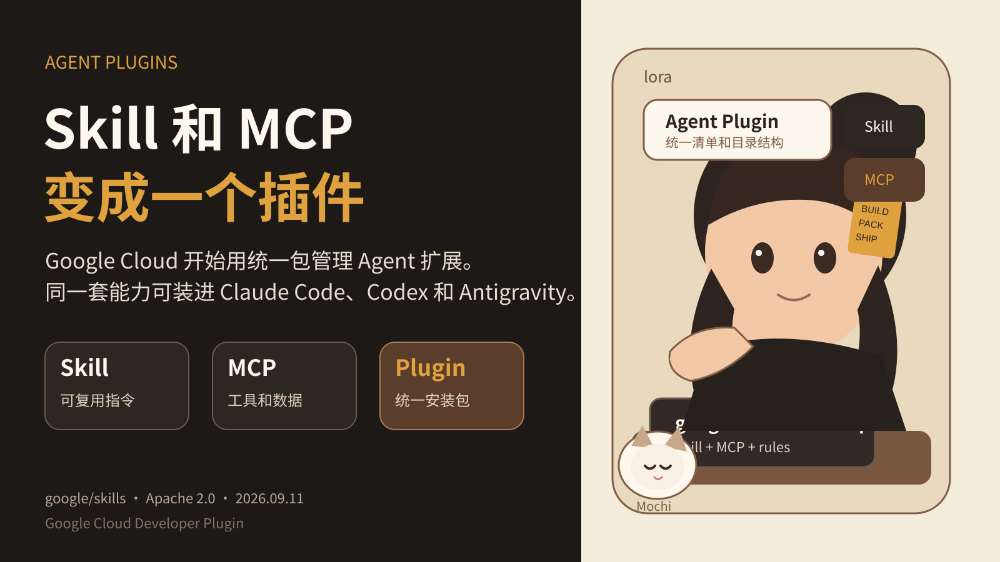

## Google 把 Skill 和 MCP 打成一个插件，Coding Agent 扩展层开始标准化
Google Cloud 9 月 10 日发布了 Google Cloud Developer Plugin for AI Coding Agents。
官方公告先指出了一个实际问题。Agent Skill 很容易安装，也能减少部分场景的上下文占用。但 Skill 数量增加后，逐个管理会变得麻烦。有些能力还必须同时依赖其他 Skill、MCP Server 和配置文件。
Google 的处理方式是把这些相关能力装进一个 Plugin。
### Plugin 具体打包什么
Google 的 `google-cloud-developer` 插件遵循 Agent Plugins 规范。
这个规范给 Agent 扩展定义统一 manifest 和目录结构。当前核心组件是 Skill 和 MCP Server。Google 的插件还包含客户端需要的规则和配置。
`google-cloud-developer` 负责几类基础工作：Google Cloud 认证和授权、项目管理、gcloud CLI 操作约束，以及 Developer Knowledge MCP server。后者给 Agent 提供 Google 官方开发文档的最新信息。
Google 已经给出三类客户端的安装方式：Antigravity CLI、Claude Code 和 Codex CLI。
这意味着 Builder 可以把一组相关能力作为一个单元发布，而不是让用户分别复制 Skill、配置 MCP、补规则文件，再手动处理各客户端差异。
### 为什么这层现在值得关注
过去一段时间，Agent 扩展主要讨论 Skill 和 MCP。
Skill 适合保存工作方法和领域指令。MCP 适合接工具、数据和外部服务。真实项目通常需要两者一起出现。
问题在安装阶段开始显现。
假设你做了一个 Google Cloud 部署能力。Agent 需要知道部署流程，也需要读取官方文档，还需要调用云端工具，并且必须带正确身份。把这些部分分别交给用户配置，会产生多个失败点。
Plugin 把这些依赖关系放在一个可安装单元里。它没有减少底层能力，但减少了分散配置。
### 9 月 11 日的一个修复很说明问题
`google/skills` 仓库在 9 月 11 日仍在更新。
当天发布的 `google-cloud-developer 1.1.2` 修复了一个 MCP 认证问题。`mcp_config.json` 原本缺少 `authProviderType: google_credentials`。仓库提交说明写明，缺少这个字段会让客户端发送未认证请求，并收到 401 Unauthorized。
这不是模型能力问题，也不是 Prompt 问题。它是扩展包的配置正确性问题。
当 Plugin 成为分发单元以后，manifest、认证声明、版本和兼容性都需要测试。Builder 不能只检查 Skill 文本写得对不对。
### Builder 现在可以怎么做
如果你在做 Agent Skill 或 MCP 工具，可以先把能力按一个安装单元来设计。
第一，写清组件边界。哪些内容属于 Skill，哪些能力必须通过 MCP 调用，哪些规则应该由客户端执行。
第二，固定版本和依赖。Plugin 更新时，记录 Skill、MCP Server 和配置变化。不要让生产环境自动追最新版本。
第三，测试不同客户端。统一格式不代表每个客户端对全部能力的实现完全一致。至少跑一遍安装、认证、工具发现和核心任务。
第四，把权限放进发布检查。Plugin 能同时带来 Skill 和 MCP，也意味着它能扩大 Agent 的工具面。安装前要知道它会连接什么服务，使用什么身份，需要哪些权限。
### 当前边界
Agent Plugins 仍处于早期阶段。
Google 的发布说明能证明它已经用于官方 Google Cloud Plugin，也能证明 Claude Code、Codex 和 Antigravity 有对应安装路径。现有证据不能证明所有 Agent 客户端都会采用该规范，也不能证明跨客户端行为完全一致。
所以现在更准确的判断是：Agent 扩展开始出现统一打包层。Google 已经把它用于官方产品。Builder 可以开始把分发、版本、认证和兼容性纳入 Skill 与 MCP 的工程流程。
---
