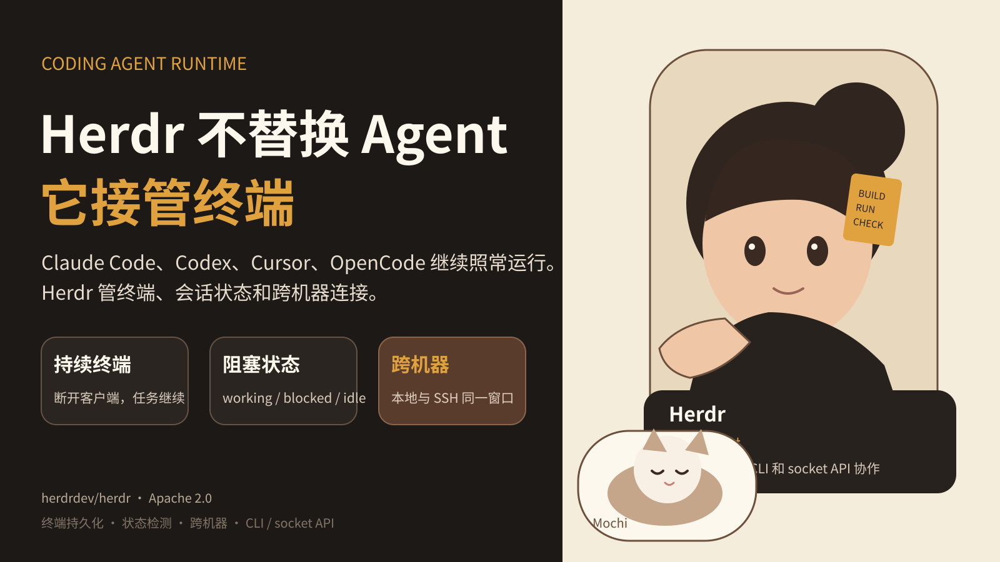

## Herdr 不替换 Agent，它把终端做成运行时
Claude Code、Codex、Cursor、OpenCode 越来越像一组并行的开发进程，而不是一个聊天窗口。
当你只开一个 Agent 时，终端足够用。开到多个 Agent 后，问题开始变具体。哪个还在跑，哪个卡住了，哪个正在等输入。SSH 断开后任务还在不在。另一台机器上的 Agent 怎么接回来。多个 Agent 怎样互相通知。
Herdr 处理的就是这一层。
### 它没有重新实现 Coding Agent
Herdr README 写得很明确。它支持 Claude Code、Codex、Cursor、OpenCode、Grok 等现有工具，但不包裹或替换它们。Herdr 管理的是这些工具所在的终端。
这意味着模型选择、Agent 自己的上下文管理和认证方式仍然留在原工具里。Herdr 负责更靠近操作系统的一层：终端进程、窗格、连接和状态。
这个边界比“再做一个统一聊天 UI”更具体。
### 第一个问题是持续运行
普通终端和 SSH 会话很容易和客户端绑定。Herdr 用后台 server 保持终端运行。你关闭客户端或丢失 SSH 连接，终端仍然继续。
机器重启后，Herdr 可以恢复保存的布局，并对支持的 Agent 恢复会话。这里有一个重要边界。原进程不会穿过机器重启继续存活。README 明确写了这一点。
这类细节很重要，因为 Agent 任务可能运行几十分钟甚至更久。控制面需要区分“客户端断开”“进程仍在”“机器重启”“会话可恢复”这几种状态。
### 第二个问题是知道谁在等你
Herdr 会给窗格标记 working、blocked 和 idle。
这听起来很小，但它对应真实的多 Agent 工作流。你同时跑几个 Coding Agent 时，最浪费时间的情况不是某个 Agent 慢，而是它早就停下来等一个确认，你却没有看到。
状态检测把终端从被动窗口变成可查询的任务界面。
### 第三个问题是跨机器
Herdr 可以把本地任务和保存的 SSH 机器放在同一个窗口。每台机器独立连接和重连。
这适合一个越来越常见的工作方式：笔记本负责控制，较大的仓库或长任务放到服务器跑。你不需要把 Agent 本身改造成云服务，只要能稳定管理远端终端和会话。
### Agent 也可以操作这个运行时
Herdr 不只给人用。README 提到，Agent 可以通过 CLI 和 socket API 创建窗格、给其他 Agent 发提示，并等待另一个 Agent 真正进入 blocked 状态。
这让终端运行时成为一种协调接口。
一个规划 Agent 可以启动实现 Agent。实现 Agent 完成后通知审查 Agent。人只在需要决策的状态出现时介入。
这里最重要的不是“多 Agent”这个词，而是每一步都有明确状态和接口。
### Kandev 和 Vicoa 走了另外两条路
Kandev 把控制面放在任务和代码审查层。它有 Kanban、并行任务、worktree 隔离、多仓库任务、不同 Agent 组成的工作流和多种执行器。
Vicoa 则把控制面延伸到桌面和手机。多个 Agent 可以在不同机器运行，移动端负责查看会话、diff 和通知。
这三个项目没有证明某一种架构会赢。它们提供了三个清楚的系统边界：终端运行时、开发工作流、跨设备控制。
### Builder 可以直接借鉴什么
如果你正在做 Coding Agent 工具，先回答一个问题：你真正要控制的是哪一层。
如果是终端层，就把进程、会话、状态和重连做好。如果是任务层，就把隔离、依赖、审查和恢复做好。如果是团队控制层，就把权限、通知、跨设备和人工接管做好。
不要因为模型接口容易接，就从模型层重新做整个产品。
Herdr 最值得借鉴的地方，是它把边界划得足够窄。现有 Agent 继续演进，它只负责一个长期存在的问题：让这些 Agent 的终端可持续、可观察、可协调。
---
