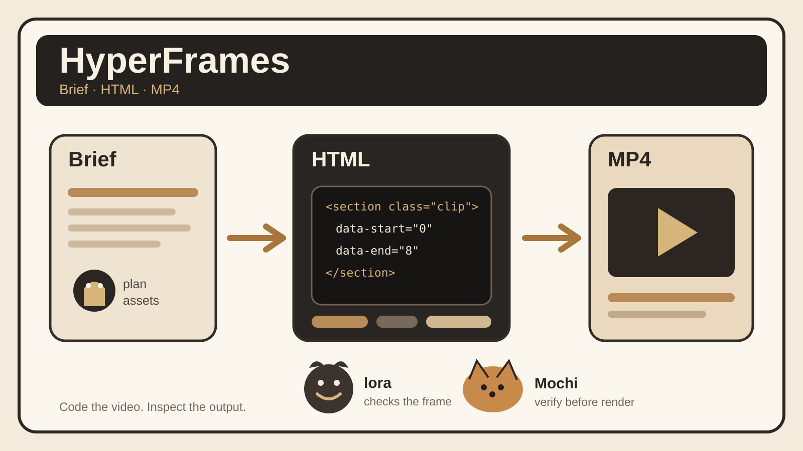

## 30 秒看懂
HyperFrames 把视频当成一个可以构建的代码项目。
Agent 先根据 brief 生成 HTML、CSS、素材引用和动画。然后用 CLI 做 lint 和 preview。确认时间线和画面后，再渲染成 MP4。
它还把常见任务做成 skills。比如把 GitHub PR 做成更新视频，或者把产品网站做成发布短片。
这意味着视频生成不只剩一个最终文件。中间结构能被版本控制、检查和修改。
## 为什么有意思
很多 AI 视频工具直接返回成片。结果不对时，修改通常还是重新描述一遍需求。
HyperFrames 保留了可编辑的中间层。视频结构是 HTML。动画有明确时间。素材有文件引用。CLI 可以检查、预览和渲染。
对于 Agent 工作流，这种结构更容易做自动化。Agent 可以修改一个片段，重新检查，再只处理需要变化的工程内容。人也能直接读代码和预览结果。
## 3 个值得借鉴的设计
### 1. 把视频变成可检查的构建产物
最终输出是 MP4，但源文件仍是 HTML、CSS、素材和动画配置。生成失败时，可以定位到具体结构，不需要只看一段 prompt 猜哪里出错。
### 2. 用 skills 固化生产流程
`/hyperframes` 负责路由。具体任务再进入产品视频、PR 视频、字幕或动效等 workflow。每个 workflow 都复用同一套 lint、preview 和 render 工具。
### 3. 把设计规范接进视频工程
README 提供 `frame.md`，用于把已有的设计规范转换成视频帧可用的规则。Agent 不需要每次重新猜字体、比例和构图约束。
## 与我的连接
这套方式可以直接用到你的内容工作台。
现在每天已经有选题、长文、X、小红书、短视频脚本和视觉 Brief。下一步可以把短视频脚本直接交给 HyperFrames skill。Agent 读取项目官网和仓库素材，生成 HTML 视频工程，再由同一套视觉规范控制字体、配色和版式。
如果你要把“每天研究一个项目”继续自动化，最值得测试的是 `PR-to-video` 和 `product-launch-video` 两个 workflow。它们能把已有证据和脚本直接转成可修改的视频工程。
