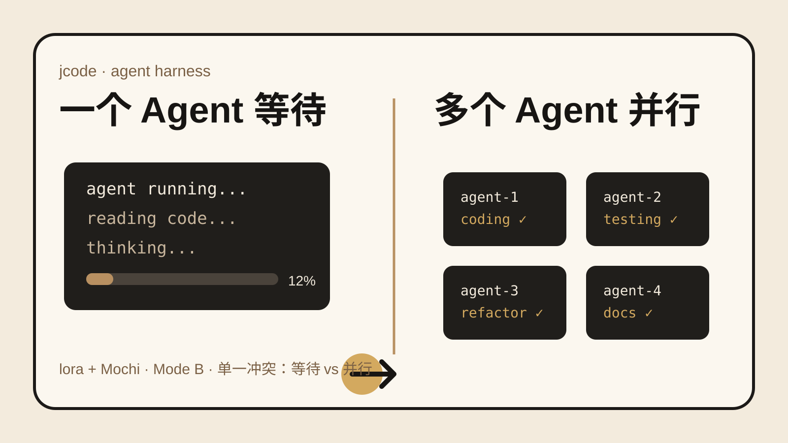

## 30 秒看懂
很多 Coding Agent 的多任务玩法，本质是多开几个进程。Agent 一多，RAM、上下文、冲突和状态同步马上变成问题。
`jcode` 直接从 Harness 下手。它用 Rust 做终端 Agent，把多个会话挂在同一服务端。Agent A 改了 Agent B 已读过的文件，服务端会通知 B。Agent 之间还能私聊、广播，主 Agent 也能自己拉起 worker。
它还把未完成 todo、置信度变化、上下文缓存和持续执行放进 Harness，而不是全靠模型自己记住。
这类项目值得看的不是又一个聊天界面，而是 Agent 到底怎样连续工作。
## 为什么有意思
现在 Coding Agent 的差异越来越难只用模型名解释。同一个模型，工具、上下文、缓存、验证和继续执行策略不同，结果会明显变化。
`jcode` 把这个问题做得很具体。它甚至公开强调 `the harness matters as much as the model`。
我更关注它的多 Agent 状态处理。并行不是同时开四个模型。真正麻烦的是四个 Agent 都在改同一个仓库时，谁知道文件已经变了，谁负责冲突，谁判断任务真的完成。
## 3 个值得借鉴的设计
### 1. 多 Agent 共用服务端状态
多个 Agent 不只是独立终端。服务端知道哪些 Agent 在同一仓库工作，也能在代码变化影响其他 Agent 上下文时发通知。
这比单纯 worktree 并行更接近一个真正的协作 runtime。
### 2. 把验证循环写进 Harness
jcode 的 todo 会记录任务分配和完成时的 confidence。项目还加入自动继续机制。turn 结束但 todo 没完成时，Harness 可以继续推动模型工作。
这适合 Agent Eval。不要只测最终答案，还要记录任务状态、验证动作、失败点和继续执行次数。
### 3. 把资源效率当成多 Agent 基础设施
多 Agent 最直接的成本不是概念，而是进程、内存、缓存和 provider 请求。jcode 专门测新增会话的 PSS，并用 server/client 结构减少重复开销。
如果要做 10 个、20 个 Agent，这类指标比 UI 上画多少节点更有用。
## 与我的连接
这个项目和你现在关注的 Agent Harness、Eval、多 Agent runtime 很接近。
可以直接拆四个东西来学：
- `server/client`：多个 Agent 共用什么状态，哪些状态必须隔离。
- `swarm`：Agent 如何发现队友、发消息、知道对方完成没有。
- `todo + confidence`：怎样把执行过程变成可测事件，而不是只看最终回答。
- `auto-poke`：长任务怎样判断应该继续，而不是模型说一句 done 就结束。
如果你要做自己的 Agent Eval 框架，我会优先抄事件模型和验证点，不先抄 UI。

## 来源与事实核验
- 项目：jcode。
- 作者与仓库：1jehuang / jcode。
- 定位：Rust 编写的开源终端 Coding Agent 与 Agent Harness。
- LICENSE：MIT。
- 当前可用：macOS、Linux、Windows 有安装入口。支持 TUI、非交互运行、server/client、多会话和 SSH 工作流。
- 多 Agent：同一仓库可运行多个 Agent。服务端会在文件变化影响其他 Agent 已读内容时通知对应 Agent，并提供 Agent 间消息与自主 spawn swarm。
- Harness：包含 memory、todo confidence、自动继续未完成任务、MCP、浏览器工具、provider 登录、会话恢复等机制。
- 最近更新：官网 changelog 显示 2026-09-08 仍有未发布提交，v0.84.0 发布于 2026-09-07，近期重点包含 SSH 会话与远程登录。
- 性能数字只按项目方自测表述。抓取时间：2026-09-09 16:47 +08:00。项目方报告新增 jcode 会话约增加 10.4 MB PSS。相同页面列出的 Claude Code 为约 212.7 MB。该数字不是独立第三方基准。
## 证据卡
1. [jcode 官网](https://jcode.sh/)：项目定位、Mission、性能方法、Bench、Harness 设计与 changelog。
2. [GitHub 仓库](https://github.com/1jehuang/jcode)：README、MIT LICENSE、安装、Swarm、Memory、MCP、Browser、Provider 与源码。
3. [jcode Bench](https://jcode.sh/bench)：项目方公开 benchmark 方法和结果。
4. [jcode Changelog](https://jcode.sh/)：2026-09-08 未发布更新与 v0.84.0、v0.83.0 记录。
