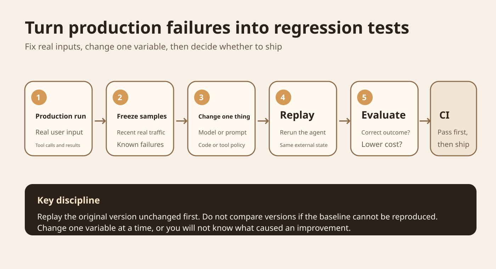
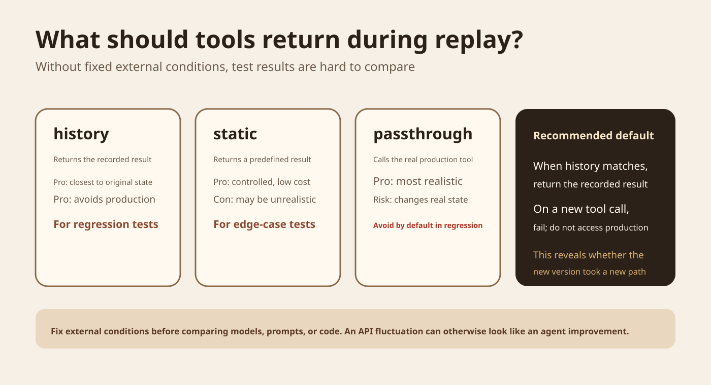
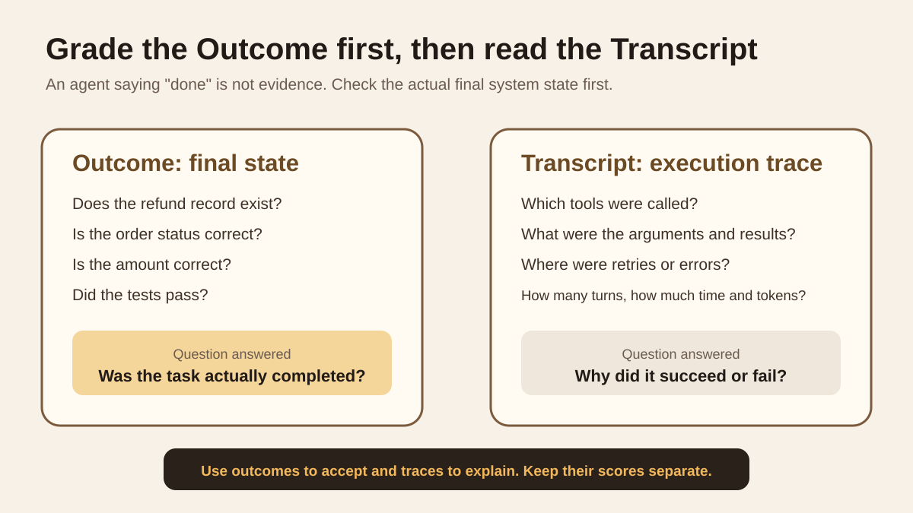
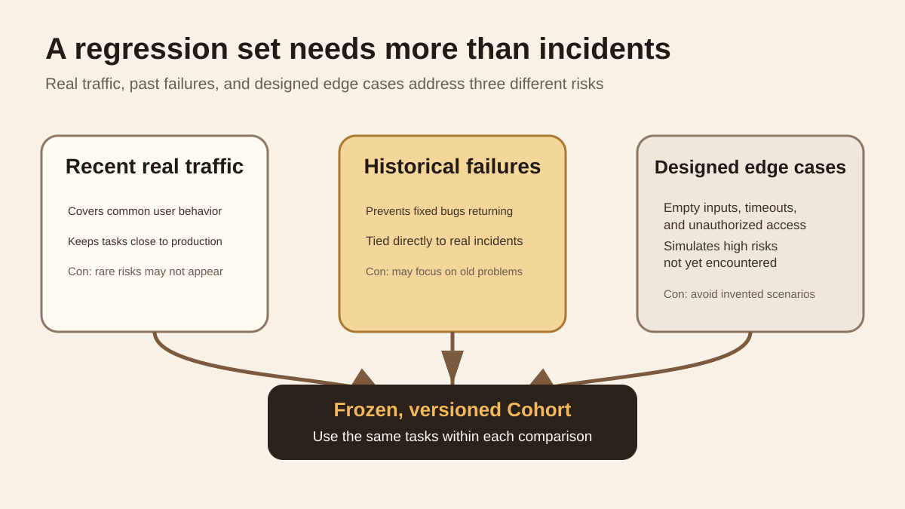

Series: daily illustrated AI close reading

Today's question is specific. After an agent makes a mistake in production, how can that real failure become a test that automatically runs whenever the model, prompt, or code changes?

The main materials are Kitaru's Replay, Evaluator, and Regression Suite. The repository is maintained by `zenml-io`, uses `develop` as its default development branch, and is licensed under Apache 2.0. It was still receiving feature and dependency updates on September 16, 2026. This article also cross-checks the approach against Anthropic's agent eval methodology and OpenAI's public articles on evaluation data quality and production feedback loops. I have not reproduced Kitaru's full experimental environment and do not treat the project's product descriptions as independent verification. [Kitaru official repository](https://github.com/zenml-io/kitaru)

## Start with a failed production refund

Suppose you build a customer-service agent. A user says, "This order was charged twice. Please refund it." The agent looks up the order, calls the refund tool, and replies, "Refunded." The user returns the next day because the money never arrived.

You fix the system prompt and run a manual test that happens to pass. A few days later, the same kind of problem returns.

What is missing is a regression-testing process. After the first incident, save the task input, tool calls, tool results, and final state from that run. Every subsequent agent change should make the new version attempt the task again under conditions as close as possible to the original.

Anthropic's January 2026 article on agent evals distinguishes capability evaluations from regression evaluations. Capability evals ask which harder problems the agent can now solve. Regression evals ask whether it can still do things it previously could. The purpose of a regression set is to keep old problems from returning. [Anthropic article](https://www.anthropic.com/engineering/demystifying-evals-for-ai-agents)

In Figure 1, look first at the far left and far right. A production failure leaves a Session. A fixed set of Sessions becomes a Cohort. Replay the baseline first. Once the conditions can be reproduced reliably, change only one variable and have the candidate run the same tasks. If the evaluation fails, CI blocks the release.

<ProcessSteps
  title="How a production incident enters regression testing"
  steps="Save the real run::Keep the task input, tool results, final state, and necessary trace|Replay the old version first::Confirm it reproduces under fixed conditions and establish a comparable baseline|Change one variable::Change only the model, prompt, code, or sampling parameters at a time|Rerun and evaluate::Check both outcome and transcript, not only the last sentence|Add it to the regression set::Freeze stable samples in a suite version and rerun them in later CI"
  source="Based on the Kitaru Replay, Evaluator, and Regression Suite documentation and this article's incident example"
/>

## Replay reruns the agent instead of rescoring an old answer

Ordinary unit tests can easily fix their inputs and outputs. An agent is different. It may search, read a database, call an external API, and decide its next step based on each result.

Kitaru saves a run as a Session. Replay executes the agent's actual code again and answers it using the recorded external results. The model generates anew, and the code runs through the full process again. The test conditions are fixed; the agent's output is not. [Kitaru Replay documentation](https://github.com/zenml-io/kitaru/blob/develop/docs/book/concepts/replay.md)

This is very different from sending yesterday's final answer back to a grader. That only tells you how yesterday's answer scores. Replay lets you observe how the new version follows the entire decision path today.

Kitaru currently reruns a task from its beginning. It does not provide Replay that resumes directly from an intermediate node. One benefit is that the candidate must complete the entire path itself, without borrowing the first half already completed by the old version.

## Why you must replay the original version first

Kitaru's documentation states the order explicitly. Before changing anything, Replay the original version unchanged.

The reason is simple. Suppose the original run passed, but replaying the original version ten times produces only six passes. After switching models, you get eight passes. You cannot directly claim that the new model improved two tasks. The test conditions themselves are unstable.

The first question is whether the baseline can be reproduced. A candidate score becomes interpretable only when the baseline is trustworthy.

Then change one thing at a time. If you change only the model, leave retrieval alone. If you change only the prompt, do not rewrite the evaluator at the same time. Otherwise, even if the result improves, you will not know which change caused it.

## Tools are the most likely source of trouble

In the refund task, the most dangerous part is the refund tool rather than the model.

Yesterday the order was "paid, not refunded." If you query the production database again today, someone may already have refunded it manually. The test result changes as a result. Worse, the candidate agent may actually call the refund API again. That changes production state instead of testing it.

Kitaru's tool policies address this problem. [Official Replay documentation](https://github.com/zenml-io/kitaru/blob/develop/docs/book/concepts/replay.md)

Figure 2 shows only the three core policies in the official documentation. `history` looks up a recorded call by tool name and arguments and returns the result from that time. `static` returns a predefined fixed result. Only `passthrough` accesses the real tool.

To keep regression tests away from production systems, use `history` and set unmatched calls to `fail`. If the new version takes a tool path absent from the old record, the test stops. This failure does not necessarily mean the new version is worse. It means the old test conditions cannot explain the new path, so a person needs to inspect it.

There is another implementation detail that is easy to miss. Kitaru's current OpenAI Agents adapter cannot set the default tool policy directly to `history`. The default must remain `passthrough`. Configure named `history` policies individually for the direct `FunctionTool` instances you want to replay. Replacing hosted tools, MCP tools, handoff targets, and related items also has current limitations. [OpenAI Agents adapter documentation](https://github.com/zenml-io/kitaru/blob/develop/docs/book/adapters/openai-agents.md)

These limits matter. With an incorrect configuration, you may think you are running offline regression tests while some calls still reach real external systems.

## Verify the outcome before reading the execution trace

An agent ending with "Refund successful" does not prove that a refund happened.

Anthropic separates Outcome from Transcript. Outcome is the final state left in the environment after a task. Transcript is the full execution process, including observable model outputs, tool calls, and intermediate results. For a coding agent, "Bug fixed" is only output. Whether the code was saved, tests passed, and the intended behavior was restored are the results that can be accepted. [Anthropic article](https://www.anthropic.com/engineering/demystifying-evals-for-ai-agents)

The reading order in Figure 3 is also the grading order. First check the final state. After it passes, read the trace to explain why it succeeded. Do the same for failures: first identify the unmet acceptance condition, then use the trace to find its cause.

Use programmatic checks wherever possible, such as checking whether a database record exists, JSON conforms to a Schema, or unit tests pass. Give open-ended questions, such as whether an answer is clear or understands user intent, to a model judge, and regularly calibrate it against human judgments.

Kitaru's Evaluator reads the full Session and can write booleans, numbers, classifications, and explanations. Each Evaluation also records the evaluator version. Human judgments can be saved as evaluations too, for comparison with automatic evaluators. [Kitaru Evaluator documentation](https://github.com/zenml-io/kitaru/blob/develop/docs/book/concepts/evaluators.md)

## A regression set needs more than incidents

Adding a test after every production failure is the right move, but the test set cannot consist only of incidents.

Kitaru's Regression Suite recommends combining real records with manually constructed fixtures. Start with recent real traffic and add past failures. For conditions that have not appeared in production but pose a known risk, add manually designed edge cases. [Regression Suite documentation](https://github.com/zenml-io/kitaru/blob/develop/docs/book/guides/regression-suite.md)

Real traffic covers common usage, but rare risks may never have appeared. Historical failures prevent old problems from returning, but can keep tests focused on the past. Manually designed edge cases cover known risks such as empty inputs, timeouts, permission errors, and tool exceptions.

Kitaru uses Cohort Version to fix the test population. A version stays unchanged after creation. To add or remove Sessions, create a new version. You can then establish whether two experiments used the same tasks.

## Evaluations can have bugs too

Another safeguard is needed here. An agent failing a test does not necessarily mean the agent was wrong.

In OpenAI's July 2026 audit of SWE-Bench Pro, the automated data-quality process flagged 200 broken tasks, or 27.4%. Human annotation found 249, or 34.1%. OpenAI therefore estimated that roughly 30% of tasks had problems. The main issues included overly strict tests, underspecified tasks, insufficient test coverage, and conflicts between the prompt and actual acceptance criteria. [OpenAI research](https://openai.com/index/separating-signal-from-noise-coding-evaluations/)

These figures describe only OpenAI's audit of that benchmark. They cannot be generalized into "30% of all agent evals are wrong." They do establish an engineering concern. When a regression test fails, inspect the failed sample and its trace instead of trusting the aggregate score alone.

This also explains Anthropic's emphasis on reading transcripts. An evaluator that rejects a reasonable new path will consistently block good changes from shipping. Automation does not repair incorrect criteria. It executes them faster.

## How production feedback supports long-term improvement

When OpenAI published its Tax AI engineering process in May 2026, it used a different implementation, but the feedback loop was similar. Human corrections from real business work were saved as structured signals. Production traces helped the team locate failures. Targeted evals then verified fixes, followed by broader regression tests. [OpenAI Tax AI engineering article](https://openai.com/index/building-self-improving-tax-agents-with-codex/)

Production traces therefore have value beyond troubleshooting. With suitable task definitions, acceptance criteria, and data permissions, real failures can gradually become test material for the next version.

## The data relationships are what to borrow from Kitaru

Before deciding whether to adopt Kitaru itself, learn its data relationships.

| Object | Plain meaning | Why save it separately |
| --- | --- | --- |
| Session | The full record of a real or test run | Reproduce its conditions later |
| Cohort Version | A fixed set of test Sessions | Compare experiments on the same samples |
| Experiment | Exactly what changed this time | Avoid mixing multiple variables into one test |
| Replay | The new version processes an old Session again | Obtain a new trace and result for the candidate |
| Evaluation | One specific judgment about a Session | Assess correctness, cost, and tool behavior separately for the same task |

Once these relationships are clear, CI is only the final layer. A PR builds the candidate agent version and runs an experiment on a fixed cohort. Both baseline and candidate use the same evaluators. If a regression occurs, CI fails; then open the relevant session to see which step went wrong.

Kitaru's official example recommends smaller cohorts for PRs and larger traffic samples for scheduled jobs. When a new failure appears, add that session to a new cohort version so future tests include it. [Official Regression Suite documentation](https://github.com/zenml-io/kitaru/blob/develop/docs/book/guides/regression-suite.md)

## Applying this to Zhihu Threads eval v3

Zhihu Threads eval v3 already has much of the groundwork. Current records show that execution input and expected are separate. Each attempt is retained. Citation existence, source binding, and semantic support are checked independently. Evidence snapshots are also saved for each round.

Existing engineering CI records 28 test files and 436 passing tests. The standalone driver records 80 passing contract checks and passing rule checks for 10 synthetic scenarios. The real semantic workflow did not produce actual model or Zhihu business results because configuration such as `OPENAI_API_KEY`, `OPENAI_BASE_URL`, `OPENAI_MODEL`, and `ZHIHU_ACCESS_SECRET` was missing. Those 10 synthetic scenarios therefore currently qualify as a deterministic contract set, not a production regression set.

The next step does not require rewriting the evaluator. Add the Session and Replay layer first.

| Already present | Suggested addition | Purpose |
| --- | --- | --- |
| ExecutionInput | session_id | Fix the identity of a real run |
| source snapshot | tool call and tool result | Replay the external conditions at that time |
| Rule and semantic scores | evaluator_version | Know which rules produced the judgment |
| Attempt records | cohort_version | Fix the same set of regression tasks |
| Tokens and duration | baseline_session_id and candidate_session_id | Compare old and new versions on the same task directly |

Once real semantic runs are possible, select representative successes and failures from real tasks and freeze them as `regression_v1`. Whenever the model, prompt, retrieval strategy, or agent behavior changes, rerun the current baseline on `regression_v1` first. Once the baseline is stable, change one thing and rerun the candidate.

Zhihu search and content reads change over time. During regression testing, prefer saved source snapshots. If the candidate makes a new external call absent from the old record, mark it as a replay miss first instead of automatically accessing real business systems.

## A small experiment you can run today

Choose 5 tasks with fixed inputs, expected results, and source snapshots already available. Run each once with the current version, and save the full records as the baseline. Confirm that the evaluator can read these 5 runs.

Then change only the system prompt. Keep the model, retrieval code, tasks, and evaluator unchanged. Disable all external writes. Use the saved source snapshot for calls it can answer. Record any new external call from the candidate directly as a replay miss.

Save these fields for each task: `task_id`, `baseline_session_id`, `candidate_session_id`, rule results, semantic results, tool-call sequence, replay miss, tokens, duration, and failure reason.

The first round can use simple success criteria. None of the 5 tasks may introduce a new deterministic failure. Source binding may not gain new errors. If the semantic evaluator actually runs, the candidate's pass count must be at least the baseline's. A person must inspect every replay miss.

Three situations are especially easy to misread: comparing the candidate before the baseline is stable, allowing the test to access changing production tools unnoticed, and looking only at the overall pass rate without opening failed Sessions to check whether the evaluator is fair.

## Limits of this method

Replay can reproduce only the world that was recorded. If the original Session omitted a key state, it cannot automatically recover it later.

`history` can also block reasonable new behavior. If the candidate adds a necessary tool call, `on_miss=fail` fails the test. The correct interpretation is that the new path needs inspection, rather than an immediate conclusion that the candidate is worse.

Regression sets age. As product capabilities, tools, and user distributions change, create new Cohort Versions. Keep old versions so you can identify when the test distribution changed.

Evaluators also need versioning and regression tests. Incorrect grading criteria will reject even a good agent.

## Remember these four points

A production failure should leave a Session, rather than only a screenshot in a ticket.

Replay aims to fix test conditions so the old and new agents face the same problem.

When grading, verify the final state first, then read the execution trace to explain the result.

A regression set needs real traffic, historical failures, and manually designed edge cases together.

Self-check 1: why not rerun yesterday's task with the new model on today's production APIs?

Because external state has changed. A score difference may come from changed data rather than a changed model. Real write tools can also cause side effects.

Self-check 2: why replay the original version first?

First confirm that the test conditions themselves are stable. Otherwise, differences between candidate and baseline cannot be attributed reliably.

Self-check 3: does a replay miss always mean the candidate is worse?

No. It may mean that the candidate took a new path absent from the old records. That requires additional recorded conditions or human judgment.

## Main primary sources

[Kitaru official repository](https://github.com/zenml-io/kitaru): project maintainers, current code, and license.

[Kitaru Replay](https://github.com/zenml-io/kitaru/blob/develop/docs/book/concepts/replay.md): Replay, fork, tool policies, and current limits.

[Kitaru Evaluators](https://github.com/zenml-io/kitaru/blob/develop/docs/book/concepts/evaluators.md): Evaluation data structures, versions, and batch evaluation.

[Kitaru Regression Suite](https://github.com/zenml-io/kitaru/blob/develop/docs/book/guides/regression-suite.md): fixed cohorts, experiments, CI gates, and long-term maintenance.

[Kitaru OpenAI Agents adapter](https://github.com/zenml-io/kitaru/blob/develop/docs/book/adapters/openai-agents.md): named `history`, default `passthrough`, and current replacement limits.

[Anthropic, Demystifying evals for AI agents](https://www.anthropic.com/engineering/demystifying-evals-for-ai-agents): Outcome, Transcript, graders, capability evals, regression evals, and human calibration.

[OpenAI, Separating signal from noise in coding evaluations](https://openai.com/index/separating-signal-from-noise-coding-evaluations/): the audit of broken benchmark tasks and evaluation validity.

[OpenAI, Building self-improving tax agents with Codex](https://openai.com/index/building-self-improving-tax-agents-with-codex/): the improvement loop connecting production traces, expert corrections, targeted evals, and broader regression tests.

I did not run Kitaru or reproduce its end-to-end examples for this article. The description of its capabilities comes from the official repository and documentation. The engineering adaptation is based on those mechanisms and the current state of Zhihu Threads eval v3.
