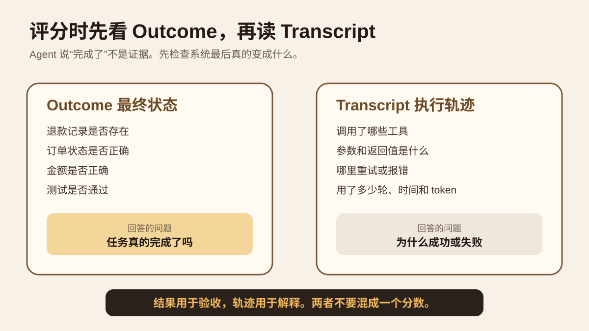
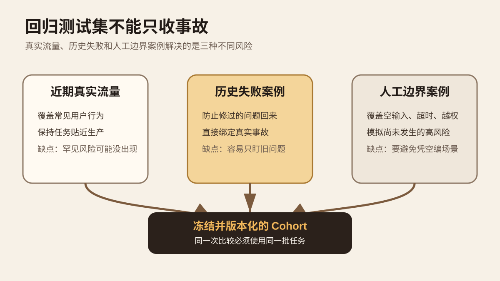

系列：每日 AI 图文精读

今天只研究一个问题。Agent 线上犯过一次错以后，怎样让这个真实错误变成以后每次改模型、提示词或代码时都会自动重跑的测试。

主材料是 Kitaru 的 Replay、Evaluator 和 Regression Suite。仓库由 `zenml-io` 维护，默认开发分支为 `develop`，许可证为 Apache 2.0。2026 年 9 月 16 日仓库仍有功能和依赖更新。本文还用 Anthropic 的 Agent Eval 方法，以及 OpenAI 对评测数据质量和生产反馈闭环的公开文章交叉检查。本文没有复现 Kitaru 的完整实验环境，也不把项目方的产品描述当成独立验证。

[Kitaru 官方仓库](https://github.com/zenml-io/kitaru)

## 先从一个线上退款错误开始

假设你做了一个客服 Agent。用户说“这笔订单重复扣款，请退款”。Agent 查订单，调用退款工具，然后回复“已经退款”。第二天用户回来，钱并没有退。

你修了 system prompt，手工测试一次，刚好成功。几天后，同类问题再次出现。

这里缺的是一条回归链路。第一次事故发生后，要把当时的任务输入、工具调用、工具结果和最终状态保存下来。以后每次改 Agent，都让新版本回到尽量相同的测试现场重新做一次。

Anthropic 在 2026 年 1 月发布的 Agent Eval 文章里区分了能力评测和回归评测。能力评测问“Agent 现在还能解决哪些更难的问题”。回归评测问“以前已经会做的事情，现在是不是还会做”。回归集的目的就是阻止旧问题回来。[Anthropic 官方文章](https://www.anthropic.com/engineering/demystifying-evals-for-ai-agents)

图 1 是本文绘制的机制示意。先看最左和最右。线上失败留下 Session，固定一批 Session 成为 Cohort。基线先重放一次。确认现场能稳定复现以后，只改一个变量，再让候选版本跑同一批任务。评测没有通过，CI 就不放行。

## Replay 不是把旧答案重新打一遍分

普通单元测试很容易固定输入和输出。Agent 不一样。它可能先搜索，再读数据库，再调用外部 API，然后根据每一步结果决定下一步。

Kitaru 把一次运行保存成 Session。Replay 会重新执行 Agent 的真实代码，再用记录下来的外部结果回答它。模型会重新生成，代码也会重新走完整流程。被固定的是测试现场，不是 Agent 的输出。[Kitaru Replay 文档](https://github.com/zenml-io/kitaru/blob/develop/docs/book/concepts/replay.md)

这和“把昨天的最终答案重新送给评分器”差很多。后者只能告诉你昨天的答案能得多少分。Replay 能观察新版本今天会怎样走完整决策路径。

Kitaru 当前从任务开头重新运行，不提供从某个中间节点直接继续的 Replay。这样做有一个好处。候选版本必须自己重新完成整条路径，不能借用旧版本已经完成的前半段。

## 为什么第一步必须重放原版本

Kitaru 文档把顺序写得很明确。修改任何东西之前，先让原版本原样 Replay。

原因很简单。假设原运行通过，但原版本重放十次只能通过六次。你换模型以后通过八次，不能直接说新模型带来了两个任务的提升。测试现场本身就不稳定。

所以第一问不是“候选版本多少分”。第一问是“基线能不能复现”。只有基线可信，后面的差异才有解释价值。

然后一次只改一项。只换模型，就不要同时改检索。只改提示词，就不要同时重写 evaluator。否则即使结果变好，也不知道是哪项改动起作用。

## 最容易出事的是工具

退款任务最危险的部分不是模型，而是退款工具。

昨天订单还是“已支付，未退款”。今天重新查询生产数据库，订单也许已经被人工退款。测试结果因此改变。更糟的是，候选 Agent 真的再次执行退款接口。那已经不是测试，而是在修改生产状态。

Kitaru 的工具策略解决这个问题。[Replay 官方文档](https://github.com/zenml-io/kitaru/blob/develop/docs/book/concepts/replay.md)

图 2 只画官方文档里的三种核心策略。`history` 按工具名和参数查历史记录，返回当时的结果。`static` 返回预先指定的固定结果。`passthrough` 才会访问真实工具。

回归测试想保证不碰生产系统时，可以用 `history`，并把未匹配调用设置为 `fail`。这时新版本突然走出一条旧记录里没有的工具路径，测试会停下来。这个失败不一定说明新版本更差。它说明旧测试现场不足以解释这条新路径，需要人工检查。

还有一个容易漏掉的实现细节。Kitaru 当前的 OpenAI Agents adapter 不能把默认工具策略直接设成 `history`。默认策略必须保留为 `passthrough`，需要对希望重放的直接 `FunctionTool` 逐个配置具名 `history`。Hosted tool、MCP、handoff 目标等替换目前也有限制。[OpenAI Agents adapter 文档](https://github.com/zenml-io/kitaru/blob/develop/docs/book/adapters/openai-agents.md)

这类限制很重要。配置写错以后，你以为正在离线回归，实际可能仍有调用走向真实外部系统。

## 先验收结果，再读执行轨迹

Agent 最后说“退款成功”不代表退款真的发生。

Anthropic 把 Outcome 和 Transcript 分开。Outcome 是任务执行后环境留下的最终状态。Transcript 是完整执行过程，包括可观察的模型输出、工具调用和中间结果。对 Coding Agent 来说，“Bug 已修复”只是输出。代码是否保存，测试是否通过，目标行为是否恢复，才是可以验收的结果。[Anthropic 官方文章](https://www.anthropic.com/engineering/demystifying-evals-for-ai-agents)

图 3 的阅读顺序就是评分顺序。先检查最终状态。通过以后，再读轨迹解释它为什么成功。失败时也一样，先确定哪项验收条件没满足，再从轨迹里找原因。

能用程序判断的条件优先用程序。例如数据库记录是否存在、JSON 是否符合 Schema、单元测试是否通过。回答是否清楚、有没有理解用户意图这类开放问题，再交给模型裁判，并定期拿人工判断校准。

Kitaru 的 Evaluator 读取完整 Session，可以写布尔值、数字、分类结果和解释。每条 Evaluation 还记录 evaluator 版本。人工判断也可以作为 evaluation 保存，用来和自动 evaluator 对照。[Kitaru Evaluator 文档](https://github.com/zenml-io/kitaru/blob/develop/docs/book/concepts/evaluators.md)

## 回归测试集不能只收事故

每次线上出错就增加一个测试，这是正确动作，但测试集不能只有事故。

Kitaru 的 Regression Suite 建议把真实记录和人工构造的 fixture 配合使用。可以先取近期真实流量，再补过去的失败案例。还没有在生产中出现、但风险明确的条件，可以用人工边界案例补齐。[Regression Suite 文档](https://github.com/zenml-io/kitaru/blob/develop/docs/book/guides/regression-suite.md)

真实流量覆盖常见使用方式，但低概率风险可能一直没出现。历史失败能防止旧问题复发，但会让测试长期盯着过去。人工边界案例负责覆盖空输入、超时、权限错误、工具异常等已知风险。

Kitaru 用 Cohort Version 固定测试人群。版本创建后保持不变。要增删 Session，就建立新版本。这样两次实验使用的到底是不是同一批任务，可以查清楚。

## 评测本身也可能有 Bug

这里要再加一层防线。Agent 失败，不一定是 Agent 真错了。

OpenAI 在 2026 年 7 月审计 SWE-Bench Pro 时，自动数据质量流程标记了 200 个破损任务，占 27.4%。人工标注发现 249 个，占 34.1%。OpenAI 因此估计大约 30% 的任务存在问题。主要问题包括测试过度严格、题目要求不足、测试覆盖太低，以及提示与真正验收条件冲突。[OpenAI 官方研究](https://openai.com/index/separating-signal-from-noise-coding-evaluations/)

这组数字只描述 OpenAI 对该 Benchmark 的审计，不能外推成“所有 Agent Eval 都有 30% 错误”。它能说明一个工程问题。回归测试失败后，要打开失败样本和轨迹检查，不能只相信总分。

这也解释了为什么 Anthropic 强调读 transcript。一个 evaluator 如果把合理的新路径判错，会稳定地阻止好改动上线。自动化不会修复错误标准，只会更快执行错误标准。

## 生产反馈怎样形成长期改进

OpenAI 在 2026 年 5 月公开 Tax AI 的工程过程时，用了另一套实现，但反馈闭环和这里相通。真实业务中的人工修正被保存成结构化信号，生产 trace 帮团队定位失败，再用针对性的 eval 验证修复，最后跑更广的 regression。[OpenAI Tax AI 工程文章](https://openai.com/index/building-self-improving-tax-agents-with-codex/)

这说明生产 trace 的价值不只是排障。只要任务定义、验收标准和数据权限处理得当，真实失败可以逐步变成下一版的测试材料。

## 迁移到 Zhihu Threads eval v3

你的 Zhihu Threads eval v3 已经把不少基础工作做好了。当前记录显示，execution input 和 expected 已经分开。每次尝试会保留。引文存在、来源绑定和语义支持分别检查。逐轮证据快照也会保存。

现有工程 CI 已记录 28 个测试文件、436 项测试通过。独立驱动记录了 80 项契约检查和 10 个合成场景规则检查通过。真实语义工作流因为缺少 `OPENAI_API_KEY`、`OPENAI_BASE_URL`、`OPENAI_MODEL` 和 `ZHIHU_ACCESS_SECRET` 等配置，没有得到真实模型和知乎业务结果。因此，这 10 个合成场景现在适合作为确定性契约集，不能写成生产回归集。

下一步不需要重写 evaluator。先补 Session 和 Replay 这一层。

| 现在已有 | 建议新增 | 目的 |
| --- | --- | --- |
| ExecutionInput | session_id | 把一次真实运行固定下来 |
| source snapshot | tool call 与 tool result | 重放当时的外部现场 |
| 规则和语义评分 | evaluator_version | 知道是哪版规则给的结论 |
| 尝试记录 | cohort_version | 固定同一批回归任务 |
| token 与耗时 | baseline_session_id 与 candidate_session_id | 直接比较同一个任务的新旧版本 |

等真实语义运行可执行以后，从真实任务里挑代表性成功案例和失败案例，冻结成 `regression_v1`。以后改模型、提示词、检索策略或 Agent 行为时，先让当前基线在 `regression_v1` 重跑。基线稳定以后，再只改一项重跑候选版本。

知乎搜索和内容读取会随时间变化。回归阶段应优先使用保存下来的 source snapshot。候选版本出现旧记录里没有的新外部调用时，先标记 replay miss，不自动访问真实业务系统。

## 一个今天就能做的小实验

选 5 个已有固定输入、expected 和 source snapshot 的任务。先用当前版本各跑一次，保存完整记录作为 baseline。确认 evaluator 能读取这 5 次运行。

然后只修改 system prompt。模型、检索代码、题目、evaluator 都保持不变。外部写操作全部关闭。能用保存的 source snapshot 回答的调用就使用保存结果。候选版本出现新的外部调用时直接记录 replay miss。

每个任务保存这些字段：`task_id`、`baseline_session_id`、`candidate_session_id`、规则结果、语义结果、工具调用序列、replay miss、token、耗时、错误原因。

第一轮成功标准可以很朴素。5 个任务不能新增确定性失败。来源绑定不能新增错误。语义 evaluator 如果实际运行，候选通过数不能低于基线。所有 replay miss 都要人工看一遍。

最容易误判的情况有三个。基线还不稳定就直接比较候选。测试过程偷偷访问了会变化的线上工具。只看总通过率，没有打开失败 Session 检查 evaluator 是否公平。

## 这套方法的边界

Replay 只能复现已经记录下来的世界。如果原 Session 少记了关键状态，之后无法自动补回来。

`history` 也可能挡住合理的新行为。候选 Agent 新增一次必要工具调用时，`on_miss=fail` 会让测试失败。这里的正确解释是“需要检查这条新路径”，不是直接判候选更差。

回归集会老化。产品能力、工具和用户分布改变以后，要建立新的 Cohort Version。旧版本保留下来，用于知道测试分布在哪个时间点发生了改变。

Evaluator 同样需要版本和回归。评分标准错了，Agent 再好也会被判错。

## 记住这四句话

线上失败最好留下 Session，而不是只留一张工单截图。

Replay 的目标是固定测试现场，让新旧 Agent 面对同样的问题。

评分时先验收最终状态，再读执行轨迹解释原因。

回归集需要真实流量、历史失败和人工边界案例共同组成。

自测 1：为什么不能直接让新模型在今天的线上 API 上重跑昨天的任务？

因为外部状态已经变化。分数差异可能来自数据变化，而不是模型变化。真实写工具还可能产生副作用。

自测 2：为什么要先重放原版本？

先确认测试现场本身稳定。否则候选和基线的差异无法可靠归因。

自测 3：Replay miss 一定代表候选变差了吗？

不一定。它也可能表示候选走出了一条旧记录没有覆盖的新路径，需要补现场或人工判断。

## 主要一手来源

[Kitaru Replay](https://github.com/zenml-io/kitaru/blob/develop/docs/book/concepts/replay.md)：核对重放定义、基线重放、override、工具策略和从头重跑。

[Kitaru Evaluators](https://github.com/zenml-io/kitaru/blob/develop/docs/book/concepts/evaluators.md)：核对 Evaluation 结构、版本、人工标签和批量评分。

[Kitaru Regression Suite](https://github.com/zenml-io/kitaru/blob/develop/docs/book/guides/regression-suite.md)：核对 Cohort Version、Experiment、CI gate 和真实 Session 与人工 fixture 的组合。

[Kitaru OpenAI Agents adapter](https://github.com/zenml-io/kitaru/blob/develop/docs/book/adapters/openai-agents.md)：核对具名 `history`、默认 `passthrough` 以及当前替换限制。

[Anthropic，Demystifying evals for AI agents](https://www.anthropic.com/engineering/demystifying-evals-for-ai-agents)：核对 Outcome、Transcript、grader、能力评测、回归评测和人工校准。

[OpenAI，Separating signal from noise in coding evaluations](https://openai.com/index/separating-signal-from-noise-coding-evaluations/)：核对 Benchmark 破损任务审计和评测有效性问题。

[OpenAI，Building self-improving tax agents with Codex](https://openai.com/index/building-self-improving-tax-agents-with-codex/)：核对生产 trace、专家修正、针对性 eval 和更广回归之间的改进闭环。
