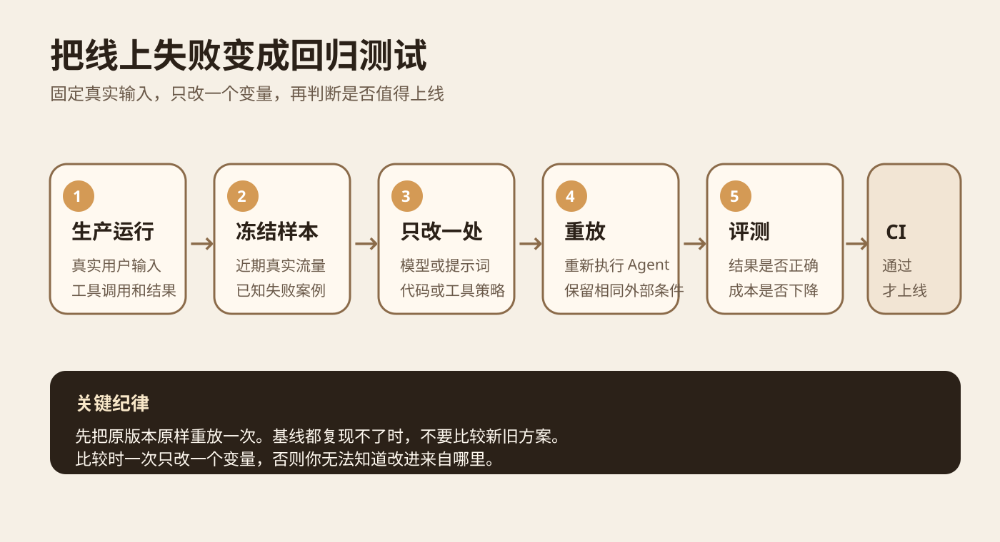
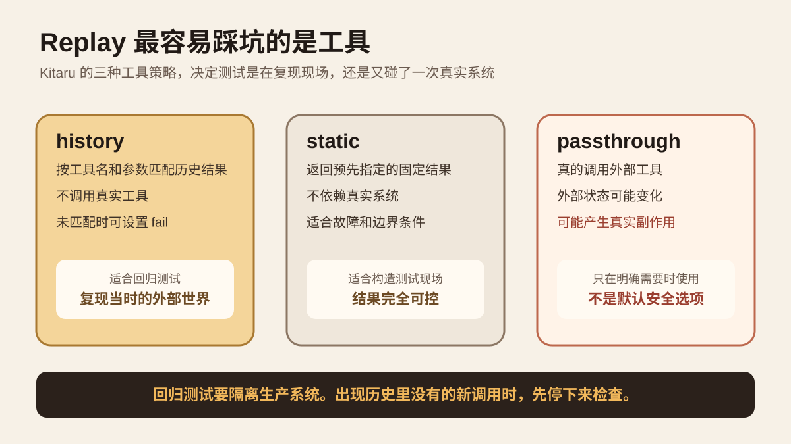
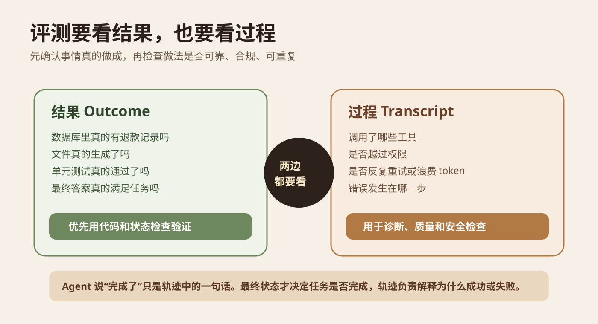
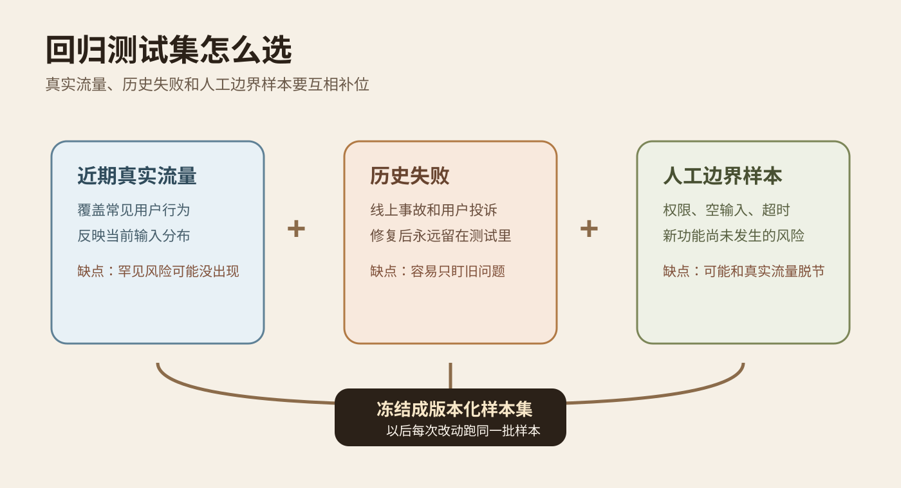

系列：每日 AI 图文精读

今天读的是 Kitaru 的 Replay、Evaluator 和 Regression Suite 设计。它解决一个很实际的问题：Agent 在线上犯过一次错以后，怎样让这个错误以后每次改模型、提示词或代码时都自动重跑，而不是等用户再次踩中。

这次选它还有一个原因。Kitaru 的官方仓库在 2026 年 9 月 16 日仍在快速更新。当天提交包括 TypeScript 与 Mastra scorer evaluator，以及 record replay 相关属性。仓库由 `zenml-io` 维护，当前公开，LICENSE 为 Apache 2.0。这里研究的是它的测试机制，不把项目方自己的产品描述当成独立验证。[官方仓库](https://github.com/zenml-io/kitaru) [当天 evaluator 提交](https://github.com/zenml-io/kitaru/commit/4916aef8f158b27601f37e380d8038996ab4b037)

## 先从一个线上错误开始

假设你做了一个客服 Agent。用户说“这笔订单重复扣款，请退款”。Agent 查订单、核对状态、调用退款工具，最后回复“已经退款”。

第二天用户回来，说钱根本没退。

你修了提示词，又升级了模型，然后自己手动试了一遍。刚好成功。问题看起来解决了。

几天以后，另一个订单又出了类似问题。

这里真正缺的不是一句更好的提示词，而是一条固定的回归链路。第一次事故发生以后，这个真实任务应该进入测试集。以后每次改 Agent，都用同样的输入和尽量相同的外部条件再跑一遍。只有旧问题没有重新出现，新方案才有资格继续上线。

Anthropic 在 2026 年 1 月的 Agent eval 文章里把这类测试分得很清楚。能力评测回答“现在还能学会什么新任务”，回归评测回答“以前会做的事情，现在是不是还会做”。回归集接近 100% 通过才有意义，因为它本来就是为了防止已经解决的问题重新出现。[Anthropic 官方说明](https://www.anthropic.com/engineering/demystifying-evals-for-ai-agents)

图 1 先看中间这条线。真实运行留下完整记录，固定成测试样本，然后只改一个变量，再重放、评测、决定是否允许进入 CI。最重要的是“只改一个变量”。如果你同时换模型、改提示词、改检索逻辑，最后变好也无法知道是哪一项起作用。

<ProcessSteps
  title="一次线上事故怎样进入回归链路"
  steps="保存真实运行::保留任务输入、工具结果、最终状态和必要轨迹|先重放旧版本::确认原版本能在固定条件下复现，建立可比较基线|只改一个变量::模型、提示词、代码或采样参数一次只换一项|重新执行并评分::同时检查 outcome 和 transcript，不只看最后一句话|进入回归集::把稳定样本固定到 suite 版本，并在后续 CI 重跑"
  source="根据 Kitaru Replay、Evaluator、Regression Suite 文档与本文事故示例整理"
/>

## Replay 到底是什么

普通单元测试经常直接写固定输入和固定输出。Agent 更麻烦，因为一次任务中间会调用搜索、数据库、文件系统、第三方 API，还会根据每一步结果决定下一步。

所以，重放不是“把上次最终答案再拿出来打一遍分”。Kitaru 的做法是保存一次完整 Session。里面有任务输入、Agent 调用、工具返回、最终结果等信息。重放时重新执行 Agent 的真实代码，再让记录下来的外部世界回答它。

这意味着模型仍然会重新思考，代码仍然会重新走一遍，只是外部条件尽量固定。你可以把它理解成把“当时发生过的现场”保存下来，再让新版本回到这个现场重新处理一次。

Kitaru 文档要求先做一件很容易被忽略的事：修改之前，先用原版本原样重放。如果原版本自己都不能稳定复现原运行，那么后面的新旧比较没有可靠基线。然后再建立 fork，一次只换模型、提示词、代码或采样参数中的一项。[Replay 官方文档](https://github.com/zenml-io/kitaru/blob/develop/docs/book/concepts/replay.md)

Kitaru 的 replay 目前是从任务开头重新执行，不支持从中间某一步直接切进去。这反而减少了一个歧义。新版本必须自己重新走完整决策路径，不能借用旧版本前半段已经做好的推理。

## 最难的一步是控制工具

重放最大的坑不是模型，而是工具。

还拿退款 Agent 举例。原运行里，Agent 查询订单 `A1024`，工具当时返回“已支付，未退款”。如果回归测试重新调用线上数据库，几天后这笔订单可能已经退款了。你以为模型行为变了，其实只是外部状态变了。

更危险的是，测试 Agent 真的再次调用退款接口。那就不是测试，是在修改生产数据。

Kitaru 把这件事做成 Tool Policy。`history` 返回历史记录中的工具结果。`static` 返回你指定的固定结果。`passthrough` 才会真正访问工具。文档还支持用 `on_miss` 规定遇到历史里没有的新工具调用时怎么办。[Tool Policy 说明](https://github.com/zenml-io/kitaru/blob/develop/docs/book/concepts/replay.md)

图 2 的重点在最右边。回归测试默认应该让未知工具调用直接失败，而不是偷偷访问生产系统。失败本身也是信息。它说明新版本走出了一条旧轨迹里没有的路径，这时应该人工检查，再决定给它什么测试数据。

这里还有一个具体限制。Kitaru 文档写明，OpenAI Agents adapter 目前不能直接把默认工具策略全部设成 `history`，需要对直接函数工具分别配置 history override。这类框架限制不能忽略，否则你以为做的是离线回放，实际可能仍有工具走实时路径。[Replay 官方文档](https://github.com/zenml-io/kitaru/blob/develop/docs/book/concepts/replay.md)

## 为什么只看最终答案也不够

回归测试下一步是评分。

退款 Agent 最后说“退款成功”，这句话本身没有证明任何事情。真正的 Outcome 是退款记录是否存在，订单状态是否改变，金额是否正确。

Anthropic 在 Agent eval 里明确区分 Transcript 和 Outcome。Transcript 是整个执行过程。Outcome 是任务执行以后环境留下的最终状态。对 Coding Agent 来说，“我已经修复 Bug”只是 transcript 的一句话，真正的 outcome 是代码是否保存、测试是否通过、目标行为是否修复。[Anthropic 官方说明](https://www.anthropic.com/engineering/demystifying-evals-for-ai-agents)

Kitaru 的 evaluator 也是这个思路。Evaluator 读取完整 session，可以产生布尔结果、数字分数、分类结果和解释。官方还提供成本、延迟、工具调用模式、输出契约、工具健康等确定性检查。人工标签也可以作为 evaluation 存在同一个 session 上，用来校准自动评分器。[Evaluator 官方文档](https://github.com/zenml-io/kitaru/blob/develop/docs/book/concepts/evaluators.md)

图 3 可以直接记成一句话。先验收最终状态，再用执行轨迹解释为什么成功或失败。

能用代码判断的条件，优先用代码。比如数据库里是否多了一条退款记录、输出 JSON 是否符合 Schema、单元测试是否全部通过。这类检查便宜、稳定、可复现。只有“回答是否清楚”“是否真正理解用户意图”这类开放问题，再交给模型裁判，并定期和人工判断对照。

## 测试集不能只收事故

一个常见做法是每出一个线上事故，就加一个测试。这是对的，但还不够。

如果测试集只有历史失败，Agent 会越来越擅长不重犯旧错，却可能对新用户场景完全没有保护。反过来，如果只抽近期真实流量，很多低概率但高风险的问题可能一个都没抽到。

Kitaru 的 regression suite 文档建议把 recorded session 和 synthetic fixture 配合使用。固定的一批 session 会组成 cohort version。版本固定以后不再偷偷改变。如果要增删样本，就建立新版本。这样两次实验使用的是不是同一批任务，一眼能查出来。[Regression Suite 官方文档](https://github.com/zenml-io/kitaru/blob/develop/docs/book/guides/regression-suite.md)

图 4 里的三个来源各自解决不同问题。真实流量负责贴近实际使用。历史失败负责保证修过的问题不回来。人工边界样本负责覆盖还没发生但你已经知道危险的情况，例如空输入、越权参数、超时和工具返回异常。

所以，“真实数据”不等于“完整测试集”。好的回归集本身就是一种产品风险清单。

## Kitaru 真正值得迁移的是这套数据关系

不要先纠结要不要直接引入 Kitaru。先把它的数据关系学走。

| 对象 | 大白话 | 为什么要单独保存 |
| --- | --- | --- |
| Session | 一次真实或测试运行的完整记录 | 以后能复现现场 |
| Cohort Version | 固定的一批测试 Session | 保证不同实验在同一批样本上比较 |
| Experiment | 这次到底改了什么 | 防止一次混进多个变量 |
| Replay | 新版本重新处理旧 Session | 得到候选版本的新轨迹和结果 |
| Evaluation | 对一次 Session 的一个具体判断 | 同一任务可以分别看正确性、成本、工具行为 |

关系理顺以后，CI 只是最后一层。PR 建好候选 Agent 版本，用固定 cohort 跑 experiment。基线和候选都执行同样 evaluator。如果出现回归，CI 直接失败，再打开具体 session 看哪一步出了问题。

Kitaru 官方示例也是这样做。它建议 PR 用较小 cohort，定时任务用更大的流量样本。发现新失败后，把这个 session 加到新的 cohort version，之后的测试都会包含它。[Regression Suite 官方文档](https://github.com/zenml-io/kitaru/blob/develop/docs/book/guides/regression-suite.md)

## 迁移到你的 Zhihu Threads eval v3

你现在的 Zhihu Threads eval v3 已经有几个很重要的基础。执行输入和 expected 已经分开。每次尝试都会保留。引用存在、来源绑定和语义支持分开评分。逐轮证据快照也已经保存。离线契约和真实语义验收也没有混写成同一个完成率。

这意味着你不用重做 evaluator。下一步更值得补的是“真实 Session 进入长期回归集”的链路。

现在真实语义工作流还因为缺少 `OPENAI_API_KEY`、`ZHIHU_ACCESS_SECRET` 等配置，没有取得真实模型和知乎业务结果。因此不要把现有 10 个合成场景直接写成“生产回归集”。它们应该继续承担确定性契约测试。

等真实语义运行能够执行以后，可以这样接：每个真实任务保存 `session_id`、execution input、当轮 source snapshot、工具调用与参数、工具结果摘要、最终输出、规则 evaluator 结果、语义 evaluator 结果、token、费用、耗时。然后挑一批代表性成功案例和真实失败案例冻结成 `regression_v1`。

以后你修改检索、模型、提示词或者 Agent 策略时，不直接拿新版本去线上试。先让基线版本在 `regression_v1` 原样跑一遍，确认基线能复现。然后只改一个变量，重跑同一批任务。

知乎相关的外部调用默认不要 passthrough。对于已经记录过的搜索或内容读取，优先返回当时的 source snapshot。出现历史里没有的新外部调用时先 fail，并把新轨迹标出来。这样可以避免回归测试因为知乎内容变化或线上状态变化产生假回归，也避免测试任务真的修改业务状态。

你的 v3 还有一个现成优势。你已经把“规则通过”和“语义未评判”分开。所以第一版 CI 门禁不需要重新发明分数。可以先规定：原来通过的确定性契约不得新增失败；来源绑定不得新增错误；真实语义 evaluator 必须实际运行，候选版本通过数不得低于同一 cohort 的基线。token 和费用先记录，不在没有稳定基线时硬设阈值。

## 一个可以实际做的小实验

不用先搭完整平台。拿 Zhihu Threads 现有 eval v3 就能做一个最小实验。

起始条件是选 5 个任务。优先使用已经有固定输入、固定 expected、固定 source snapshot 的任务。先用当前版本各跑一次，保存完整运行记录，记为 baseline。确认这 5 个 baseline 都能被 evaluator 正确读出。

然后只改一个变量。例如，只修改 Agent 的 system prompt，不换模型，不改检索，不改 evaluator。

工具层禁止真实写操作。能用保存的 source snapshot 回答就使用保存结果。候选运行出现旧记录中没有的工具调用时，标记为 replay miss，不自动放行。

每个任务记录这些字段：`task_id`、`baseline_session_id`、`candidate_session_id`、规则结果、语义结果、工具调用序列、replay miss、token、耗时、错误原因。

成功标准不要写“感觉更好”。第一轮可以用这个规则：5 个任务不能新增确定性失败；来源绑定不能新增错误；语义 evaluator 的通过数不得低于基线；任何 replay miss 必须人工检查。满足以后，才值得扩大到 20 个或 50 个任务。

这里最容易误判的是三个地方。第一次重放没有先验证基线，却直接比较新版本。测试时访问了会变化的线上工具。最后只看总通过率，没有打开失败 session 看真正原因。

## 这套方法也有边界

Replay 不是时间机器。你记录下来的只是当时能观察到的输入、工具结果和环境状态。如果原 Session 少记了一项关键状态，后面无法凭 replay 自动补回来。

固定历史工具结果也会产生另一个问题。新版本也许合理地想调用一个过去没有调用过的新工具。`on_miss=fail` 会把它拦住。这个失败不能直接解释成候选 Agent 更差。它表示“旧测试现场不足以覆盖这条新路径”，需要补测试环境或人工判断。

回归集也会老化。产品、新工具和用户行为变化以后，需要建立新的 cohort version，而不是永远守着第一批样本。旧版本不要删，因为它能告诉你测试分布什么时候发生过变化。

最后，Replay 只解决“怎样公平复测”。它不会自动告诉你什么才是好结果。Evaluator 的标准仍然来自产品要求、真实用户和人工校准。如果评分器错了，自动化只会更稳定地给出错误结论。

## 今天应该记住什么

线上失败最有价值的处理方式，是把它变成以后每次改动都会自动重跑的测试。

做 Agent 回归时，先固定测试样本和外部工具结果，再改变模型、提示词或代码。先看最终 Outcome 是否真的正确，再读 Transcript 定位行为问题。真实流量、历史失败和人工边界样本要组合使用。

如果要把这套方法迁移到现有项目，先补 Session、固定测试集版本和 Replay 三个概念，不需要一开始就换掉整个 eval 框架。

自测 1：为什么不能直接拿新模型在今天的线上 API 上重跑昨天的任务？

因为外部状态已经变化。最后的差异可能来自 API、数据库或内容变化，而不是新模型本身。回归比较要尽量固定外部条件。

自测 2：Agent 最后回复“完成了”，为什么还不能算任务通过？

那只是执行轨迹中的一句输出。要检查环境最终状态，例如数据库、文件、测试结果或真实业务状态。

自测 3：为什么测试集不能只有历史失败案例？

只看历史失败容易过度拟合旧问题。还需要近期真实流量覆盖常见场景，并用人工边界样本覆盖尚未发生的高风险情况。

## 主要来源

[Kitaru 官方仓库](https://github.com/zenml-io/kitaru)：核对项目维护方、当前代码和 LICENSE。

[Kitaru Replay](https://github.com/zenml-io/kitaru/blob/develop/docs/book/concepts/replay.md)：重放定义、fork、工具策略和限制。

[Kitaru Evaluators](https://github.com/zenml-io/kitaru/blob/develop/docs/book/concepts/evaluators.md)：Evaluator 数据结构、版本和批量评测方式。

[Kitaru Regression Suite](https://github.com/zenml-io/kitaru/blob/develop/docs/book/guides/regression-suite.md)：固定 cohort、experiment、CI gate 和长期维护方式。

[Anthropic，Demystifying evals for AI agents](https://www.anthropic.com/engineering/demystifying-evals-for-ai-agents)：Outcome、Transcript、grader、能力评测与回归评测的区分。

抓取与核对日期：2026 年 9 月 16 日。本文没有运行 Kitaru，也没有复现它的端到端示例。Kitaru 的功能说明来自其官方仓库与文档，工程迁移部分是基于这些机制和当前 Zhihu Threads eval v3 状态给出的实现建议。
