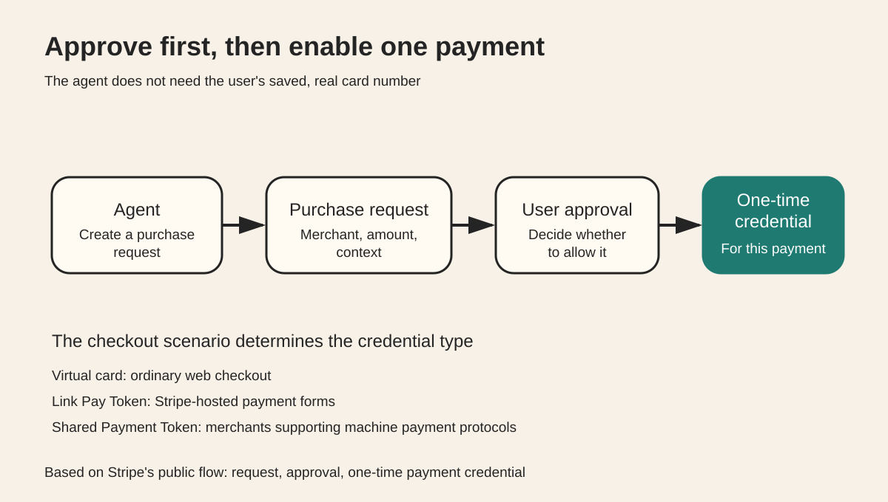

Stripe's Link CLI handles a specific step in putting agents to work. An agent can search for products, compare prices, and prepare checkout, but spending money should not require it to keep the user's saved, real card number.

Link CLI separates payment into an explicit authorization process. The agent first submits a purchase request. Only after the user approves does Link return the payment credentials needed for that purchase.

Figure 1 shows the Link CLI payment authorization flow. The agent submits a purchase request and receives the one-time credentials needed for this payment only after the user approves.

## Understand it in 30 seconds

When an agent wants to buy something for the user, it first creates a spend request with Link that specifies the merchant, amount, and purchase context.

The user approves the purchase in Link. Link then gives the agent a payment credential. The agent uses it to complete a web checkout or a machine payment.

The user's saved, real card number does not need to be handed to the agent.

As of September 24, 2026, this capability is available only to US Link accounts, and every purchase still requires user approval.

## What the project is

The project is [stripe/link-cli](https://github.com/stripe/link-cli), maintained by Stripe and released under the MIT License.

Other official entry points include [Link Agent Wallet](https://link.com/agents) and Stripe's article [Giving agents the ability to pay](https://stripe.com/blog/giving-agents-the-ability-to-pay).

The repository provides link-cli onboard and link-cli demo. link-cli demo uses test mode, creates no real charges, and can run through the full authorization flow.

The agent skill can be installed with npx skills add stripe/link-cli. The repository also provides an MCP entry point, but testing the payment authorization mechanism does not require connecting MCP first.

## The agent does not receive a long-lived, real card number

Link CLI currently lists three types of payment credentials.

The first is a one-time virtual card for ordinary web checkout. The merchant does not need to enable Link or use Stripe.

The second is a Link Pay Token for Stripe-hosted payment forms.

The third is a Shared Payment Token for merchants that support machine payment protocols.

All three use the same purchase request at the upper level. The lower level returns the appropriate credential for the checkout scenario. The agent does not need to hard-code one payment channel into its entire task workflow.

## Why permission comes before payment

A purchase request includes the merchant and purchase context as well as the amount.

The user sees the specific purchase the agent is preparing, rather than an abstract "allow payment" button. The system provides payment capability only after the user approves.

This structure separates two actions.

First, the agent decides what to buy and prepares the transaction.

Second, the user decides whether to grant payment permission for this transaction.

This makes risk easier to limit than placing long-lived payment secrets in the agent's environment in advance.

## Three designs worth borrowing

### Confirm intent before granting capability

Low-risk steps can run first. Request temporary permission when it is time to spend money.

### Give people the purchase context to review

Authorization covers a specific transaction, rather than ongoing access to a payment account. Users can review the merchant, amount, and purchase context before approving.

### Make payment credentials an adapter layer

Keep the upper-level purchase workflow consistent, and switch between a virtual card, Link Pay Token, or Shared Payment Token according to the merchant's capabilities.

This structure also applies to other agent tools. Search, analysis, and preparation can run with limited permissions. Request a scoped, time-limited capability only when an action will produce a real side effect.

## Current limits

Link Agent Wallet currently supports only US Link accounts. It should not be described as globally available.

Every purchase still requires user approval, so this is not "fully autonomous agent spending."

Virtual cards, Link Pay Tokens, and Shared Payment Tokens apply to different checkout scenarios. The three capabilities should not be conflated into a single payment protocol.

## Sources

- [stripe/link-cli](https://github.com/stripe/link-cli)
- [Stripe: Giving agents the ability to pay](https://stripe.com/blog/giving-agents-the-ability-to-pay)
- [Link Agent Wallet](https://link.com/agents)
