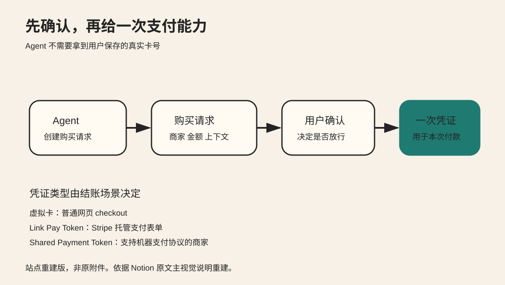

Stripe 的 Link CLI 处理的是 Agent 落地时很具体的一步。Agent 可以搜索商品、比较价格、准备 checkout，但真正花钱时，不应该长期持有用户保存的真实卡号。

Link CLI 把付款拆成一个明确的授权过程。Agent 先提交购买请求。用户确认以后，Link 才返回本次购买需要的支付凭证。

图 1 是站点重建版，非 Notion 原附件。原附件当前只能通过短期签名 URL 读取。重建图只保留原文已经核对的流程，不增加新事实。

## 30 秒看懂

Agent 想替用户购买商品时，先向 Link 创建 spend request，写清商家、金额和购买上下文。

用户在 Link 中确认这笔购买。确认以后，Link 再给 Agent 一次支付凭证。Agent 用它完成网页 checkout 或机器支付。

用户保存的真实卡号不需要交给 Agent。

截至 2026 年 9 月 24 日，这项能力只对美国 Link 账户开放，而且每笔购买仍需要用户确认。

## 项目是什么

项目是 [stripe/link-cli](https://github.com/stripe/link-cli)，由 Stripe 维护，仓库使用 MIT License。

官方入口还包括 [Link Agent Wallet](https://link.com/agents) 和 Stripe 的文章 [Giving agents the ability to pay](https://stripe.com/blog/giving-agents-the-ability-to-pay)。

仓库提供 link-cli onboard 和 link-cli demo。link-cli demo 使用 test mode，不产生真实扣款，可以跑完整授权流程。

Agent Skill 可以通过 npx skills add stripe/link-cli 安装。仓库也提供 MCP 入口，但验证支付授权机制并不要求先接 MCP。

## Agent 拿到的不是长期真实卡号

Link CLI 当前列出三类支付凭证。

第一类是一次性虚拟卡，用于普通网页 checkout。商家不需要启用 Link，也不要求使用 Stripe。

第二类是 Link Pay Token，用于 Stripe 托管的支付表单。

第三类是 Shared Payment Token，用于支持机器支付协议的商家。

上层都是同一个购买请求。下层再根据结账场景返回对应凭证。Agent 不需要把某一种支付通道写死进整个任务流程。

## 权限为什么放在付款前

购买请求里不只有金额，还包括商家和购买上下文。

用户看到的不是一个抽象“允许付款”按钮，而是 Agent 准备进行哪笔购买。用户确认以后，系统才继续提供支付能力。

这个结构把两个动作分开了。

第一步，Agent 决定买什么，并准备交易。

第二步，用户决定是否给本次交易付款权限。

这比把长期支付秘密提前放进 Agent 环境更容易限制风险。

## 三个值得借鉴的设计

### 先确认意图，再给能力

低风险步骤可以先执行。真正要花钱时，再申请临时权限。

### 把购买上下文交给人审核

授权对象是具体交易，不是长期开放支付账户。用户能看到商家、金额和购买上下文以后再确认。

### 把支付凭证做成适配层

上层购买流程保持一致，下层根据商家能力切换虚拟卡、Link Pay Token 或 Shared Payment Token。

这套结构也能迁移到其他 Agent 工具。搜索、分析和准备阶段可以保持较低权限。只有真正产生副作用时，才请求有范围、有时效的能力。

## 当前边界

Link Agent Wallet 目前只支持美国 Link 账户，不能写成全球可用。

每笔购买仍需要用户确认，所以它也不是“Agent 完全自主消费”。

虚拟卡、Link Pay Token 和 Shared Payment Token 的适用场景不同，不能把三种能力混成一种支付协议。

## 来源

- [stripe/link-cli](https://github.com/stripe/link-cli)
- [Stripe：Giving agents the ability to pay](https://stripe.com/blog/giving-agents-the-ability-to-pay)
- [Link Agent Wallet](https://link.com/agents)
