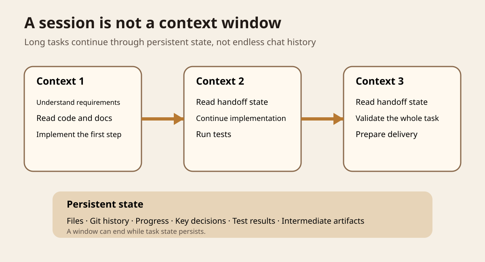
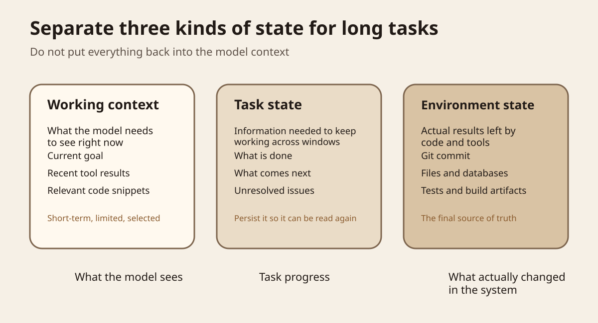
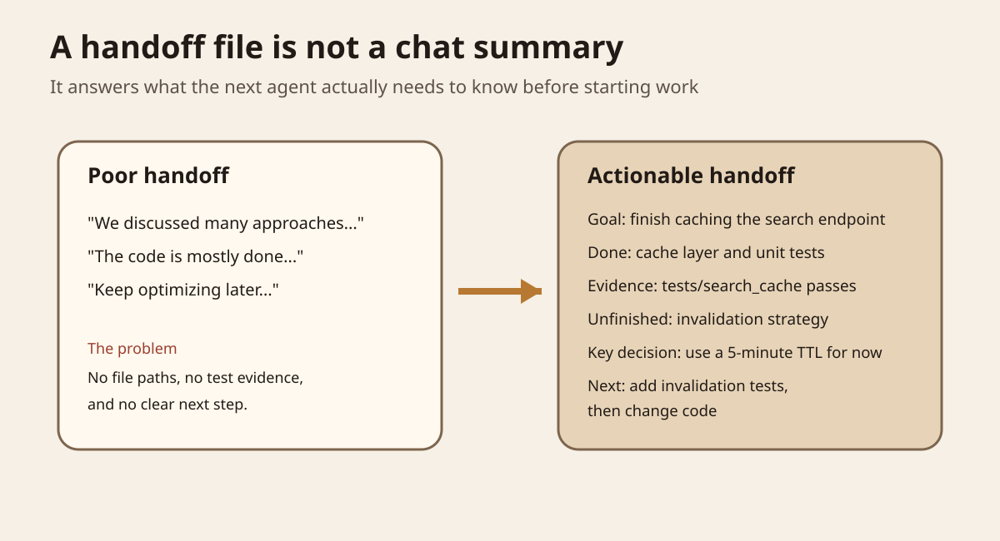
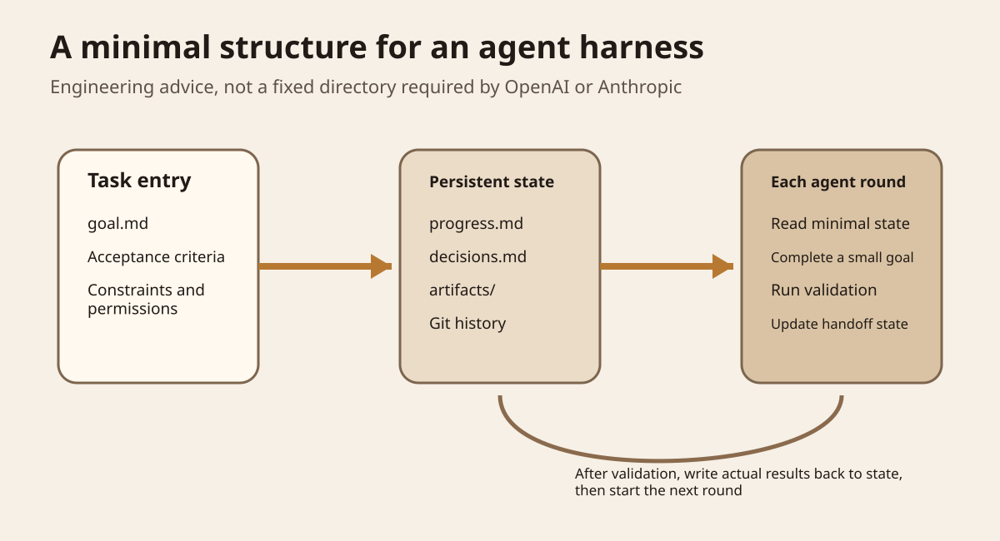

Series: Daily illustrated AI close readings

The earlier discussion of regression testing answered the question, "How do we know a change has not made things worse?" There is another question to answer first. If an agent needs to work for hours, even across several context windows, how does it remember where it left off?

This time, I read two primary sources. The first is the Agents API, released by OpenAI on September 10, 2026. It makes the harness used by Codex, long sessions, context management, subagents, and execution environments available through a managed API. The second is Anthropic's Managed Agents architecture article, published on April 8, 2026. Their implementations differ, but both point to the same engineering fact. **Continuity in a long-running task cannot depend solely on the chat history the model can currently see.** [OpenAI Agents API](https://openai.com/index/introducing-the-agents-api/) [Anthropic Managed Agents](https://www.anthropic.com/engineering/managed-agents)



In Figure 1, look at the "persistent state" line at the bottom. Contexts 1, 2, and 3 can each end, while files, Git history, progress records, key decisions, and test results remain. The next round does not put every old conversation back into the model. It retrieves the information actually needed to complete the current work.

<KeyPoints
  title="Separate three things before a long task"
  items="Working context::The high-signal information the model actually needs to see in this round|Task state::What is done, what remains, and what to do next|Environment state::Files, Git, tests, and artifacts are the facts the system has actually left behind"
/>

<ArchitectureStack
  title="Three layers of state for long tasks"
  layers="Environment state::The facts the system has actually left behind::Code files, Git, databases, test results, and artifacts should exist independently of the session|Task state::Progress needed to continue across sessions::Persist goals, completed work, unfinished work, decisions, and next steps|Working context::Information needed for this round of reasoning::Each round retrieves only the high-signal context the current task needs, rather than putting the entire history back into the model"
  source="State boundaries drawn from OpenAI Agents API and Anthropic Managed Agents"
/>

## Start with a development task

Suppose you ask a coding agent to add caching to a search endpoint. It needs to read the code, trace the call chain, implement the cache, add tests, handle invalidation, and run the full validation suite.

If the whole task takes ten minutes, one session is usually enough. Problems appear as the task gets longer. Tool responses, logs, and code snippets pile up. The model's current context window has a limit. Even a large window does not mean it is a good idea to put all the history inside it.

OpenAI's Agents API automatically compacts older content as a session approaches the context limit, letting work span multiple context windows. OpenAI also treats the sandbox as a separate environment where agents can work with files, run code, and save intermediate artifacts. The official article describes long sessions, tool search, and subagents as distinct harness capabilities, rather than treating them all as "a larger context." [OpenAI Agents API on long sessions](https://openai.com/index/introducing-the-agents-api/)

Anthropic is more direct. It devotes a section to "The session is not Claude's context window." Managed Agents defines a session as a persistent event log. When the model needs history, the harness selects portions of the session's events, prepares them, and places them in the context window. A session can therefore be longer than the context visible to any single model call. [Anthropic Managed Agents](https://www.anthropic.com/engineering/managed-agents)

## Keep three kinds of state separate



The first is working context. It answers, "What does the model need to see right now?" Examples include the current goal, the most recent test failure, the function being changed, and necessary tool instructions. Keep it high-signal. It does not need to hold the full history.

The second is task state. It answers, "How far has the task progressed?" For example, the cache layer is finished, invalidation remains undone, a five-minute TTL has been chosen for now, and the next step is to add two tests. Write this outside the model's context so the next round can read it.

The third is environment state. It answers, "What has actually changed in the system?" Code files, Git commits, databases, test output, and generated artifacts belong here. An agent saying "done" is not a source of truth. The actual files and validation results are.

Separating these concepts makes many agent memory problems simpler. You do not need to invent a magical "infinite memory." You need to decide what belongs temporarily in working context, what information needs persistent storage, and what facts can be read again directly from the environment.

## Compaction helps, but cannot replace persistent state

Think of compaction as a compressed handoff. When history nearly fills the window, it condenses dozens of interactions into a shorter summary so work can continue.

Anthropic's context engineering article treats compaction, structured notes, and subagent architectures as separate techniques for long-running tasks. Claude Code's compaction tries to retain architectural decisions, unresolved bugs, and implementation details while discarding verbose tool output. Structured notes write important state outside the context window so it can be read again later. [Anthropic context engineering](https://www.anthropic.com/engineering/effective-context-engineering-for-ai-agents)

The easiest mistake here is treating compaction as a database. A summary inevitably loses information, and it is hard to know which detail will matter again two hours later. Anthropic's Managed Agents therefore separates the recoverable session log from the model's current context. The raw events can persist, and the harness decides which portion to retrieve for this round.

A more reliable order is to give important facts a persistent source first, then compact them. Do not keep only the compressed text and discard all the original evidence.

## What belongs in a handoff file?

Anthropic's 2025 experiments with long-running harnesses found that compaction alone was not enough. Agents ran into two practical problems. One was trying to do too much at once, reaching the end of the context window halfway through, and leaving the next round unable to understand the current state. The other was seeing substantial work already in the repository and declaring the task complete too early. Anthropic used an initializer agent, progress files, and Git history so later agents could quickly recover their working state. [Anthropic long-running harnesses](https://www.anthropic.com/engineering/effective-harnesses-for-long-running-agents)



Do not write a handoff record like meeting minutes. The next round most needs information it can act on. At a minimum, it needs the goal, completed work, evidence locations, unfinished work, decisions that should not be casually overturned, and the first next step.

For example, "Caching is done" says very little. A better record is, "The cache layer is implemented, and `tests/search_cache` currently passes. Invalidation is not yet implemented. Add invalidation tests first, then change the implementation. The TTL is provisionally five minutes; the reason is recorded in decisions."

A new session then does not have to guess what the previous round actually did.

## Why this is worth learning now

OpenAI's Agents API entered public beta on September 10, 2026. Its official session-creation example lets developers specify a model, MCP tools, multi-agent settings, a vault, and an execution environment together. OpenAI manages the harness, while developers still choose the tools, knowledge, and runtime environment. [OpenAI announcement](https://openai.com/index/introducing-the-agents-api/)

Anthropic's Managed Agents separates the brain, hands, and session. The brain is the model and harness; the hands are the sandbox and tools; the session is the persistent event record. If the harness crashes, it can restart and recover from the session log. The sandbox can also be replaced, instead of tying all state to a single container. Anthropic reports that its decoupled architecture reduced p50 time to first token by roughly 60% and p95 by more than 90%. These figures apply only to the Managed Agents architecture described in that article. They should not be generalized into performance gains for all agent systems. [Anthropic Managed Agents](https://www.anthropic.com/engineering/managed-agents)

<StatStrip stats="~60%::Reduction in p50 time to first token|>90%::Reduction in p95 time to first token" source="Reported in Anthropic's Managed Agents article; applies only to that architecture and its test conditions" />

Read together, the two sources offer something more transferable than a particular SDK method name. They show where to draw state boundaries. Model context, task records, and execution environments should be manageable separately.

## How to apply this in your own agent harness

The following is general engineering advice, not a description of a verified repository implementation. The example modules and fields illustrate how to separate long-session state. They should not be taken as features already implemented in an existing project.



Start by splitting a long task across three interfaces. The task entry point stores the goal, acceptance criteria, and permissions. Persistent state stores progress, key decisions, intermediate artifacts, and Git evidence. Each agent round reads only the state it currently needs, completes a small goal, runs validation, and writes the actual results back to persistent state.

A minimal directory could look like this:

```text
harness/
  goal.md
  progress.md
  decisions.md
  artifacts/
```

This is not a recommendation to build a complex memory service immediately. The first version does not even need a database. Markdown and Git are enough to test the core hypothesis.

Put only task facts in `progress.md`, such as completed work, to-dos, failing tests, and next steps. Use `decisions.md` for decisions that affect later implementation and the reasons behind them. Put reports, evaluation results, and other outputs that cannot depend on chat memory alone in `artifacts/`. Git remains the source of truth for the code itself.

## An experiment you can run in ninety minutes

Choose a real, small task that takes 30 to 60 minutes. Do not use a question that can be answered in one sentence. Adding caching, tests, and error handling to an existing endpoint is one example.

Run two experiments. Group A may rely only on session history and automatic compaction. Group B must update `progress.md` after each stage, record important decisions in `decisions.md`, then deliberately start a new session to continue.

Use the same task and acceptance tests for both groups. Record completion rate, how often old questions are explored again, repeated mistakes, total tokens, final test results, and the time from the start of a new session to its first useful change.

Do not define success as "Group B feels smarter." Check at least two things. First, can a new session continue without asking you where the previous one left off? Second, does it pass final acceptance just as a continuous session would? If handoff files keep growing and the agent still reads every part of them on each round, you have only moved the chat history into Markdown. You have not solved context selection.

## The points to remember

A session spans the task's lifecycle. A context window holds the information the model can see in a particular reasoning step. They are different things.

Compaction addresses "It no longer fits in the current window." Persistent state addresses "Can we retrieve it again later?"

Files, Git, tests, and artifacts are more reliable than the agent's own claim that it has finished.

A long-running task harness should let a new context quickly recover a usable working state. Keeping one conversation alive forever is not the goal.

### Self-check

**Why not put the entire history back into the model?** Context has capacity and attention costs. Old tool output and irrelevant history take space away from information the current task actually needs.

**How do compaction and persistent state differ?** Compaction is lossy compression. Persistent state keeps facts, records, and artifacts that can be read again later.

**What handoff information does the next agent round need most?** The current goal, completed work, verifiable evidence, unfinished work, key decisions, and a clear next step, rather than a complete chat summary.

## Primary sources added for this article

[OpenAI, Introducing the Agents API, 2026-09-10](https://openai.com/index/introducing-the-agents-api/): Used to check the public beta, automatic compaction, sandbox, tool search, and multi-agent support.

[Anthropic, Scaling Managed Agents, 2026-04-08](https://www.anthropic.com/engineering/managed-agents): Used to check the boundaries between session, harness, and sandbox, and the design that separates sessions from context windows.

[Anthropic, Effective context engineering for AI agents, 2025-09-29](https://www.anthropic.com/engineering/effective-context-engineering-for-ai-agents): Used to check context management through compaction, structured notes, just-in-time retrieval, and subagents.

[Anthropic, Effective harnesses for long-running agents, 2025-11-26](https://www.anthropic.com/engineering/effective-harnesses-for-long-running-agents): Used to check incremental work across context windows, progress records, and Git-based handoffs.
