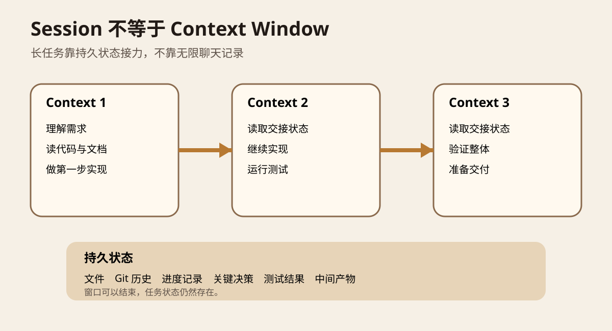
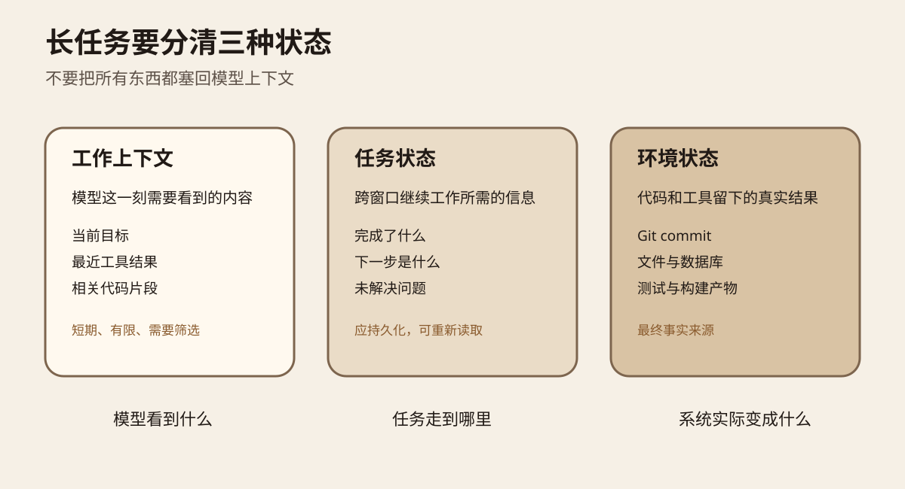
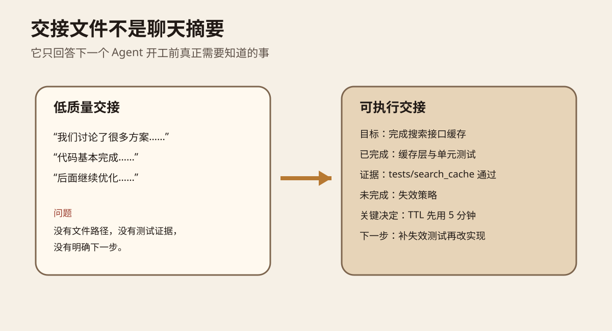
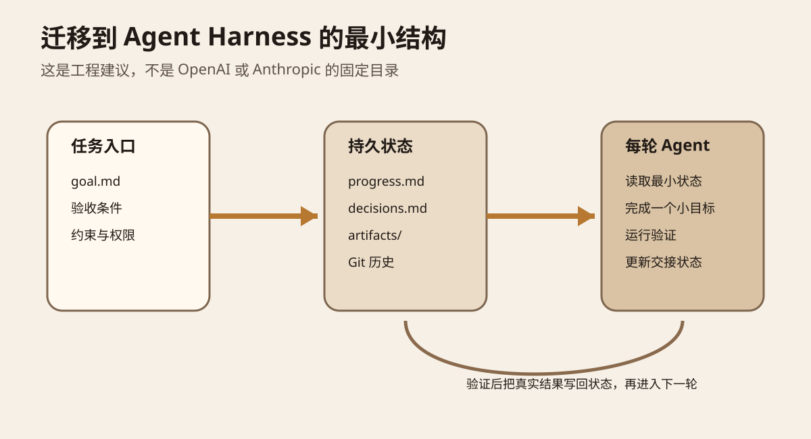

系列：每日 AI 图文精读

前面的回归测试解决“改完以后怎么知道没有退步”。还有一个更靠前的问题：如果 Agent 要连续工作几个小时，甚至跨多个上下文窗口，它到底靠什么记住自己做到哪里？

这次主要读两份一手材料。第一份是 OpenAI 在 2026 年 9 月 10 日发布的 Agents API。它把 Codex 使用的 harness、长会话、上下文管理、子 Agent 和执行环境做成托管 API。第二份是 Anthropic 在 2026 年 4 月 8 日发布的 Managed Agents 架构文章。两边实现不同，但都指向同一个工程事实：**长任务的连续性不能等同于模型当前看到的聊天记录。** [OpenAI Agents API](https://openai.com/index/introducing-the-agents-api/) [Anthropic Managed Agents](https://www.anthropic.com/engineering/managed-agents)



图 1 看下面那条“持久状态”。Context 1、2、3 可以分别结束，但文件、Git 历史、进度记录、关键决定和测试结果仍然存在。下一轮不是把所有旧对话重新塞进模型，而是重新取得完成当前工作真正需要的信息。

<KeyPoints
  title="长任务先分清三件事"
  items="工作上下文::这一轮模型真正需要看到的高信号信息|任务状态::已经完成什么、还差什么、下一步做什么|环境状态::文件、Git、测试和 artifact 才是系统实际留下的事实"
/>

## 先用一个开发任务理解

假设你让 Coding Agent 给一个搜索接口增加缓存。它要先读代码，找到调用链，再实现缓存，补测试，处理失效策略，最后跑完整验证。

如果整个任务十分钟能完成，一条会话通常够用。问题出现在任务变长以后。工具返回越来越多，日志越来越多，代码片段越来越多。模型当前的 context window 有上限。即使窗口很大，也不代表把所有历史都放进去就是好事。

OpenAI 的 Agents API 会在 session 接近上下文限制时自动压缩较早的内容，让工作跨越多个 context window。OpenAI 还把 sandbox 作为独立环境，让 Agent 能操作文件、运行代码并保存中间产物。官方文章明确把长会话、工具搜索和子 Agent 当成 harness 的不同能力，而不是把它们都解释成“更大的上下文”。[OpenAI Agents API 长会话说明](https://openai.com/index/introducing-the-agents-api/)

Anthropic 的表述更直接。它专门写了一节“The session is not Claude’s context window”。Managed Agents 把 session 定义为持久事件日志。模型当前需要历史时，harness 再从 session 中选择事件片段，整理后放回 context window。也就是说，session 可以比任何一次模型调用看到的上下文都长。[Anthropic Managed Agents](https://www.anthropic.com/engineering/managed-agents)

## 三种状态不要混在一起



第一种是工作上下文。它回答“模型这一刻需要看到什么”。例如当前目标、最近一次测试失败、正在修改的函数和必要的工具说明。它应该尽量高信号，不需要保存全部历史。

第二种是任务状态。它回答“任务走到哪里”。例如已经完成缓存层，失效策略还没做，决定先使用五分钟 TTL，下一步需要补两个测试。它应该写到模型上下文之外，下一轮再读取。

第三种是环境状态。它回答“系统实际变成什么”。代码文件、Git commit、数据库、测试输出和生成的 artifact 都属于这一层。Agent 说“已经完成”不是事实来源。真实文件和验证结果才是。

这三个概念分开以后，很多 Agent Memory 问题会变简单。你不需要发明一个神奇的“无限记忆”。你需要决定什么内容应该短期留在工作上下文，什么信息应该持久保存，什么事实可以直接从环境重新读取。

## Compaction 有用，但不能替代持久状态

Compaction 可以理解成压缩交接。历史快放不下时，把几十轮交互压成更短的摘要，再继续工作。

Anthropic 在 context engineering 文章中把 compaction、结构化笔记和 sub-agent 架构分别作为长任务手段。Claude Code 的 compaction 会尽量保留架构决定、未解决 bug 和实现细节，同时丢掉冗长工具输出。结构化笔记则把重要状态写到 context window 外，后续再读回来。[Anthropic Context Engineering](https://www.anthropic.com/engineering/effective-context-engineering-for-ai-agents)

这里最容易犯的错，是把 compaction 当成数据库。摘要一定会丢信息，而且当下很难知道哪一条细节会在两小时以后重新变重要。Anthropic 的 Managed Agents 因此把可恢复的 session log 和模型当前 context 分开。原始事件可以持久保存，harness 决定这一轮取哪一部分。

所以更稳的顺序是：重要事实先有持久来源，再做压缩。不要只保留压缩后的文本，然后把原始证据全部丢掉。

## 交接文件到底应该写什么

Anthropic 2025 年的长任务 harness 实验发现，仅有 compaction 仍不够。Agent 会出现两个很实际的问题。一种是一次想做太多，做到一半窗口结束，下一轮不知道现场。另一种是看到仓库已经有不少成果，就过早判断“任务完成”。他们使用初始化 Agent、进度文件和 Git 历史，让后续 Agent 能快速恢复工作状态。[Anthropic 长任务 Harness](https://www.anthropic.com/engineering/effective-harnesses-for-long-running-agents)



交接记录不要写成会议纪要。下一轮最需要的是可以继续执行的信息。至少要知道目标是什么，已经完成什么，证据在哪里，还有什么没完成，哪些决定不能随便推翻，下一步先做什么。

比如“缓存已经完成”信息量很低。更好的记录是“缓存层已经实现，`tests/search_cache` 当前通过。失效策略尚未实现。先补失效测试，再修改实现。TTL 暂定五分钟，原因记录在 decisions 中”。

这样新会话不需要重新猜上一轮到底干了什么。

## 为什么现在值得学这个

OpenAI 的 Agents API 在 2026 年 9 月 10 日进入 public beta。官方提供的创建 session 示例里，可以同时指定模型、MCP 工具、multi-agent 设置、vault 和执行环境。OpenAI 负责 harness，开发者仍然选择工具、知识和运行环境。[OpenAI 发布说明](https://openai.com/index/introducing-the-agents-api/)

Anthropic 的 Managed Agents 则把 brain、hands 和 session 拆开。brain 是模型与 harness，hands 是 sandbox 和工具，session 是持久事件记录。这样 harness 崩溃时，可以重新启动并从 session log 恢复；sandbox 也可以替换，而不是把所有状态绑死在同一个容器里。Anthropic 报告其解耦架构把 p50 首 token 延迟降低约 60%，p95 降低超过 90%。这个数字只代表他们文中描述的 Managed Agents 架构，不应推广成所有 Agent 系统的性能收益。[Anthropic Managed Agents](https://www.anthropic.com/engineering/managed-agents)

<StatStrip stats="~60%::p50 首 token 延迟降低|>90%::p95 首 token 延迟降低" source="Anthropic Managed Agents 文中报告，仅代表该架构与测试条件" />

两份材料放在一起看，真正值得迁移的不是某个 SDK 方法名，而是状态边界。模型上下文、任务记录和执行环境应该能分别管理。

## 放进自己的 Agent Harness 怎么做

下面是工程建议，不代表我已经读取或修改了你的 Lora PI Kit 仓库。这次在 Notion 中没有找到能确认该仓库当前目录结构的一手项目页面，所以这里只给最小通用结构，不虚构现有文件。



可以先把长任务拆成三个接口。任务入口保存目标、验收条件和权限。持久状态保存进度、关键决定、中间产物和 Git 证据。每轮 Agent 只读取当前需要的状态，完成一个小目标，运行验证，再把真实结果写回持久状态。

一个最小目录可以是：

```text
harness/
  goal.md
  progress.md
  decisions.md
  artifacts/
```

这不是推荐你立刻做复杂 Memory Service。第一版甚至不用数据库。Markdown 加 Git 已经足够验证核心假设。

`progress.md` 只写任务事实。例如完成项、待办、失败测试、下一步。`decisions.md` 写会影响后续实现的决定和理由。`artifacts/` 放报告、评测结果或其他不能只靠聊天记住的产物。代码本身继续由 Git 做事实来源。

## 一个半小时就能做的实验

选一个需要 30 到 60 分钟的真实小任务，不要用一句话就能完成的问题。比如给现有接口增加缓存、测试和错误处理。

做两组实验。A 组只允许 Agent 依赖会话历史和自动 compaction。B 组要求每完成一个阶段都更新 `progress.md`，重要决定写入 `decisions.md`，然后主动开启一个新会话继续。

两组使用相同任务和相同验收测试。记录完成率、重新探索旧问题的次数、错误重复次数、总 token、最终测试结果，以及新会话开始后第一次有效修改花了多久。

成功标准不要定成“B 组感觉更聪明”。至少检查两件事。第一，新会话能否在不问你“之前做到哪里”的情况下继续。第二，最终验收是否与连续会话一样通过。如果交接文件越来越长，Agent 每轮仍然把所有内容全部读入，那么你只是把聊天记录搬到了 Markdown，没有解决上下文选择问题。

## 记住这几句话

Session 是任务生命周期，context window 是模型某一次推理能看到的信息。两者不是一个东西。

Compaction 解决“当前窗口放不下”，持久状态解决“以后还能不能找回来”。

文件、Git、测试和 artifact 比 Agent 自己说“我完成了”更可靠。

长任务 Harness 的重点不是让一个对话永远活着，而是让新的 context 能快速恢复到可工作的状态。

### 自测

**为什么不能只把全部历史重新塞给模型？** 因为 context 有容量和注意力成本，旧工具输出和无关历史会挤占当前真正需要的信息。

**Compaction 和持久状态有什么区别？** Compaction 是有损压缩。持久状态保存以后还能重新读取的事实、记录和产物。

**下一轮 Agent 最需要哪类交接信息？** 当前目标、已完成事项、可验证证据、未完成事项、关键决定和明确下一步，而不是完整聊天摘要。

## 本次补充的一手来源

[OpenAI，Introducing the Agents API，2026-09-10](https://openai.com/index/introducing-the-agents-api/)：核对 public beta、自动 compaction、sandbox、工具搜索和 multi-agent。

[Anthropic，Scaling Managed Agents，2026-04-08](https://www.anthropic.com/engineering/managed-agents)：核对 session、harness、sandbox 的边界，以及 session 不等于 context window 的设计。

[Anthropic，Effective context engineering for AI agents，2025-09-29](https://www.anthropic.com/engineering/effective-context-engineering-for-ai-agents)：核对 compaction、结构化笔记、just-in-time retrieval 和 sub-agent 的上下文管理方法。

[Anthropic，Effective harnesses for long-running agents，2025-11-26](https://www.anthropic.com/engineering/effective-harnesses-for-long-running-agents)：核对跨上下文窗口的增量工作、进度记录和 Git 交接模式。
